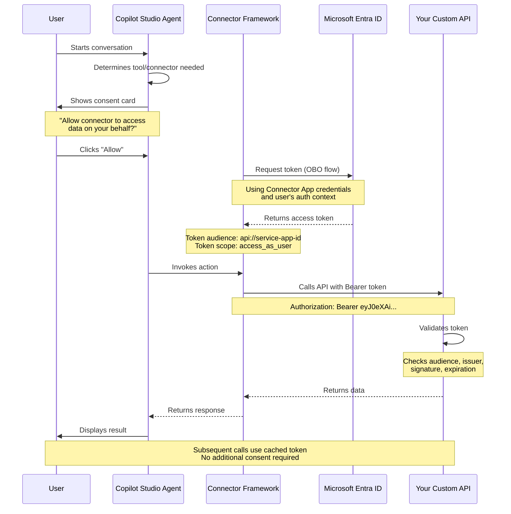

When building  agents in Copilot Studio, you often need to call downstream custom APIs with the user's credentials. Until recently, most builders relied on [manual authentication](https://learn.microsoft.com/en-us/microsoft-copilot-studio/configuration-end-user-authentication#authenticate-manually) to populate `System.User.AccessToken` and pass it as a bearer token to their APIs.

But here's a little-known capability* that makes a difference: **Custom connectors support the same SSO/consent experience as first-party connectors (as long as they support Entra authentication)**.

*At least it wasn't known to me, so I assumed no one else knew about it either. Sorry.

## The Problem with Manual Authentication

While manual authentication works, it has significant drawbacks:

1. **Complex Setup**: requires configuring two app registrations per agent (at least per out best practices)
2. **No Tenant Graph Grounding**: Manual authentication isn't compatible with [Tenant Graph Grounding](https://learn.microsoft.com/en-us/microsoft-copilot-studio/knowledge-copilot-studio#tenant-graph-grounding), which provides higher quality responses grounded in SharePoint and Graph Connectors
3. **Single Resource Limitation**: You configure a single OAuth resource for manual auth, which means you cannot obtain both a Graph token and a token for your custom API simultaneously.

## How Connector SSO Works in Copilot Studio

Before diving into custom connectors, let's understand how Copilot Studio handles authentication for **first-party connectors** that support Entra ID.

### The Consent Card Experience

When a signed-in user is conversing with an agent and the agent invokes a connector configured with [end-user authentication](https://learn.microsoft.com/en-us/microsoft-copilot-studio/configure-enduser-authentication), Copilot Studio presents a **consent card** asking the user to grant permission for the agent to create a connection on their behalf.

{: .shadow w="700" h="400"}
_The seamless consent card experience_

This is purely for privacy considerations. When users click `Allow` Copilot Studio handles all the OAuth token exchange automatically behind the scenes, obtaining tokens on behalf of the user (OBO flow).

## This Also Works for Custom Connectors!

Custom connectors configured with Entra authentication can leverage the exact same SSO/consent experience as first-party connectors, but there are specific configuration requirements:

1. A **service app registration** representing your custom API
2. A **connector app registration**, representing your, well custom connector
3. Grant permissions to the connector app to obtain an OBO token with the service app as the resource
4. Configure authentication for your custom connector 

This may seem like a lot of steps, but **it's done once per connector, and then any agent can use that connector** with the same seamless SSO experience.

When a signed-in user invokes your custom connector for the first time, they see the consent prompt showing your custom API's scopes. Once granted, subsequent calls work automatically with the user's credentials—just like Office 365 Users, SharePoint, or any other first-party connector using Entra auth.

{: .shadow w="700" h="400"}
_The seamless consent card experience, this time for a custom connector_

{: .shadow w="700" h="400"}
_The agent responds based on connector output_

## The Better Way: Custom Connector SSO

Just like first-party connectors that support Entra ID authentication, custom connectors can trigger the elegant [consent card experience](/posts/connector-consent-card-obo/) instead of the universally disliked connection manager.

{: .shadow w="700" h="400"}
_The seamless consent experience - now available for custom connectors_

When a signed-in user is conversing with an agent and invokes a connector configured with Entra auth, they see a consent prompt asking permission for Copilot Studio to sign in on their behalf. This is purely for privacy considerations—**users aren't expected to actually sign in manually**.

## Configuration Overview

Setting up custom connector SSO requires configuring two app registrations and a custom connector. Let's walk through each step in detail.

### Understanding the Authentication Flow

Before diving into configuration, let's visualize how the authentication flow works:

**Key Points:**
- **One-time consent**: Users consent once per connector
- **OBO (On-Behalf-Of) flow**: Connector Framework requests tokens using the user's context
- **Token audience**: Points to your Service App (`api://service-app-id`)
- **Automatic refresh**: Connector Framework handles token renewal
- **User context preserved**: API receives user's identity and claims

### Step 1: Create the Service App Registration (Your Custom API)

The service app registration represents your custom API. This is the OAuth resource that will be protected and accessed by the connector.

#### 1.1 Create the App Registration

1. Navigate to [Azure Portal](https://portal.azure.com) → **Microsoft Entra ID** → **App registrations**
2. Click **New registration**
3. Configure basic settings:
   - **Name**: `Service App 3p` (or your API name)
   - **Supported account types**: **Accounts in this organizational directory only (Single tenant)**
   - **Redirect URI**: Leave blank (not needed for API)
4. Click **Register**

#### 1.2 Note the Application ID URI

1. After creation, go to **Overview**
2. Note the **Application (client) ID** - you'll need this later
3. The Application ID URI will be in format: `api://<client-id>`

#### 1.3 Expose an API

1. In the left menu, click **Expose an API**
2. Next to **Application ID URI**, click **Add**
3. Accept the default `api://<client-id>` or customize it (e.g., `api://contoso.com/myapi`)
4. Click **Save**

{: .shadow w="700" h="400"}
_Setting the Application ID URI_

#### 1.4 Add a Custom Scope

1. Still in **Expose an API**, click **Add a scope**
2. Configure the scope:
   - **Scope name**: `access_as_user`
   - **Who can consent**: **Admins and users**
   - **Admin consent display name**: `Access as user`
   - **Admin consent description**: `Access the API as the signed-in user`
   - **User consent display name**: `Access as user`
   - **User consent description**: `Allow the app to access the API on your behalf`
   - **State**: **Enabled**
3. Click **Add scope**

{: .shadow w="700" h="400"}
_Defining a custom scope for your API_

The full scope identifier will be: `api://<client-id>/access_as_user`

#### 1.5 Configure API Permissions (Optional)

Your service app registration typically **doesn't need any API permissions** itself, unless your API needs to call other APIs like Microsoft Graph.

If your API needs to call Microsoft Graph:

1. Go to **API permissions**
2. Click **Add a permission** → **Microsoft Graph** → **Delegated permissions**
3. Add only what you need (e.g., `User.Read` if you need basic profile info)
4. Click **Add permissions**
5. Click **Grant admin consent for [Your Tenant]** if required

{: .shadow w="700" h="400"}
_Most service apps only need User.Read, if anything_

**Important**: Keep permissions minimal. The service app represents your API, not the connector consuming it.

#### 1.6 Record Key Values

Save these values for later steps:
- **Application (client) ID**: `b52b5b7a-e895-4600-b567-2c4cbe27d2e7` (example)
- **Application ID URI**: `api://b52b5b7a-e895-4600-b567-2c4cbe27d2e7`
- **Scope**: `api://b52b5b7a-e895-4600-b567-2c4cbe27d2e7/access_as_user`

### Step 2: Create the Connector App Registration

[Placeholder: Connector app registration configuration]

### Step 3: Configure the Custom Connector

[Placeholder: Custom connector configuration]

## Best Practices

[Placeholder: Security and implementation best practices]

- Least privilege scopes
- Token caching
- Error handling
- Testing strategies

## Comparison: Manual Auth vs. Custom Connector SSO

| Feature                | Manual Auth             | Custom Connector SSO     |
| ---------------------- | ----------------------- | ------------------------ |
| Setup Complexity       | High                    | Medium                   |
| Tenant Graph Grounding | ❌ No                    | ✅ Yes                    |
| User Experience        | Poor (explicit sign-in) | Excellent (consent card) |
| Token Management       | Manual                  | Automatic                |
| MCP Server Support     | ❌ No                    | ✅ Yes                    |

## Real-World Scenarios

Custom connector SSO is perfect for:

- **Enterprise API Integration**: Call internal APIs with user context
- **Multi-tenant Applications**: Maintain user identity across services
- **Compliance Requirements**: Ensure proper user authorization
- **MCP Servers**: Connect to Model Context Protocol servers with Entra auth

## Troubleshooting

[Placeholder: Common issues and solutions]

- Consent not appearing
- Token validation failures
- Scope mismatches

## Further Reading

- [Configure End-User Authentication](https://learn.microsoft.com/en-us/microsoft-copilot-studio/configure-enduser-authentication)
- [Intercepting Connector Consent Cards](/posts/connector-consent-card-obo/)
- [Tenant Graph Grounding](https://learn.microsoft.com/en-us/microsoft-copilot-studio/knowledge-copilot-studio#tenant-graph-grounding)

---

*Special thanks to the Copilot Studio engineering team for clarifying this capability!*