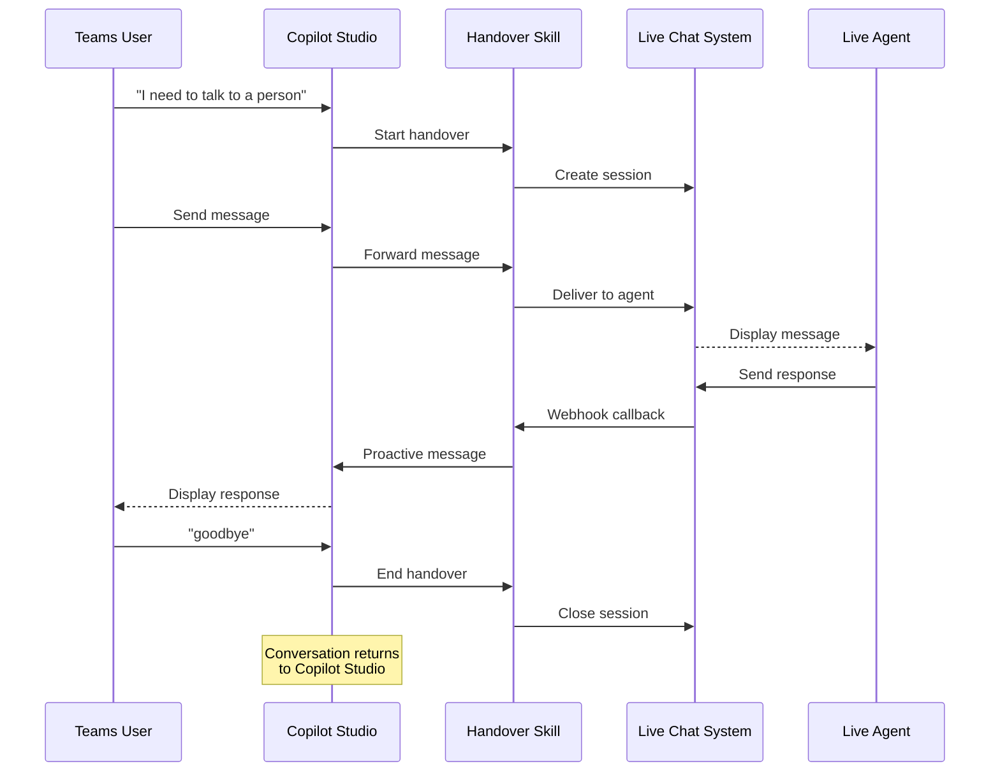

AI agents are great at handling routine queries, but [sometimes you just need a human](https://x.com/Oginji_/status/1923010101343818149). The question is: how do you hand off to a live agent while keeping all the benefits of Copilot Studio's native channels and conversation control?

This post introduces a new pattern that lets Copilot Studio manage the Microsoft Teams channel while enabling seamless escalation to live agents in your custom customer service system.

## The Problem with Traditional Handover

Here's how escalation typically works today (see [documentation](https://learn.microsoft.com/en-us/microsoft-copilot-studio/configure-generic-handoff)):

An engagement hub or CCaaS solution (ServiceNow, Genesys, Salesforce Service Cloud) provides a chat service—sometimes a simple widget, but often their own AI assistant or virtual agent—between the customer and your Copilot Studio agent. When a conversation needs a live agent, the engagement hub's chat service routes it to their live chat system, taking over the entire conversation.

This creates several problems:

**Lost Native Channels**: You can't use Copilot Studio's native channels like Microsoft Teams or WebChat. Instead, you're stuck with the engagement hub's chat interface, losing all the rich features and integrations that made you choose Copilot Studio in the first place.

**No Return Path**: Once the conversation is handed off to the engagement hub, there's no easy way to return it to your Copilot Studio agent. The user is stuck in the live chat experience, even for simple follow-up questions the agent could handle.

**Redundant Orchestration**: Many CCaaS vendors (ServiceNow, Salesforce) require you to plug your Copilot Studio agent into *their* existing virtual agent or AI assistant. This creates a double layer of natural language understanding and conversation orchestration—both systems trying to interpret intent and manage the flow.

It's architectural redundancy that adds complexity without adding value.

## A Better Approach

What if Copilot Studio could stay in control of its native channels while still enabling bidirectional communication with your customer service system? 

That's exactly why we published a sample with a new pattern: [Copilot Studio Handover Sample](https://github.com/microsoft/CopilotStudioSamples/tree/main/IntegrateWithEngagementHub/HandoverToLiveAgentUsingSkill)

Using M365 Agents SDK skills and Microsoft Teams proactive messaging, this approach lets you:

1. Keep Copilot Studio managing the Microsoft Teams channel natively
2. Route messages to any third-party live chat system via API
3. Let live agents send multiple asynchronous responses back to customers
4. Seamlessly return the conversation to the Copilot Studio agent
5. Avoid the double orchestration of plugging into another virtual agent platform

The key insight: the skill acts as a lightweight message broker between Copilot Studio and your live chat system, maintaining conversation mappings while preserving Copilot Studio's control of the channel.

> M365 Agents SDK skills are currently supported but not the long-term recommended pattern. For new implementations, consider [multi-agent orchestration](https://learn.microsoft.com/en-us/microsoft-copilot-studio/add-agent-microsoft-365-agents-sdk-agent), which reflects Microsoft's forward investment path.
{: .prompt-warning }

## How It Works

Here's the basic flow:

The magic here is **Microsoft Teams proactive messaging**, which enables live agents to send responses at any time, creating a natural conversation flow without Copilot Studio having to poll or wait for user input. When the user is done with the live agent, they simply return to chatting with the Copilot Studio agent—no separate widget to close, no context lost.

> **Important**: This pattern currently works only with the Microsoft Teams channel because it relies on Teams proactive messaging for the bidirectional async communication. The underlying concept is channel-agnostic, but you'd need to adapt the messaging mechanism for other channels.
{: .prompt-warning }

## The Sample

The [Copilot Studio Handover Sample](https://github.com/microsoft/CopilotStudioSamples/tree/main/IntegrateWithEngagementHub/HandoverToLiveAgentUsingSkill) includes three components:

**1. HandoverToLiveAgentSample** - An M365 Agents SDK skill that acts as the message broker between Copilot Studio and your live chat system. It handles:
- Authentication with both Copilot Studio and your live chat platform
- Conversation mapping and state management
- Message routing in both directions
- Teams proactive messaging

**2. ContosoLiveChatApp** - A mock customer service application that demonstrates the integration pattern. This simulates a third-party live chat system with:
- REST APIs for session management
- A web UI for live agents
- Webhook capabilities for sending responses back

Think of this as a stand-in for your actual ServiceNow, Salesforce, Genesys, or Zendesk implementation.

**3. HandoverAgentSample.zip** - A pre-built Copilot Studio solution with:
- Pre-configured "Escalate to Live Chat" and "Goodbye Live Chat" topics
- Environment variables for skill configuration
- Ready-to-import and test

## Getting Started

The [GitHub repository](https://github.com/microsoft/CopilotStudioSamples/tree/main/IntegrateWithEngagementHub/HandoverToLiveAgentUsingSkill) includes everything you need to try this pattern.

At a high level, you'll need to:

1. **Set up two Azure AD app registrations** - one for the skill to authenticate with Azure Bot Service, and one for the Copilot Studio agent (auto-created when you import the solution)
2. **Run the skill and mock live chat app locally** - using dev tunnels to expose the skill endpoint
3. **Import the pre-built Copilot Studio solution** - includes ready-to-test topics and environment variables
4. **Configure authentication** - connect the skill to both your Copilot Studio agent and live chat system

The README provides detailed step-by-step instructions for local development, testing, and production deployment. Fair warning: the setup is a bit involved (two app registrations, multiple configuration files), but once it's running, you'll have a fully functional handover pattern to build on.

## Try It Out

Ready to explore this pattern? Check out the [complete sample on GitHub](https://github.com/microsoft/CopilotStudioSamples/tree/main/IntegrateWithEngagementHub/HandoverToLiveAgentUsingSkill).

Have questions or built something cool with this pattern? Drop a comment below—I'd love to hear about it!

{: .shadow w="500"}
_How you'll feel keeping control of your channels while handing off to live agents_

---

*Are you integrating Copilot Studio to a custom engagement hub? Let us know!*
