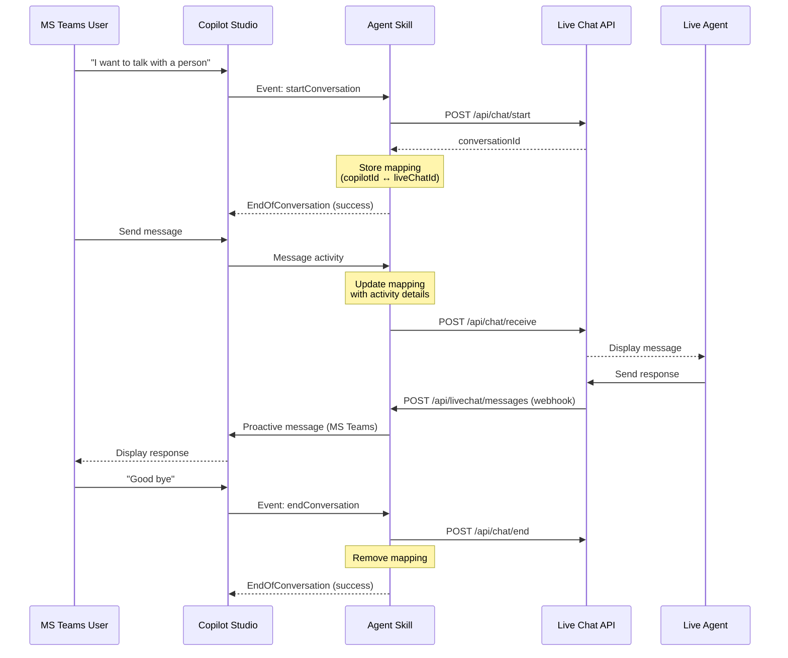

# Why Hand Over to Live Agents?

AI agents excel at handling routine queries efficiently, but complex scenarios often require human expertise. The challenge: how do you seamlessly escalate from bot to human while maintaining conversation context and enabling bidirectional communication?

This post demonstrates a production-ready pattern for handing over Copilot Studio conversations to third-party live chat systems and returning them back to the agent—complete with full context preservation and real-time message exchange.

## What You'll Build

- A Copilot Studio skill that bridges agent conversations to live chat systems
- Bidirectional message flow using MS Teams proactive messaging
- Conversation state management across systems
- A mock live chat app demonstrating the integration pattern (adaptable to your own system)

> This pattern uses Microsoft Teams proactive messaging, limiting it to the Teams channel. Other channels don't support the async communication required for live agent responses.
{: .prompt-warning }

## Prerequisites

- .NET 9.0 SDK installed
- Copilot Studio environment with agent creation permissions
- Microsoft Teams channel enabled for your agent
- Azure AD tenant with App Registration permissions
- [Dev tunnel](https://learn.microsoft.com/azure/developer/dev-tunnels/get-started) for local development and testing

## Solution Overview

The handover pattern consists of three interconnected components:

### 1. HandoverToLiveAgentSample (.NET 9.0 Skill)

A Copilot Studio skill that acts as the bridge between your agent and external live chat systems. This skill handles:

- **Event processing**: Responds to `startConversation` and `endConversation` events from Copilot Studio
- **Message forwarding**: The `OnMessageAsync` handler sends user messages from Teams to the live chat system
- **Conversation mapping**: Maintains bidirectional relationships between Copilot and live chat conversation IDs
- **Proactive messaging**: Sends live agent responses back to MS Teams users

**Key components:**
- `CopilotStudioAgent.cs`: Main agent handling Copilot Studio activities
- `ConversationManager.cs`: Manages conversation ID mappings and metadata
- `LiveChatService.cs`: Communicates with the external live chat API
- `LiveChatWebhookController.cs`: Receives webhook messages from live agents
- `MsTeamsProactiveMessage.cs`: Handles MS Teams proactive messaging

### 2. ContosoLiveChatApp (Mock Live Chat System)

A simple demonstration app simulating a third-party customer service platform. **This is where you'll plug in your own live chat system.**

The mock app provides:
- REST API for starting/ending conversations
- Message receiving endpoint for incoming user messages
- Webhook sender for outgoing agent responses
- Simple web UI for live agents to view and respond to conversations

<!-- IMAGE PLACEHOLDER: Screenshot of ContosoLiveChatApp web interface
Shows: Live chat UI with conversation list on left, active chat window on right
Example conversation displayed showing messages from both user and agent
Highlighting the "Send" button and message input field
File path suggestion: /assets/posts/copilot-studio-handover-live-agent/contoso-livechat-ui.png
-->

### 3. HandoverAgentSample.zip (Copilot Studio Solution)

Pre-built Copilot Studio agent with customized topics:
- **"Escalate to Live Chat"**: Triggers the handover using `startConversation` and `sendMessage` skills
- **"Goodbye Live Chat"**: Ends the handover session and returns control to the agent

<!-- IMAGE PLACEHOLDER: Screenshot of Copilot Studio authoring canvas
Shows: The "Escalate to Live Chat" topic with nodes visible
Highlighting: Call an action node invoking the handover skill
Show the topic trigger phrases like "talk to a person", "human agent"
File path suggestion: /assets/posts/copilot-studio-handover-live-agent/copilot-studio-topic.png
-->

## How It Works

Understanding the message flow is crucial for implementing this pattern. Here's the complete sequence from escalation to resolution:



The key insight: the skill maintains a persistent mapping between the Copilot Studio conversation and the live chat session, enabling messages to flow in both directions asynchronously.

## Setup Steps

### Step 1: Setup Dev Tunnel

For local development, create a dev tunnel to expose your local endpoints:

```powershell
# Authenticate with your Microsoft account
devtunnel login

# Create a tunnel (replace <YOUR-NAME> with a unique identifier)
devtunnel create <YOUR-NAME> --allow-anonymous

# Create port forwarding for the skill endpoint
devtunnel port create <YOUR-NAME> -p 5001

# Start hosting the tunnel
devtunnel host <YOUR-NAME>
```

Note the generated URL—you'll need it in later configuration steps.

<!-- IMAGE PLACEHOLDER: Terminal screenshot showing dev tunnel commands
Shows: Successful devtunnel creation with output showing the tunnel URL
Highlighting: The HTTPS URL format like "https://xyz-5001.euw.devtunnels.ms"
File path suggestion: /assets/posts/copilot-studio-handover-live-agent/devtunnel-setup.png
-->

### Step 2: Run the Applications

Open two terminal windows and run both applications:

**Terminal 1 - HandoverToLiveAgentSample (Skill):**
```powershell
dotnet run --project .\HandoverToLiveAgentSample\HandoverToLiveAgentSample.csproj
```
Available at: `http://localhost:5001`

**Terminal 2 - ContosoLiveChatApp (Mock Live Chat):**
```powershell
dotnet run --project .\ContosoLiveChatApp\ContosoLiveChatApp.csproj
```
Available at: `http://localhost:5000`

### Step 3: Import Solution to Copilot Studio

1. Download `HandoverAgentSample.zip` from the repository
2. Navigate to your Copilot Studio environment
3. Import the solution and configure environment variables:
   - `[Contoso Agent] Handoff Skill endpointUrl`: `https://<YOUR-TUNNEL>-5001.euw.devtunnels.ms/api/messages`
   - `[Contoso Agent] Handoff Skill msAppId`: (will be updated after App Registration)

<!-- IMAGE PLACEHOLDER: Screenshot of Copilot Studio solution import screen
Shows: Environment variables configuration panel
Highlighting: The two environment variables mentioned above with sample values
File path suggestion: /assets/posts/copilot-studio-handover-live-agent/environment-variables.png
-->

### Step 4: Configure App Registration

After importing the solution, Copilot Studio creates an Azure AD App Registration for your agent:

1. Find the App Registration with Client ID matching your Agent App ID
2. Set "Home page URL" to your dev tunnel endpoint: `https://<YOUR-TUNNEL>-5001.euw.devtunnels.ms/api/messages`
3. Navigate to "Certificates & secrets"
4. Create a new client secret and copy its value immediately

> Store the client secret securely—you won't be able to view it again. For production, use Azure Key Vault.
{: .prompt-danger }

<!-- IMAGE PLACEHOLDER: Screenshot of Azure Portal App Registration page
Shows: The "Certificates & secrets" blade with a client secret created
Highlighting: The "Copy" button for the secret value and expiration date
File path suggestion: /assets/posts/copilot-studio-handover-live-agent/app-registration-secret.png
-->

### Step 5: Update Configuration Files

Now configure the skill with authentication details:

**appsettings.json** (in HandoverToLiveAgentSample project):
```json
{
  "LiveChatSettings": {
    "BaseUrl": "http://localhost:5000"
  },
  "Connections": {
    "CopilotStudioBot": {
      "ConnectionType": "AzureAD",
      "Settings": {
        "TenantId": "your-tenant-id",
        "ClientId": "your-bot-app-id",
        "ClientSecret": "your-bot-client-secret",
        "Scopes": ["https://api.botframework.com/.default"]
      }
    }
  },
  "ConnectionsMap": [
    {
      "ServiceUrl": "https://smba*",
      "Connection": "CopilotStudioBot"
    }
  ]
}
```

The `ConnectionsMap` section is critical—it tells the skill which credentials to use when sending proactive messages based on the service URL pattern.

**skill-manifest.json** (in HandoverToLiveAgentSample/wwwroot):
```json
{
  "endpointUrl": "https://<YOUR-TUNNEL>-5001.euw.devtunnels.ms/api/messages",
  "msAppId": "your-bot-app-id"
}
```

> If you modify skill-manifest.json after initial setup, refresh the skill in Copilot Studio for changes to take effect.
{: .prompt-tip }

### Step 6: Publish and Test

1. Publish your agent in Copilot Studio
2. Add it to the "Teams and Microsoft 365 Copilot" channel
3. Open Microsoft Teams and start a conversation
4. Trigger the escalation by saying "I need to talk to a person"
5. Open the Contoso Live Chat app at `http://localhost:5000`
6. Respond as a live agent and watch messages flow bidirectionally

<!-- IMAGE PLACEHOLDER: Screenshot of Microsoft Teams showing active conversation
Shows: User message "I need to talk to a person"
Agent response: "Connecting you to a live agent..."
Then live agent response appearing in the chat
File path suggestion: /assets/posts/copilot-studio-handover-live-agent/teams-conversation.png
-->

## Key Implementation Details

Let's examine the core code patterns that make this handover work.

### Handling Conversation Events

The skill responds to two special events from Copilot Studio:

```csharp
// HandoverToLiveAgentSample/CopilotStudio/CopilotStudioAgent.cs

private async Task OnEventAsync(ITurnContext turnContext, ITurnState turnState, CancellationToken ct)
{
    if (turnContext.Activity.Name == "startConversation")
    {
        // User wants to escalate - create a new live chat session
        var liveChatConversationId = await liveChatService.StartConversationAsync();
        
        // Store the mapping between Copilot and live chat IDs
        await conversationManager.UpsertMappingByCopilotConversationId(
            turnContext.Activity, liveChatConversationId);
        
        // Signal success back to Copilot Studio
        await turnContext.SendActivityAsync(new Activity
        {
            Type = ActivityTypes.EndOfConversation,
            Name = "startConversation",
            Code = EndOfConversationCodes.CompletedSuccessfully
        }, ct);
    }
    else if (turnContext.Activity.Name == "endConversation")
    {
        // User is done with live agent - clean up
        var mapping = await conversationManager.GetMapping(
            turnContext.Activity.Conversation!.Id);
        
        await liveChatService.EndConversationAsync(
            mapping.LiveChatConversationId);
        
        await conversationManager.RemoveMappingByCopilotConversationId(
            turnContext.Activity.Conversation!.Id);
    }
}
```

The `startConversation` event initiates the handover, while `endConversation` cleans up when the user returns to the agent.

### Managing Conversation Mappings

The `ConversationManager` maintains the critical bidirectional mapping:

```csharp
// HandoverToLiveAgentSample/CopilotStudio/ConversationManager.cs

public class ConversationMapping
{
    // Core identifiers for bidirectional lookup
    public string CopilotConversationId { get; set; }
    public string LiveChatConversationId { get; set; }
    
    // Metadata needed for proactive messaging
    public string UserId { get; set; }
    public string? ChannelId { get; set; }
    public string? ServiceUrl { get; set; }
    public string? BotId { get; set; }
    public string? BotName { get; set; }
}
```

This mapping stores everything needed to send proactive messages back to Teams. The `ServiceUrl` is particularly important—it identifies the MS Teams SMBA region and determines which credentials to use.

> The sample uses in-memory storage with static dictionaries. For production, replace this with Redis, Azure Cosmos DB, or another persistent store.
{: .prompt-warning }

### Receiving Messages from Live Agents

When a live agent responds, the webhook controller receives the message and routes it back to Teams:

```csharp
// HandoverToLiveAgentSample/LiveChat/LiveChatWebhookController.cs

[HttpPost("messages")]
public async Task<ActionResult> ReceiveMessageAsync([FromBody] MessageRequest request)
{
    // Look up which Copilot conversation this live chat session belongs to
    var mapping = await _conversationManager.GetMapping(request.ConversationId);
    
    // Send the agent's message back to Teams using proactive messaging
    await _proactiveMessenger.SendTextAsync(
        mapping, request.Message, request.Sender);
    
    return Ok();
}
```

The webhook pattern decouples the live chat system from the skill—the live chat system just needs to POST to this endpoint when agents send messages.

### Proactive Messaging to Teams

Sending messages back to Teams requires proactive messaging capabilities:

```csharp
// HandoverToLiveAgentSample/CopilotStudio/MsTeamsProactiveMessage.cs

public async Task SendTextAsync(ConversationMapping mapping, string text, string? senderName)
{
    // Resolve which App ID to use based on service URL
    var appId = ResolveAppId(mapping.ServiceUrl);
    
    // Create conversation reference for proactive messaging
    var conversationReference = new ConversationReference
    {
        Conversation = new ConversationAccount { Id = mapping.CopilotConversationId },
        ServiceUrl = mapping.ServiceUrl,
        ChannelId = mapping.ChannelId,
        Bot = new ChannelAccount { Id = mapping.BotId, Name = mapping.BotName },
        User = new ChannelAccount { Id = mapping.UserId }
    };
    
    // Format message with sender's name
    var formattedText = string.IsNullOrEmpty(senderName) 
        ? text 
        : $"**{senderName}**: {text}";
    
    // Send proactive message
    await _channelAdapter.ContinueConversationAsync(
        appId, 
        conversationReference, 
        async (turnContext, ct) =>
        {
            await turnContext.SendActivityAsync(
                MessageFactory.Text(formattedText), ct);
        }, 
        default);
}
```

This method handles the complexity of MS Teams SMBA regions and ensures messages appear in the correct conversation.

### Dependency Injection Setup

The skill uses scoped and singleton services appropriately:

```csharp
// HandoverToLiveAgentSample/Program.cs

builder.Services.AddScoped<ILiveChatService, LiveChatService>();
builder.Services.AddSingleton<IConversationManager, ConversationManager>();
builder.Services.AddSingleton<IProactiveMessenger, MsTeamsProactiveMessage>();

// Register the main agent class
builder.AddAgent<HandoverToLiveAgent.CopilotStudio.CopilotStudioAgent>();
```

`ConversationManager` is singleton to maintain state across requests, while `LiveChatService` is scoped for per-turn processing. The `CopilotStudioAgent` class must use scoped service resolution to access `LiveChatService` correctly.

## Extending to Your Live Chat System

The Contoso Live Chat app is a **mock example** demonstrating the integration pattern. Here's how to adapt it to your own live chat platform.

### Understanding the Integration Contract

Your live chat system needs to implement these capabilities:

**1. Start Conversation API**
When a user escalates, the skill calls this to create a new live chat session:

```csharp
// Your implementation of ILiveChatService
public async Task<string> StartConversationAsync()
{
    // Call your live chat API to create a session
    // Example: POST https://your-livechat.com/api/sessions
    
    var response = await _httpClient.PostAsync(
        "https://your-livechat.com/api/sessions",
        new StringContent("{}", Encoding.UTF8, "application/json"));
    
    var data = await response.Content.ReadFromJsonAsync<SessionResponse>();
    
    // Return the session ID from your system
    return data.SessionId;
}
```

**2. Send Message API**
When users send messages through Teams, forward them to your live chat system:

```csharp
public async Task SendMessageAsync(string conversationId, string message, string userId)
{
    // Call your live chat API to deliver the user's message
    // Example: POST https://your-livechat.com/api/sessions/{id}/messages
    
    var payload = new
    {
        message = message,
        senderId = userId,
        senderType = "customer"
    };
    
    await _httpClient.PostAsJsonAsync(
        $"https://your-livechat.com/api/sessions/{conversationId}/messages",
        payload);
}
```

**3. End Conversation API**
When users return to the agent, clean up the live chat session:

```csharp
public async Task EndConversationAsync(string conversationId)
{
    // Call your live chat API to close the session
    // Example: DELETE https://your-livechat.com/api/sessions/{id}
    
    await _httpClient.DeleteAsync(
        $"https://your-livechat.com/api/sessions/{conversationId}");
}
```

### Configuring Webhooks

Your live chat system must send agent responses back to the skill via webhook. Configure your platform to POST to:

```
https://<YOUR-SKILL-ENDPOINT>/api/livechat/messages
```

**Expected webhook payload:**
```json
{
  "conversationId": "live-chat-session-id",
  "message": "Hello, I'm here to help!",
  "sender": "Agent Name"
}
```

Most enterprise live chat platforms (Salesforce Service Cloud, Zendesk, Intercom, etc.) support webhook notifications when agents send messages. Consult your platform's documentation for webhook configuration.

### Authentication Considerations

If your live chat API requires authentication:

```csharp
// Add authentication headers in your ILiveChatService implementation
private async Task<HttpClient> GetAuthenticatedClient()
{
    var client = _httpClientFactory.CreateClient();
    
    // Option 1: API Key authentication
    client.DefaultRequestHeaders.Add("X-API-Key", _apiKey);
    
    // Option 2: Bearer token authentication
    // var token = await GetAccessToken();
    // client.DefaultRequestHeaders.Authorization = 
    //     new AuthenticationHeaderValue("Bearer", token);
    
    return client;
}
```

> Store API keys and secrets in Azure Key Vault or environment variables, never in source code.
{: .prompt-danger }

### Adapting the UI

If you want live agents to use a custom interface:

1. **Embed in existing tools**: Most enterprise platforms provide webhooks and APIs—you may not need a separate UI
2. **Build custom UI**: Use the Contoso app as a starting point, modify the HTML/JS to match your branding
3. **Mobile apps**: Call the same REST APIs from mobile applications

The key is ensuring agents can view incoming messages and send responses that trigger the webhook back to the skill.

## Limitations and Considerations

### Microsoft Teams Channel Only

This pattern requires proactive messaging to send live agent responses back to users asynchronously. Currently, only the Microsoft Teams channel in Copilot Studio supports this capability reliably.

**Impact**: Users on web chat, mobile app, or other channels cannot use this handover pattern.

**Workaround**: Consider implementing different escalation strategies for non-Teams channels (email notifications, callback requests, etc.).

### In-Memory Storage

The sample uses static dictionaries in `ConversationManager` for conversation mappings.

**Impact**: 
- State is lost on application restart
- Cannot scale to multiple instances (no shared state)
- Not suitable for production environments

**Solution**: Replace with persistent storage:
```csharp
// Example: Azure Cosmos DB implementation
public class CosmosConversationManager : IConversationManager
{
    private readonly Container _container;
    
    public async Task UpsertMappingByCopilotConversationId(
        Activity activity, string liveChatId)
    {
        var mapping = new ConversationMapping
        {
            CopilotConversationId = activity.Conversation.Id,
            LiveChatConversationId = liveChatId,
            // ... other properties
        };
        
        await _container.UpsertItemAsync(mapping, 
            new PartitionKey(mapping.CopilotConversationId));
    }
}
```

### Multiple Simultaneous Sessions

The current implementation allows one MS Teams chat to create multiple live chat sessions without UI disambiguation.

**Impact**: If a user escalates multiple times without closing previous sessions, messages may be received simultaneously from multiple agents.

**Solution**: Implement session management UI or enforce one-session-per-user policies in your `ConversationManager`.

### Skill Manifest Refresh

Changes to `skill-manifest.json` require refreshing the skill in Copilot Studio.

**Process**:
1. Update the manifest file
2. Navigate to Copilot Studio > Settings > Skills
3. Find the handover skill
4. Click "Refresh" to reload the manifest

## Summary Checklist

When implementing live agent handover:

1. **Set up infrastructure**: Dev tunnel or production endpoint, .NET 9.0 runtime, Teams channel
2. **Configure authentication**: App Registration with client secret, proper scopes for Bot Framework
3. **Implement ILiveChatService**: Start conversation, send message, end conversation methods
4. **Configure webhooks**: Ensure your live chat system POSTs agent messages to the skill
5. **Set up conversation mapping storage**: Replace in-memory storage with persistent database
6. **Handle proactive messaging**: Configure `ConnectionsMap` for MS Teams SMBA regions
7. **Create Copilot Studio topics**: Use `startConversation` and `endConversation` events
8. **Test end-to-end**: Verify messages flow bidirectionally without loss

## Key Takeaways

- The skill pattern enables seamless handover to any third-party live chat system
- Conversation mapping is the critical component for bidirectional message routing
- MS Teams proactive messaging enables asynchronous agent responses
- The Contoso app is a template—replace it with your real live chat integration
- Production deployments require persistent storage and proper secret management
- Only Microsoft Teams channel currently supports this pattern fully

## Try It Yourself

Ready to implement live agent handover? Clone the complete sample:

**Repository**: [HandoverToLiveAgent Sample](https://github.com/mawasile/CopilotStudioSamples/tree/main/HandoverToLiveAgent)

1. Clone the repository
2. Follow the setup steps above
3. Test with the mock Contoso app
4. Replace `ILiveChatService` with your own live chat integration
5. Deploy to production with persistent storage

---

*Questions about integrating with your specific live chat platform? Have you implemented a similar handover pattern? Share your experience in the comments below!*
