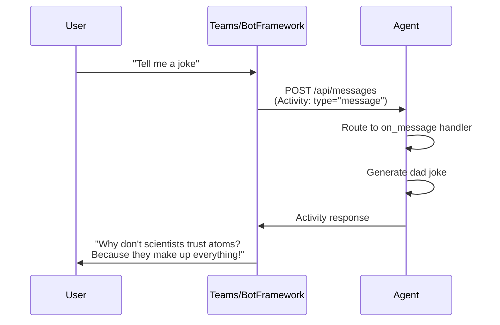
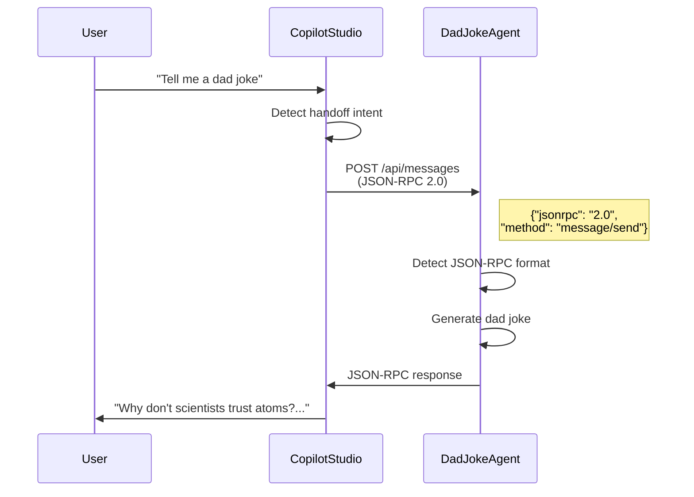

# From Dad Jokes to A2A: Building Python Agents That Talk to Copilot Studio

**Two protocols, one agent, infinite extensibility possibilities**

---

## Why Build External Agents for Copilot Studio?

Ever watched [YMAD's hilarious dad joke videos](https://www.youtube.com/@YMAD) and thought, "I need an agent that can do that"? Well, you're in luck! I built a Dad Joke Agent that delivers quality groan-worthy humor—but more importantly, it demonstrates something powerful: **how to extend Copilot Studio with external agents**.


*A2A: Adult-to-Agent protocol. Because when you've got child agents and connected agents, sometimes you need the grown-up in the room to handle the heavy lifting! 🕵️*

**Here's the real question my colleague asked:** "What business challenge does this solve?"

Great question. The answer: **extensibility through agents**. Copilot Studio is powerful, but sometimes you need to bring in specialized agents—autonomous entities with their own capabilities, logic, and integrations—that live outside Copilot Studio's native boundaries.

This isn't just about calling Python code. It's about **true multi-agent orchestration**:

- **Specialized agents** that own a domain and can reason about it (not just execute functions)
- **Pro-code agents** built with frameworks like the Microsoft 365 Agents SDK, LangChain, or Semantic Kernel
- **Existing agents** your team has already built that you want to connect to Copilot Studio
- **Agents with complex capabilities** — ML inference, multi-step workflows, external system integrations — that need the flexibility of code

With the newly announced Activity Protocol and Agent-to-Agent (A2A) communication in Copilot Studio (both in preview), you can now connect external agents into true multi-agent architectures. Copilot Studio becomes the orchestrator, handing off to specialized agents when their expertise is needed.

This post shows you how—using Python and the Microsoft 365 Agents SDK as the example, but the A2A protocol works with agents built in any framework.

> **🚨 Important Disclaimer**: This is a learning project built with current preview features. The code is for educational purposes—if you decide to put any of this in production, that's on you, dad! (See what I did there?) Always do proper testing and security reviews.

---

## Real-World Scenarios: Agents That Do Things

The dad joke example is fun, but here's where this pattern really shines. These aren't just Python scripts—they're **agents with autonomous capabilities** that Copilot Studio can hand off to:

| Agent | What It Does | Why It's an Agent (Not Just Code) |
|-------|--------------|-----------------------------------|
| **Document Intelligence Agent** | Extracts and validates data from invoices, contracts, or forms using Azure Document Intelligence + custom ML | Reasons about document structure, handles edge cases, decides what to extract based on context |
| **Legacy System Agent** | Integrates with SAP, Salesforce, or homegrown systems using existing battle-tested code | Manages complex authentication, handles retries, understands system-specific quirks |
| **ML Inference Agent** | Runs churn prediction, demand forecasting, or anomaly detection models | Interprets results, provides confidence levels, suggests actions based on predictions |
| **Workflow Orchestrator Agent** | Handles complex approval flows with conditional logic, parallel paths, and error recovery | Makes decisions about routing, handles exceptions, maintains workflow state |
| **External Data Agent** | Aggregates multiple APIs (weather + traffic + calendar) and synthesizes actionable insights | Combines data intelligently, resolves conflicts, presents unified recommendations |

**The key insight**: These agents *own their domain*. Copilot Studio orchestrates the conversation, but when specialized expertise is needed, it hands off to an agent that can reason, decide, and act—not just execute a function.

---

## Why Python? Why the Microsoft 365 Agents SDK?

The A2A protocol is framework-agnostic—you can build agents in anything. But for this example, I chose:

**Python** because:
- Approachable for technical and semi-technical people alike
- Massive community support and libraries for almost anything
- The de facto language for ML/AI workloads
- If you've got existing Python agents or code, you can expose them via A2A

**Microsoft 365 Agents SDK** because:
- Native integration with Microsoft ecosystem and Copilot Studio
- Handles the protocol complexity for you
- Built-in support for both Activity Protocol and A2A
- If you're starting from scratch, this is the recommended path

**But what if you already have agents in another framework?** That's exactly why I built this example to show *both* protocols. The A2A/JSON-RPC approach works with agents built in LangChain, Semantic Kernel, AutoGen, or any custom framework. Copilot Studio doesn't care how your agent is built—just that it speaks the protocol.

---

## The Two Protocols Explained

Before we dive into code, let's understand what we're dealing with:

| Protocol | Used By | When to Use |
|----------|---------|-------------|
| **Activity Protocol** | Bot Framework, Teams, Microsoft 365 Agents SDK | Building new agents with the SDK, need rich features (cards, attachments, conversation updates) |
| **A2A (JSON-RPC 2.0)** | Copilot Studio agent-to-agent handoffs | Connecting existing agents built in any framework to Copilot Studio |

**The cool part?** You can support both in the same endpoint! This agent detects which protocol is being used and responds accordingly. You probably don't *need* both, but I wanted to show it's possible.

### Activity Protocol Flow



### A2A Protocol Flow (JSON-RPC for Copilot Studio)



---

## Quick Setup: Clone and Run

Ready to try it? Here's how to get running in under 5 minutes.

### Prerequisites

- Python 3.9+
- [uv package manager](https://github.com/astral-sh/uv) (or use pip)
- VS Code (for dev tunnels)

### Step 1: Clone and Install

```bash
# Clone the repository
git clone https://github.com/Roelzz/dad-joke-a2a-agent.git
cd "Dad joke Agent example"

# Install dependencies
uv sync

# Configure environment
cp .env.example .env
# Edit .env with your OpenAI API key (optional) and BASE_URL

# Run the agent
uv run python main.py
```

You should see:

```
🤣 Dad Joke Agent Starting...
📡 Listening on http://localhost:2009/api/messages
🔑 OpenAI Integration: Enabled
```

### Step 2: Test It Locally

```bash
# Check health
curl http://localhost:2009/health

# Send a message
curl -X POST http://localhost:2009/api/messages \
  -H "Content-Type: application/json" \
  -d '{
    "type": "message",
    "text": "Tell me a dad joke",
    "from": {"id": "user123", "name": "Test User"},
    "recipient": {"id": "bot", "name": "Dad Joke Agent"},
    "conversation": {"id": "test-conv"},
    "channelId": "test"
  }'
```

### Step 3: Expose with VS Code Dev Tunnel

To connect to Copilot Studio, you need a public HTTPS URL:

1. **Forward port 2009** in VS Code (Ports panel)
2. **Make it public** (right-click → Port Visibility → Public)
3. **Copy the tunnel URL** (e.g., `https://abc123-2009.uks1.devtunnels.ms`)
4. **Update `.env`**: Set `BASE_URL=https://your-tunnel-url`
5. **Restart the agent**

Test your tunnel:

```bash
curl https://your-tunnel-url/health
```

---

## Code Walkthrough: The Key Parts

I've built this agent with **extensive logging** so you can see exactly what's happening. This is educational code—every request is logged with emoji indicators to help you trace the flow.

### Protocol Detection and Routing

The magic happens in `messages_endpoint`. One endpoint, two protocols:

```python
async def messages_endpoint(request):
    body = await request.json()

    # JSON-RPC 2.0 Detection (A2A Protocol)
    if body.get("jsonrpc") == "2.0" and body.get("method") == "message/send":
        print("🔀 Detected JSON-RPC 2.0 A2A message")

        # Extract message from JSON-RPC params
        params = body.get("params", {})
        message = params.get("message", {})
        parts = message.get("parts", [])

        # Get text from parts
        text = ""
        for part in parts:
            if part.get("kind") == "text":
                text = part.get("text", "")
                break

        # Generate response
        joke = await get_dad_joke(text)

        # Build JSON-RPC response
        jsonrpc_response = {
            "jsonrpc": "2.0",
            "id": body.get("id"),
            "result": {
                "message": {
                    "kind": "message",
                    "parts": [{"kind": "text", "text": joke}],
                    "role": "assistant"
                }
            }
        }
        return json_response(jsonrpc_response)

    # Activity Protocol (Bot Framework)
    else:
        print("🔀 Detected Bot Framework Activity")
        activity = Activity(**body)
        # Route to appropriate handler...
```

**What's happening:**
- Check for `"jsonrpc": "2.0"` to detect A2A messages
- Extract text from the nested `params.message.parts` structure
- Build a proper JSON-RPC response with matching `id`
- Fall back to Activity Protocol for everything else

### Activity Handlers

The SDK uses decorators to register handlers:

```python
@AGENT_APP.activity("message")
async def on_message(context: TurnState, activity: Activity):
    """Handle incoming message activities"""
    user_message = activity.text.strip() if activity.text else ""

    # Check for help command
    if user_message.lower() in ["/help", "help"]:
        await context.send_activity(help_text)
        return

    # Generate or retrieve a dad joke
    joke = await get_dad_joke(user_message)
    await context.send_activity(joke)
```

### Handoff Support

The handoff mechanism handles agent-to-agent transfers:

```python
async def handle_handoff(context: TurnState, activity: Activity):
    """Handle agent-to-agent handoff from Copilot Studio"""
    handoff_context = activity.value if hasattr(activity, 'value') else {}

    # Send acknowledgment
    await context.send_activity("🤝 Hey there! I'm the Dad Joke Agent...")

    # Support multiple field names for compatibility
    if handoff_context and isinstance(handoff_context, dict):
        request = (handoff_context.get("request") or
                  handoff_context.get("message") or
                  handoff_context.get("userMessage") or
                  handoff_context.get("text"))

        if request:
            joke = await get_dad_joke(request)
            await context.send_activity(joke)
```

> **Why multiple field names?** Documentation wasn't crystal clear on which field Copilot Studio uses, so I support them all. Maximum compatibility beats strict adherence to unclear specs!

### Discovery Endpoints

Copilot Studio needs to discover your agent's capabilities:

```python
# Agent card - describes the agent
@app.router.add_get("/.well-known/agent-card.json")

# Agent manifest - Teams/Copilot Studio integration  
@app.router.add_get("/api/manifest")

# Discovery document - comprehensive metadata
@app.router.add_get("/.well-known/agent-discovery.json")
```

All endpoints dynamically replace `{BASE_URL}` placeholders with your actual URL from `.env`:

```python
card_str = json.dumps(card_data).replace("{BASE_URL}", BASE_URL)
card_data = json.loads(card_str)
```

This means you can switch between local, tunnel, and production URLs without editing JSON files!

---

## Connecting to Copilot Studio

Now for the fun part—actually connecting your agent!

### Step 1: Ensure Your Tunnel is Running

```bash
curl https://your-tunnel-url/health
# Should return: {"status": "healthy", "agent": "Dad Joke Agent"}
```

### Step 2: Configure Copilot Studio

1. **Open Copilot Studio** and create or edit an agent
2. **Navigate to Settings → Agent capabilities**
3. **Enable "Agent-to-Agent" (A2A)**
4. **Enter your agent card URL**:
   ```
   https://your-tunnel-url/.well-known/agent-card.json
   ```
5. **Verify** Copilot Studio shows "Dad Joke Agent"

### Step 3: Set Up Handoff

1. **Create a topic** with trigger phrases like "Tell me a dad joke"
2. **Add a "Transfer conversation" action** pointing to your Dad Joke Agent
3. **Test it!** Type "Tell me a dad joke" and watch the handoff happen

### Step 4: Watch the Logs

This is where the extensive logging pays off:

```
🌐 POST /api/messages from 20.12.34.56
📨 INCOMING REQUEST
==============================================================
Body:
{
  "jsonrpc": "2.0",
  "method": "message/send",
  "id": "abc123",
  "params": {
    "message": {
      "parts": [{"kind": "text", "text": "Tell me a dad joke"}]
    }
  }
}
==============================================================

🔀 Detected JSON-RPC 2.0 A2A message
📝 Extracted text: Tell me a dad joke
✅ Request processed successfully
📤 Sending JSON-RPC 2.0 response
```

If something goes wrong, the logs will show exactly where!

---

## Lessons Learned: The Gotchas

Building this wasn't entirely smooth sailing. Here's what I discovered:

### 1. The 405 Error Mystery

**Problem**: `405 Method Not Allowed` when Copilot Studio connected.

**Root cause**: I implemented POST for `/.well-known/agent-card.json` but it should be GET only.

**Solution**: Discovery endpoints are GET, messaging endpoint is POST.

### 2. URL Configuration Headaches

**Problem**: Hardcoded tunnel URLs meant updating 4+ files every time the tunnel changed.

**Solution**: Use `{BASE_URL}` placeholders everywhere and replace dynamically. Environment variables are your friend!

### 3. Handoff Context Field Names

**Problem**: Which field does Copilot Studio use? `request`? `message`? `userMessage`?

**Solution**: Support them all:

```python
request = (handoff_context.get("request") or
          handoff_context.get("message") or
          handoff_context.get("userMessage") or
          handoff_context.get("text"))
```

### 4. Preview Features Are Preview Features

These features were announced at Ignite and are in preview:
- Microsoft 365 Agents SDK
- A2A protocol in Copilot Studio
- Some discovery endpoints

Things may change, documentation may evolve, and there may be quirks. If you encounter issues, share feedback through official channels!

---

## What's Next?

You've got a working dual-protocol agent! Here's where to take it:

**Build Your Own Agents:**
- Create specialized agents that own a domain (document processing, customer insights, workflow management)
- Connect existing agents you've built in LangChain, Semantic Kernel, or other frameworks
- Build pro-code agents with complex reasoning that goes beyond what's easy in low-code
- Expose your ML models as agents that can interpret and act on their predictions

**Explore Further:**
- [Microsoft 365 Agents SDK](https://github.com/microsoft/agents) — full documentation
- [Copilot Studio Documentation](https://learn.microsoft.com/microsoft-copilot-studio/) — official docs
- [More articles on The MCS CAT Blog](https://microsoft.github.io/mcscatblog/) — tips from the team

---

## TL;DR

After reading this, you can:

1. ✅ **Fork the repo** at [github.com/Roelzz/dad-joke-a2a-agent](https://github.com/Roelzz/dad-joke-a2a-agent)
2. ✅ **Understand** how Activity Protocol and A2A/JSON-RPC enable multi-agent architectures
3. ✅ **Run and test** a working dual-protocol agent locally
4. ✅ **Connect it** to Copilot Studio using agent-to-agent handoffs
5. ✅ **Apply the pattern** to your own agents—whether built in Python, or any other framework

**Key takeaways:**
- Copilot Studio can orchestrate external agents via A2A and Activity Protocol
- These are real agents with autonomous capabilities, not just code endpoints
- A2A is framework-agnostic: connect agents built in Python, LangChain, Semantic Kernel, or anything
- One agent can support both protocols (useful but not required)
- Detection is simple: check for the `jsonrpc` field
- Extensive logging is your best friend when learning

---

## Your Turn!

I built this example because multiple customers reached out after Ignite, wanting to understand best practices for agent-to-agent communication. Hopefully this helps!

**Now I want to hear from you:**
- 🍴 **Fork the repo** and try it out
- 🔧 **Build something** with your own Python logic
- 💬 **Comment below** with questions or what you're building
- 🤝 **Share your results** — I'd love to see what you create

And if you've got a better dad joke than "Why don't scientists trust atoms? Because they make up everything!" — drop it in the comments. I'm always looking to expand the repertoire. 🎤

Happy coding! 🎉

---

*Written by Roel Schenk, Microsoft Copilot Studio Customer Advisory Team*

*Have questions or feedback? Drop a comment below or reach out to the team!*
