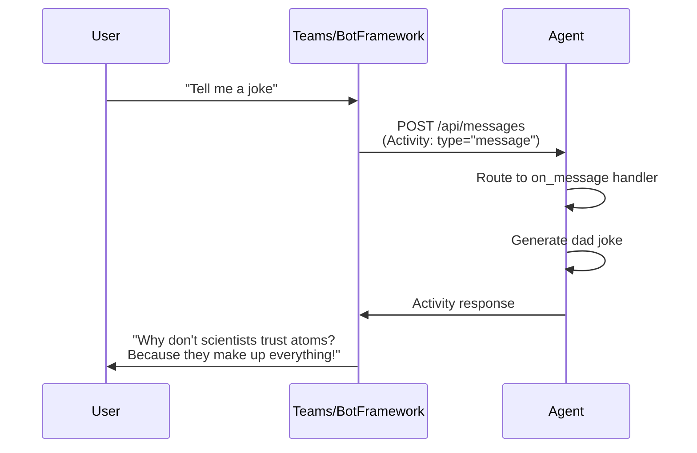
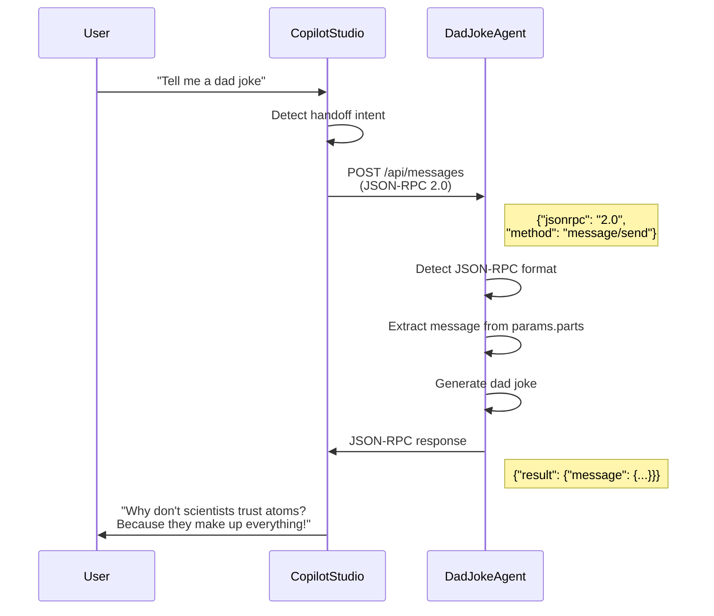

# From Dad Jokes to A2A: Building Python Agents with Microsoft 365 SDK for MCS

**Two Ways of Connecting Your Agents to Copilot Studio**

---

## Introduction

Ever watched [YMAD's hilarious dad joke videos](https://www.youtube.com/@YMAD) and thought, "I need an agent that can do that"? Well, you're in luck! I recently built a Dad Joke Agent that not only delivers quality groan-worthy humor but also demonstrates something pretty cool: how to build a Python agent that speaks *both* the Activity Protocol and the Agent-to-Agent (A2A) protocol.

**🚨 Important Disclaimer**: This is a learning project built with current MCS preview features. The code is for educational purposes—if you decide to put any of this in production, that's on you, dad! (See what I did there?) No code of mine should be deployed to production anywhere without proper testing, security reviews, and a healthy dose of caution.

That said, this project was a fantastic learning experience for me. I wanted to understand how to connect custom Python agents to Copilot Studio using the newly released Microsoft 365 Agents SDK. The result? A fully functional dual-protocol agent that you can fork, run, and learn from.

**What you'll learn:**
- How to build agents using the Microsoft 365 Agents SDK in Python
- The difference between Activity Protocol and A2A/JSON-RPC
- How to support *both* protocols in a single agent
- The discovery endpoints and handoff mechanisms Copilot Studio expects
- Some quirks and gotchas I discovered along the way
- How to use extensive logging to understand what's happening under the hood

**Repository**: [GitHub - Dad Joke Agent]([https://github.com/Roelzz/dad-joke-a2a-agent](https://github.com/Roelzz/dad-joke-a2a-agent)) 

Let's dive in! 🤣

---

## Why This Matters

Copilot Studio is powerful, but connecting custom agents to it has historically been... let's say, "non-trivial." With the Microsoft 365 Agents SDK and the new A2A protocol (both in preview), we now have standardized ways to:

1. **Build agents in Python** that integrate seamlessly with the Microsoft ecosystem
2. **Handle agent-to-agent handoffs** where Copilot Studio can transfer conversations to your specialized agent
3. **Support multiple protocols** in a single service (Activity Protocol for Bot Framework clients, JSON-RPC for Copilot Studio)

The challenge? Understanding how these protocols work, what Copilot Studio expects, and how to implement them correctly. That's where this Dad Joke Agent comes in—it's a working example with all the logging you need to see what's happening behind the scenes.

### The Two Protocols

Before we go further, let's clarify what we're dealing with:

| Protocol | Used By | Message Format | Purpose |
|----------|---------|----------------|---------|
| **Activity Protocol** | Bot Framework, Teams, traditional bots | Bot Framework Activities (JSON) | Standard bot communication, supports rich cards, attachments, conversation updates |
| **A2A (JSON-RPC 2.0)** | Copilot Studio, agent-to-agent handoffs | JSON-RPC 2.0 messages | Lightweight agent communication, skill invocation, handoff protocol |

**The cool part?** You can support both in the same endpoint! This agent detects which protocol is being used and responds accordingly.

---

## Quick Setup: Clone and Run

Want to try it out? Here's how to get running in under 5 minutes:

### Prerequisites
- Python 3.9+
- [uv package manager](https://github.com/astral-sh/uv) (or use pip)
- VS Code (for dev tunnels)

### Installation

```bash
# Clone the repository
git clone https://github.com/YOUR-USERNAME/dad-joke-agent.git
cd "Dad joke Agent example"

# Install dependencies
uv sync

# Configure environment
cp .env.example .env
# Edit .env with your OpenAI API key (optional) and BASE_URL

# Run the agent
uv run python main.py
```

You should see:
```
🤣 Dad Joke Agent Starting...
📡 Listening on http://localhost:2009/api/messages
🔑 OpenAI Integration: Enabled
```

### Test It Locally

```bash
# Check health
curl http://localhost:2009/health

# Send a message
curl -X POST http://localhost:2009/api/messages \
  -H "Content-Type: application/json" \
  -d '{
    "type": "message",
    "text": "Tell me a dad joke",
    "from": {"id": "user123", "name": "Test User"},
    "recipient": {"id": "bot", "name": "Dad Joke Agent"},
    "conversation": {"id": "test-conv"},
    "channelId": "test"
  }'
```

### Expose with VS Code Dev Tunnel

To connect to Copilot Studio, you need to expose your local agent:

1. **Forward port 2009** in VS Code (Ports panel)
2. **Make it public** (right-click → Port Visibility → Public)
3. **Copy the tunnel URL** (e.g., `https://abc123-2009.uks1.devtunnels.ms`)
4. **Update `.env`**: Set `BASE_URL=https://your-tunnel-url`
5. **Restart the agent**

**Why tunnels?** Copilot Studio needs to reach your agent over HTTPS to send handoff requests. Dev tunnels provide a secure, temporary public URL for local development without deploying to the cloud.

**Test your tunnel:**
```bash
curl https://your-tunnel-url/health
```

---

## Understanding the Protocols

The magic of this agent is in how it handles both protocols. Let's visualize the message flows:

### Activity Protocol Flow (Bot Framework)



**Key Characteristics:**
- Uses Bot Framework Activity schema
- Rich activity types: message, conversationUpdate, event, invoke, handoff
- Supports attachments, adaptive cards, suggested actions
- Bi-directional communication with context

### A2A Protocol Flow (JSON-RPC for Copilot Studio)



**Key Characteristics:**
- Uses JSON-RPC 2.0 message format
- Structured `parts` array for message content
- Lightweight, focused on text communication
- Request-response pattern with IDs

### How the Agent Handles Both

Here's the brilliant part (if I do say so myself): **one endpoint, two protocols**. The agent detects which protocol is being used and responds appropriately.

```python
# In main.py - messages_endpoint function
async def messages_endpoint(request):
    body = await request.json()

    # Check if this is a JSON-RPC 2.0 A2A message
    if body.get("jsonrpc") == "2.0" and body.get("method") == "message/send":
        # Handle JSON-RPC format
        # Extract text from parts array
        # Return JSON-RPC response

    # Otherwise, treat as Bot Framework Activity
    else:
        # Handle Activity Protocol
        # Route to appropriate handler
        # Return Activity response
```

This dual-protocol support means:
- ✅ Works with Teams, Bot Framework Emulator (Activity Protocol)
- ✅ Works with Copilot Studio handoffs (JSON-RPC/A2A)
- ✅ Single codebase, single deployment
- ✅ Future-proof for both ecosystems

---

## Code Walkthrough: The Key Functions

I've built this agent with **extensive logging** so you can see exactly what's happening. This isn't production code—it's educational code. Every request is logged with emoji indicators to help you trace the flow.

### 1. Protocol Detection and Routing

The `messages_endpoint` function (main.py:345-498) is where all the magic happens:

```python
async def messages_endpoint(request):
    # Detailed logging for troubleshooting
    print("\n" + "="*60)
    print("📨 INCOMING REQUEST")
    print("="*60)

    body = await request.json()

    # JSON-RPC 2.0 Detection
    if body.get("jsonrpc") == "2.0" and body.get("method") == "message/send":
        print("🔀 Detected JSON-RPC 2.0 A2A message")

        # Extract message from JSON-RPC params
        params = body.get("params", {})
        message = params.get("message", {})
        parts = message.get("parts", [])

        # Get text from parts
        text = ""
        for part in parts:
            if part.get("kind") == "text":
                text = part.get("text", "")
                break

        # Generate response
        joke = await get_dad_joke(text)

        # Build JSON-RPC response
        jsonrpc_response = {
            "jsonrpc": "2.0",
            "id": body.get("id"),
            "result": {
                "message": {
                    "kind": "message",
                    "parts": [{"kind": "text", "text": joke}],
                    "role": "assistant"
                }
            }
        }

        return json_response(jsonrpc_response)

    # Activity Protocol handling
    else:
        print("🔀 Detected Bot Framework Activity")
        activity = Activity(**body)
        # Route to appropriate handler...
```

**What's happening:**
- Checks for `"jsonrpc": "2.0"` to detect A2A messages
- Extracts text from the nested `params.message.parts` structure
- Builds a proper JSON-RPC response with matching `id`
- Falls back to Activity Protocol for everything else

### 2. Activity Handlers

The agent uses decorators to register handlers for different activity types:

```python
@AGENT_APP.activity("message")
async def on_message(context: TurnState, activity: Activity):
    """Handle incoming message activities"""
    user_message = activity.text.strip() if activity.text else ""

    # Check for help command
    if user_message.lower() in ["/help", "help"]:
        # Send help message
        await context.send_activity(help_text)
        return

    # Generate or retrieve a dad joke
    joke = await get_dad_joke(user_message)
    await context.send_activity(joke)
```

**Handlers include:**
- `on_message` - User text messages
- `on_conversation_update` - User joins/leaves
- `on_event` - System events (including handoffs)
- `on_invoke` - Skill invocations

### 3. Handoff Support

The handoff mechanism (main.py:168-206) is crucial for A2A integration:

```python
async def handle_handoff(context: TurnState, activity: Activity):
    """Handle agent-to-agent handoff from Copilot Studio"""
    try:
        # Extract handoff context
        handoff_context = activity.value if hasattr(activity, 'value') else {}

        # Send acknowledgment
        response = """🤝 **Handoff Received!**

        Hey there! I'm the Dad Joke Agent, and I've just received
        your conversation from another agent."""
        await context.send_activity(response)

        # If there's a specific request, handle it
        if handoff_context and isinstance(handoff_context, dict):
            # Support multiple field names for compatibility
            request = (handoff_context.get("request") or
                      handoff_context.get("message") or
                      handoff_context.get("userMessage") or
                      handoff_context.get("text"))

            if request:
                joke = await get_dad_joke(request)
                await context.send_activity(joke)

    except Exception as e:
        print(f"Error handling handoff: {e}")
        await context.send_activity("Let's start fresh - ask me for a joke!")
```

**Key features:**
- Supports multiple activity types: `handoff`, `event`, `invoke`
- Extracts context from multiple possible field names (maximum compatibility)
- Sends acknowledgment message to user
- Processes embedded requests automatically

### 4. Discovery Endpoints

Copilot Studio needs to discover your agent's capabilities. The agent exposes several endpoints:

```python
# Agent card - describes the agent
@app.router.add_get("/api/card")
@app.router.add_get("/.well-known/agent-card.json")

# Agent manifest - Teams/Copilot Studio integration
@app.router.add_get("/api/manifest")

# Declarative agent - Copilot Studio specific
@app.router.add_get("/api/declarative-agent")

# Discovery document - comprehensive metadata
@app.router.add_get("/api/discovery")
@app.router.add_get("/.well-known/agent-discovery.json")
```

All these endpoints dynamically replace `{BASE_URL}` placeholders with your actual URL from `.env`:

```python
# Replace {BASE_URL} placeholder with actual BASE_URL
card_str = json.dumps(card_data).replace("{BASE_URL}", BASE_URL)
card_data = json.loads(card_str)
```

This means you can easily switch between local, tunnel, and production URLs without editing JSON files!

### 5. Logging: Your Learning Tool

Throughout the code, you'll see extensive logging:

```python
print(f"\n🌐 {request.method} {request.path} from {request.remote}")
print(f"📝 Extracted text: {text}")
print(f"🔀 Routing activity type: {activity.type}")
print(f"✅ Request processed successfully")
print(f"❌ ERROR PROCESSING MESSAGE")
```

**Emoji indicators:**
- 🌐 HTTP request received
- 📨 Incoming request details
- 🔀 Protocol/routing decision
- 📝 Extracted content
- ✅ Success
- ❌ Error
- 📤 Outgoing response
- 🤝 Handoff detected

**Why so much logging?** Because when you're learning how these protocols work, seeing exactly what's being sent and received is invaluable. You can trace:
- What Copilot Studio is sending
- How the agent interprets it
- What response is generated
- Any errors that occur

This is **not** production code—you'd want structured logging, log levels, and less verbosity in production. But for learning? This is gold.

---

## Connecting to Copilot Studio

Now for the fun part—actually connecting your agent to Copilot Studio!

### Step 1: Ensure Your Tunnel is Running

Make sure your agent is running and accessible via your dev tunnel:

```bash
# Should return {"status": "healthy", "agent": "Dad Joke Agent"}
curl https://your-tunnel-url/health
```

### Step 2: Configure Copilot Studio

1. **Open Copilot Studio** and create a new agent or edit an existing one

2. **Add Agent-to-Agent capability**
   - Navigate to Settings → Agent capabilities
   - Enable "Agent-to-Agent" (A2A)

3. **Configure the agent card URL**

   When prompted: "If your agent card is hosted at a well-known location, enter its full URL..."

   Enter:
   ```
   https://your-tunnel-url/.well-known/agent-card.json
   ```

4. **Test the connection**
   - Copilot Studio will fetch your agent card
   - Verify it shows "Dad Joke Agent" with your description

### Step 3: Set Up Handoff

In your Copilot Studio agent:

1. **Create a topic** that triggers handoff

   Example trigger phrases:
   - "Tell me a dad joke"
   - "I need a joke"
   - "Make me laugh"

2. **Add handoff action**
   - In the topic flow, add "Transfer conversation"
   - Select your Dad Joke Agent
   - (Optional) Pass context: `"request": "Tell me a joke about {topic}"`

3. **Test in the chat**
   - Type: "Tell me a dad joke"
   - Copilot Studio should hand off to your agent
   - Your agent should respond with a joke!

### Step 4: Watch the Logs

This is where the extensive logging pays off! When Copilot Studio connects, you'll see:

```
🌐 POST /api/messages from 20.12.34.56
📨 INCOMING REQUEST
==============================================================
Method: POST
Path: /api/messages

Headers:
  Content-Type: application/json
  ...

Body:
{
  "jsonrpc": "2.0",
  "method": "message/send",
  "id": "abc123",
  "params": {
    "message": {
      "parts": [
        {"kind": "text", "text": "Tell me a dad joke"}
      ]
    }
  }
}
==============================================================

🔀 Detected JSON-RPC 2.0 A2A message
📝 Extracted text: Tell me a dad joke
✅ Request processed successfully
📤 Sending JSON-RPC 2.0 response
```

You can see:
- ✅ JSON-RPC 2.0 was detected
- ✅ Message was extracted correctly
- ✅ Response was generated

If something goes wrong, the logs will show exactly where!

---

## Lessons Learned: The Kinks in the Road

Building this wasn't entirely smooth sailing. Here are some gotchas I discovered:

### 1. The 405 Error Mystery

**Problem**: Initially, I got `405 Method Not Allowed` errors when Copilot Studio tried to connect.

**Root cause**: I had implemented POST support for `/.well-known/agent-card.json` based on what I thought the documentation said. However, this endpoint should primarily be GET.

**Solution**: The agent now supports both GET (for discovery) and POST (for messaging) at different endpoints:
- `/.well-known/agent-card.json` → GET only (agent card)
- `/api/messages` → POST (actual messaging)

**Lesson**: Read the spec carefully, but also be prepared to experiment. These are preview features, and documentation may be evolving.

### 2. URL Configuration Headaches

**Problem**: Hardcoded tunnel URLs in JSON files meant updating 4+ files every time the tunnel changed.

**Solution**: Use `{BASE_URL}` placeholders in all JSON files and replace them dynamically:

```python
BASE_URL = os.getenv("BASE_URL", f"http://localhost:{PORT}")

# In endpoint handlers
card_str = json.dumps(card_data).replace("{BASE_URL}", BASE_URL)
```

**Lesson**: Separate configuration from code. Environment variables are your friend!

### 3. JSON-RPC vs Activity Protocol

**Problem**: Not immediately obvious which protocol Copilot Studio would use.

**Solution**: Support both! Detect at runtime and handle appropriately.

**Lesson**: The `jsonrpc` field is the reliable indicator. Check for it first, then fall back to Activity Protocol.

### 4. Handoff Context Field Names

**Problem**: Documentation wasn't clear on which field name to use for handoff context (`request`, `message`, `userMessage`, `text`?).

**Solution**: Support them all:

```python
request = (handoff_context.get("request") or
          handoff_context.get("message") or
          handoff_context.get("userMessage") or
          handoff_context.get("text"))
```

**Lesson**: When in doubt, be flexible. Maximum compatibility beats strict adherence to unclear specs.

### 5. Preview Features Are Preview Features

**Important reminder**: Everything here uses preview features:
- Microsoft 365 Agents SDK
- A2A protocol in Copilot Studio
- Some of the discovery endpoints

**What this means:**
- Things may change
- Documentation may be incomplete or evolving
- There may be bugs or unexpected behavior
- Feedback to the product team is valuable!

If you encounter issues or have suggestions, share them with the Copilot Studio team through official channels.

---

## What's Next?

You now have a working dual-protocol agent! Here are some ideas for what to do next:

### Build Your Own Agent

Fork this repository and customize it:
- **Weather Agent**: Fetch weather data from an API
- **Knowledge Base Agent**: Query your company's documentation
- **Workflow Agent**: Trigger business processes
- **Calculator Agent**: Perform complex calculations
- **Translation Agent**: Translate text between languages

The patterns in this agent apply to any scenario!

### Explore the Microsoft 365 Agents SDK

This agent just scratches the surface. The SDK supports:
- State management and conversation memory
- Authentication and authorization
- Proactive messaging
- Rich cards and adaptive cards
- File uploads and handling
- Multi-turn conversations

Check out the [Microsoft 365 Agents SDK documentation](https://github.com/microsoft/agents) for more.

### Join the Community

- **Share your dad jokes!** Drop them in the comments below 👇
- **Show us what you built!** Share your custom agents
- **Ask questions!** If something's unclear, let me know
- **Provide feedback!** These are preview features—your input matters

---

## Conclusion

Building an agent that connects to Copilot Studio doesn't have to be rocket science (though it does involve a healthy amount of JSON-RPC). With the Microsoft 365 Agents SDK and support for both Activity Protocol and A2A, you can create powerful custom agents that integrate seamlessly with the Microsoft ecosystem.

**Key takeaways:**
- ✅ One agent can support both protocols (Activity + A2A/JSON-RPC)
- ✅ Detection is simple: check for `jsonrpc` field
- ✅ Discovery endpoints help Copilot Studio find and integrate your agent
- ✅ Extensive logging is your friend when learning
- ✅ Environment variables make configuration flexible
- ✅ Preview features are exciting but may have quirks

**Remember:**
- 🚨 This is educational code, not production-ready
- 🔒 Never commit API keys or secrets
- 🐛 Preview features may change
- 🤝 Share your learnings with the community

Now go forth and build some agents! And if you create something cool (or discover more dad jokes), share them in the comments.

**Useful Resources:**
- [GitHub Repository](https://github.com/YOUR-USERNAME/dad-joke-agent) *(add your link)*
- [Microsoft 365 Agents SDK](https://github.com/microsoft/agents)
- [Copilot Studio Documentation](https://learn.microsoft.com/microsoft-copilot-studio/)
- [YMAD Dad Jokes](https://www.youtube.com/@YMAD) (for inspiration!)
- [More articles on The Custom Engine](https://microsoft.github.io/mcscatblog/)

Happy coding! 🎉

---

*Written by Roel Schenk, Copilot Studio Customer Advisory Team*

*Have questions or feedback? Drop a comment below or reach out to the team!*
