## Because without agent analysis, your mission really is impossible.

Developers building Copilot Agents face challenges in visualize agent performance and behavior during development. While functional correctness is important, understanding response-time behavior and planner step execution is critical for creating efficient and reliable agents. Without proper visibility, developers struggle to:

1. Measure response-time performance and correlate it with output size.
2. Identify variability and trends in response times across different queries.
3. Spot anomalies such as spikes, drift, or outliers during a single conversation.
4. Trace dynamic planning logic, including tool invocations and arguments, to validate reasoning and execution paths.
5. Aggregate and analyze data for continuous improvement and optimization.

Manual tracking of these metrics is time-consuming, error-prone, and lacks scalability, making it difficult to ensure consistent performance and transparency in agent behavior during development.

## Diving into the Agent’s Subconscious

The Agent SDK, powered by Python DataFrames and Gradio, can be used to build a lightweight observability tool to monitor Microsoft Copilot Studio agent responses. It serves as a comprehensive "black-box" debugger, transforming raw agent responses into structured data for architectural clarity.
Performance Analytics & Benchmarking

- **Statistical Insights**: By using Python DataFrames to calculate the Mean, Median, and Standard Deviation of response times, developers can easily distinguish between consistent performance and high-jitter scenarios.

- **Visual Bottleneck Detection**: The Gradio UI provides teams with a real-time graphical interface to identify efficiency bottlenecks. These insights are visualized through interactive Line Charts for trend monitoring and Box Plots for benchmarking statistical outliers and "worst-case" latency scenarios.

- **Internal Ledger**: Response data from the Copilot agent is deciphered by the Agent SDK to provide a transparent ledger of the agent’s inner workings. Instead of seeing only the final output, developers gain access to a per-query audit trail that includes:

  - **Query-Response Mapping**: A direct link between user prompts, agent replies, and precise character/token counts to diagnose output quality.

  - **LLM Planner Traceability**: A "look under the hood" at the orchestrator’s decision-making process. The tool captures the model’s internal reasoning (Thoughts), the specific Tools invoked, and the exact Arguments passed between systems.


## How To Code? - Decoding the tool

The system initiates a secure session via Microsoft MSAL and the Agent SDK to establish a direct communication line with the Copilot orchestrator. It then executes batch queries from a local source, using asynchronous loops to capture both the final text and the hidden trace events containing the agent's internal reasoning. Finally, the tool processes these raw activities through Python DataFrames and streams real-time performance metrics and architectural logs directly to a Gradio dashboard.

```mermaid
graph TD
    %% Use linear paths to encourage straighter lines

    subgraph Auth [Authentication & Security]
        A([🚀 Start Tool]) --> B[🎫 Access Token]
    end

    subgraph Init [Connection Setup]
        B --> C[🔌 Initialize Session]
    end

    subgraph User [Mission Control]
        C --> E[▶️ Start Test Run]
    end

    subgraph Engine [Processing Engine]
        E --> F[📂 Open input.txt]
        F --> G[🔄 Loop: Utterance]
        
        subgraph Analysis [Activity Analysis]
            G --> H{Activity Type?}
            H -- "Activity" --> I[🧠 Extract Planner Steps]
            H -- "Message" --> J[💬 Capture Final Text]
        end
        
        I --> K[📥 Update Results DF]
        J --> K
    end

    subgraph Visualization [Streaming Dashboard]
        K --> L[📡 Stream Data to UI]
        
        L --> M[📊 Update Stats]
        L --> O[📋 Refresh COT]

        M -- "Set Complete" --> Q([💾 Final Export: Save CSV])
        O -- "Set Complete" --> Q([💾 Final Export: Save CSV])
    end

    %% Unified Blue Palette Styling
    style Auth fill:#E3F2FD,stroke:#2196F3,stroke-width:1px
    style Init fill:#BBDEFB,stroke:#1E88E5,stroke-width:1px
    style User fill:#90CAF9,stroke:#1976D2,stroke-width:1px
    style Engine fill:#E1F5FE,stroke:#03A9F4,stroke-width:1px
    style Visualization fill:#B3E5FC,stroke:#0288D1,stroke-width:1px
    
    %% Node Specifics
    style A fill:#0D47A1,color:#fff
    style E fill:#1565C0,color:#fff
    style Q fill:#01579B,color:#fff
    style H fill:#E1F5FE,stroke:#01579B
```



🎬 ***"The Access Key": Secure Authentication (MSAL Integration)*** - MSAL integration manages identity handshake with Microsoft Entra ID. It attempts a "Silent" login first (using cached credentials) to avoid bothering the user. If that fails, it triggers an "Interactive" login.

```python
# Uses MSAL to get an access token for Power Platform APIs
pca = PublicClientApplication(client_id=app_client_id, ...)

# Try to get token from cache first
response = pca.acquire_token_silent(token_request["scopes"], account=accounts[0])

# Fallback to interactive login if silent fails
if retry_interactive:
    response = pca.acquire_token_interactive(**token_request)
```

📡 ***"The Agent Protocol": Copilot Client Initialization*** - Agent SDK acts as the bridge and pulls configuration (e.g. Environment ID and Bot Schema Name) from environment variables and pairs them with the generated token to create an authenticated session.

```python
  settings = ConnectionSettings(
      environment_id=environ.get("COPILOTSTUDIOAGENT__ENVIRONMENTID"),
      agent_identifier=environ.get("COPILOTSTUDIOAGENT__SCHEMANAME"),
  )
  # Generates the client used to send/receive messages
  copilot_client = CopilotClient(settings, token)
  return copilot_client
```

🖥️ ***"The Observation Deck": The "Calm Seafoam" Dashboard (Gradio UI)*** - Gradio creats a professional, multi-tabbed interface. It uses a custom theme and organizes the dashboard into two primary views:
- *Statistics*: Tab: Contains numerical summaries (Mean, Median, Standard Deviation) and visual plots.
- *Data Tab*: Features advanced search-enabled DataFrames to inspect the raw "Planner" logic and response strings.

```python
with gr.Blocks(theme='shivi/calm_seafoam') as demo:
    with gr.Tab("Statistics"):
        # Metrics and Charts
        mean_output = gr.Number(label="Mean")
        lineplot_output = gr.LinePlot(...)
        
    with gr.Tab("Data"):
        # Granular logs for debugging
        frame_output = gr.DataFrame(label="Query Response / Time Data")
        frameai_output = gr.DataFrame(label="LLM Planner Steps Data")
```

⚙️ ***"The Action Trigger": Event Orchestration*** - The code uses a listener `btn.click` to connect the UI button to the backend logic. When user starts tests, the `ask_question_file` method processes the Copilot responses and pushes the results back to the various UI components (charts, numbers, and tables) simultaneously.

```python
btn.click(
    fn=proc.ask_question_file, # The backend processing function
    inputs=[],
    outputs=[btn, tb, process_status, mean_output, lineplot_output, frame_output, ...] 
)
```

🔄 ***Automated Batch Processing*** - Each line in `input.txt` is treated as a unique user utterance and the session remains active while code loops through the queries, providing a hands-free way to test the agent.

```python
# Iterates through each line in the file as a new query
with open('./data/input.txt', 'r', encoding='utf-8') as file:
    for line in file:
        query = line.strip()
        # Signals the connection to start a dialogue
        replies = self.connection.ask_question(query, conversation_id)
```

🕵️ ***Deep Trace*** - As the Copilot agent processes a query, it emits various `Activities`. Agent SDK listens for specific event types like `DynamicPlanReceived` or `DynamicPlanStepTriggered`. Instead of just capturing the final text, it harvests the agent Chain Of Thoughts (Internal Thoughts, Tool Arguments etc.) that explain why the agent chose a specific path.

```python
async for reply in replies:
    if reply.type == ActivityTypes.event:
        # Records the hidden "thoughts" of the LLM planner
        resultsaidf.loc[len(resultsaidf)] = [
            querycounter, query, reply.value_type, reply.value['thought'], ...
        ]
```

⏱️ ***Performance Tracking: Real-Time Statistical Engine*** - For every query, code triggers `timer time.perf_counter()`. It calculates the exact duration from the moment the query is sent to the moment the final message is received recording the latency and time related statistics.  

```python
start_time = time.perf_counter()
# ... wait for agent response ...
elapsed_time = time.perf_counter() - start_time
resultsdf.loc[len(resultsdf)] = [querycounter, query, reply.text, elapsed_time, len(reply.text)]
```

The backend utilizes Pandas to maintain an in-memory state of the current test run. Instead of post-processing, the engine performs incremental aggregation of performance metrics on every event loop. Pandas DataFrames serve as the "Source of Truth" for the application state.

```python
# Real-time yield of calculated series for Gradio UI components
yield (
    # Arithmetic Mean & Median for central tendency
    resultsdf['Time'].mean().round(2),   
    resultsdf['Time'].median().round(2), 

    # Dispersion Metrics: Standard Deviation (Sigma) indicates system jitter
    resultsdf['Time'].std().round(2),    
    resultsdf['Time'].max().round(2),    
    
    # Statistical Correlation: Pearson coefficient between character length and latency
    resultsdf['Char-Len'].corr(resultsdf['Time']) if len(resultsdf) > 1 else 0,
    
    # Dynamic Box-and-Whisker Plot for outlier visualization
    self.generate_boxplot(resultsdf['Time']) 
)
```

📊 ***Dashboard Streaming*** - Using `yield keyword`, code streams data back to the Gradio UI in real-time. This allows the **"Statistics"** and **"Data"** tabs to update dynamically after every single query, providing immediate feedback without waiting for the entire batch to finish.

```python
# Updates the UI components (Mean, Median, Charts) after each response
yield (
    f"Processing {querycounter} of {linecount}",
    resultsdf['Time'].mean().round(2),
    resultsdf['Time'].std().round(2),
    self.generate_boxplot(resultsdf['Time']),
    resultsdf.sort_index()
)
```

## Complete Working Tool

A fully functional version of this tool is available in the publicly available [ResponseAnalysisAgentsSDK](https://github.com/microsoft/CopilotStudioSamples/tree/main/FunctionalTesting/ResponseAnalysisAgentsSDK) repository. 
The codebase is ready for use and includes comprehensive instructions on initial environment setup, execution of tests, and the technical interpretation of the resultss. 


## Considerations

Before you rush off to implement this, let's be honest about what you're giving up:

**What you lose:**
- **Conversation analytics for the welcome** — Since no real activity happens, you won't see welcome message metrics in your Copilot Studio analytics
- **Dynamic welcome content** — Your agent's Conversation Start topic might do personalization, A/B testing, or other clever things. You *could* make the mocked message dynamic with JavaScript, but that would defeat the purpose of low-code
- **Adaptive Cards in the greeting** — You *can* inject them (the activity payload supports attachments), but you'll need to construct the JSON yourself

**What you keep:**
- **Normal conversation flow** — Once the user sends a message, everything works exactly as before
- **All agent capabilities** — Topics, knowledge, plugins, orchestration—none of that changes
- **The user experience** — Visitors see a friendly greeting and can chat when ready

> If your Conversation Start topic does important work (setting context, checking user state, personalization), this approach might not be right for you.
{: .prompt-warning}

## Key Takeaways

- **Mocked welcome messages inject client-side into WebChat's Redux store** — No messages go out to the agent
- **`DIRECT_LINE/INCOMING_ACTIVITY` simulates a message arriving from the agent** — We're injecting into the incoming stream, not sending anything outbound
- **Real conversations start normally** — Once the user types, everything works as expected
- **Consider the trade-offs** — You lose greeting analytics and dynamic content capabilities

---

*Have you tried this approach on your public-facing agents? Or maybe you've found a more elegant solution to the "welcome message problem"? Drop a comment below—I promise it won't trigger a welcome message.*
