## Because without agent analysis, your mission really is impossible

Architects and developers building Copilot Agents frequently encounter a "black box" problem during the development lifecycle. While verifying functional correctness, there is very limited granular visibility into response-time distributions and planner step execution. 

Without such visibility, developers struggle to identify systemic inefficiencies and are unable to ....

1. Correlate response-time performance with knowledge source and output size.
2. Identify variability and trends in response times across different queries.
3. Trace dynamic planning logic, including tool invocations and arguments, to validate reasoning and execution paths.
4. Aggregate and analyze data for continuous improvement and optimization.

Manual tracking of these metrics is time-consuming, error-prone, and lacks scalability, making it difficult to ensure consistent performance and transparency in agent behavior during development.

## 🧠 Inception: Diving into the Agent’s Subconscious

<span style="color:magenta">
The Agent SDK, powered by Python DataFrames, can be used to record and calculate agent response time. Python DataFrames enable the transformation of raw timestamps into a real-time telemetry stream that calculates incremental metrics such as Mean, Median, and Standard Deviation after every message. By aggregating these values across a full conversation, the system can derive higher-order insights.
</span>

<span style="color:magenta">
Beyond standard message response, Copilot Studio emits `Activity` logs containing metadata for every response generated. By intercepting and recording these trace activities developers can extract additional data on agent's internal reasoning and tool selection. This granular data allows architects to visualize the exact sequence of events.
</span>

<span style="color:magenta">
A Gradio UI can provide teams with a real-time graphical interface to visualize insights through interactive and dashboards powered by streaming response data.
</span>


### 🕵️ Decoding the Tool:

- ***Secure Communication***: initiates a secure session via Microsoft MSAL (Microsoft Authentication Library) and the Agent SDK to establish a direct communication line with the Copilot orchestrator. 

- ***Structured Message Dispatch***: Read utterances from a local input.txt file and utilizes the Agent SDK to send them as a programmatic sequence to the Copilot.

- ***Asynchronous Response Handling***: Initiate a secure client session handshake and listens for incoming Activity packets in an asynchronous loop until response is received.

- ***Incremental Latency Computation***: Python DataFrames capture raw timestamps for each message, enabling the live calculation of Mean, Median, and Standard Deviation over the full conversation.

- ***Activity Trace Interception***: Filter for `activity` types emitted by Copilot Studio to extract metadata.

- ***Agent Reasoning Extraction***: Parses the information within the metadata to record the agent's reasoning, specific tool-calls, and logical plan execution.

- ***Real-Time Visualization***: Stream real-time performance metrics and activity directly to a Gradio dashboard.

```mermaid
graph TD
    %% Use linear paths to encourage straighter lines

    subgraph Auth [Authentication & Security]
        A([🚀 Start Tool]) --> B[🎫 Access Token]
    end

    subgraph Init [Connection Setup]
        B --> C[🔌 Initialize Session]
    end

    subgraph User [Mission Control]
        C --> E[▶️ Start Test Run]
    end

    subgraph Engine [Processing Engine]
        E --> F[📂 Open input.txt]
        F --> G[🔄 Loop: Utterance]
        
        subgraph Analysis [Activity Analysis]
            G --> H{Activity Type?}
            H -- "Activity" --> I[🧠 Extract Planner Steps]
            H -- "Message" --> J[💬 Capture Final Text]
        end
        
        I --> K[📥 Update Results DF]
        J --> K
    end

    subgraph Visualization [Streaming Dashboard]
        K --> L[📡 Stream Data to UI]
        
        L --> M[📊 Update Stats]
        L --> O[📋 Chain of Thought]

        M -- "Set Complete" --> Q([💾 Final Export: Save CSV])
        O -- "Set Complete" --> Q([💾 Final Export: Save CSV])
    end

    %% Unified Blue Palette Styling
    style Auth fill:#E3F2FD,stroke:#2196F3,stroke-width:1px
    style Init fill:#BBDEFB,stroke:#1E88E5,stroke-width:1px
    style User fill:#90CAF9,stroke:#1976D2,stroke-width:1px
    style Engine fill:#E1F5FE,stroke:#03A9F4,stroke-width:1px
    style Visualization fill:#B3E5FC,stroke:#0288D1,stroke-width:1px
    
    %% Node Specifics
    style A fill:#0D47A1,color:#fff
    style E fill:#1565C0,color:#fff
    style Q fill:#01579B,color:#fff
    style H fill:#E1F5FE,stroke:#01579B
```



### 💻 How to code?

🎬 ***"The Access Key": Secure Authentication (MSAL Integration)*** - MSAL integration manages identity handshake with Microsoft Entra ID. It attempts a "silent" login first (using cached credentials) to avoid bothering the user. If that fails, it triggers an "Interactive" login.

```python
# Uses MSAL to get an access token for Power Platform APIs
pca = PublicClientApplication(client_id=app_client_id, ...)

# Try to get token from cache first
response = pca.acquire_token_silent(token_request["scopes"], account=accounts[0])

# Fallback to interactive login if silent fails
if retry_interactive:
    response = pca.acquire_token_interactive(**token_request)
```

📡 ***"The Agent Protocol": Copilot Client Initialization*** - Agent SDK acts as the bridge and pulls configuration (e.g. Environment ID and Bot Schema Name) from environment variables and pairs them with the generated token to create an authenticated session.

```python
  settings = ConnectionSettings(
      environment_id=environ.get("COPILOTSTUDIOAGENT__ENVIRONMENTID"),
      agent_identifier=environ.get("COPILOTSTUDIOAGENT__SCHEMANAME"),
  )
  # Generates the client used to send/receive messages
  copilot_client = CopilotClient(settings, token)
  return copilot_client
```

🖥️ ***"The Observation Deck": The "Calm Seafoam" Dashboard (Gradio UI)*** - Gradio creates a multi-tabbed dashboard interface. It uses a custom theme and organizes the dashboard into two primary views:
- *Statistics*: Tab: Contains numerical summaries (Mean, Median, Standard Deviation) and visual plots.
- *Data Tab*: Features advanced search-enabled DataFrames to inspect the raw "Planner" logic and response strings.

```python
with gr.Blocks(theme='shivi/calm_seafoam') as demo:
    with gr.Tab("Statistics"):
        # Metrics and Charts
        mean_output = gr.Number(label="Mean")
        lineplot_output = gr.LinePlot(...)
        
    with gr.Tab("Data"):
        # Granular logs for debugging
        frame_output = gr.DataFrame(label="Query Response / Time Data")
        frameai_output = gr.DataFrame(label="LLM Planner Steps Data")
```

⚙️ ***"The Action Trigger": Event Orchestration*** - The code uses a listener `btn.click` to connect the UI button to the backend logic. When user starts tests, the `ask_question_file` method processes the Copilot responses and pushes the results back to the various UI components (charts, numbers, and tables) simultaneously.

```python
btn.click(
    fn=proc.ask_question_file, # The backend processing function
    inputs=[],
    outputs=[btn, tb, process_status, mean_output, lineplot_output, frame_output, ...] 
)
```

🔄 ***Automated Batch Processing*** - Each line in `input.txt` is treated as a unique user utterance and the session remains active while code loops through the queries, providing a hands-free way to test the agent.

```python
# Iterates through each line in the file as a new query
with open('./data/input.txt', 'r', encoding='utf-8') as file:
    for line in file:
        query = line.strip()
        # Signals the connection to start a dialogue
        replies = self.connection.ask_question(query, conversation_id)
```

🕵️ ***Deep Trace*** - As the Copilot agent processes a query, it emits various `Activities`. Agent SDK listens for specific event types e.g. `DynamicPlanReceived` or `DynamicPlanStepTriggered`. Instead of just capturing the final text, it harvests the agent Chain Of Thoughts (Internal Thoughts, Tool Arguments etc.) that explain why the agent chose a specific path.

```python
async for reply in replies:
    if reply.type == ActivityTypes.event:
        # Records the hidden "thoughts" of the LLM planner
        resultsaidf.loc[len(resultsaidf)] = [
            querycounter, query, reply.value_type, reply.value['thought'], ...
        ]
```

⏱️ ***Performance Tracking: Real-Time Statistical Engine*** - For every query, code triggers `timer time.perf_counter()`. It calculates the exact duration from the moment the query is sent to the moment the final message is received recording the latency and time related statistics.  

```python
start_time = time.perf_counter()
# ... wait for agent response ...
elapsed_time = time.perf_counter() - start_time
resultsdf.loc[len(resultsdf)] = [querycounter, query, reply.text, elapsed_time, len(reply.text)]
```

The backend utilizes Pandas to maintain an in-memory state of the current test run. Instead of post-processing, the engine performs incremental aggregation of performance metrics on every event loop. Pandas DataFrames serve as the "Source of Truth" for the application state.

```python
# Real-time yield of calculated series for Gradio UI components
yield (
    # Arithmetic Mean & Median for central tendency
    resultsdf['Time'].mean().round(2),   
    resultsdf['Time'].median().round(2), 

    # Dispersion Metrics: Standard Deviation (Sigma) indicates system jitter
    resultsdf['Time'].std().round(2),    
    resultsdf['Time'].max().round(2),    
    
    # Statistical Correlation: Pearson coefficient between character length and latency
    resultsdf['Char-Len'].corr(resultsdf['Time']) if len(resultsdf) > 1 else 0,
    
    # Dynamic Box-and-Whisker Plot for outlier visualization
    self.generate_boxplot(resultsdf['Time']) 
)
```

📊 ***Dashboard Streaming*** - Using `yield keyword`, code streams data back to the Gradio UI in real-time. This allows the **"Statistics"** and **"Data"** tabs to update dynamically after every single query, providing immediate feedback without waiting for the entire batch to finish.

```python
# Updates the UI components (Mean, Median, Charts) after each response
yield (
    f"Processing {querycounter} of {linecount}",
    resultsdf['Time'].mean().round(2),
    resultsdf['Time'].std().round(2),
    self.generate_boxplot(resultsdf['Time']),
    resultsdf.sort_index()
)
```

## 🎬 The Feature Presentation: Complete Working Tool

A fully functional version of this tool is available in the publicly available [ResponseAnalysisAgentsSDK](https://github.com/microsoft/CopilotStudioSamples/tree/main/FunctionalTesting/ResponseAnalysisAgentsSDK) repository. 
The codebase is ready for use and includes comprehensive instructions on initial environment setup, execution of tests, and the technical interpretation of the results. 


## ⚠️ The Cautionary Tale: Important Considerations

Before you rush off to try and implement this, let's be honest about a few things:

> The current implementation is designed exclusively for single-session analysis.
{: .prompt-warning}

> Before deploying the tool, review the [requirements](https://github.com/microsoft/CopilotStudioSamples/tree/main/FunctionalTesting/ResponseAnalysisAgentsSDK#prerequisite) to ensure your environment is compatible, then execute the [setup steps](https://github.com/microsoft/CopilotStudioSamples/tree/main/FunctionalTesting/ResponseAnalysisAgentsSDK#step-1-create-an-agent-in-copilot-studio) to configure the tool.
{: .prompt-warning}

> Never commit access tokens or credentials to source control. Always use environment variables or secure credential stores, and implement proper token refresh logic.
{: .prompt-danger}

## 💡 The Director’s Cut: Key Takeaways

- **Custom Tooling via Agent SDK**: Use the Agent SDK as a foundational interface to develop bespoke engineering tools and diagnostic utilities tailored to your specific Copilot Studio environment.

- **Glass-Box Observability**: Intercept `Activity` trace to expose agent planner Metadata, allowing audit of specific tool-calls and internal processing logic behind every agent response. 

- **Data-Driven Validation**: Leverage Python data libraries to transition from anecdotal testing to formal validation. By automating batch runs, you can calculate rigorous statistical measures such as Mean, Variance, and Correlation metrics.

- **Logic Isolation**: Maintain a single-conversation focus to eliminate concurrency noise. This isolation ensures the telemetry you collect is "clean," allowing for the precise refinement of system instructions and agent state-machine transitions.

---

*Have you tried this approach on your agents? Or maybe you've found a more elegant solution? Drop a comment below.*
