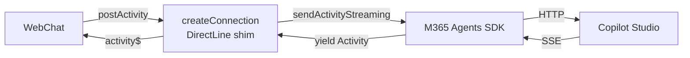

This one comes straight from the field. Teams and Microsoft 365 are the de-facto surfaces for deploying Copilot Studio agents, and for good reason. But not every organization wants to stop there. Some want to imagine their own portal, their own UX, their own branding. They want to control the full experience.

A customer we've been working with is doing exactly that. They're building a custom employee portal where every department has its own AI-powered specialist. HR policies, IT support, finance approvals, legal guidance, all accessible from a single app, each agent grounded on its own domain-specific knowledge.

{: .shadow w="700" }

An employee switches from the HR agent to the IT helpdesk and back without leaving the app. The experience is seamless and fully branded.

For the chat component itself, they're using [BotFramework WebChat](https://github.com/microsoft/BotFramework-WebChat), which gives you [full control over the message pipeline]() while handling all the rendering complexity you don't want to rebuild from scratch. And for the backend connectivity, they opted for the **M365 Agents SDK** (`@microsoft/agents-copilotstudio-client`) instead of Direct Line. Why? Two big reasons:

1. **Streaming support.** The SDK uses SSE-based streaming, so agent responses arrive chunk by chunk in real-time, no polling required, providing the expected modern chat experience. Who wants to wait long seconds until a response arrives?
2. **Tenant Graph Grounding.** The SDK works with [Authenticate with Microsoft](), which enables Tenant Graph Grounding, giving agents semantic search over SharePoint and Copilot Connector data.

So far, so good. But then they hit the wall.

## The Missing Piece

Here's the thing about the M365 Agents SDK that nobody tells you until you're knee-deep in an implementation: **the underlying API doesn't support fetching past activities**.

With Direct Line, you get a `getActivities` endpoint. You can reconnect to a conversation, pull the full activity history, and WebChat will happily render everything as if the user never left. It's one of those things you take for granted until it's gone.

The SDK? No such luck. When the page reloads (or the user navigates away and comes back), the conversation is just... gone. Not from the server, mind you. The conversation still exists on the Copilot Studio side with its full context. But there's no way to ask the SDK "hey, what happened in this conversation so far?"


> To be clear, this isn't about "memory" a-la ChatGPT. The agent still knows what you talked about if you resume the conversation. The problem is that the client has no API to fetch past activities or list previous conversations. When the user comes back, WebChat has nothing to render and no way to ask for it.
{: .prompt-warning }

What's up, Microsoft? (Yes, I realize I'm saying this to myself. We're on the same team. Still needs to be said.)

## Two Problems, Not One

When we sat down to figure this out, we realized it was actually two distinct problems:

### Problem 1: Conversation Resumption

The official `CopilotStudioWebChat.createConnection()` method in the SDK doesn't accept a `conversationId` parameter. Every time you create a connection, it starts a brand new conversation. There's no way to say "connect me back to conversation `abc-123`."

The underlying SDK client *does* support passing a `conversationId`, so the capability exists at the protocol level. The WebChat adapter just doesn't expose it. As a bonus, our custom adapter also lets you control whether the greeting fires, since not every app wants the agent to send the same welcome message each time a new conversation starts.

### Problem 2: Activity History

Even if you solve problem 1 (and we did), you still can't retrieve past activities *or* list previous conversations. There's no "give me the activities for conversation `abc-123`" and no "give me this user's conversation list." The conversation resumes on the server side, so the agent has context, but WebChat renders an empty chat window. The user sees a blank screen and has to remember where they left off.

## The Solution: A Custom WebChat Adapter

To solve both problems, we extended the adapter that already ships with the SDK. The M365 Agents SDK includes [`CopilotStudioWebChat.createConnection()`](https://github.com/microsoft/Agents-for-js/blob/main/packages/agents-copilotstudio-client/src/copilotStudioWebChat.ts), a DirectLine-compatible shim that implements `connectionStatus$`, `activity$`, `postActivity()`, and `end()`, as demonstrated in the [official webclient sample](https://github.com/microsoft/Agents/tree/main/samples/nodejs/copilotstudio-webclient). Our custom adapter builds on that same pattern, adding the missing conversation management capabilities.

The adapter is open source and available at [github.com/adilei/copilot-webchat-adapter](https://github.com/adilei/copilot-webchat-adapter).

> **Heads up:** This adapter is open source and provided as-is. It's not supported by Microsoft. If you use it, you own the code.
{: .prompt-warning }

Here's the architecture:



The adapter uses the SDK's async generator methods (`startConversationStreaming()` and `sendActivityStreaming()`) for real-time streaming.

### Solving Conversation Resumption

The adapter accepts a `conversationId` option. When provided, it:

1. Skips the `startConversationStreaming()` call (no duplicate greeting)
2. Passes the `conversationId` to every `sendActivityStreaming()` call
3. Tracks the conversation ID for the lifetime of the connection

```typescript
import { createConnection } from 'copilot-webchat-adapter'

// New conversation (default behavior)
const directLine = createConnection(client, { showTyping: true })

// Resume existing conversation
const directLine = createConnection(client, {
  conversationId: savedConversationId,
  showTyping: true,
})
```

Yes, the variable is called `directLine`. That's not a mistake, it's the point. WebChat expects a `directLine` prop that implements `connectionStatus$`, `activity$`, `postActivity()`, and `end()`. It doesn't know or care that the underlying transport isn't actually Direct Line. The adapter speaks the same protocol.

### Solving Activity History

Conversation resumption is only half the story. Without past messages, the user stares at a blank chat window. So how do we get them back?

There are two roles here: the **adapter** (our DirectLine shim) and the **consumer** (your app, the code that uses the adapter and renders WebChat).

The adapter is responsible for **fetching** history on resume and replaying it into WebChat. It accepts an optional `getHistoryFromExternalStorage` callback that, when provided, is called on connect to retrieve past activities and emit them through `activity$` before any new messages stream in. The adapter handles sequence numbering so WebChat renders everything in the right order.

The consumer is responsible for **storing** activities as they arrive, and providing them back to the adapter through that callback. The adapter is completely agnostic about how or where you store activities. It just needs a function that returns an array of activities for a given conversation ID.

> `getHistoryFromExternalStorage` is intentionally optional. When the SDK or its underlying API eventually supports fetching activities natively, the adapter can call it internally by default, and this callback becomes an override rather than a requirement.
{: .prompt-info }

How you implement that store is entirely up to you. Our customer uses a database. The [adapter's sample](https://github.com/adilei/copilot-webchat-adapter) uses a simple localStorage-backed store. You could use IndexedDB, a server-side API, whatever fits your needs. The only contract is a `getActivities(conversationId)` function that the adapter can call on resume:

```typescript
import { createConnection } from 'copilot-webchat-adapter'

const directLine = createConnection(client, {
  conversationId: savedConversationId,
  showTyping: true,
  getHistoryFromExternalStorage: (id) => activityStore.getActivities(id),
})
```

But how do activities get *into* the store in the first place? That's where [WebChat's Redux middleware]() comes in:

```javascript
const store = WebChat.createStore({}, () => next => action => {
  if (action.type === 'DIRECT_LINE/INCOMING_ACTIVITY') {
    const { activity } = action.payload
    if (activity.type === 'message' && directLine.conversationId) {
      activityStore.saveActivity(directLine.conversationId, activity)
    }
  }
  return next(action)
})

WebChat.renderWebChat({ directLine, store }, document.getElementById('webchat'))
```

Every incoming message activity gets saved as it arrives. When the user comes back, the adapter calls `getActivities`, replays them into WebChat, and the conversation picks up where it left off.

## Seeing It in Action

The adapter's test page won't win any design awards, but what matters is what it demonstrates.

Here's a first conversation. The user connects, the greeting streams in, and they ask a question about company policies. Notice the conversation ID in the status bar:

{: .shadow w="700" }
_New conversation_

Now the user reloads the page, pastes the conversation ID, and reconnects. The stored history appears immediately, and they can continue the conversation right where they left off. The agent still has full context, so the follow-up question gets a contextual answer:

{: .shadow w="700" }
_Conversation resumed after refresh_

No greeting replay. No blank screen. The conversation just picks up where it left off.

## What the Sample Doesn't Cover (Yet)

The sample's Redux middleware only saves activities where `type === 'message'`. That's a simplification. In a production app, you'd likely want to store more, for example, adaptive card submissions so that when history is restored, previously clicked cards appear as already submitted (or are disabled). The sample doesn't handle this yet, but the pattern is the same: intercept the relevant activity types in the middleware and save them to your store.

The adapter itself is agnostic here. It replays whatever activities your `getHistoryFromExternalStorage` function returns.

### Graceful Degradation

If `getHistoryFromExternalStorage` throws (localStorage cleared, quota exceeded, corrupted data), the adapter swallows the error and continues without history. You get a blank chat that still works, rather than a crashed application.

## Limitations and Gotchas

Let's be transparent about what this doesn't solve:

**Conversation expiry.** Copilot Studio conversations don't live forever. We haven't fully tested what happens when you try to resume an expired conversation, whether the SDK throws, returns an error activity, or silently starts a new one. This is on our list to investigate.

**No cross-device history.** With the default localStorage implementation, conversation history is tied to the browser. Open a different browser or device, and you'll resume the conversation (agent has context) but won't see past messages. Implement a server-side store if you need this.


## Key Takeaways

- The M365 Agents SDK enables streaming and tenant Graph grounding for Copilot Studio agents, but **lacks an API to fetch past conversation activities**.
- This means WebChat loses all visible conversation history on page reload, even though the agent retains context on the server.
- The [copilot-webchat-adapter](https://github.com/adilei/copilot-webchat-adapter) solves this by acting as a **DirectLine-compatible shim** that adds conversation resumption and pluggable activity storage.
- Activities are saved via a **WebChat Redux middleware** and replayed on reconnect through the adapter's `getHistoryFromExternalStorage` callback.
- The `ActivityStore` interface is abstract, so you can swap localStorage for any persistence layer that fits your requirements.

## What's Next

Ideally, the M365 Agents SDK would add a `getActivities()` API natively, making the storage workaround unnecessary. The adapter is designed with that future in mind: when the SDK adds history fetching, `getHistoryFromExternalStorage` becomes an optional override rather than the primary mechanism.

Until then, this pattern works. Our customer shipped it, their employees are happily switching between domain specialist agents without losing their place, and nobody's staring at a blank chat window wondering where their conversation went.

Have you run into this gap yourself? Are you using the M365 Agents SDK with WebChat, or still on Direct Line? I'd love to hear about your experience in the comments.

## Further Reading

- [VIDEO: Mastering WebChat Middleware for Copilot Studio Agents]()
- [The Welcome Message That Never Was: Mocking Agent Greetings in WebChat]()
- [You Probably Don't Need Manual Authentication (And Didn't Even Know It)]()
