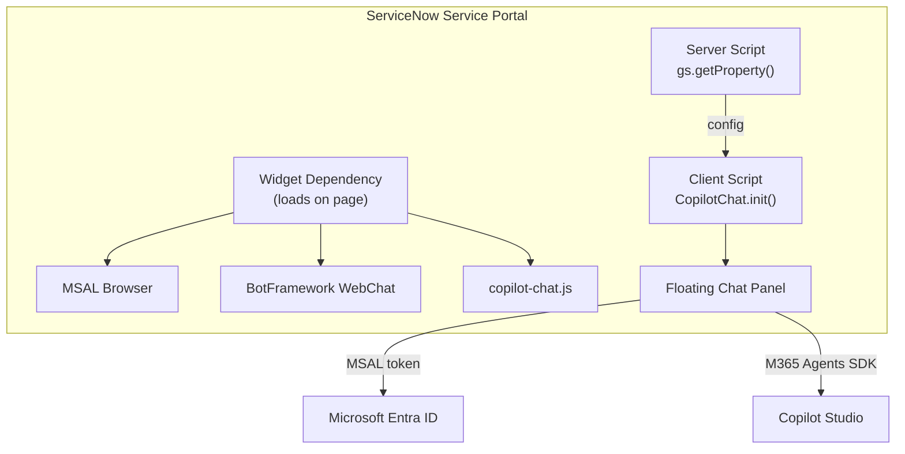

Another field report! If you liked the [last one about conversation history](), this one follows a similar pattern: a customer hits a wall, we figure it out together, and now we're sharing what we learned.

This time, the customer had built an IT support agent in Copilot Studio. Grounded on their ServiceNow knowledge base, and able to carry out automated actions like opening tickets and checking incident status via Power Platform connectors. Worked great in Teams and M365 Copilot. But their help desk portal is ServiceNow, and that's where employees actually go when something breaks. They wanted the same agent available there.

The catch? Their ServiceNow instance uses **PingFederate** for SSO. When they looked at embedding a Copilot Studio agent that authenticates through Microsoft Entra ID, their first reaction was: "We'll need to set up federation between PingFederate and Entra. That's going to take months and involve three different teams."

Spoiler: it didn't. But let's start with the approach we recommended and why.

## Why Not Use the ServiceNow Virtual Agent Integration?

Fair question. ServiceNow has its own conversational AI platform called **Virtual Agent**, a full NLU engine with topic design, entity extraction, and dialog flows built into the portal. There's an [official integration pattern](https://learn.microsoft.com/en-us/microsoft-copilot-studio/customer-copilot-servicenow) where Virtual Agent acts as the frontend and calls Copilot Studio as a backend skill. If you already have Virtual Agent deployed and want to augment it with generative AI, it's a solid approach.

But that means every message goes through ServiceNow's NLU first before reaching Copilot Studio. If your agent already handles intent recognition, knowledge retrieval, and orchestration, that's an extra AI layer that doesn't add much, just latency and another system to maintain. This customer's Copilot Studio agent was already fully capable. They didn't need a middleman, they needed the message to go straight to their agent.

## Why Not an iframe?

You could host a page with WebChat on Azure Static Web Apps (are there any other cloud providers that support static web apps? not sure 😉) and iframe it into ServiceNow. You'd get streaming, customization, middleware, all of it. But then you're maintaining extra infrastructure for a hosted page that just... sits inside a frame.

More importantly, an iframe is isolated. It runs in its own origin, in its own browsing context. It can't access anything on the ServiceNow page.

A native Service Portal widget can. Think of it like **SPFx for SharePoint**: you're not embedding something *next to* the platform, you're extending *inside* it. The widget runs in ServiceNow's AngularJS framework, and the server script has full access to **GlideSystem APIs**. Our widget already uses this: the server script calls `gs.getProperty()` to read agent configuration from system properties and passes it to the client via the `data` object. That same server script could just as easily call `gs.getUserName()` or `gs.hasRole()` to pass user identity and role information into the chat.

We haven't fully explored this yet, but it opens up interesting possibilities. Imagine the user is viewing an incident page and opens the chat widget. The server script could read the current page context and pass the incident number to the agent as a conversation starter: *"I see you're looking at INC0012345. How can I help with this?"* No copy-pasting, no "please provide your incident number." The agent already knows.

Could you hack something similar with an iframe and URL parameters? Sure. But you'd be fighting the platform instead of working with it.

## The Architecture

So we built a native widget. Here's what it looks like:

{: .shadow w="700" }
_The IT Support agent running as a floating chat widget in ServiceNow Service Portal_

The widget is a self-contained IIFE bundle (~147 KB) that loads alongside MSAL and WebChat via ServiceNow's Widget Dependencies system. No iframes, no external services, no ServiceNow Virtual Agent.



1. **Widget Dependencies** load three scripts on page load: MSAL, WebChat, and the bundle
2. The **server script** reads agent configuration from ServiceNow system properties via `gs.getProperty()`, decoupling configuration from code
3. The **client script** calls `CopilotChat.init()`, which renders a floating bubble in the bottom-right corner
4. On first click, the bundle acquires an MSAL token, creates a streaming connection to Copilot Studio via the M365 Agents SDK, and renders WebChat in a slide-up panel

> **Why an IIFE bundle?** ServiceNow's Service Portal loads widget scripts via plain `<script>` tags through its Widget Dependencies system. ES modules aren't supported in this context. The bundle must execute in global scope and attach its API to `window`, the same pattern used by WebChat (`window.WebChat`) and MSAL (`window.msal`).
{: .prompt-info }

## The Auth Story (Or: Why PingFederate Didn't Matter)

Remember the customer's concern from the intro? They expected months of federation work. Here's why that wasn't needed.

The widget doesn't "share" ServiceNow's authentication context. It doesn't need to. The chat widget runs its **own MSAL instance** in the browser, completely independent of however ServiceNow authenticates its users. It's just another SPA running on the page.

The auth flow is:

1. User signs into ServiceNow via PingFederate (or SAML, or OIDC, or local auth, doesn't matter)
2. User clicks the chat bubble
3. The widget's MSAL instance checks for cached Entra ID tokens in the browser
4. If found (user is already signed into any Microsoft service), authentication is **silent**. No popup, no redirect, no friction.
5. If not found, a **one-time popup** appears for Entra ID sign-in
6. All subsequent visits use the cached token. The popup never appears again (until the token expires)

The key insight is that MSAL can leverage an **existing Entra ID session** in the browser. If the user has signed into *any* Microsoft service on that browser (Outlook, Teams, Azure Portal, you name it), that Entra session is already there. MSAL detects it and acquires a token silently, no popup needed. In practice, most enterprise users already have an Entra session in their browser, so **most users never see a popup at all**.

This means the widget works with **any** ServiceNow authentication configuration: PingFederate, Okta, SAML, local accounts, whatever. The two auth systems are completely decoupled.

> The Entra ID app registration is a standard SPA (Single-page application) configuration. Add your ServiceNow portal origin as a redirect URI, and you're done. No federation, no token exchange, no middleware.
{: .prompt-tip }

## Automated Deployment

Nobody wants to manually create a dozen ServiceNow records. So we built a deployment script.

```bash
cd ServiceNowWidget
npm install
npm run build

cp scripts/deploy-config.sample.json scripts/deploy-config.json
# Fill in your instance URL, credentials, and agent settings

npm run deploy
```

The script uses the ServiceNow Table API to create everything: system properties, widget record (with all source files), bundle attachment, JS Includes, Widget Dependency, M2M relationship records, and optionally places the widget on the portal homepage.

It's **idempotent**. Run it once to set up, run it again after code changes to update the bundle and widget source files. No duplicates, no stale references.

> We validated the script end-to-end on a clean ServiceNow developer instance, but ServiceNow instances can vary significantly in configuration. If you run into issues on your instance, please [open an issue](https://github.com/microsoft/CopilotStudioSamples/issues) so we can improve the script.
{: .prompt-info }

## The Sample

The full sample is available in the [CopilotStudioSamples](https://github.com/microsoft/CopilotStudioSamples/tree/main/ServiceNowWidget) repo. It includes:

- **TypeScript source** for the widget (auth, bubble UI, WebChat initialization)
- **ServiceNow widget files** (HTML, client JS, server JS, SCSS) ready to copy into the widget editor
- **Automated deployment script** (Node.js, zero external dependencies)
- **Manual setup guide** with screenshots for step-by-step deployment
- **Local development test page** so you can iterate without a ServiceNow instance

## Key Takeaways

- You **don't need to route through ServiceNow's Virtual Agent** to get Copilot Studio in your portal. A direct embed with WebChat gives you streaming, full UI control, and middleware capabilities.
- The widget's auth is **completely independent of ServiceNow's auth**. PingFederate, Okta, SAML, local auth: it doesn't matter. MSAL handles its own token lifecycle.
- Most enterprise users already have an Entra ID session in their browser, so the auth experience is typically **silent** with no popup at all.
- A native widget extends the platform like **SPFx extends SharePoint**. An iframe can't access ServiceNow's page context, user identity, or inter-widget communication.
- The **deployment script** handles everything via the ServiceNow REST API, from system properties to widget placement. No manual record creation needed.

## We Want Your Feedback

This is a new sample, and we'd love to hear from you. Are you embedding Copilot Studio in ServiceNow or other third-party portals? What challenges have you run into? Does the deployment script work on your instance, or did we miss an edge case?

Drop a comment below or [open an issue on the repo](https://github.com/microsoft/CopilotStudioSamples/issues).

## Further Reading

- [VIDEO: Mastering WebChat Middleware for Copilot Studio Agents]()
- [The Conversation History Gap in the M365 Agents SDK (And How We Filled It)]()
- [You Probably Don't Need Manual Authentication (And Didn't Even Know It)]()
