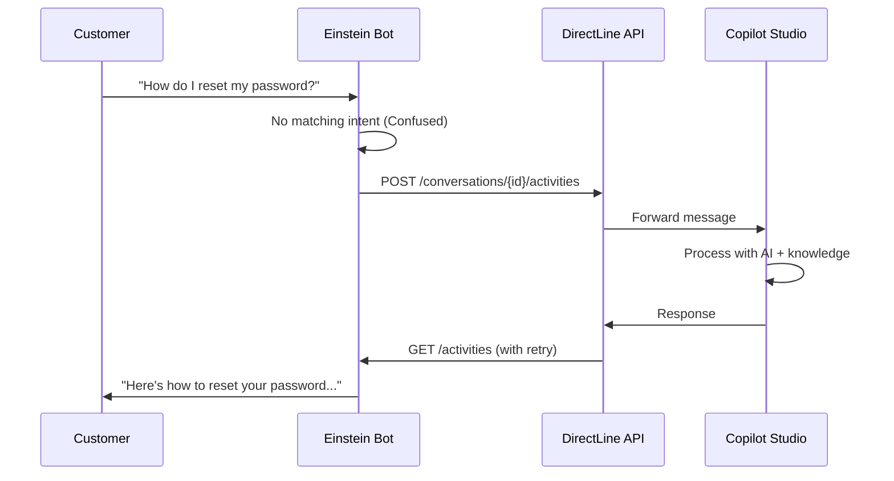

Some organizations run their entire customer service operation on Salesforce. Cases, queues, Omni-Channel routing, live agent handoff, all native to the platform. They don't want to rip that out. But they also want their AI-powered conversations handled by Copilot Studio, with its AI-generated responses. The ask is straightforward: let Salesforce do what Salesforce does best, and delegate AI-generated responses to Copilot Studio.

The [documentation for this integration](https://learn.microsoft.com/en-us/microsoft-copilot-studio/customer-copilot-salesforce-handoff) has been around for a while, but it only covered the architecture and general idea. If you actually wanted to build it, you were on your own for the Salesforce-side code. No Apex samples, no deployment automation, no guidance on how to handle credentials securely. For a platform integration that touches authentication, remote callouts, and permission sets, that's a lot of gaps to fill yourself.

So we fixed it.

## What Changed

The docs page now includes everything you need to go from zero to a working integration:

- **Complete Apex classes** with inline documentation: `DL_GetConversation`, `DL_PostActivity`, and `DL_GetActivity`, ready to copy into your Salesforce org
- **Named Credentials configuration** for secure authentication (no more hardcoding Direct Line secrets in your Apex code)
- **Step-by-step Einstein Bot dialog setup** with screenshots showing exactly how to wire the Welcome and Confused dialogs
- **Deployment scripts** (Bash and PowerShell) that handle everything in one shot

All the code lives in the [CopilotStudioSamples repo](https://github.com/microsoft/CopilotStudioSamples/tree/main/IntegrateWithEngagementHub/Salesforce), so you can clone it, inspect it, and modify it to fit your needs.

## How the Integration Works

If you're new to this pattern, here's the quick version. Einstein Bot acts as the front end in Salesforce Service Cloud. When a customer starts chatting, the bot handles what it can. When it hits something it doesn't understand (the "Confused" topic in Einstein, and yes, the irony of *Einstein* being confused is not lost on us, though in fairness even the original couldn't observe a particle's position and momentum at the same time), it forwards the message to Copilot Studio via the [Direct Line API](https://learn.microsoft.com/en-us/azure/bot-service/rest-api/bot-framework-rest-direct-line-3-0-api-reference). Copilot Studio processes the query using its knowledge sources and generative AI, and sends back a response. Einstein Bot displays it to the customer.



Einstein Bot keeps full control of the conversation and handles live agent escalation through Salesforce's own Omni-Channel routing. If you need a human, Einstein routes to a Salesforce queue, not Copilot Studio. This is a deliberate design choice: you don't want two systems competing to route handoffs.

## The Deployment Experience

This is the part I'm most excited about. If you have the [Salesforce CLI](https://developer.salesforce.com/tools/salesforcecli) installed, the deployment scripts handle steps 2 through 5 of the docs:

```bash
# Log in to your Salesforce org
sf org login web

# Clone the sample and run the deployment
git clone https://github.com/microsoft/CopilotStudioSamples.git
cd CopilotStudioSamples/IntegrateWithEngagementHub/Salesforce
./scripts/deploy.sh
```

The script:
1. Deploys three Apex classes to your org
2. Creates a Remote Site Setting to allow callouts to `directline.botframework.com`
3. Sets up an External Credential with Custom auth protocol
4. Creates a Named Credential pointing to the Direct Line endpoint
5. Grants all three Apex classes to the Chatbot permission set
6. Adds the credential principal access so Einstein Bot can use it

After the script completes, you just need to add your Direct Line secret to the External Credential (a manual step for security reasons, we don't want secrets in scripts) and configure the Einstein Bot dialogs.

> There's a PowerShell version too (`deploy.ps1`) if you're on Windows. Both scripts do the same thing.
{: .prompt-info }

## Named Credentials: Don't Hardcode Secrets

One thing worth calling out: the integration uses Salesforce [Named Credentials](https://developer.salesforce.com/docs/atlas.en-us.apexcode.meta/apexcode/apex_callouts_named_credentials.htm) instead of embedding the Direct Line secret directly in the Apex code. This is a best practice that's easy to skip when you're just trying to get something working, but it matters.

Named Credentials give you:
- **Centralized secret management**: rotate the token in one place, not across multiple classes
- **No secrets in code**: the Authorization header is constructed via a formula (`{!'Bearer ' & $Credential.Directline.Token}`), so the actual secret never appears in source
- **Permission isolation**: only the Chatbot permission set has access to the credential principal

If you've built integrations before where someone committed an API key to a class file and then forgot about it for two years, you know why this matters.

## The Retry Problem (And How We Solved It)

Copilot Studio processes messages asynchronously. When Einstein Bot posts a message via Direct Line, the response isn't immediately available in the next API call. You need to poll.

The `DL_GetActivity` class handles this with configurable delay and retry logic:

```java
// Default: wait 5 seconds before first attempt, retry up to 5 times
Integer initialDelay = (input.delaySeconds != null && input.delaySeconds > 0)
    ? input.delaySeconds : 5;
Integer retries = (input.maxRetries != null && input.maxRetries > 0)
    ? input.maxRetries : 5;
```

It waits for an initial delay (default 5 seconds) before the first poll, then retries every second until it finds a bot message or hits the retry limit. The class also filters out user messages (you only want the bot's response) and detects `handoff.initiate` events in case Copilot Studio requests escalation.

You can tune the delay and retry count from the Einstein Bot dialog, no code changes needed.

## Where Should We Invest Next?

This is where I want your input. We have limited bandwidth, and the Salesforce integration space has a few possible directions. Here's what we're considering:

### Option 1: Authenticated Agents

Can we make this integration work when the Copilot Studio agent requires user authentication? For example, accessing SharePoint knowledge or calling connectors that need delegated permissions. Honestly, this doesn't look promising. The Einstein Bot ↔ Direct Line ↔ Copilot Studio chain makes it hard to flow user identity through, and there's no straightforward token exchange pattern between Salesforce and Entra ID in this context. But if enough people need it, we'll dig deeper.

### Option 2: Direct Embed (WebChat Widget in Salesforce)

Instead of routing through Einstein Bot, embed the Copilot Studio agent directly in a Salesforce chat canvas, similar to the [ServiceNow widget approach](). This would give you streaming, rich message rendering, and middleware capabilities. The trade-off? You'd lose Einstein Bot's native Omni-Channel handoff routing. Getting handoff to work in an embedded model would require a fairly complex backend integration between the widget, Copilot Studio's handoff events, and Salesforce's case/queue system. Doable, but not simple.

### Option 3: Agentforce Instead of Einstein Bots

Salesforce has been investing in [Agentforce](https://www.salesforce.com/agentforce/) as their next-generation agent platform. Should we build the integration on Agentforce instead of Einstein Bots? The APIs and capabilities are different, and it would mean rethinking the architecture, but it might be a better fit for organizations that are already adopting Agentforce.

## Key Takeaways

- The **Salesforce ↔ Copilot Studio integration docs** got a major overhaul with complete Apex code, Named Credentials, and deployment scripts
- The **deployment scripts** handle everything from Apex classes to permission grants in one command
- Einstein Bot acts as the **frontend**, forwarding unrecognized queries to Copilot Studio via Direct Line
- **Named Credentials** keep your secrets out of code and make rotation painless
- The integration currently supports **unauthenticated agents only**, with a request/response model

## What Do You Think?

We want to hear what matters most to you. Are you using the Einstein Bot integration today? Are you planning to? Which direction would be most valuable: authenticated agents, a direct WebChat embed, or Agentforce support?

If you're evaluating how Copilot Studio fits into your Salesforce stack (or wondering which integration API to use in the first place), the [API decision guide]() can help you navigate the options.

Drop a comment below or [open an issue on the samples repo](https://github.com/microsoft/CopilotStudioSamples/issues). Your feedback directly shapes where we put our effort next.
