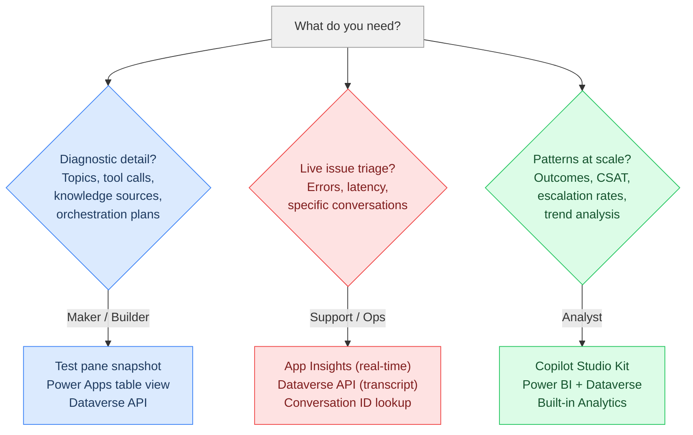
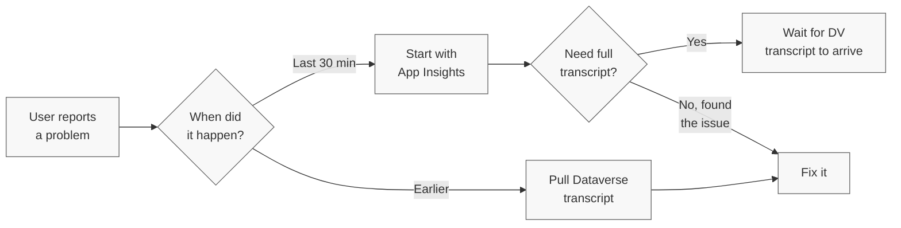

**Somewhere between the user's question and the agent's answer, a lot happens. Most people never look.**

## TL;DR

Copilot Studio conversation transcripts give you the full picture of every conversation your agent has. Not just "User says / Bot says," but the diagnostic data underneath: which topic fired, what knowledge sources were consulted, which tools were called, which agents or MCP servers were invoked, what the orchestration plan was, and how long each step took.

This post is structured around three scenarios:

- **Scenario 1: Maker debugging** — You're building and testing. Something's off. You need to see exactly what the agent considered and why it made the choices it did.
- **Scenario 2: Live triage** — A user reports a problem. You need to find that specific conversation and trace what went wrong.
- **Scenario 3: Analyst monitoring** — You're past one-off debugging. You need trends, patterns, and pipelines across hundreds or thousands of conversations.

Each scenario points you to the right tools and data sources. After that, you'll find reference sections on the data model, Dataverse vs Application Insights, all six access methods, required roles, what's not in the transcript, and analysis tooling.

---

## Three scenarios

Three scenarios come up again and again. Each needs different data, different tools, and a different mindset.



### Scenario 1: You're building and evaluating, and something won't stick

You have clear business requirements. You've created an evaluation dataset. You run evals and the agent won't pick up the right knowledge source, or it keeps routing to the wrong topic, or the generative answer misses the point. You've tried adjusting trigger phrases, tweaking knowledge source settings, rewriting instructions. Nothing works.

It's time to open the hood.

**Where to look:** Start with the test pane snapshot for quick debugging during development. For deeper analysis, open the `ConversationTranscript` table in Power Apps to browse the raw JSON. If you're scripting evaluations or building an automated pipeline, use the Dataverse Web API. See [Six ways to get transcripts](#six-ways-to-get-conversation-transcripts) for the full breakdown of each method.

**What you'll see:** The transcript shows you exactly what the agent considered, which knowledge sources it searched, what came back, and why it chose the answer it did. You stop guessing and start debugging with data.

When you dig into the raw conversation transcript (the `Content` column in the `ConversationTranscript` [Dataverse table](https://learn.microsoft.com/en-us/power-apps/developer/data-platform/webapi/reference/conversationtranscript?view=dataverse-latest)), you get a JSON array of activity objects (based on the [Bot Framework protocol](https://learn.microsoft.com/en-us/azure/bot-service/rest-api/bot-framework-rest-connector-activities?view=azure-bot-service-4.0)). Each activity has a `valueType` that tells you what happened.

| What you want to know | Where to find it |
|---|---|
| Which topic fired and how confident the agent was | `IntentRecognition` activities with `TopicName` and `Score` |
| How the agent routed between topics | `DialogRedirect` activities with target dialog IDs |
| Whether a **tool** or **action** was called (and what it returned) | Event activities for tool invocations, including connector calls and HTTP requests |
| Whether a **child agent** or **connected agent** was invoked | Event activities showing agent to agent handoffs and responses |
| Whether an **MCP server** was called | Event activities for MCP tool invocations, including request/response payloads |
| What the **orchestration plan** was | Generative orchestration trace data showing the agent's reasoning and planned steps |
| Which **knowledge sources** were searched and what was returned | `SearchAndSummarizeContent` in `nodeTraceData` activities |
| How long each step took | Timestamps on each activity in the conversation flow |
| Whether the conversation was resolved, escalated, or abandoned | `SessionInfo` activities with outcome and turn count |
| What the user rated the experience | `CSATSurveyResponse` activities |

Most platforms give you session logs: what the user said and what the bot answered. Copilot Studio gives you the full diagnostic chain: from intent recognition to topic routing, from orchestration planning to tool execution, from knowledge source retrieval to response generation. Every decision the agent made, every external call it attempted, every score it calculated. You're not reverse-engineering behavior from outputs. You're reading the agent's actual decision trail.

#### A real example: Why the agent sometimes went silent in Teams

I had a customer whose agent worked fine most of the time, but in Teams it would sometimes just... not respond. The user would ask a question and get nothing back. No error, no timeout message. Just silence.

Here's what most people don't know: **Teams has a hard timeout for bot responses.** If your agent doesn't send a response within approximately 2 minutes (~120 seconds), Teams drops the connection silently. The agent might still be working on a response, but the user will never see it. This same timeout applies to synchronous flow actions called from Copilot Studio. See [this Microsoft Q&A thread](https://learn.microsoft.com/en-us/answers/questions/5619297/how-to-fix-a-flowactiontimedout-error-within-copil) for details on the ~120 second enforcement, and [this thread](https://learn.microsoft.com/en-us/answers/questions/5722696/intermittent-non-response-issue-with-copilot-studi) for a community report of the exact same symptom pattern.

The agent's responses were sometimes fast (under 30 seconds) and sometimes slow (over 2 minutes), which is why it seemed intermittent. We opened the transcripts for the slow conversations and traced where the time was going, step by step:

1. **User message**: "How do I submit an expense report?"
2. **IntentRecognition**: Topic `ExpenseSubmission` triggered with confidence 0.92. Correct topic, no routing issue.
3. **Orchestration plan** (from nodeTraceData): The agent planned to search knowledge sources, then call the `expense_lookup` tool, then summarize the results.
4. **Knowledge source search**: The agent searched **3 SharePoint sites** and **2 uploaded PDFs**. The transcript breaks down each source with its search duration:
   - SharePoint: HR Policies site — 8.2 seconds, returned 3 chunks
   - SharePoint: Finance Portal — 6.4 seconds, returned 1 chunk
   - SharePoint: Company Wiki — 5.1 seconds, returned 0 chunks
   - PDF: Expense Guidelines 2026.pdf — 0.4 seconds, returned 2 chunks (**the actual answer**)
   - PDF: Travel Policy.pdf — 0.3 seconds, returned 0 chunks
5. **Tool call**: The `expense_lookup` connector returned in 0.8 seconds.
6. **Response generation**: The LLM summarized the results. Total time from user message to agent response: varies, but on slow runs it exceeded the Teams timeout. The user got nothing.

There it was. On a good day, SharePoint responded quickly and the total stayed under the timeout. On a bad day, SharePoint was sluggish and the total crept past the limit. The user got silence.

The actual answer came from the PDF in 0.4 seconds. The three SharePoint sites contributed 19.7 seconds of search time and returned results that weren't even used in the final response.

**The fix:** We updated the knowledge source descriptions to make it unambiguously clear which source covers what. The orchestrator stopped casting a wide net across all five sources and targeted the right one. Response time dropped to around 20 seconds. The agent responded every time.

That's the difference between guessing ("maybe I should tweak some settings") and debugging with data ("the SharePoint searches are the bottleneck, and the answer isn't even there").

> **What about the things you CAN'T see?** Transcripts show you a lot, but not everything. See [What's not in the transcript](#whats-not-in-the-transcript) for the gaps and why they exist.
{: .prompt-info }

---

### Scenario 2: Your agent is live and a user reports a problem

Your agent has been running fine. Then a user reaches out: "The agent gave me the wrong answer" or "It threw some weird error." You need to see exactly what happened in that specific conversation.

**Where to look depends on when it happened.**

If the issue happened **in the last 30 minutes**, start with Application Insights. Dataverse transcripts aren't written until approximately 30 minutes after conversation inactivity. App Insights gives you near real-time telemetry: errors, response latency, dependency call failures, and stack traces. You won't get the full transcript JSON, but you'll see whether a tool call failed, whether a knowledge source timed out, or whether the agent threw an exception.

If the issue happened **earlier today or before**, pull the Dataverse transcript. Ask the user to type `/debug conversationid` in the chat. They'll get back a unique conversation ID (a GUID like `0c4ebb21-3f74-4df4-b191-812aea31273d`) that you can use to look up the full transcript. For a detailed walkthrough on how users can retrieve their conversation ID, see [How to Get Your Conversation ID When Chatting with Agents]().

With that ID in hand, filter the `ConversationTranscript` table's `Name` column (which stores `ConversationId_BotId`) and you'll find all records for that conversation. From there, you can trace the full activity chain: which topic fired, what the orchestration plan was, whether a tool call failed, whether a knowledge source returned nothing, or whether the agent routed to the wrong topic entirely.

**The triage workflow:**



> **App Insights shows you the error. The transcript shows you the context.** If a tool call failed, App Insights tells you the HTTP status code and stack trace. The transcript tells you what the agent was trying to do and what happened before and after. For thorny issues, you often need both.
{: .prompt-tip }

See [Dataverse vs Application Insights](#dataverse-vs-application-insights) for a full comparison of what each data source contains.

---

### Scenario 3: You need ongoing monitoring and trend analysis

You're past one-off debugging. Your agent is in production, handling real conversations, and you need to track what's happening across hundreds or thousands of interactions. Are escalation rates climbing? Which topics have the lowest resolution rate? Are there user intents your agent doesn't cover? Is CSAT trending down on a specific channel?

This is analyst territory. You're not reading individual transcripts. You're building pipelines and dashboards.

**Where to look:**

**For pre-built analytics**, the [Copilot Studio Kit](https://github.com/microsoft/Power-CAT-Copilot-Studio-Kit) is the fastest path. Install the solution in your environment and you get:

- **[Conversation KPIs](https://learn.microsoft.com/en-us/microsoft-copilot-studio/guidance/kit-conversation-kpi)** that automatically parse transcripts and generate aggregated outcome data: sessions, turns, outcomes (resolved, escalated, abandoned), with optional full transcript storage and a built-in transcript visualizer. KPIs are generated twice daily automatically, or on demand.
- **[Conversation Analyzer](https://learn.microsoft.com/en-us/microsoft-copilot-studio/guidance/kit-conversation-analyzer)** that lets you run custom AI prompts against transcripts to surface insights like sentiment analysis, personal data detection, or any pattern you define.
- **[Agent Insights Hub](https://github.com/microsoft/Power-CAT-Copilot-Studio-Kit)** that aggregates telemetry from both Application Insights and Conversation Transcripts into a single view with KPI cards, trend charts, CSAT scores, and filtering by agent, channel, and date range. Supports up to 365 days of historical data.

**For custom dashboards**, connect Power BI directly to the Dataverse `ConversationTranscript` table. You can build whatever views you need: CSAT by topic, escalation rates by channel, resolution trends over time. The built-in Copilot Studio Analytics also offers quick CSV exports of session outcomes.

**For scripted pipelines**, use the Dataverse Web API to pull transcripts programmatically, parse the JSON, and feed the results into your own analysis tooling. See [4. Dataverse Web API](#4-dataverse-web-api---programmatic-access-for-scripted-analysis-and-pipelines) in the access methods reference for a ready-to-use Python example.

**For long-term storage**, the default 30-day retention on Dataverse transcripts won't cut it. Use [Azure Synapse Link for Dataverse](https://learn.microsoft.com/en-us/microsoft-copilot-studio/guidance/custom-analytics-strategy) to continuously export transcripts to Azure Data Lake Storage Gen2. From there you can run historical analysis in Synapse, Fabric, or any tool that reads Parquet files.

**For operational health alongside conversation data**, connect Application Insights and use the [Agent Insights Hub](https://github.com/microsoft/Power-CAT-Copilot-Studio-Kit) to correlate error rates, latency, and dependency failures with session outcomes. This is where you spot things like "escalation rate spiked last Tuesday at 2 PM" and then check App Insights to see that a connector went down at the same time.

> **Scenario 3 is where Dataverse and App Insights come together.** Individual debugging can often use one or the other. Ongoing monitoring needs both: Dataverse for conversation content and outcomes, App Insights for operational health and real-time alerting. See [Dataverse vs Application Insights](#dataverse-vs-application-insights) for the full comparison.
{: .prompt-tip }

---

## Understanding the data model

Now that you know which scenario you're in and where to look, here's how the underlying data is structured.

### Records, sessions, and conversations

There are four distinct concepts, and the confusion comes from using "conversation" to mean all of them at once.

**ConversationId** is the thread identifier. It's assigned when a user starts talking to the agent and stays the same for as long as that user's channel session exists. In the transcript table, it's embedded in the `Name` column as `{ConversationId}_{BotId}`. This is the ID you see in error messages and debug panels - it's your primary key for "find everything about this user's interaction."

> The conversation ID you get from error messages or the test pane's debug info maps directly to the transcript `Name` field. Filter `Name` where it starts with that conversation ID, and you'll find the matching records.
{: .prompt-tip }

**Record** - One row in the `ConversationTranscript` table. One record = one inactivity window = one `ConversationStartTime`. If the user goes idle for 30 minutes and comes back, a new record is written. Same `Name` (same ConversationId), but a new `ConversationStartTime`. If a single inactivity window produces more than 1 MB of content, that window is split into multiple records. Those share both the same `Name` and the same `ConversationStartTime`, and you sort them by `BatchId` to reassemble them.

**Session** - Copilot Studio's unit of analytics, not a conversation reset. It starts with the first user message and ends after **30 minutes of inactivity**. Each session gets its own `SessionInfo` activity with an outcome: Resolved, Escalated, or Abandoned. A new session does not clear conversation history, session variables, or LLM context - it only creates a new analytics boundary. One session = one inactivity window = one `ConversationStartTime` in the data.

**Conversation** - The human concept: everything the user experienced. It can span multiple sessions if they go idle and return. There is no native "conversation" entity in the transcript table. You reconstruct it by grouping all records with the same `Name`.

### How these relate

```
ConversationId  →  lives in Name column (Name = ConversationId_BotId)
                   groups ALL records for this user thread

  Session 1     →  one ConversationStartTime
                   one or more records (if >1 MB, split by BatchId)
                   one SessionInfo outcome (e.g. Resolved)

  Session 2     →  new ConversationStartTime (same Name, different start time)
  (user returned    one or more records
  after 30 min)     new SessionInfo outcome (e.g. Abandoned)
```



```mermaid
gantt
    title User interaction spanning 2 sessions and 3 records
    dateFormat HH:mm
    axisFormat %H:%M

    section Session 1
    User asks question (Record 1, BatchId 0)      :active, s1a, 09:00, 2m
    Agent responds (Record 1, BatchId 0)           :active, s1b, 09:02, 3m
    Follow-up exchange (Record 2, BatchId 1)       :active, s1c, 09:05, 1m

    section Inactivity
    30-min timeout gap                              :done, gap, 09:06, 34m

    section Session 2
    User returns (Record 3, BatchId 0)             :active, s2a, 09:40, 2m
    Agent responds (Record 3, BatchId 0)           :active, s2b, 09:42, 3m
```

**Example scenario:** A user asks a question at 9:00, gets an answer, asks a follow-up at 9:05, then walks away. At 9:40, they come back with another question. From the user's perspective, this is one conversation. In the data, it's **two sessions** with separate `SessionInfo` activities and potentially separate outcomes. If the first session was resolved and the second was abandoned, your analytics shows one resolved and one abandoned - not one conversation with a mixed outcome.

**To look up a specific transcript** given a conversation ID from the test pane or an error message: filter `Name` where it starts with that conversation ID. You'll get one or more records. Group by `ConversationStartTime` to see each session. Within each group, sort by `BatchId` to read the content in order.

### Why this matters

Understanding these boundaries matters for two reasons: getting your analytics right and keeping the user experience clean, especially in persistent channels like Teams and Microsoft 365 Copilot.

**For analytics:** You can't reliably measure "conversation duration" or "conversations per user" without understanding these boundaries. A single user interaction might show up as 1 session or 3, depending on idle gaps. Count **sessions** as your primary unit, not records or "conversations."

**For user experience:** A new session after 30 minutes is an **analytics boundary only**. It creates a new `SessionInfo` activity and a new transcript record, but it does **not** reset conversation history, session variables, or LLM context. In channels like Teams and Microsoft 365 Copilot, the conversation thread persists indefinitely - history accumulates across session boundaries, the LLM context fills up with stale turns, and the agent starts giving confused answers. Unlike the test pane, there's no automatic "Reset" button.

You can add explicit conversation-end signals (a "Done" button, a closing topic, a satisfaction survey) for cleaner boundaries. But without active intervention, the conversation state carries over even when the session counter ticks up.

Two techniques to manage this:

1. **Inactivity reset topic** - Use the **"The user is inactive for a while"** trigger (e.g., 15 minutes) to clear session variables and conversation history, end the conversation, and mark it resolved. Prompt the user to say "hello" to reinitialize, since `ConversationStart` [only fires once](https://learn.microsoft.com/en-us/microsoft-copilot-studio/guidance/deploy-agent-teams) in Teams (at first install) and the Greeting topic is the actual initializer.
2. **`/debug clearstate`** - This command forces a complete conversation reset in Teams: clears state, removes cached connector info, re-authenticates connectors, and loads the latest published version. Document it in your agent's help messaging and share it with support teams.

> For more Teams-specific deployment patterns, see [Best Practices for Deploying Copilot Studio Agents in Microsoft Teams]() and the [official Microsoft guidance](https://learn.microsoft.com/en-us/microsoft-copilot-studio/guidance/deploy-agent-teams).
{: .prompt-tip }

---

## Dataverse vs Application Insights

These are the two places your agent's data lives. They serve different purposes, and most production setups need both.

| Aspect | Dataverse | Application Insights |
|---|---|---|
| Data delivery | Pull (query on demand) | Push (streams telemetry) |
| Setup | Automatic | Must activate |
| Latency | ~30 min delay | Near real-time |
| Full transcript JSON | Yes | No |
| Session outcomes | Yes | No |
| CSAT responses | Yes | No |
| Error details / stack traces | Limited | Yes |
| Response latency | Timestamps only | Full timing data |
| Dependency call health | No | Yes |
| Alerting | No (needs Power Automate) | Built-in |
| Retention | 30 days (configurable) | Up to 730 days (with configuration) |
| Query language | OData / FetchXML | KQL |

Use Dataverse for conversation content and outcomes. Use Application Insights for operational health.

> **Session outcomes are NOT in Application Insights.** This is the most common source of confusion. App Insights gives you operational telemetry (errors, latency, dependency health). Session outcomes (Resolved, Escalated, Abandoned) live in Dataverse only. If your ops dashboard needs both error rates and resolution rates, you need both data sources.
{: .prompt-warning }

> **Transcripts are not written in developer environments.** Developer environments do not generate transcript records - regardless of settings. Use a sandbox or production environment. Transcripts can contain PII, sensitive business data, and personal user interactions - grant the **Bot Transcript Viewer** role sparingly and apply a four-eyes principle for live conversation access. See [Why can't I see my conversation transcripts?](https://learn.microsoft.com/en-us/microsoft-copilot-studio/analytics-transcripts-powerapps#why-cant-i-see-my-conversation-transcripts-in-the-conversationtranscript-power-apps-table) and [Transcript access controls](https://learn.microsoft.com/en-us/microsoft-copilot-studio/admin-transcript-controls) for details.
{: .prompt-warning }

---

## Six ways to get conversation transcripts

| Method | Best for | Scenarios | Code required |
|---|---|---|---|
| **Test pane** | Quick debugging during development | Maker | No |
| **Analytics UI** | Session outcome exports and CSV downloads | Maker, Analyst | No |
| **Power Apps table** | Browsing raw transcript JSON | Maker, Analyst | No |
| **Dataverse Web API** | Scripted analysis and pipelines | Maker, Analyst | Yes |
| **Application Insights** | Real-time operational monitoring and alerting | Triage, Ops | No (KQL queries) |
| **Copilot Studio Kit** | Pre-built dashboards, KPIs, and automated analysis | Analyst, Ops | No (install solution) |

<details markdown="1">
<summary><strong>1. Test pane</strong> - Quick real-time debugging during development <em style="color: #3b82f6; font-weight: normal;">(click to expand)</em></summary>

The quickest way to see what's happening. When you test your agent in the authoring canvas, the test pane shows you the conversation flow in real time, including which topics fired and how the agent routed. Great for development and quick debugging, but it only shows the current test conversation.

> Click the **...** (three dots) in the test pane next to "Test your agent" and select **Save snapshot**. It downloads a zip file called `botcontent` containing both the conversation transcript and the full build configuration of that specific agent. Very useful for offline analysis or sharing with colleagues.
{: .prompt-tip }

</details>

<details markdown="1">
<summary><strong>2. Analytics UI</strong> - No-code CSV export with session outcomes and transcripts <em style="color: #3b82f6; font-weight: normal;">(click to expand)</em></summary>

No code required.

1. Open your agent in Copilot Studio
2. Go to **Analytics**
3. Select your date range
4. Above the **Overview** card, select **Download Sessions**
5. On the Download Sessions pane, select a row to download the session transcripts for the specified time frame

**What you get:** A CSV with session outcomes, turn counts, chat transcripts in "User says / Bot says" format, and basic metadata like `SessionOutcome` (Resolved, Escalated, Abandoned), turn counts, and the initial user message.

**What you don't get:** The rich JSON with knowledge source details, intent scores, tool calls, and node traces. For that, you need Dataverse or Application Insights.

> The `ChatTranscript` field in the CSV has a **512 character limit per bot response**. Longer responses get truncated. This is per response, not per session. If you're seeing cut off answers in the CSV, that's why. Use the Power Apps table view or Dataverse API for the full content.
{: .prompt-warning }

**Limitations:** Only the last 29 days of data. See [Download conversation transcripts in Copilot Studio](https://learn.microsoft.com/en-us/microsoft-copilot-studio/analytics-transcripts-studio) for details.

</details>

<details markdown="1">
<summary><strong>3. Power Apps table</strong> - Browse raw transcript JSON without code or downloads <em style="color: #3b82f6; font-weight: normal;">(click to expand)</em></summary>

You can view the raw transcript data right in the Power Apps maker portal. No code, no downloads.

1. Sign in to [make.powerapps.com](https://make.powerapps.com)
2. In the side pane, select **Tables**, then **All**
3. Search for "ConversationTranscript"
4. Select the **ConversationTranscript** table
5. Browse the records directly, or select **Export > Export data** to download as CSV

This gives you access to the full `Content` column with all the raw JSON, the `Metadata` column, conversation start times, and bot identifiers. You can filter and sort right in the UI.

You can also set up **views** to filter by specific agents or date ranges, making it easy to monitor specific agents over time.

> From here you can also export to Excel, connect Power BI directly to this table, or set up a Power Platform dataflow for ongoing processing.
{: .prompt-tip }

</details>

<details markdown="1">
<summary><strong>4. Dataverse Web API</strong> - Programmatic access for scripted analysis and pipelines <em style="color: #3b82f6; font-weight: normal;">(click to expand)</em></summary>

This is the programmatic path. Use it when you want to pull transcripts into a script, feed them into a pipeline, or build your own analysis tooling. No client secret needed: you sign in through the browser and the token uses your identity. You need the **Bot Transcript Viewer** role on your Dataverse account and your app registration must have **"Allow public client flows"** set to Yes in Azure AD (now Microsoft Entra ID).

```python
import msal, requests, json

# --- Configuration ---
client_id = "your-app-registration-client-id"  # Must allow public client flows
tenant_id = "your-azure-ad-tenant-id"
org = "your-dataverse-org-name"          # e.g. "contoso" (from contoso.crm.dynamics.com)
bot_guid = "your-copilot-studio-bot-id"  # Find in Copilot Studio > Settings > Session details > Copilot Id

# Interactive browser login (delegated permissions, no secret)
app = msal.PublicClientApplication(
    client_id,
    authority=f"https://login.microsoftonline.com/{tenant_id}"
)
token = app.acquire_token_interactive(
    scopes=[f"https://{org}.crm.dynamics.com/user_impersonation"]
)

# Query recent transcripts for a specific agent
response = requests.get(
    f"https://{org}.crm.dynamics.com/api/data/v9.2/conversationtranscripts",
    headers={
        "Authorization": f"Bearer {token['access_token']}",
        "OData-Version": "4.0",
        "Accept": "application/json"
    },
    params={
        "$filter": (
            f"_bot_conversationtranscriptid_value eq '{bot_guid}'"
            " and conversationstarttime ge 2026-02-01T00:00:00Z"
        ),
        "$select": "name,content,metadata,conversationstarttime",
        "$orderby": "conversationstarttime desc",
        "$top": "100"
    }
)

transcripts = response.json().get("value", [])
```

> The `_bot_conversationtranscriptid_value` lookup property is the correct way to filter transcripts by agent. You can verify this in the [ConversationTranscript entity reference](https://learn.microsoft.com/en-us/power-apps/developer/data-platform/webapi/reference/conversationtranscript?view=dataverse-latest). The `bot_guid` is the Copilot ID from **Settings > Session details** in Copilot Studio.
{: .prompt-info }

**Things to know:**

- Transcripts are written **30 minutes after conversation inactivity**, not in real time. See [how transcripts are retained](https://learn.microsoft.com/en-us/microsoft-copilot-studio/admin-transcript-controls) for details.
- Default retention is **30 days**. A bulk delete job in Power Apps removes older records automatically. You can [change this schedule](https://learn.microsoft.com/en-us/microsoft-copilot-studio/analytics-transcripts-powerapps) by cancelling the existing bulk delete job and creating a new one with a different retention period. For long term storage, use [Azure Synapse Link for Dataverse](https://learn.microsoft.com/en-us/microsoft-copilot-studio/guidance/custom-analytics-strategy) to export to Azure Data Lake Storage Gen2.
- Each record has a **1 MB limit** on the `Content` column. Longer conversations get split across multiple records sharing the same `Name` and `ConversationStartTime`, differentiated by `Metadata.BatchId`. Merge them by sorting on `BatchId`.

</details>

<details markdown="1">
<summary><strong>5. Application Insights</strong> - Near real-time operational telemetry with alerting <em style="color: #3b82f6; font-weight: normal;">(click to expand)</em></summary>

If your Copilot Studio agent is connected to **Azure Application Insights**, you get telemetry data that complements (and in some cases goes beyond) what Dataverse transcripts provide.

Application Insights captures:

- Request and response timings for each conversation turn
- Dependency calls (knowledge source lookups, tool calls, connector invocations)
- Error and exception details
- Custom events and traces from your agent's execution

The key advantage: **Application Insights data is available in near real time**, unlike Dataverse transcripts which have a 30 minute delay. If you need to monitor agent performance live or set up alerts when error rates spike, this is the way.

For a pre-built starting point, check the [Copilot Studio Analytics Template Workbook](https://learn.microsoft.com/en-us/microsoft-copilot-studio/advanced-bot-framework-composer-capture-telemetry#analytics-template-workbook) for Application Insights. It gives you operational dashboards for error rates, latency, and availability out of the box.

You can query Application Insights data using **KQL (Kusto Query Language)** in the Azure portal, connect it to Power BI, or export to Log Analytics for long term retention.

To connect your agent, go to **Settings > Advanced > Application Insights** in Copilot Studio and configure the connection string. You'll find three logging toggles there: **Log activities** (incoming/outgoing messages and events), **Log sensitive Activity properties** (user IDs, names, message text), and **Log node tools** (an event for each topic node execution). See [Connect your agent to Application Insights](https://learn.microsoft.com/en-us/microsoft-copilot-studio/advanced-bot-framework-composer-capture-telemetry) for the full walkthrough.

> **Filter out test pane traffic.** Copilot Studio tags all telemetry with a `designMode` custom dimension. Use `where customDimensions['designMode'] == "False"` in your KQL queries to exclude test pane conversations and only analyze production traffic.
{: .prompt-tip }

> **`user_Id` is not always a real user.** In anonymous channels like webchat, Application Insights `user_Id` is a session-based identifier that changes with each conversation. Metrics like "distinct users" actually represent "unique conversations" in those scenarios. Only authenticated channels provide a stable user identity.
{: .prompt-warning }

</details>

<details markdown="1">
<summary><strong>6. Copilot Studio Kit</strong> - Pre-built transcript analysis, KPIs, and dashboards <em style="color: #3b82f6; font-weight: normal;">(click to expand)</em></summary>

If you don't want to build your own tooling, someone already did. The [Copilot Studio Kit](https://github.com/microsoft/Power-CAT-Copilot-Studio-Kit) is a free, open source Power Platform solution from Microsoft's Power CAT team. Install it in your environment and you get transcript analysis (and a lot more) out of the box.

What it gives you for transcripts specifically:

- **[Conversation KPIs](https://learn.microsoft.com/en-us/microsoft-copilot-studio/guidance/kit-conversation-kpi)** automatically parse transcripts and generate aggregated outcome data in Dataverse: sessions, turns, outcomes (resolved, escalated, abandoned), with optional full transcript storage and a built in transcript visualizer. KPIs are generated twice daily automatically, or on demand.
- **[Conversation Analyzer](https://learn.microsoft.com/en-us/microsoft-copilot-studio/guidance/kit-conversation-analyzer)** lets you run custom AI prompts against transcripts to surface insights like sentiment analysis, personal data detection, or any pattern you define. Comes with two built in prompts and supports custom ones you create and reuse.
- **[Agent Insights Hub](https://github.com/microsoft/Power-CAT-Copilot-Studio-Kit)** is a full analytics dashboard that aggregates telemetry from both Application Insights and Conversation Transcripts into a single view with KPI cards, trend charts, CSAT scores, and filtering by agent, channel, and date range. Supports up to 365 days of historical data.

But the Kit goes well beyond transcripts. It includes test automation with AI graded rubrics, agent inventory for tenant wide visibility, compliance hub for governance policies, webchat playground for customizing chat appearance, and more. If you're running agents in production, it's worth the install. See the [Copilot Studio Kit overview](https://learn.microsoft.com/en-us/microsoft-copilot-studio/guidance/kit-overview) for the full feature list.

</details>

---

## Which roles do you need?

This trips people up. Here's the breakdown:

| What you want to do | Role required |
|---|---|
| View transcripts in the Copilot Studio test pane | Agent maker or editor access |
| View and download transcripts from Copilot Studio Analytics | **Bot Transcript Viewer** security role (Dataverse). Only admins can grant this during agent sharing. |
| View and download transcripts from Power Apps | **Bot Transcript Viewer** security role (Dataverse) |
| Query transcripts via the Dataverse Web API | **Bot Transcript Viewer** security role on your Dataverse user |
| Configure transcript settings for an environment | **Environment administrator** or **System administrator** role |

> The **Bot Transcript Viewer** is a Dataverse environment security role, not an Azure AD app registration setting. Makers with the Environment Maker role do **not** automatically get transcript access. An admin must explicitly assign Bot Transcript Viewer during agent sharing.
{: .prompt-warning }

---

## What's not in the transcript

Transcripts show you a lot, but not everything. Knowing the gaps saves you from hunting for data that isn't there.

**The full LLM prompt and completion are not exposed.** You can see the orchestration plan, the knowledge source results fed to the model, and the agent's final response. But the actual system prompt assembled by the orchestrator (the full instruction set sent to the LLM) is not in the transcript. This is intentional. The system prompt contains the agent's behavioral instructions, safety guardrails, and internal logic. Exposing it in transcript data would create a security risk: anyone with transcript access could extract the full prompt, which could be used to find weaknesses, bypass guardrails, or replicate the agent's behavior. It's the same reason you wouldn't log your API keys in your application traces.

**Token counts are not tracked in transcripts.** This sometimes surprises people coming from direct API usage where token counts matter for cost management. In Copilot Studio, billing works through the [message credit mechanism](https://learn.microsoft.com/en-us/microsoft-copilot-studio/manage-copilot-capacity), not per-token pricing. You're charged credits per message, not per token. So token counts aren't exposed because they're not how you're billed, and tracking them wouldn't help you optimize costs. If you need to monitor consumption, look at credit usage in the Power Platform admin center instead.

**Internal orchestrator reasoning beyond the trace summary.** You can see *what* the orchestrator planned to do (search these sources, call this tool, then summarize). You can't see the full chain-of-thought reasoning for *why* it chose that plan over alternatives. The trace gives you the plan, not the deliberation.

---

## Beyond transcripts: Automate your analysis

Reading raw JSON transcripts at scale isn't fun. And you shouldn't have to. There are two approaches: AI-assisted analysis for pattern detection and open-ended questions, and deterministic tooling for structured, repeatable validation.

You can use **Copilot itself** to analyze your transcripts. Drop a transcript (or a batch of them) into a Copilot with researcher or analyst capabilities, and ask it to:

- Identify conversations where the wrong topic fired
- Find patterns in escalated or abandoned sessions
- Spot tool calls that are failing or timing out
- Flag knowledge source searches that return no results
- Summarize the most common user intents that aren't covered by your agent

This turns transcript analysis from a manual chore into a conversation. Instead of writing queries and building dashboards, you ask questions and get answers. And if you want to go deeper and build a full automated evaluation pipeline, the data is all there to support it.

<details markdown="1">
<summary><strong>Ready-to-use analysis prompt</strong> - Copy-paste this into any LLM or Copilot <em style="color: #3b82f6; font-weight: normal;">(click to expand)</em></summary>

```text
You are a Copilot Studio agent analyst. Your job is to analyze how an agent
is built, how it behaves at runtime, and where the gaps are between the two.

## Data sources

You may receive any combination of the following:

### Agent architecture (from bot export or test pane snapshot)
- botContent.yml -- the full agent definition: topics (with trigger phrases
  and model descriptions), knowledge sources, actions, entities, global
  variables, system instructions, authentication mode, content moderation
  settings, orchestrator configuration, and connected agents/skills.
- dialog.json -- conversation flow definitions: node configurations per
  topic, condition branches, variable assignments, message nodes,
  BeginDialog calls (topic-to-topic routing), and action invocations.

### Conversation transcripts (JSON from Dataverse or snapshot)
A JSON array of activity objects based on the Bot Framework protocol.
Key activity valueTypes and what they tell you:
- IntentRecognition -- which topic fired, TopicName, confidence Score
- DialogRedirect -- topic-to-topic routing with target dialog IDs
- SearchAndSummarizeContent (in nodeTraceData) -- knowledge source searches,
  which sources were queried, what chunks were returned, search duration
- SessionInfo -- session outcome (Resolved, Escalated, Abandoned), turn
  count, session start/end timestamps
- CSATSurveyResponse -- user satisfaction rating
- VariableAssignment -- variable values set during the conversation
- Event activities -- tool/action calls (connectors, HTTP requests),
  child/connected agent invocations, MCP server calls, orchestration
  plan traces with the agent's reasoning and planned steps

### Data model rules
- Sessions time out after 30 minutes of inactivity
- Transcripts can span multiple Dataverse records (1 MB limit per record)
  -- merge records sharing the same Name and ConversationStartTime by
  sorting on Metadata.BatchId
- The Name column is ConversationId_BotId -- use it to group all records
  for a single user thread
- Timestamps on each activity let you calculate step-by-step durations

## How to analyze

1. Start with the architecture files to understand what the agent is
   designed to do: its topics, trigger phrases, knowledge sources, actions,
   and routing logic.
2. Then examine transcripts to see what actually happened at runtime:
   which topics fired, what confidence scores looked like, which knowledge
   sources were searched, what tools were called, and how long each step
   took.
3. Compare intent to execution: are the right topics triggering? Are
   knowledge sources returning relevant results? Are tools succeeding?
   Is the orchestration plan sensible?
4. Flag mismatches between architecture and behavior -- that's where the
   bugs and optimization opportunities live.

## Your task

[YOUR ANALYSIS GOAL HERE]
```

Example analysis goals:

- Overlapping topic triggers causing misroutes (compare trigger phrases across topics in `botContent.yml`)
- Error diagnosis for a specific conversation ID (trace the full activity chain)
- Topic routing issues where confidence scores are close (look at `IntentRecognition` scores)
- Coverage gaps - user intents with no matching topic (unmatched messages falling to fallback)
- Slow knowledge source lookups (compare search durations across sources in `nodeTraceData`)
- Failing tool calls or connector errors (look for error events and HTTP status codes)
- Orchestration plan quality (does the agent's reasoning match the expected flow?)
- Stale or contradictory system instructions (cross-reference instructions in `botContent.yml` with actual behavior)

</details>

### MCS Agent Analyser

Analyzing transcripts alone tells you what happened - but not why. For that, you need to understand how the agent is built. The MCS Agent Analyser is an open source Python tool that gives you both views: agent structure alongside runtime behavior. It uses deterministic analysis - no LLM required.

**Key features:**

- Topic, skill, and entity visualization with connection maps
- Routing decision trees with trigger overlap detection
- 18 built-in best-practice validation rules plus custom YAML rules
- Deterministic instruction auditing
- Batch conversation analytics
- Side-by-side version comparison
- Execution timeline Gantt charts

**What it parses:**

- Bot exports (`botContent.yml`, `dialog.json`)
- Conversation transcripts (JSON)
- Live Dataverse connections
- Power Platform solution exports

It eliminates the guesswork: instead of switching between transcript JSON and the Copilot Studio UI to understand what went wrong, you see structure alongside behavior. It runs locally, so your agent configurations and transcripts stay in your environment.

### **[Check it out here](https://github.com/Roelzz/mcs-agent-analyser)**

---

## What to do next

Where you start depends on which scenario you're in.

**If you're in Scenario 1 (building and debugging):** Start with eval-driven development. Build an evaluation dataset, run evals, and use transcripts to diagnose failures. Open the `ConversationTranscript` table in Power Apps and read the raw JSON of a few conversations. You'll be surprised what's in there.

**If you're in Scenario 2 (triaging live issues):** Connect Application Insights if you haven't already. The near real-time data and alerting are worth the setup. Start collecting conversation IDs from users who report problems, and make sure your support team knows about `/debug conversationid`.

**If you're in Scenario 3 (building ongoing monitoring):** Install the [Copilot Studio Kit](https://github.com/microsoft/Power-CAT-Copilot-Studio-Kit) for pre-built dashboards and automated transcript analysis. If your retention needs exceed 30 days, set up Synapse Link. Connect Power BI for custom views.

**Regardless of scenario:** Let AI and tooling do the heavy lifting. Use the Kit's [Conversation Analyzer](https://learn.microsoft.com/en-us/microsoft-copilot-studio/guidance/kit-conversation-analyzer) for automated pattern detection, feed transcripts to a Copilot for open-ended analysis, or use the [MCS Agent Analyser](https://github.com/Roelzz/mcs-agent-analyser) for deterministic structure-level validation.

The gap between "I think my agent is working" and "I know my agent is working" is exactly one transcript analysis away.

---

## You made it.

**If you actually read all of this, you just speed-ran what took me months of digging through Dataverse tables, decoding JSON blobs, and wondering why `SessionInfo` says "Resolved" when the user clearly rage-quit.**

You now know more about Copilot Studio conversation transcripts than most people who build agents for a living. Use that power wisely. Or at least use it to win an argument about whether your agent is actually working.

**One ask:** Drop a comment below with your lightning bolt moment - the thing that made you go "wait, THAT's how it works?" - or any question this post didn't answer. This is a living document. Your feedback turns it into a series or an updated version that's even more useful for the next person staring at a 47-field JSON object wondering where their life went wrong.

Happy investigating, and may your topic routing always fire correctly on the first try.
