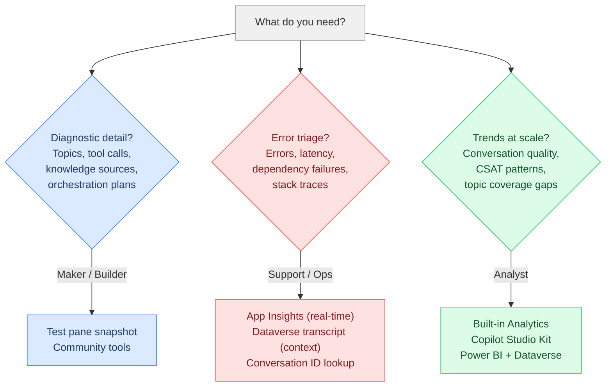
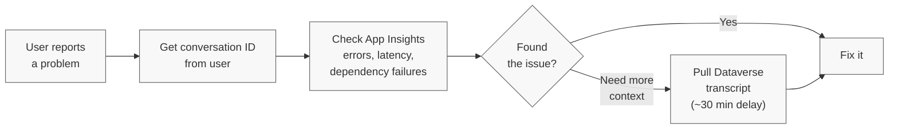

**Somewhere between the user's question and the agent's answer, a lot happens. Most people never look.**

## TL;DR

Copilot Studio conversation transcripts give you the full picture of every conversation your agent has. Not just "User says / Bot says," but the diagnostic data underneath: which topic fired, what knowledge sources were consulted, which tools were called, which agents or MCP servers were invoked, what the orchestration plan was, and how long each step took.

This post is structured around three personas:

- **[Maker debugging](#maker-debugging-youre-building-and-somethings-not-working)**: You're building, something's off. Download the transcript, read it, fix it.
- **[Support/ops triage](#supportops-triage-a-user-reports-a-problem)**: A user reports a problem. Find the conversation, trace the failure.
- **[Analyst trends](#trend-analysis-conversation-quality-and-patterns-at-scale)**: You need patterns across hundreds of conversations. Build dashboards and pipelines.

Each persona points you to the right tools.

---

## Three personas, different starting points



### Maker debugging: You're building and something's not working

You're in the test pane. The agent won't pick up the right knowledge source, routes to the wrong topic, or the generative answer misses the point. You've tweaked trigger phrases and rewritten instructions. Nothing works.

**Open the hood.**

Click the **...** (three dots) in the test pane next to "Test your agent" and select **Save snapshot**. It downloads a zip file called `botcontent` containing the conversation transcript and the full agent configuration. Open `dialog.json` and read what actually happened.

**Here are a few examples of what you'll find:**

| What you want to know | Where to find it |
|---|---|
| Which topic fired and how confident the agent was | `IntentRecognition` activities with `TopicName` and `Score` |
| How the agent routed between topics | `DialogRedirect` activities with target dialog IDs |
| Whether a **tool** or **action** was called (and what it returned) | Event activities for tool invocations, including connector calls and HTTP requests |
| Whether a **child agent** or **connected agent** was invoked | Event activities showing agent-to-agent handoffs and responses |
| Whether an **MCP server** was called | Event activities for MCP tool invocations, including request/response payloads |
| What the **orchestration plan** was | Generative orchestration trace data showing the agent's reasoning and planned steps |
| Which **knowledge sources** were searched and what was returned | `SearchAndSummarizeContent` in `nodeTraceData` activities |
| How long each step took | Timestamps on each activity in the conversation flow |
| Whether the conversation was resolved, escalated, or abandoned | `SessionInfo` activities with outcome and turn count |
| What the user rated the experience | Customer Satisfaction (CSAT) survey response in `CSATSurveyResponse` activities |

That's a lot of data. Here's why it matters.

#### A real example: Why the agent sometimes went silent

A customer's agent worked fine most of the time, but would sometimes just... not respond. No error, no timeout message. Just silence. It turned out that Copilot Studio enforces a synchronous response timeout (around 120 seconds based on [observed behavior](https://learn.microsoft.com/en-us/answers/questions/5619297/how-to-fix-a-flowactiontimedout-error-within-copil) and [community reports](https://learn.microsoft.com/en-us/answers/questions/5722696/intermittent-non-response-issue-with-copilot-studi), not official documentation), and in Teams, exceeding it results in a silent failure. The user gets nothing.

Downloading the snapshot was the first step, but what really helped was running it through the [MCS Agent Analyser](https://github.com/Roelzz/mcs-agent-analyser) to visualize exactly where the time was going. (For a different approach to real-time performance tracing, see [Agentic Tooling: Making Agent Performance Transparent and Measurable]().) Here's what the trace showed:

1. **User message**: "How do I submit an expense report?"
2. **IntentRecognition**: Topic `ExpenseSubmission` triggered with confidence 0.92. Correct topic.
3. **HTTP connector call**: `expense_lookup` API checked the user's pending reports. **Returned in 34 seconds.** First red flag.
4. **Topic redirect**: Routed to `ExpenseGuidelines` for the how-to answer.
5. **Knowledge source search**: The agent searched **2 SharePoint sites** and **1 uploaded PDF**. All three returned **0 relevant chunks**. The content had been migrated to a new intranet months earlier, but nobody had updated the knowledge source configurations.
6. **Fallback**: No useful results, so the orchestrator fell through to a catch-all topic that ran an **Azure AI Search** query against the full document index. That single call took **62 seconds**.
7. **Response generation**: The LLM summarized the Azure AI Search results. **Total elapsed: 34s + 62s + LLM generation = ~130 seconds.** Past the timeout. The user got silence.

**The fix** was three things:
- **Updated the knowledge sources** — they were still pointing at the old SharePoint sites that had been emptied during migration, not the new intranet where the content actually lived
- **Optimized the Azure AI Search index** — added semantic ranking and reduced the search scope so the catch-all query wasn't scanning the entire document corpus
- **Restructured the catch-all topic** to set a timeout and return a graceful fallback message instead of hanging

Result: average response time dropped to ~35 seconds. No more silent failures.

That's the difference between guessing ("maybe I should tweak some settings") and debugging with data ("the knowledge sources are pointing at empty SharePoint sites, and the catch-all is doing a full index scan").

But what if you're not in the test pane? Maybe the agent is already live and users are reporting issues. That's a different scenario entirely.

---

### Support/ops triage: A user reports a problem

Your agent is live. A user reaches out: "The agent gave me the wrong answer" or "It threw some weird error." You need to find that specific conversation and trace what went wrong.

**Step 1: Get the conversation ID.** Ask the user to share three things: what they were doing, what they expected, and their conversation ID. They can type `/debug conversationid` in the chat to get a GUID like `0c4ebb21-3f74-4df4-b191-812aea31273d` (see [How to Get Your Conversation ID]()).

**Step 2: Check Application Insights.** If you're running agents in production, [connecting Copilot Studio to Application Insights](https://learn.microsoft.com/en-us/microsoft-copilot-studio/advanced-bot-framework-composer-capture-telemetry) is a best practice. App Insights is where errors, latency, dependency failures, and stack traces live, and it gives you near real-time telemetry. Here's a simple KQL query that returns everything for a single conversation using the conversation ID from Step 1:

```sql
customEvents
| extend conversationId = tostring(customDimensions["conversationId"])
| where conversationId == 'your-conversation-id'
| project timestamp, name, session_Id, customDimensions
| order by timestamp asc
```

This is just to get you started. For pre-built dashboards, check the [Copilot Studio Analytics Template Workbook](https://learn.microsoft.com/en-us/microsoft-copilot-studio/advanced-bot-framework-composer-capture-telemetry#analytics-template-workbook). A full conversation trace query with timing, topic flow, and action breakdown will be covered in an upcoming post.

**Step 3: When App Insights isn't enough.** Tool invocations show up as `TopicStart` events in App Insights, so you can see *which* tools and connectors were called, but not with the same clarity as Dataverse transcripts. Knowledge source details (which sources were searched, what chunks came back, search duration), intent recognition confidence scores, the orchestration plan, and session outcomes (Resolved, Escalated, Abandoned) aren't in App Insights at all. If you need to follow the agent's complete orchestration plan, Dataverse transcripts are significantly more detailed. We hope future updates will bring more of this data into App Insights. For now, you need the Dataverse transcript. Filter the `ConversationTranscript` table's `Name` column (which stores `ConversationId_BotId`) with the conversation ID from Step 1. Note that transcripts aren't written until ~30 minutes after conversation inactivity, so recent conversations may not be available yet.

For browsing and parsing transcripts, you can [view them directly in Power Apps](https://learn.microsoft.com/en-us/microsoft-copilot-studio/analytics-transcripts-powerapps), use the [Copilot Studio Kit](https://github.com/microsoft/Power-CAT-Copilot-Studio-Kit) for pre-built dashboards, or the community tools mentioned earlier.

**The triage workflow:**



> **App Insights shows you the error. The transcript shows you the context.** If a tool call failed, App Insights tells you the HTTP status code and stack trace. The transcript tells you what the agent was trying to do and what happened before and after. For thorny issues, you often need both.
{: .prompt-tip }

---

### Trend analysis: Conversation quality and patterns at scale

You're past one-off debugging. Your agent handles real conversations at scale and you need to track what's happening across them. Are escalation rates climbing? Which topics have the lowest resolution rate? Are there user intents your agent doesn't cover? Is CSAT trending down on a specific channel?

This is analyst territory. You're not reading individual transcripts, you're looking for patterns.

**Start with the [built-in Analytics pane](https://learn.microsoft.com/en-us/microsoft-copilot-studio/analytics-overview).** Copilot Studio's **Analytics** section gives you more than you might expect out of the box: session outcomes, AI-generated [themes](https://learn.microsoft.com/en-us/microsoft-copilot-studio/analytics-themes) that cluster user questions into categories, [generated answer rate and quality](https://learn.microsoft.com/en-us/microsoft-copilot-studio/analytics-improve-agent-effectiveness#generated-answer-rate-and-quality-preview) scoring (with drill-down to individual questions), sentiment analysis, CSAT scores, tool use metrics, and estimated savings. No setup, no code. This is your first stop for understanding how your agent is performing.

**For custom analytics over transcript data**, the [Copilot Studio Kit](https://github.com/microsoft/Power-CAT-Copilot-Studio-Kit) is a middle ground between built-in analytics and a full custom pipeline. It parses Dataverse transcripts into a relational data model, gives you [Conversation KPIs](https://learn.microsoft.com/en-us/microsoft-copilot-studio/guidance/kit-conversation-kpi) and reference reports out of the box, and lets you build your own reports over that data model. The [Conversation Analyzer](https://learn.microsoft.com/en-us/microsoft-copilot-studio/guidance/kit-conversation-analyzer) adds AI-powered prompts against transcripts for custom pattern detection.

**For fully custom dashboards**, use [Dataverse link to Microsoft Fabric](https://learn.microsoft.com/en-us/power-apps/maker/data-platform/azure-synapse-link-view-in-fabric) to sync the `ConversationTranscript` table into a Fabric lakehouse. The raw transcript JSON needs parsing — use a dataflow or automated Fabric notebook to flatten it into a structured semantic model. From there, build whatever Power BI views you need: CSAT by topic, escalation rates by channel, resolution trends over time. This also solves long-term storage: the default 30-day Dataverse retention won't cut it for trend analysis, but your Fabric lakehouse retains everything you sync.


---

## What's not in the transcript

Transcripts show you a lot, but not everything. Whether you're a maker reading a snapshot or an analyst building custom reports, knowing the gaps saves you from hunting for data that isn't there.

**The full LLM prompt and completion are not exposed.** You can see the orchestration plan, the knowledge source results fed to the model, and the agent's final response. But the actual system prompt assembled by the orchestrator (the full instruction set sent to the LLM) is not in the transcript. This is intentional: the system prompt contains behavioral instructions, safety guardrails, and internal logic. Exposing it would create a security risk, the same reason you wouldn't log API keys in application traces.

**Responses grounded in sensitive enterprise data are excluded.** Agent responses that use SharePoint as a knowledge source and reference documents containing sensitive data are [not included in the conversation transcript](https://learn.microsoft.com/en-us/microsoft-copilot-studio/analytics-transcripts-powerapps). This is a privacy safeguard, but it means you may see gaps in the transcript where a knowledge-grounded response was generated but not recorded.

**Token counts are not tracked in transcripts.** In Copilot Studio, billing works through [Copilot Credits](https://learn.microsoft.com/en-us/microsoft-copilot-studio/requirements-messages-management), not per-token pricing. Token counts aren't exposed because they're not how you're billed. Monitor consumption through credit usage in the Power Platform admin center.

**Orchestrator reasoning.** You can see *what* the orchestrator planned to do (search these sources, call this tool, then summarize). When using a [deep reasoning](https://learn.microsoft.com/en-us/microsoft-copilot-studio/requirements-messages-management#reasoning-model-billing-rates) model, the chain of thought is shared in the transcript, giving you visibility into *why* it chose that plan. Without deep reasoning, you only see the resulting plan — not the reasoning behind it.

---

## Wrapping up

This post is the starting point: which persona are you, what data do you need, and where do you find it. We covered how makers can debug with test pane snapshots, how support and ops teams can triage with App Insights and Dataverse transcripts, and how analysts can build trend analysis with the built-in analytics, the Copilot Studio Kit, and Fabric.

There's a lot more to dig into. The Dataverse transcript data model, detailed App Insights queries, how to build custom analytics pipelines, and how to set up automated analysis are all topics that deserve their own posts. If there's interest, we'll go deeper.

**One ask:** Drop a comment below with what you'd like to see next, or any question this post didn't answer. Your feedback shapes what comes next.

Happy investigating, and may your topic routing always fire correctly on the first try.
