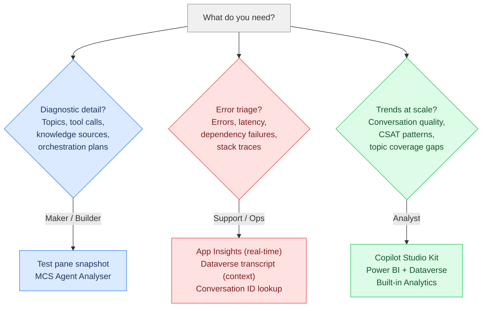
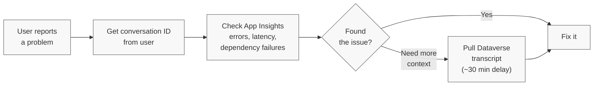

**Somewhere between the user's question and the agent's answer, a lot happens. Most people never look.**

## TL;DR

Copilot Studio conversation transcripts give you the full picture of every conversation your agent has. Not just "User says / Bot says," but the diagnostic data underneath: which topic fired, what knowledge sources were consulted, which tools were called, which agents or MCP servers were invoked, what the orchestration plan was, and how long each step took.

This post is structured around three personas:

- **[Maker debugging](#maker-debugging-youre-building-and-somethings-not-working)**: You're building, something's off. Download the transcript, read it, fix it.
- **[Support/ops triage](#supportops-triage-a-user-reports-a-problem)**: A user reports a problem. Find the conversation, trace the failure.
- **[Analyst trends](#trend-analysis-conversation-quality-and-patterns-at-scale)**: You need patterns across hundreds of conversations. Build dashboards and pipelines.

Each persona points you to the right tools. For the full data model, Dataverse vs App Insights comparison, and detailed access methods with code examples, see the [Technical Reference]().

---

## Three personas

Three personas, three different starting points.



### Maker debugging: You're building and something's not working

You're in the test pane. The agent won't pick up the right knowledge source, routes to the wrong topic, or the generative answer misses the point. You've tweaked trigger phrases and rewritten instructions. Nothing works.

**Open the hood.**

Click the **...** (three dots) in the test pane next to "Test your agent" and select **Save snapshot**. It downloads a zip file called `botcontent` containing the conversation transcript and the full agent configuration. Open the transcript JSON and read what actually happened.

**What you'll see:**

| What you want to know | Where to find it |
|---|---|
| Which topic fired and how confident the agent was | `IntentRecognition` activities with `TopicName` and `Score` |
| How the agent routed between topics | `DialogRedirect` activities with target dialog IDs |
| Whether a **tool** or **action** was called (and what it returned) | Event activities for tool invocations, including connector calls and HTTP requests |
| Whether a **child agent** or **connected agent** was invoked | Event activities showing agent-to-agent handoffs and responses |
| Whether an **MCP server** was called | Event activities for MCP tool invocations, including request/response payloads |
| What the **orchestration plan** was | Generative orchestration trace data showing the agent's reasoning and planned steps |
| Which **knowledge sources** were searched and what was returned | `SearchAndSummarizeContent` in `nodeTraceData` activities |
| How long each step took | Timestamps on each activity in the conversation flow |
| Whether the conversation was resolved, escalated, or abandoned | `SessionInfo` activities with outcome and turn count |
| What the user rated the experience | Customer Satisfaction (CSAT) survey response in `CSATSurveyResponse` activities |

**Not in the test pane?** Have the user type `/debug conversationid` in the chat to get the conversation ID (a GUID). Confirmed working in Teams as of March 2026; not tested in M365 Copilot or webchat. Use that ID to look up the full transcript in Dataverse. See [How to Get Your Conversation ID]() for details.

For deterministic, structural analysis of your agent alongside transcripts, the [MCS Agent Analyser](https://github.com/Roelzz/mcs-agent-analyser) parses both the agent definition and transcripts to show you structure alongside behavior. More on that [below](#mcs-agent-analyser).

#### A real example: Why the agent sometimes went silent in Teams

I had a customer whose agent worked fine most of the time, but would sometimes just... not respond. The user would ask a question in Teams and get nothing back. No error, no timeout message. Just silence.

Here's what most people don't know: **Copilot Studio appears to enforce a synchronous response timeout around 120 seconds across all channels.** This is based on observed behavior and community reports, not official documentation. If your agent doesn't send a response within that window, the connection drops. In some channels (notably Teams), this happens silently — no error, no message. Other channels may surface a timeout error or show a loading spinner indefinitely. This same timeout applies to synchronous flow actions called from Copilot Studio. See [this Microsoft Q&A thread](https://learn.microsoft.com/en-us/answers/questions/5619297/how-to-fix-a-flowactiontimedout-error-within-copil) for details on the ~120 second behavior, and [this thread](https://learn.microsoft.com/en-us/answers/questions/5722696/intermittent-non-response-issue-with-copilot-studi) for a community report of the exact same symptom pattern.

We opened the transcripts for the slow conversations and traced where the time was going:

1. **User message**: "How do I submit an expense report?"
2. **IntentRecognition**: Topic `ExpenseSubmission` triggered with confidence 0.92. Correct topic.
3. **HTTP connector call**: `expense_lookup` API checked the user's pending reports. **Returned in 34 seconds.** That was the first red flag.
4. **Topic redirect**: Routed to `ExpenseGuidelines` for the how-to answer.
5. **Knowledge source search**: The agent searched **2 SharePoint sites** and **1 uploaded PDF**. All three returned **0 relevant chunks**. The content had been migrated to a new intranet months earlier, but nobody had updated the knowledge source configurations.
6. **Fallback**: No useful results, so the orchestrator fell through to a catch-all topic that ran an **Azure AI Search** query against the full document index. That single call took **62 seconds**.
7. **Response generation**: The LLM summarized the Azure AI Search results. **Total elapsed: 34s + 62s + LLM generation = ~130 seconds.** Past the timeout. The user got silence.

**The fix** was three things:
- **Updated knowledge source descriptions** so the orchestrator targeted the right source (the new intranet, not the stale SharePoint sites that had been emptied during migration)
- **Optimized the Azure AI Search index** — added semantic ranking and reduced the search scope so the catch-all query wasn't scanning the entire document corpus
- **Restructured the catch-all topic** to set a timeout and return a graceful fallback message instead of hanging

Result: average response time dropped to ~35 seconds. No more silent failures.

> **Persistent channels like Teams need extra attention.** Conversation state carries over across session boundaries, which can compound timeout issues. See [Managing conversation boundaries](#managing-conversation-boundaries) in the Technical Reference for techniques to handle this.
{: .prompt-tip }

That's the difference between guessing ("maybe I should tweak some settings") and debugging with data ("the knowledge sources are pointing at empty SharePoint sites, and the catch-all is doing a full index scan").

> **What about the things you CAN'T see?** Transcripts show you a lot, but not everything. See [What's not in the transcript](#whats-not-in-the-transcript) for the gaps and why they exist.
{: .prompt-info }

---

### Support/ops triage: A user reports a problem

Your agent is live. A user reaches out: "The agent gave me the wrong answer" or "It threw some weird error." You need to find that specific conversation and trace what went wrong.

**Step 1: Get the conversation ID.** Ask the user to share three things: what they were doing, what they expected, and their conversation ID. They can type `/debug conversationid` in the chat to get a GUID like `0c4ebb21-3f74-4df4-b191-812aea31273d` (see [How to Get Your Conversation ID]()).

**Step 2: Check Application Insights.** App Insights is where errors, latency, dependency failures, and stack traces live. It gives you near real-time telemetry, unlike Dataverse transcripts which aren't written until ~30 minutes after conversation inactivity. To correlate with the conversation ID from Step 1, query `customDimensions` in [KQL (Kusto Query Language)](https://learn.microsoft.com/en-us/kusto/query/) — the conversation ID appears in fields like `session_Id` or within `customDimensions`. A starting query: `traces | where customDimensions has 'your-conversation-id'` or `requests | where session_Id == 'your-conversation-id'`.

For a pre-built starting point, check the [Copilot Studio Analytics Template Workbook](https://learn.microsoft.com/en-us/microsoft-copilot-studio/advanced-bot-framework-composer-capture-telemetry#analytics-template-workbook), which gives you operational dashboards for error rates, latency, and availability out of the box. For org-specific triage needs, you can also emit [custom telemetry events](https://learn.microsoft.com/en-us/microsoft-copilot-studio/advanced-bot-framework-composer-capture-telemetry) and build KQL queries tailored to your environment.

> **Don't have App Insights connected yet?** Skip to Step 3 and pull the Dataverse transcript once available. Then [connect App Insights](https://learn.microsoft.com/en-us/microsoft-copilot-studio/advanced-bot-framework-composer-capture-telemetry) so you're ready next time.
{: .prompt-info }

**Step 3: If App Insights doesn't give you enough context,** pull the full Dataverse transcript. Filter the `ConversationTranscript` table's `Name` column (which stores `ConversationId_BotId`) with the conversation ID from Step 1. The transcript gives you the complete activity chain: which topic fired, the orchestration plan, whether a tool call failed, whether a knowledge source returned nothing, or whether the agent routed to the wrong topic entirely.

If the conversation just happened (within the last 30 minutes), the transcript may not be available yet. You can also use the [Copilot Studio Kit](https://github.com/microsoft/Power-CAT-Copilot-Studio-Kit) or the [MCS Agent Analyser](https://github.com/Roelzz/mcs-agent-analyser) to pull and visualize conversations once the transcript lands.

**The triage workflow:**



> **App Insights shows you the error. The transcript shows you the context.** If a tool call failed, App Insights tells you the HTTP status code and stack trace. The transcript tells you what the agent was trying to do and what happened before and after. For thorny issues, you often need both.
{: .prompt-tip }

---

### Trend analysis: Conversation quality and patterns at scale

You're past one-off debugging. Your agent handles real conversations at scale and you need to track what's happening across them. Are escalation rates climbing? Which topics have the lowest resolution rate? Are there user intents your agent doesn't cover? Is CSAT trending down on a specific channel?

This is analyst territory. You're not reading individual transcripts, you're looking for patterns.

**Start with the built-in Analytics pane.** Copilot Studio's **Analytics** section gives you session outcomes, engagement rates, resolution and escalation trends, CSAT scores, and topic performance out of the box. No setup, no code. This is your first stop for understanding how your agent is performing.

**For deeper, pre-built analytics**, the [Copilot Studio Kit](https://github.com/microsoft/Power-CAT-Copilot-Studio-Kit) takes it further. Install the solution and you get [Conversation KPIs](https://learn.microsoft.com/en-us/microsoft-copilot-studio/guidance/kit-conversation-kpi) (automated outcome aggregation), [Conversation Analyzer](https://learn.microsoft.com/en-us/microsoft-copilot-studio/guidance/kit-conversation-analyzer) (custom AI prompts against transcripts), and [Agent Insights Hub](https://learn.microsoft.com/en-us/microsoft-copilot-studio/guidance/kit-overview) (unified dashboard combining App Insights and Dataverse data).

**For fully custom dashboards**, connect Power BI directly to the Dataverse `ConversationTranscript` table. Build whatever views you need: CSAT by topic, escalation rates by channel, resolution trends over time.

**For long-term storage**, the default 30-day retention won't cut it. Use [Azure Synapse Link for Dataverse](https://learn.microsoft.com/en-us/microsoft-copilot-studio/guidance/custom-analytics-strategy) to continuously export to Azure Data Lake Storage Gen2. From there you can run historical analysis in Synapse, Fabric, or any tool that reads Parquet files.

> **Trend analysis is where Dataverse and App Insights come together.** Individual debugging can often use one or the other. Trend analysis needs both: Dataverse for conversation content and outcomes, App Insights for operational health and real-time alerting.
{: .prompt-tip }

#### Quick reference: data model and access methods

Sessions ≠ conversations. A session ends after 30 minutes of inactivity and gets an outcome (Resolved, Escalated, Abandoned). A conversation can span multiple sessions if the user goes idle and returns. Understanding this distinction is critical for accurate analytics — see [Understanding the data model](#understanding-the-data-model) in the Technical Reference for the full breakdown of records, sessions, and conversations. Dataverse stores conversation content and outcomes; Application Insights stores operational health (errors, latency, dependency failures). Most production setups need both.

| Method | Best for | Scenarios | Code required |
|---|---|---|---|
| **Test pane** | Quick debugging during development | Maker | No |
| **Analytics UI** | Session outcome exports and CSV downloads | Maker, Analyst | No |
| **Power Apps table** | Browsing raw transcript JSON | Maker, Analyst | No |
| **Dataverse Web API** | Scripted analysis and pipelines | Maker, Analyst | Yes |
| **Application Insights** | Real-time operational monitoring and alerting | Triage, Ops | No (KQL queries) |
| **Copilot Studio Kit** | Pre-built dashboards, KPIs, and automated analysis | Analyst, Ops | No (install solution) |

For the full data model deep-dive, Dataverse vs App Insights comparison, and detailed instructions for all six access methods (including a Python code example), see the [Technical Reference]().

---

## Which roles do you need?

This trips people up. Here's the breakdown:

| What you want to do | Role required |
|---|---|
| View transcripts in the Copilot Studio test pane | Agent maker or editor access |
| View and download transcripts from Copilot Studio Analytics | **Bot Transcript Viewer** security role (Dataverse). Only admins can grant this during agent sharing. |
| View and download transcripts from Power Apps | **Bot Transcript Viewer** security role (Dataverse) |
| Query transcripts via the Dataverse Web API | **Bot Transcript Viewer** security role on your Dataverse user |
| Query telemetry in Application Insights | **Reader** or **Log Analytics Reader** on the App Insights resource (Azure RBAC) |
| Configure transcript settings for an environment | **Environment administrator** or **System administrator** role |

> The **Bot Transcript Viewer** is a Dataverse environment security role, not a Microsoft Entra ID app registration setting. Makers with the Environment Maker role do **not** automatically get transcript access. An admin must explicitly assign Bot Transcript Viewer during agent sharing.
{: .prompt-warning }

For Application Insights roles, see the [Technical Reference](#dataverse-vs-application-insights).

---

## What's not in the transcript

Transcripts show you a lot, but not everything. Knowing the gaps saves you from hunting for data that isn't there.

**The full LLM prompt and completion are not exposed.** You can see the orchestration plan, the knowledge source results fed to the model, and the agent's final response. But the actual system prompt assembled by the orchestrator (the full instruction set sent to the LLM) is not in the transcript. This is intentional: the system prompt contains behavioral instructions, safety guardrails, and internal logic. Exposing it would create a security risk, the same reason you wouldn't log API keys in application traces.

**Token counts are not tracked in transcripts.** In Copilot Studio, billing works through [Copilot Credits](https://learn.microsoft.com/en-us/microsoft-copilot-studio/requirements-messages-management), not per-token pricing. Token counts aren't exposed because they're not how you're billed. Monitor consumption through credit usage in the Power Platform admin center.

**Orchestrator reasoning.** You can see *what* the orchestrator planned to do (search these sources, call this tool, then summarize). The full chain-of-thought reasoning for *why* it chose that plan over alternatives depends on the model configuration. When using a [deep reasoning](https://learn.microsoft.com/en-us/microsoft-copilot-studio/requirements-messages-management#reasoning-model-billing-rates) model, the reasoning tokens appear as additional trace data in the transcript activities, giving you visibility into the orchestrator's decision process. Without deep reasoning, you only see the resulting plan — not the reasoning behind it.

---

## Beyond transcripts: Automate your analysis

Reading raw JSON transcripts at scale isn't fun. There are two approaches: AI-assisted analysis for pattern detection and open-ended questions, and deterministic tooling for structured, repeatable validation.

You can use **Copilot itself** to analyze your transcripts. Drop a transcript (or a batch of them) into a Copilot with researcher or analyst capabilities, and ask it to:

- Identify conversations where the wrong topic fired
- Find patterns in escalated or abandoned sessions
- Spot tool calls that are failing or timing out
- Flag knowledge source searches that return no results
- Summarize the most common user intents that aren't covered by your agent

<details markdown="1">
<summary><strong>Ready-to-use analysis prompt</strong> - Copy-paste this into any LLM or Copilot <em style="color: #3b82f6; font-weight: normal;">(click to expand)</em></summary>

```text
You are a Copilot Studio agent analyst. Your job is to analyze how an agent
is built, how it behaves at runtime, and where the gaps are between the two.

## Data sources

You may receive any combination of the following:

### Agent architecture (from bot export or test pane snapshot)
- botContent.yml -- the full agent definition: topics (with trigger phrases
  and model descriptions), knowledge sources, actions, entities, global
  variables, system instructions, authentication mode, content moderation
  settings, orchestrator configuration, and connected agents/skills.
  This is the primary definition format used in Copilot Studio exports.
- dialog.json -- conversation flow definitions from Bot Framework Composer:
  node configurations per topic, condition branches, variable assignments,
  message nodes, BeginDialog calls (topic-to-topic routing), and action
  invocations. Note: dialog.json is a Bot Framework Composer artifact.
  Copilot Studio exports use botContent.yml as the primary definition
  format. You'll encounter dialog.json in legacy exports or Composer-based
  customizations.

### Conversation transcripts (JSON from Dataverse or snapshot)
A JSON array of activity objects based on the Bot Framework protocol.
Key activity valueTypes and what they tell you:
- IntentRecognition -- which topic fired, TopicName, confidence Score
- DialogRedirect -- topic-to-topic routing with target dialog IDs
- SearchAndSummarizeContent (in nodeTraceData) -- knowledge source searches,
  which sources were queried, what chunks were returned, search duration
- SessionInfo -- session outcome (Resolved, Escalated, Abandoned), turn
  count, session start/end timestamps
- CSATSurveyResponse -- user satisfaction rating
- VariableAssignment -- variable values set during the conversation
- Event activities -- tool/action calls (connectors, HTTP requests),
  child/connected agent invocations, MCP server calls, orchestration
  plan traces with the agent's reasoning and planned steps

### Data model rules
- Sessions time out after 30 minutes of inactivity
- Transcripts can span multiple Dataverse records (1 MB limit per record)
  -- merge records sharing the same Name and ConversationStartTime by
  sorting on Metadata.BatchId
- The Name column is ConversationId_BotId -- use it to group all records
  for a single user thread
- Timestamps on each activity let you calculate step-by-step durations

## How to analyze

1. Start with the architecture files to understand what the agent is
   designed to do: its topics, trigger phrases, knowledge sources, actions,
   and routing logic.
2. Then examine transcripts to see what actually happened at runtime:
   which topics fired, what confidence scores looked like, which knowledge
   sources were searched, what tools were called, and how long each step
   took.
3. Compare intent to execution: are the right topics triggering? Are
   knowledge sources returning relevant results? Are tools succeeding?
   Is the orchestration plan sensible?
4. Flag mismatches between architecture and behavior -- that's where the
   bugs and optimization opportunities live.

## Your task

[YOUR ANALYSIS GOAL HERE]
```

Example analysis goals:

- Overlapping topic triggers causing misroutes (compare trigger phrases across topics in `botContent.yml`)
- Error diagnosis for a specific conversation ID (trace the full activity chain)
- Topic routing issues where confidence scores are close (look at `IntentRecognition` scores)
- Coverage gaps: user intents with no matching topic (unmatched messages falling to fallback)
- Slow knowledge source lookups (compare search durations across sources in `nodeTraceData`)
- Failing tool calls or connector errors (look for error events and HTTP status codes)
- Orchestration plan quality (does the agent's reasoning match the expected flow?)
- Stale or contradictory system instructions (cross-reference instructions in `botContent.yml` with actual behavior)

</details>

### MCS Agent Analyser

The [MCS Agent Analyser](https://github.com/Roelzz/mcs-agent-analyser) is an open-source Python tool for deterministic analysis of agent structure alongside runtime behavior. It parses bot exports, transcripts, and live Dataverse connections to give you routing decision trees, trigger overlap detection, best-practice validation, and execution timeline Gantt charts. No LLM required. Particularly useful for [maker debugging](#maker-debugging-youre-building-and-somethings-not-working) and [support/ops troubleshooting](#supportops-triage-a-user-reports-a-problem).

---

## What to do next

Where you start depends on your persona.

**If you're a maker (building and debugging):** Start with eval-driven development. Build an evaluation dataset, run evals, and use transcripts to diagnose failures. Save a test pane snapshot and read the raw JSON of a few conversations. You'll be surprised what's in there.

**If you're in support/ops (triaging live issues):** Connect Application Insights if you haven't already. The near real-time data and alerting are worth the setup. Start collecting conversation IDs from users who report problems, and make sure your support team knows about `/debug conversationid`.

**If you're an analyst (building trend analysis):** Install the [Copilot Studio Kit](https://github.com/microsoft/Power-CAT-Copilot-Studio-Kit) for pre-built dashboards and automated transcript analysis. If your retention needs exceed 30 days, set up Synapse Link. Connect Power BI for custom views.

**Regardless of persona:** Let AI and tooling do the heavy lifting. Use the Kit's [Conversation Analyzer](https://learn.microsoft.com/en-us/microsoft-copilot-studio/guidance/kit-conversation-analyzer) for automated pattern detection, and feed transcripts to a Copilot for open-ended analysis. If you're a maker or in ops, use the [MCS Agent Analyser](https://github.com/Roelzz/mcs-agent-analyser) for deterministic structure-level validation of your agent's configuration alongside runtime behavior.

The gap between "I think my agent is working" and "I know my agent is working" is exactly one transcript analysis away.

---

## You made it.

**If you actually read all of this, you just speed-ran what took me months of digging through Dataverse tables, decoding JSON blobs, and wondering why `SessionInfo` says "Resolved" when the user clearly rage-quit.**

You now know more about Copilot Studio conversation transcripts than most people who build agents for a living. Use that power wisely. Or at least use it to win an argument about whether your agent is actually working.

For the full data model deep-dive, all six access methods with code, and the Dataverse vs App Insights comparison table, check the [Technical Reference]().

**One ask:** Drop a comment below with your lightning bolt moment, the thing that made you go "wait, THAT's how it works?", or any question this post didn't answer. Your feedback shapes what comes next.

Happy investigating, and may your topic routing always fire correctly on the first try.
