**This is the technical companion to [Open the Hood: What Your Copilot Studio Agent Is Really Doing](). That post tells you which scenario you're in and where to start. This one gives you the full reference.**

**What's in this post:**

1. [Understanding the data model](#understanding-the-data-model) - records, sessions, conversations, and why the boundaries matter
2. [Managing conversation boundaries](#managing-conversation-boundaries) - techniques for persistent channels like Teams
3. [Dataverse vs Application Insights](#dataverse-vs-application-insights) - full comparison table, roles, and warnings
4. [Six ways to get conversation transcripts](#six-ways-to-get-conversation-transcripts) - all six methods with detailed instructions and code
5. [MCS Agent Analyser](#mcs-agent-analyser) - deterministic structure-level analysis tool

---

## Understanding the data model

### Records, sessions, and conversations

There are four distinct concepts, and the confusion comes from using "conversation" to mean all of them at once.

**ConversationId** is the thread identifier. It's assigned when a user starts talking to the agent and stays the same for as long as that user's channel session exists. In the transcript table, it's embedded in the `Name` column as `{ConversationId}_{BotId}`. This is the ID you see in error messages and debug panels. It's your primary key for "find everything about this user's interaction."

> The conversation ID you get from error messages or the test pane's debug info maps directly to the transcript `Name` field. Filter `Name` where it starts with that conversation ID, and you'll find the matching records.
{: .prompt-tip }

**Record**: one row in the `ConversationTranscript` table. One record = one inactivity window = one `ConversationStartTime`. If the user goes idle for 30 minutes and comes back, a new record is written. Same `Name` (same ConversationId), but a new `ConversationStartTime`. If a single inactivity window produces more than 1 MB of content, that window is split into multiple records. Those share both the same `Name` and the same `ConversationStartTime`, and you sort them by `BatchId` to reassemble them.

**Session**: Copilot Studio's unit of analytics, not a conversation reset. It starts with the first user message and ends after **30 minutes of inactivity**. Each session gets its own `SessionInfo` activity with an outcome: Resolved, Escalated, or Abandoned. A new session does not clear conversation history, session variables, or LLM context. It only creates a new analytics boundary. One session = one inactivity window = one `ConversationStartTime` in the data.

**Conversation**: the human concept. Everything the user experienced. It can span multiple sessions if they go idle and return. There is no native "conversation" entity in the transcript table. You reconstruct it by grouping all records with the same `Name`.

### How these relate

```
ConversationId  →  lives in Name column (Name = ConversationId_BotId)
                   groups ALL records for this user thread

  Session 1     →  one ConversationStartTime
                   one or more records (if >1 MB, split by BatchId)
                   one SessionInfo outcome (e.g. Resolved)

  Session 2     →  new ConversationStartTime (same Name, different start time)
  (user returned    one or more records
  after 30 min)     new SessionInfo outcome (e.g. Abandoned)
```



```mermaid
gantt
    title User interaction spanning 2 sessions and 3 records
    dateFormat HH:mm
    axisFormat %H:%M

    section Session 1
    User asks question (Record 1, BatchId 0)      :active, s1a, 09:00, 2m
    Agent responds (Record 1, BatchId 0)           :active, s1b, 09:02, 3m
    Follow-up exchange (Record 2, BatchId 1)       :active, s1c, 09:05, 1m

    section Inactivity
    30-min timeout gap                              :done, gap, 09:06, 34m

    section Session 2
    User returns (Record 3, BatchId 0)             :active, s2a, 09:40, 2m
    Agent responds (Record 3, BatchId 0)           :active, s2b, 09:42, 3m
```

**Example scenario:** A user asks a question at 9:00, gets an answer, asks a follow-up at 9:05, then walks away. At 9:40, they come back with another question. From the user's perspective, this is one conversation. In the data, it's **two sessions** with separate `SessionInfo` activities and potentially separate outcomes. If the first session was resolved and the second was abandoned, your analytics shows one resolved and one abandoned, not one conversation with a mixed outcome.

**To look up a specific transcript** given a conversation ID from the test pane or an error message: filter `Name` where it starts with that conversation ID. You'll get one or more records. Group by `ConversationStartTime` to see each session. Within each group, sort by `BatchId` to read the content in order.

### Why this matters for analytics

You can't reliably measure "conversation duration" or "conversations per user" without understanding these boundaries. A single user interaction might show up as 1 session or 3, depending on idle gaps. Count **sessions** as your primary unit, not records or "conversations."

---

## Managing conversation boundaries

A new session after 30 minutes is an **analytics boundary only**. It creates a new `SessionInfo` activity and a new transcript record, but it does **not** reset conversation history, session variables, or LLM context. In channels like Teams and Microsoft 365 Copilot, the conversation thread persists indefinitely: history accumulates across session boundaries, the LLM context fills up with stale turns, and the agent starts giving confused answers. Unlike the test pane, there's no automatic "Reset" button.

You can add explicit conversation-end signals (a "Done" button, a closing topic, a satisfaction survey) for cleaner boundaries. But without active intervention, the conversation state carries over even when the session counter ticks up.

Two techniques to manage this:

1. **Inactivity reset topic**: Use the **"The user is inactive for a while"** trigger (e.g., 15 minutes) to clear session variables and conversation history, end the conversation, and mark it resolved. Prompt the user to say "hello" to reinitialize, since `ConversationStart` [only fires once](https://learn.microsoft.com/en-us/microsoft-copilot-studio/guidance/deploy-agent-teams) in Teams (at first install) and the Greeting topic is the actual initializer. Other channels may behave differently; test `ConversationStart` behavior in your target channel.
2. **`/debug clearstate`**: This command forces a complete conversation reset in Teams: clears state, removes cached connector info, re-authenticates connectors, and loads the latest published version. Document it in your agent's help messaging and share it with support teams.

> For more Teams-specific deployment patterns, see [Best Practices for Deploying Copilot Studio Agents in Microsoft Teams]() and the [official Microsoft guidance](https://learn.microsoft.com/en-us/microsoft-copilot-studio/guidance/deploy-agent-teams).
{: .prompt-tip }

---

## Dataverse vs Application Insights

These are the two places your agent's data lives. They serve different purposes, and most production setups need both.

| Aspect | Dataverse | Application Insights |
|---|---|---|
| Data delivery | Pull (query on demand) | Push (streams telemetry) |
| Setup | Automatic | Must activate |
| Latency | ~30 min delay | Near real-time |
| Full transcript JSON | Yes | No |
| Session outcomes | Yes | No |
| CSAT responses | Yes | No |
| Error details / stack traces | Limited | Yes |
| Response latency | Timestamps only | Full timing data |
| Dependency call health | No | Yes |
| Alerting | No (needs Power Automate) | Built-in |
| Retention | 30 days (configurable) | Up to 730 days (configurable) |
| Query language | OData / FetchXML | [KQL (Kusto Query Language)](https://learn.microsoft.com/en-us/kusto/query/) |

Use Dataverse for conversation content and outcomes. Use Application Insights for operational health.

### Roles for accessing each data source

| What you want to do | Role required |
|---|---|
| View transcripts in the Copilot Studio test pane | Agent maker or editor access |
| View and download transcripts from Copilot Studio Analytics | **Bot Transcript Viewer** security role (Dataverse environment role) |
| View and download transcripts from Power Apps | **Bot Transcript Viewer** security role (Dataverse environment role) |
| Query Dataverse transcripts via Web API | **Bot Transcript Viewer** security role on your Dataverse user |
| Query Application Insights telemetry | **Reader** or **Log Analytics Reader** on the App Insights resource (Azure RBAC) |
| Configure transcript settings for an environment | **Environment administrator** or **System administrator** role |

> **Session outcomes are NOT in Application Insights.** This is the most common source of confusion. App Insights gives you operational telemetry (errors, latency, dependency health). Session outcomes (Resolved, Escalated, Abandoned) live in Dataverse only. If your ops dashboard needs both error rates and resolution rates, you need both data sources.
{: .prompt-warning }

> **Transcripts are not written in developer environments.** Developer environments do not generate transcript records, regardless of settings. Use a sandbox or production environment. See [Why can't I see my conversation transcripts?](https://learn.microsoft.com/en-us/microsoft-copilot-studio/analytics-transcripts-powerapps#why-cant-i-see-my-conversation-transcripts-in-the-conversationtranscript-power-apps-table) for details.
{: .prompt-warning }

> **Transcripts contain PII.** Conversation data includes personal user interactions, potentially sensitive business data, and personally identifiable information. Grant the **Bot Transcript Viewer** role sparingly and apply a four-eyes principle for live conversation access. See [Transcript access controls](https://learn.microsoft.com/en-us/microsoft-copilot-studio/admin-transcript-controls) for details.
{: .prompt-warning }

---

## Six ways to get conversation transcripts

| Method | Best for | Scenarios | Code required |
|---|---|---|---|
| **Test pane** | Quick debugging during development | Maker | No |
| **Analytics UI** | Session outcome exports and CSV downloads | Maker, Analyst | No |
| **Power Apps table** | Browsing raw transcript JSON | Maker, Analyst | No |
| **Dataverse Web API** | Scripted analysis and pipelines | Maker, Analyst | Yes |
| **Application Insights** | Real-time operational monitoring and alerting | Triage, Ops | No (KQL queries) |
| **Copilot Studio Kit** | Pre-built dashboards, KPIs, and automated analysis | Analyst, Ops | No (install solution) |

### 1. Test pane
**Quick real-time debugging during development**

The quickest way to see what's happening. When you test your agent in the authoring canvas, the test pane shows you the conversation flow in real time, including which topics fired and how the agent routed. Great for development and quick debugging, but it only shows the current test conversation.

> Click the **...** (three dots) in the test pane next to "Test your agent" and select **Save snapshot**. It downloads a zip file called `botcontent` containing both the conversation transcript and the full build configuration of that specific agent. Very useful for offline analysis or sharing with colleagues.
{: .prompt-tip }

### 2. Analytics UI
**No-code CSV export with session outcomes and transcripts**

No code required.

1. Open your agent in Copilot Studio
2. Go to **Analytics**
3. Select your date range
4. Above the **Overview** card, select **Download Sessions**
5. On the Download Sessions pane, select a row to download the session transcripts for the specified time frame

**What you get:** A CSV with session outcomes, turn counts, chat transcripts in "User says / Bot says" format, and basic metadata like `SessionOutcome` (Resolved, Escalated, Abandoned) and the initial user message.

**What you don't get:** The rich JSON with knowledge source details, intent scores, tool calls, and node traces. For that, you need Dataverse or Application Insights.

> The `ChatTranscript` field in the CSV has a **512 character limit per bot response**. Longer responses get truncated. This is per response, not per session. If you're seeing cut-off answers in the CSV, that's why. Use the Power Apps table view or Dataverse API for the full content.
{: .prompt-warning }

**Limitations:** Only the last 29 days of data. See [Download conversation transcripts in Copilot Studio](https://learn.microsoft.com/en-us/microsoft-copilot-studio/analytics-transcripts-studio) for details.

### 3. Power Apps table
**Browse raw transcript JSON without code or downloads**

You can view the raw transcript data right in the Power Apps maker portal. No code, no downloads.

1. Sign in to [make.powerapps.com](https://make.powerapps.com)
2. In the side pane, select **Tables**, then **All**
3. Search for "ConversationTranscript"
4. Select the **ConversationTranscript** table
5. Browse the records directly, or select **Export > Export data** to download as CSV

This gives you access to the full `Content` column with all the raw JSON, the `Metadata` column, conversation start times, and bot identifiers. You can filter and sort right in the UI.

You can also set up **views** to filter by specific agents or date ranges, making it easy to monitor specific agents over time.

> From here you can also export to Excel, connect Power BI directly to this table, or set up a Power Platform dataflow for ongoing processing.
{: .prompt-tip }

### 4. Dataverse Web API
**Programmatic access for scripted analysis and pipelines**

This is the programmatic path. Use it when you want to pull transcripts into a script, feed them into a pipeline, or build your own analysis tooling. No client secret needed: you sign in through the browser and the token uses your identity. You need the **Bot Transcript Viewer** role on your Dataverse account and your app registration must have **"Allow public client flows"** set to Yes in Microsoft Entra ID. The example uses [MSAL (Microsoft Authentication Library)](https://learn.microsoft.com/en-us/entra/msal/overview) for interactive browser authentication.

```python
import msal, requests, json  # json needed to parse the Content column

# --- Configuration ---
client_id = "your-app-registration-client-id"  # Must allow public client flows
tenant_id = "your-entra-id-tenant-id"
org = "your-dataverse-org-name"          # e.g. "contoso" (from contoso.crm.dynamics.com)
bot_guid = "your-copilot-studio-bot-id"  # Find in Copilot Studio > Settings > Session details > Copilot ID

# Interactive browser login (delegated permissions, no secret)
app = msal.PublicClientApplication(
    client_id,
    authority=f"https://login.microsoftonline.com/{tenant_id}"
)
token = app.acquire_token_interactive(
    scopes=[f"https://{org}.crm.dynamics.com/user_impersonation"]
)

# Query recent transcripts for a specific agent
response = requests.get(
    f"https://{org}.crm.dynamics.com/api/data/v9.2/conversationtranscripts",
    headers={
        "Authorization": f"Bearer {token['access_token']}",
        "OData-Version": "4.0",
        "Accept": "application/json"
    },
    params={
        "$filter": (
            f"_bot_conversationtranscriptid_value eq '{bot_guid}'"
            " and conversationstarttime ge 2026-02-01T00:00:00Z"
        ),
        "$select": "name,content,metadata,conversationstarttime",
        "$orderby": "conversationstarttime desc",
        "$top": "100"
    }
)

transcripts = response.json().get("value", [])
```

> The `_bot_conversationtranscriptid_value` lookup property is the correct way to filter transcripts by agent. You can verify this in the [ConversationTranscript entity reference](https://learn.microsoft.com/en-us/power-apps/developer/data-platform/webapi/reference/conversationtranscript?view=dataverse-latest). The `bot_guid` is the Copilot ID from **Settings > Session details** in Copilot Studio.
{: .prompt-info }

**Things to know:**

- Transcripts are written **30 minutes after conversation inactivity**, not in real time. See [how transcripts are retained](https://learn.microsoft.com/en-us/microsoft-copilot-studio/admin-transcript-controls) for details.
- Default retention is **30 days**. A bulk delete job in Power Apps removes older records automatically. You can [change this schedule](https://learn.microsoft.com/en-us/microsoft-copilot-studio/analytics-transcripts-powerapps) by cancelling the existing bulk delete job and creating a new one with a different retention period. For long-term storage, use [Azure Synapse Link for Dataverse](https://learn.microsoft.com/en-us/microsoft-copilot-studio/guidance/custom-analytics-strategy) to export to Azure Data Lake Storage Gen2.
- Each record has a **1 MB limit** on the `Content` column. Longer conversations get split across multiple records sharing the same `Name` and `ConversationStartTime`, differentiated by `Metadata.BatchId`. Merge them by sorting on `BatchId`.

### 5. Application Insights
**Near real-time operational telemetry with alerting**

If your Copilot Studio agent is connected to **Azure Application Insights**, you get telemetry data that complements (and in some cases goes beyond) what Dataverse transcripts provide.

Application Insights captures:

- Request and response timings for each conversation turn
- Dependency calls (knowledge source lookups, tool calls, connector invocations)
- Error and exception details
- Custom events and traces from your agent's execution

The key advantage: **Application Insights data is available in near real time**, unlike Dataverse transcripts which have a 30-minute delay. If you need to monitor agent performance live or set up alerts when error rates spike, this is the way.

For a pre-built starting point, check the [Copilot Studio Analytics Template Workbook](https://learn.microsoft.com/en-us/microsoft-copilot-studio/advanced-bot-framework-composer-capture-telemetry#analytics-template-workbook) for Application Insights. It gives you operational dashboards for error rates, latency, and availability out of the box.

You can query Application Insights data using **KQL (Kusto Query Language)** in the Azure portal, connect it to Power BI, or export to Log Analytics for long-term retention.

To connect your agent, go to **Settings > Advanced > Application Insights** in Copilot Studio and configure the connection string. You'll find three logging toggles there: **Log activities** (incoming/outgoing messages and events), **Log sensitive Activity properties** (user IDs, names, message text), and **Log node tools** (an event for each topic node execution). See [Connect your agent to Application Insights](https://learn.microsoft.com/en-us/microsoft-copilot-studio/advanced-bot-framework-composer-capture-telemetry) for the full walkthrough.

> **Filter out test pane traffic.** Copilot Studio tags all telemetry with a `designMode` custom dimension. Use `where customDimensions['designMode'] == "False"` in your KQL queries to exclude test pane conversations and only analyze production traffic.
{: .prompt-tip }

> **`user_Id` is not always a real user.** In anonymous channels like webchat, Application Insights `user_Id` is a session-based identifier that changes with each conversation. Metrics like "distinct users" actually represent "unique conversations" in those scenarios. Only authenticated channels provide a stable user identity.
{: .prompt-warning }

### 6. Copilot Studio Kit
**Pre-built transcript analysis, KPIs, and dashboards**

If you don't want to build your own tooling, someone already did. The [Copilot Studio Kit](https://github.com/microsoft/Power-CAT-Copilot-Studio-Kit) is a free, open-source Power Platform solution from Microsoft's Power CAT team. Install it in your environment and you get transcript analysis (and a lot more) out of the box.

What it gives you for transcripts specifically:

- **[Conversation KPIs](https://learn.microsoft.com/en-us/microsoft-copilot-studio/guidance/kit-conversation-kpi)** automatically parse transcripts and generate aggregated outcome data in Dataverse: sessions, turns, outcomes (resolved, escalated, abandoned), with optional full transcript storage and a built-in transcript visualizer. KPIs are generated twice daily automatically, or on demand.
- **[Conversation Analyzer](https://learn.microsoft.com/en-us/microsoft-copilot-studio/guidance/kit-conversation-analyzer)** lets you run custom AI prompts against transcripts to surface insights like sentiment analysis, personal data detection, or any pattern you define. Comes with two built-in prompts and supports custom ones you create and reuse.
- **[Agent Insights Hub](https://learn.microsoft.com/en-us/microsoft-copilot-studio/guidance/kit-overview)** is a full analytics dashboard that aggregates telemetry from both Application Insights and Conversation Transcripts into a single view with KPI cards, trend charts, CSAT scores, and filtering by agent, channel, and date range. Supports up to 365 days of historical data.

But the Kit goes well beyond transcripts. It includes test automation with AI-graded rubrics, agent inventory for tenant-wide visibility, compliance hub for governance policies, webchat playground for customizing chat appearance, and more. If you're running agents in production, it's worth the install. See the [Copilot Studio Kit overview](https://learn.microsoft.com/en-us/microsoft-copilot-studio/guidance/kit-overview) for the full feature list.

---

## MCS Agent Analyser

Analyzing transcripts alone tells you what happened, but not why. For that, you need to understand how the agent is built. The [MCS Agent Analyser](https://github.com/Roelzz/mcs-agent-analyser) is an open-source Python tool that gives you both views: agent structure alongside runtime behavior. It uses deterministic analysis, no LLM required.

**Key features:**

- Topic, skill, and entity visualization with connection maps
- Routing decision trees with trigger overlap detection
- 18 built-in best-practice validation rules plus custom YAML rules
- Deterministic instruction auditing
- Batch conversation analytics
- Side-by-side version comparison
- Execution timeline Gantt charts

**What it parses:**

- Bot exports (`botContent.yml`, `dialog.json`)
- Conversation transcripts (JSON)
- Live Dataverse connections
- Power Platform solution exports

It eliminates the guesswork: instead of switching between transcript JSON and the Copilot Studio UI to understand what went wrong, you see structure alongside behavior. It runs locally, so your agent configurations and transcripts stay in your environment. Particularly useful for [maker debugging](#maker-debugging-youre-building-and-somethings-not-working) and [support/ops troubleshooting](#supportops-triage-a-user-reports-a-problem).

### **[Check it out here](https://github.com/Roelzz/mcs-agent-analyser)**

---

That covers the data model, all six access methods, and the tooling to make sense of it all. Now apply it: head back to the [main post]() to find the right approach for your scenario, or jump directly to the [MCS Agent Analyser](https://github.com/Roelzz/mcs-agent-analyser) to start analyzing your agent.
