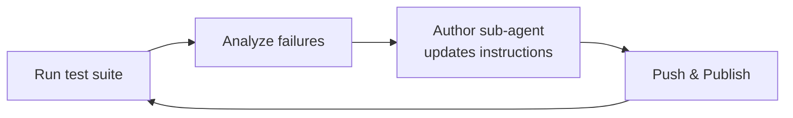

In a [previous post](), we introduced an AI coding plugin that can author Copilot Studio agents from YAML. We've now added a `publish` command to the [plugin](https://github.com/microsoft/skills-for-copilot-studio), which means an AI coding agent can do the full loop without manual intervention: edit a Copilot Studio agent's YAML, push changes, publish the draft to make it live, run tests against the published Copilot Studio agent, analyze failures, and iterate.

This post walks through what we built and a trial run of the loop on a real Copilot Studio agent. Here it is in action:



## What changed

The plugin's [manage sub-agent](https://github.com/microsoft/skills-for-copilot-studio/blob/main/agents/copilot-studio-manage.md) already supported pull, push, clone, and validate. We added a **`publish`** command that calls the Dataverse `PvaPublish` bound action and polls the `publishedon` timestamp until it changes, confirming the draft is live. The manage sub-agent's prompt enforces the correct sequence (pull, push, publish) and checks for pending changes before publishing.

With this in place, the AI coding agent's sub-agents can orchestrate a full improvement cycle: the author sub-agent edits the Copilot Studio agent's instructions, the manage sub-agent pushes and publishes, and a test suite evaluates the published Copilot Studio agent's responses.

## Trial run

We set up a D&D 5th Edition rules assistant as a Copilot Studio agent (because why not D&D?), backed by the [Systems Reference Document 5.1](https://media.wizards.com/2023/downloads/dnd/SRD_CC_v5.1.pdf) (403 pages, Creative Commons CC-BY-4.0) as a document knowledge source. The Copilot Studio agent was configured with `useModelKnowledge: false` so all answers had to come from the uploaded PDF.

The Copilot Studio agent got the basics right early on -- it could find information in the SRD and give broadly correct answers. But the failures were a mix of two things: **style** (verbose, step-by-step breakdowns when a direct answer was expected, unsolicited caveats) and **reliability** (occasionally miscalculating arithmetic or omitting a key rule consequence). The style issues were more frequent, but the correctness lapses were more damaging -- a wrong number in one answer could cascade into confused follow-ups in the same conversation. This isn't surprising -- LLMs are pattern matchers, not calculators, and multi-step arithmetic is where they're least reliable.

We designed the test cases to stress both: each question required a specific concise response style AND information from multiple distant sections of the document:

| # | Question | Expected answer |
|---|----------|-----------------|
| 1 | 5th-level Halfling Barbarian (16 Str, 14 Con), raging, no armor. AC? Rage Damage? Rages/day? Roll a 1? | Unarmored Defense AC is 10 + Dex mod + Con mod (+2), minimum 12. Rage Damage +2. 3 rages/long rest. Halfling Lucky trait: reroll the 1. |
| 2 | Dwarf Fighter in Plate. AC? Speed? Stealth disadvantage? Str requirement? Heavy armor speed rule? | AC 18, Str 15 required, Stealth disadvantage. 25 ft speed -- Dwarf trait means speed is not reduced by heavy armor. |
| 3 | Prone in difficult terrain, stand up + move 10 ft, base speed 30. Movement cost? | Stand up = 15 ft. Move 10 ft difficult terrain = 20 ft. Total 35 ft > 30 ft speed. Can't do it, 5 ft short. |
| 4 | 9th-level Barbarian (18 Str), raging, crits with Greataxe. Total damage dice? | Greataxe 1d12, crit = 2d12, Brutal Critical +1d12 = 3d12. Plus Str (+4) + Rage (+3). Final: 3d12 + 7. |
| 5 | Reckless Attack vs Dodge. Advantage/disadvantage interaction? | Reckless = advantage. Dodge = disadvantage. Both cancel. Roll one d20, straight. |

For evaluation, we used the [PytestAgentsSDK sample](https://github.com/microsoft/CopilotStudioSamples/tree/main/testing/functional/PytestAgentsSDK) from the CopilotStudioSamples repo. This harness connects to the published Copilot Studio agent via the [M365 Agents SDK](https://github.com/microsoft/Agents-for-python), sends each test case as a conversation turn, and evaluates the response using [DeepEval's](https://github.com/confident-ai/deepeval) GEval metric at a 0.75 threshold.

## The loop

Starting from blank instructions on the Copilot Studio agent, we ran 7 iterations. the AI coding agent never saw the expected answers or the SRD document directly. It only saw test results: which questions failed, their scores, and DeepEval's reasoning for the failure. From that signal alone, it generated and refined the Copilot Studio agent's instructions.

Each iteration followed the same pattern:



Here is the progression:

| Iteration | Instructions | Pass rate | Notes |
|-----------|-------------|-----------|-------|
| 0 | Blank | 2/5 (40%) | Correct answers but omits specific numbers |
| 1 | Added completeness rules | 3/5 (60%) | Tests 1 and 4 fixed (modifiers now included) |
| 2 | Added brevity rules | 3/5 (60%) | Test 5 fixed but Test 3 still verbose |
| 3 | Added race prefix + alternatives | 3/5 (60%) | Test 1 fixed again, Test 3 improving (0.73) |
| 4 | Added 7 more rules (14 total) | 1/5 (20%) | Regression. Too many rules competing for attention |
| 5 | Simplified to 7 rules | 3/5 (60%) | Recovered. 7 rules is the sweet spot |
| 6 | Added advantage/disadvantage rule | 2/5 (40%) | Multi-turn cascade: one wrong answer poisoned later turns |

No human wrote these instructions. the AI coding agent's author sub-agent constructed them entirely from test failure feedback -- scores and evaluator reasoning -- across 5 iterations. Here is what it converged on:

```
You are a D&D 5e rules expert grounded in the SRD 5.1.
Answer concisely and accurately.

- Name specific mechanics (e.g., "Unarmored Defense",
  "Halfling Lucky trait").
- Always compute final numbers. Include all modifiers
  and state the total.
- When a value is unknown, state the minimum.
- Keep calculations brief. State the result, not the
  step-by-step.
- When something is impossible, say what the character
  CAN do instead.
- When explaining a feature, state both its benefit
  and its cost.
- Do not add caveats or extra scenarios beyond what
  was asked.
```

## What we learned

**Instructions-only changes have a ceiling.** We deliberately constrained this experiment to system instructions only -- no conversation flows, no code interpreter, no additional knowledge sources -- just to stress-test the loop mechanics. This got us from 40% to a stable 60%. The remaining two tests consistently scored 0.65-0.73, just below the 0.75 threshold. In practice you would reach for stronger tools: a code interpreter action for deterministic arithmetic, a structured topic that enforces a specific response formula, or few-shot examples embedded in the instructions. The point was to see whether the loop itself works, not to achieve a perfect score.

**Keep instruction rules few and focused.** Going from 7 to 14 rules caused a regression from 3/5 to 1/5. Like any prompt engineering, there's a sweet spot -- too many rules compete for attention and start conflicting with each other. Seven concise, non-overlapping rules was the stable maximum for this agent. This is a good general practice for Copilot Studio agent instructions: favor a small number of clear directives over an exhaustive rulebook.

**Isolate test cases in separate conversations.** The test harness runs all 5 questions in a single conversation. When question 3 produced a wrong calculation, the conversation context carried that confusion into questions 4 and 5, both scoring 0.00. Running each test in its own session would give more accurate per-question scores and avoid this cascading effect.

**The loop works.** The mechanics are solid: the AI coding agent's author sub-agent edits, the manage sub-agent pushes and publishes, the test harness runs and scores, results come back with reasoning, and the next iteration targets specific failures. Each step is handled by a specialized sub-agent that knows its domain.

## Try it yourself

The plugin is open source at [github.com/microsoft/skills-for-copilot-studio](https://github.com/microsoft/skills-for-copilot-studio) and the test harness is at [github.com/microsoft/CopilotStudioSamples](https://github.com/microsoft/CopilotStudioSamples/tree/main/testing/functional/PytestAgentsSDK). If you try the loop on your own agents, we'd love to hear how it goes -- whether it improved your agent, where it got stuck, and what you'd want it to do differently. File a [bug report](https://github.com/microsoft/skills-for-copilot-studio/issues/new?template=bug_report.yml) or [feature request](https://github.com/microsoft/skills-for-copilot-studio/issues/new?template=feature_request.yml) on the plugin repo.
