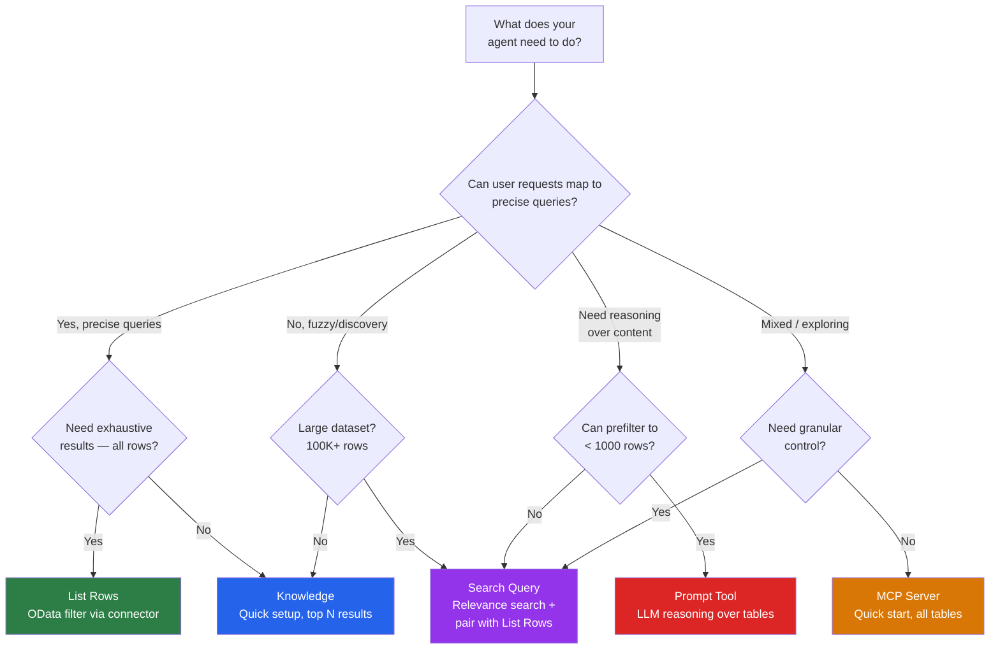
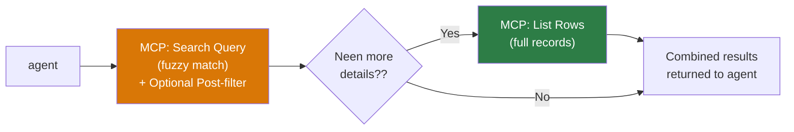
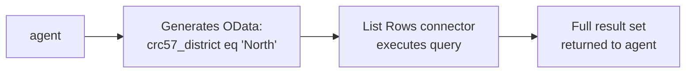
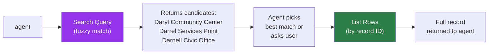
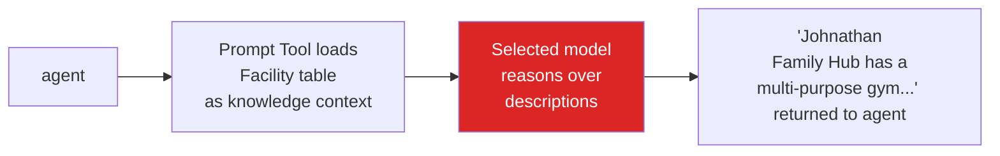

As of today, we have five distinct methods for Dataverse data retrieval, each carrying a unique set of trade-offs regarding performance, security, and scalability.

>One thing to note: This guide does not cover unstructured file upload Knowledge in Copilot Studio (Which uses different Dataverse methods). The focus is instead on tabular data (i.e. structured dataverse tables with rows and columns)
{: .prompt-warning }

Here's the thing: most people discover one method that works and never look at the others. You wire up Knowledge because it's the first thing you see, hit a wall when results get truncated (i.e. one of tradeoffs of Dataverse used as Knowledge via the "knowledge" button), and then spend a week figuring out what you should have used instead. Or you go straight to MCP because it sounds powerful, and then realize you've given your agent access to every table in the environment (which is what Dataverse MCP does).

This guide covers the five main retrieval patterns for **structured Dataverse tabular data**, when each one shines, and how to use them. It's an architecture decision guide first and a usage reference second. If we've already published a deep dive on a specific method, we'll link to it rather than repeat it.

>One more thing: this post is about **retrieval** — reading data from Dataverse. We're not covering create, update, or delete operations here. If you see CRUD mentioned, it's only in the context of turning it off.
{: .prompt-warning }

## The Scenario: Greenfield Parks & Recreation

Throughout this post, we'll use one scenario across all five methods so you can compare apples to apples.

To follow along, download the sample dataset used in this post and import it in a Dataverse Table: [fictional_facilities_table_import_to_DV.csv]({{ site.baseurl }}/assets/posts/dataverse-retrieval-patterns-copilot-studio/fictional_facilities_table_import_to_DV.csv).

{: .shadow w="700" h="400" }
_The Facility table after importing the sample CSV into Dataverse_

**The setup:** You're building a Copilot Studio agent for the fictional Greenfield Parks & Recreation Department. They have a Dataverse table called **Facility** (logical name: `crc57_facility1`) with 100 fictional facilities spread across six districts and five facility types.

The data is intentionally varied. Facility Names overlap. Types include Community Hubs, Library Branches, Recreation Centres, Civic Offices, and Access Points. Districts span North, South, East, West, Central, and Downtown. Descriptions are rich multi-line text with details about amenities and programs — the kind of free-form content that makes fuzzy search interesting. There are also columns you won't search but will want to retrieve: image URLs, opening hours, websites, capacity, GPS coordinates, and accessibility flags.

{: .shadow w="700" h="400" }
_A sample of the facility records with districts, types, and descriptions_

There's a related **Service Offerings** table (yoga classes, swimming lessons, after-school programs) linked to Facilities through a many-to-many relationship.

Residents will ask things like:
- "What facilities are in the West district?" (precise filter)
- "Where can I find something like Darol center?" (fuzzy discovery with a typo)
- "How many community hubs do we have?" (aggregation)
- "Where can we play Basketball" (LLM meaning search)
- "What programs does the Johnathan Family Hub offer?" (cross-table lookup)

Each retrieval method handles these questions differently. Let's see how.

## Choosing Your Method

Before we dive into each method, here's a simplified decision flow. Your starting point depends on what your agent needs to do and what your users require.

Before reading the detailed sections, explore the interactive widget below. It shows exactly which rows and columns each method retrieves for a sample question, what you control as a maker, and what the orchestrator handles.

<iframe src="{{ '/assets/posts/dataverse-retrieval-patterns-copilot-studio/DataverseRetrievalWidget.html' | relative_url }}" width="100%" height="560" frameborder="0" style="border-radius: 12px; border: 1px solid #e2e8f0;"></iframe>

You can (and often should) combine methods in a single agent. The rest of this post walks through each method — starting with the two quickest setups (Knowledge and MCP), then moving to the methods that give you more control (List Rows, Search Query, and Prompt Tool).

## Before You Start: The Basics

Every method needs these in place. Get them sorted first or you'll waste time debugging.

**A Copilot Studio environment with Dataverse.** Every Copilot Studio environment comes with a Dataverse database. If you're on Power Platform, you already have one. Otherwise, you'll need a licensed environment (Developer, Sandbox, or Production).

**Tables with data and clear column names.** If your columns are called `cr_col1`, `cr_col2`, every AI service will struggle to interpret them. Rename to meaningful names where possible. Note your **logical field names** (not display names) — find these in Dataverse → open the column → Settings → Logical field name. They look like `crc57_district`, `crc57_facilitytype`. You'll need these for OData filters and tool configuration.

**An authentication decision.** This constrains which methods you can use:

| Auth mode | Knowledge | List Rows | MCP Server | Search Query | Prompt Tool |
|---|---|---|---|---|---|
| User auth (signed in) | Yes | Yes | Yes | Yes | Yes |
| Service account / app auth | No | Yes | Yes (via custom connector) | Yes | Yes |
| Anonymous (no sign-in) | No | Yes | Yes (via custom connector) | Yes | Yes |

> If you need an anonymous, public-facing agent, Knowledge over Dataverse is off the table. You'll need List Rows, Search Query, or a Prompt Tool with a service connection.
{: .prompt-info }

**AI services enabled.** Your environment needs orchestration (always on), Knowledge (enable per source), and Prompt Tool (available under Tools). These are included in Copilot Studio licensing, but your admin may need to [enable generative AI features](https://learn.microsoft.com/en-us/power-platform/admin/geographical-availability-copilot) in the Power Platform Admin Center.

## 1. Knowledge: The Fastest Path to Answers

### What it is

Knowledge is Copilot Studio's built-in AI service for grounded answers over data sources. For [Dataverse Table Knowledge](https://learn.microsoft.com/en-us/microsoft-copilot-studio/knowledge-add-dataverse). You point it at a table, configure a glossary, and your agent can answer questions over the data. Under the hood, Copilot Studio's Knowledge layer rewrites user questions into structured queries for retrieval over your schema using glossary terms, synonyms, and column metadata - followed by a reasoned answer. Great for questions that can translate to queries and that can be answered over a scoped set of results.

### When to use it

- You want the **fastest setup** with minimal configuration
- Your use case is **general Q&A over table data** (lookups, basic filtering)
- You're okay with **top N results** (it returns the most relevant matches, not all matches)
- Your users will **authenticate** (Knowledge over Dataverse requires user auth)
- You need **cross-table relationship awareness** (it can follow many-to-many relationships automatically)

### When to move on

- You need **exhaustive results** (all rows matching a filter, not just the top handful)
- You need **anonymous/public-facing** agents without sign-in
- You need **full control over the query** being generated
- You need **follow-up question handling** natively (tools handle this better)

### How to set it up

1. Open your agent in **Copilot Studio**
2. Go to **Knowledge** and add a new knowledge source
3. Select **Dataverse** and pick the table(s) you want
4. **Configure the glossary** — this step makes or breaks your results

{: .shadow w="700" h="400" }

_Configuring the Knowledge glossary with synonyms for complex column names in Copilot Studio_

**The glossary is not optional in practice.** When you add a Dataverse table as a knowledge source, Copilot Studio shows you all columns with fields for term definitions and synonyms. If your columns are well named, you can get away with light glossary work. If they're cryptic, the glossary is the only way the LLM can understand your schema.

Prepare a mapping before you start:

| Logical field name | Term definition | Synonyms |
|---|---|---|
| `crc57_district` | Geographic district the facility is located in such as north, south, east, west, central and more. | area, zone, region |
| `crc57_facilitytype` | Type of facility such as civic office, access point and more | center type, building type, Hub Type |
| `crc57_facilitydescription` | Full-text description of the facility and its amenities | about, details, info, what's there |

> Adding a table to Knowledge triggers Dataverse to start indexing that table immediately. If the Dataverse search index setup (needed for Search Query and MCP) seems slow, adding the table to Knowledge first is a shortcut to kick it off.
{: .prompt-tip }

5. Test in the **Test panel** and check the [Activity tab](https://learn.microsoft.com/en-us/microsoft-copilot-studio/authoring-review-activity) for chain-of-thought reasoning
6. Look at the **rewritten query** in the activity log — it shows how the user's messy input gets cleaned up before hitting Dataverse

{: .shadow w="700" h="400" }

_The Activity tab shows how Knowledge rewrites the user's question before querying Dataverse_

### Greenfield example

A resident asks: *"What community hubs are in the West district?"*

Knowledge rewrites this to a structured query against the Facility table, filters by `crc57_district = West` and `crc57_facilitytype = Community Hub`, and returns the top matches with their details. It also follows the relationship to Service Offerings if the resident asks a follow-up like *"What programs does that one offer?"*

### Key details

- Supports **multi-turn conversations** — the agent maintains context across questions
- Can traverse **table relationships** (follow up on a facility to see its service offerings)
- Returns results based on **relevance scoring**, not exhaustive filtering
- The glossary quality directly determines answer quality

### When you'll hit the wall

Knowledge returns top N results, not all matches. When a resident asks *"Show me all facilities in the North district"* and there are 47 matches, they'll get 5 or 10. If your users need exhaustive results, List Rows is the better fit for that scenario.

## 2. MCP Server: The All-in-One Shortcut

### What it is

The Dataverse [MCP (Model Context Protocol) server](https://learn.microsoft.com/en-us/microsoft-copilot-studio/mcp-add-components-to-agent) bundles multiple Dataverse operations behind a single endpoint. It exposes list rows, search query, CRUD operations, and more as a set of tools. Connect it once and your agent can talk to every table in your environment.

> For cross-environment Dataverse access via MCP (e.g., your data lives in a different environment than your agent), see Ricardo's guide: [Connecting Copilot Studio to a Dataverse MCP Endpoint Across Environments](). For a detailed comparison of MCP vs. Power Platform connectors, check out [MCP Servers or Connectors in Copilot Studio? A Maker's Guide]().
{: .prompt-info }

### When to use it

- You want a **quick start** talking to all tables in your environment
- You're **exploring or prototyping** and don't need fine-grained control yet
- You want **multiple operations available** without configuring each separately
- The MCP server's built-in table descriptions are sufficient for your scenario

### When to move on

- You need **granular control** over which queries run and how
- You need to **restrict which tables** the agent can access (MCP exposes all tables via list rows)
- Your **DLP policies** need per-operation control
- You need **predictable tool call counts** (MCP may chain multiple calls per question)

### How to set it up

**Prerequisites:** Dataverse Search must be enabled and columns must be indexed (same as Search Query). The MCP server uses the same relevance search index under the hood.

1. In Copilot Studio, go to **Tools** and add a new tool
2. Select **MCP** as the tool type
3. Connect the **Dataverse MCP server**
4. You'll see all available operations. **Disable what you don't need**:
   - For retrieval only: disable `create_table`, `update_table`, `delete_table`, `create_record`, `update_record`, `delete_record`, and `list_apps`
   - Keep: `list_tables`, `describe_table`, `read_query`, `search`, and `fetch`
5. The MCP server automatically pulls **table and column names** from your Dataverse table definitions as a starter glossary
6. Test and check the **Activity tab** to see which operations the MCP chains together

> The entire MCP server is treated as a single connector for DLP purposes. You either allow it or block it — you can't allow "list rows via MCP" but block "delete rows via MCP" at the DLP level. Disable unwanted operations in the MCP tool configuration instead.
{: .prompt-warning }

### How the orchestrator uses MCP

The orchestrator can chain any tools together — this isn't MCP-specific behavior. What makes MCP different is that related operations are **bundled and context-aware**. They share the same endpoint, the same table metadata, and the same connection, and they understand when to call each other. You don't have to configure each operation as a separate tool.

### Greenfield example

A resident asks: *"Find something like Darol Civics."*

The MCP server runs a fuzzy search, finds "Daryl Community Center" as the closest match, then automatically follows up with a list rows call to pull the full record. Two tool calls, one user question, zero manual configuration per operation.

### Key details

- **Multiple tool calls per user question are normal** with MCP — that's by design
- You lose control over the exact OData filters being generated
- The MCP pulls table and column names for its glossary, so **choose good table and column names in Dataverse** and bring details and descriptions in your Copilot Studio agent context as-needed. 
- Dynamics 365 tables sit on Dataverse, so these same MCP patterns apply to D365 CE modules
- MCP auth can use service principal via custom connector, making anonymous-agent scenarios possible

### When you'll hit the wall

MCP is great for exploration and prototyping. For production agents with high-stakes business processes, you'll want dedicated List Rows or Search Query tools where you control exactly what queries run. MCP fires too many calls? Build dedicated tools. Need DLP per operation? Switch to individual connector tools. Need multiple instances of the same tool? Use individually configured connector tools.

## 3. List Rows: Precise, Exhaustive Retrieval

### What it is

The Dataverse connector's ["List rows" action](https://learn.microsoft.com/en-us/microsoft-copilot-studio/advanced-flow-list-of-results), added as a [tool in Copilot Studio](https://learn.microsoft.com/en-us/microsoft-copilot-studio/add-tools-custom-agent). You describe the [OData filter syntax](https://learn.microsoft.com/en-us/power-apps/developer/data-platform/webapi/query/filter-rows) in natural language inside the tool input description, and the orchestrator generates the actual OData query from the user's question. This gives you deterministic, filtered retrieval — every row that matches comes back.

> For complex queries with joins, use [FetchXML queries](https://learn.microsoft.com/en-us/power-apps/developer/data-platform/fetchxml/overview) within List Rows.
{: .prompt-info }

### When to use it

- You need **precise, exhaustive results** (all rows matching specific criteria)
- You want **full control over which columns** get filtered and returned
- You need **cross-table relationship** awareness
- You need to work with **any authentication mode**, including anonymous
- Knowledge **truncation is a problem** for your use case

### When to move on

- Users don't know exact values to filter on (they need fuzzy discovery first)
- You want 'search' behavior over a very large dataset

### How to set it up

**Prerequisites:** Configure the Dataverse connector in Copilot Studio (Tools → add Dataverse connector → configure connection). No special indexing needed — List Rows uses OData filtering or fetchXML queries directly against the table.

1. In Copilot Studio, go to **Tools** and add a new tool
2. Select the **Dataverse connector** → **List rows** action
3. Select the **target table** (e.g., Facilities)
4. Configure the **tool inputs**:
   - The connector inputs (the actual OData fields) get hidden under the covers
   - The **tool inputs** become the intelligent interface the orchestrator sees

{: .shadow w="700" h="400" }

_The tool input description teaches the orchestrator how to generate OData filters_

5. Write your input description like pseudocode:

Example OData input description

<pre><code>OData filter for the Facilities table.
- If the user mentions a district (north, south, east, west, central, downtown), filter on: crc57_district eq '{value}'
- If the user mentions a facility type (community hub, library branch, recreation centre, civic office, access point), filter on: crc57_facilitytype eq '{value}'
- If the user mentions a city name, filter on: crc57_city eq '{value}'
- Always return columns: crc57_facility, crc57_district, crc57_city, crc57_phonenumber, crc57_facilitytype
- Use logical field names only
- DO NOT invent filter values that the user did not mention
</code></pre>

> The "DO NOT invent filter values" instruction is important if you are providing a closed set of values. If your list is not exhaustive, allow the filters to add keywords, variations and synonyms to emulate search behavior. 
{: .prompt-tip }

6. Add a **tool description** that explains the business function (e.g., "Retrieves facility records filtered by district, type, or city")
7. Optionally, add **top-level agent instructions** for result handling (e.g., "If more than 5 results, ask the user to narrow down by district")

> Rename the connector to its business function, not its technical name. The orchestrator doesn't need to know it's "Dataverse List Rows." Call it "Facility Directory Lookup" or "Parks & Rec Search." This matters when you have multiple tools — clear names help the orchestrator route to the right one.
{: .prompt-tip }

### How the orchestrator generates OData

The orchestrator's OData generation is reliable when you write clear, pedagogical input descriptions with explicit glossaries of valid values. It handles `eq`, `ne`, `and`, `or`, and `contains()` well. Where it struggles is when descriptions are vague or leave room for interpretation — that's when you get hallucinated filter values or unnecessary follow-up questions.

### Greenfield example

A resident asks: *"Show me all facilities in the North district."*

The orchestrator reads the tool input description, generates `crc57_district eq 'North'`, and List Rows returns every matching facility — all of them, not just the top 5. The agent formats the result as a list.

But then another resident types: *"Where's the Darol center?"* — and gets zero results. `crc57_facility eq 'Darol center'` doesn't match anything because the closest actual name is "Daren Jonny Recreation Centre." List Rows does exact matching. For fuzzy discovery, you need Search Query.

### Key details

- The orchestrator converts natural language to OData syntax automatically
- Use **logical field names** from Dataverse column definitions (not display names)
- Supports standard OData operators: `eq`, `ne`, `and`, `or`, `contains()`, etc.
- Works with **any authentication mode**, including anonymous
- No special indexing required — queries run directly against the table

### When you'll hit the wall

Users misspell things. They type "Darol" when they mean "Daryl." They type "community center" when the value is "Community Hub." List Rows can't handle this — it's exact match only. If your users need fuzzy discovery, Search Query is designed for that.

## 4. Search Query: Fuzzy Discovery for Messy Input

### What it is

The Dataverse ["Perform unbound action"](https://learn.microsoft.com/en-us/microsoft-copilot-studio/authoring-create-search-query) connector with the `searchquery` action name. This uses Dataverse's [relevance search index](https://learn.microsoft.com/en-us/power-platform/admin/configure-relevance-search-organization) — the same engine that powers the search bar in model-driven apps. It's keyword-based with intelligent expansion for typos, stemming, and similar terms. Not vector search, not embedding-based. It ranks results by how well they match, and it handles real, messy human input.

> Karima wrote a full deep dive on searchQuery with step-by-step setup, YAML, and progressive enhancements. If you're going all-in on this method, read [Structured Data with Zero User Auth]() — it covers everything from indexing to a working agent.
{: .prompt-info }

### When to use it

- Users **don't know exact values** (they'll type "Darol" when the record says "Daryl")
- You have **large datasets** (hundreds of thousands to millions of rows)
- You need **discovery-style search** — "find me something related to X"
- You want to **pair it with List Rows** for a two-step pattern: fuzzy search to identify records, then deterministic retrieval for full details
- You have **text-heavy columns** (descriptions, notes, attachments) that need searching

### When to move on

- You need **exhaustive filtered results** (Search Query returns top-scored matches only)
- You need results from columns that aren't indexed (it only searches indexed text columns)
- You want a simple, single-step retrieval

### How to set it up

**Prerequisites:** Dataverse Search must be enabled and your columns must be indexed. This is the prerequisite people most often miss.

> Only text-type columns can be indexed (Single Line of Text, Multiple Lines of Text). Booleans, numbers, and lookups are not indexable for fuzzy search. Be selective — indexing consumes storage.
{: .prompt-warning }

**Configure the tool in Copilot Studio:**

1. Add a new tool → **Dataverse connector** → **Perform unbound action**
2. Set the **action name** to `searchquery`
3. **Configure** the inputs.

For a complete production-ready `searchquery` configuration pattern, see [Structured Data with Zero User Auth]().

### The two-step pattern: Search Query + List Rows

This is the most common enterprise pattern. Fuzzy search discovers candidates, then List Rows retrieves full details.

To set this up, you need two tools configured in your agent:

1. **Search Query tool** — configured as described above, returns candidate records with IDs and indexed columns
2. **List Rows tool** — configured to accept a record ID and return the full row with all columns

The orchestrator chains them: Search Query finds "Daryl Community Center" from the typo "Darol," then List Rows pulls the full record with phone numbers, address, service offerings, and everything else that wasn't in the search index.

> The `filter` parameter in the searchQuery API is a **post-filter** — it narrows the top-N ranked results, not the full table. This is a native Dataverse API feature, not something the orchestrator does. If you put the same OData filter in List Rows vs. as a post-filter on Search Query, List Rows will return more results because it filters the full table.
{: .prompt-warning }

### Greenfield example

A resident types: *"Where's the Darol center?"*

Search Query finds "Daryl Community Center" despite the typo, scores it highest, and returns it with a relevance score. The agent either presents it directly or, if there are multiple close matches, asks the resident to confirm which one they meant. Then List Rows pulls the full record with phone, address, and active programs.

### Key details

- **Probabilistic, not deterministic** — returns relevance-scored results, not exact matches
- Indexes the **first 1-2 MB of text** from attached files, which opens up document search scenarios
- Lean **relevance search is fast** and ideal for the largest datasets
- Returns relevance parameters and scores you can use for **ranking** and disambiguation
- Allows Pagination, and **unique controls** such as Facet aggregation, Highlighting important keywords and more
- Works with **any authentication mode** when using service principal credentials

### When you'll hit the wall

Search Query does not search text content "by meaning" — its index is keyword-based, not a semantic index with vector embeddings. A user asking "where can I play basketball?" won't find facilities whose descriptions mention "multi-purpose gym" or "youth sports programs." For that kind of intent-matching over free-text data, you need the Prompt Tool.

## 5. Prompt Tool: LLM Reasoning Over Your Data

### What it is

Copilot Studio's [prompt tool](https://learn.microsoft.com/en-us/microsoft-copilot-studio/create-custom-prompt): a configurable, single-shot LLM call that you can point at Dataverse tables as a knowledge source. You write instructions in natural language, pick a model, define inputs and outputs, and use it as a reusable tool in your agent. Think of it as a custom AI function with direct access to your table data.

### When to use it

- You need **semantic reasoning** over data — interpreting descriptions, matching intent to amenities, answering "where can I..." questions
- You need **aggregations, summaries, or calculations** over limited table data (max 1000 rows).
- You want to **swap models** — test GPT, Anthropic, or other chat-enabled models available in your environment through [AI Builder model selection](https://learn.microsoft.com/en-us/ai-builder/prebuilt-azure-openai)
- You want a **reusable, tool-shaped** LLM call with defined inputs and outputs
- You want to combine **multiple Dataverse tables** as knowledge context within a single prompt

### When to move on

- Simple lookups where List Rows or Knowledge would suffice and the agent's orchestrator could handle the rest of the reasoning (don't use a cannon for a nail)
- You need real-time, high-throughput retrieval (Prompt Tool adds LLM processing time)
- Your filtered data is too large to fit in a prompt context window

### How to set it up

**Prerequisites:** Your environment needs access to chat-enabled models. Many default LLM models are available out of the box as SaaS services, and you can add your own. Check with your admin if specific models are restricted by policy.

1. In Copilot Studio, create a new **Prompt** (under Tools or the Prompt section)
2. Write **instructions** in natural language describing what the prompt should do, how to interpret user questions, and what format to return results in
3. Add **Dataverse tables as knowledge** — click the knowledge picker and select your tables, columns and filter values. All columns become available to the LLM
4. Define **inputs** (e.g., the user's question and a filter value)
5. Define **outputs** (e.g., a text summary, a count, a formatted list)
6. **Select a model** from the dropdown
7. Test the prompt directly in the prompt editor before wiring it into your agent
8. Add the prompt as a **tool** in your agent so the orchestrator can call it when relevant

{: .shadow w="700" h="400" }

_The Prompt Tool with dynamic inputs (User Question, City), the Facility table as knowledge filtered by City, and selected columns. The model reasons over descriptions to find sports activities in Hillcrest._

### How the Prompt Tool works

### Greenfield example

A resident asks: *"Where can I play basketball in Hillcrest?"*

None of the other methods can answer this directly. "Basketball" doesn't appear as a column value anywhere — it's buried inside free-text descriptions like "multi-purpose gym" and "youth programs." Knowledge and Search Query match keywords, but they can't reason about whether a "multi-purpose gym" implies basketball. List Rows can't search descriptions at all.

The Prompt Tool loads columns from the Facility table filtered by city, reads descriptions across all rows, and connects "basketball" to facilities with gyms and sports amenities in Hillcrest. It returns: "Johnathan Family Hub in Hillcrest has a multi-purpose gym and youth programs. Jonty Access Point in Birchwood also has gym facilities."

This is where the Prompt Tool earns its keep: **semantic reasoning over free-text data**. The LLM reads your descriptions and interprets intent, bridging the gap between what users ask and how your data is actually written.

> The Prompt Tool reasons well over text and values in tables.  Note that data size, reasoning complexity and model choice will impact latency, so designs must be intentional and based on acceptable tradeoffs.
{: .prompt-warning }

### Key details

- **Semantic reasoning** is the core differentiator — the LLM interprets descriptions and matches user intent to data.
- Can also do **aggregation and computation** (counts, sums, comparisons) through code generation.
- Model selection matters — different models may perform better for different query types
- The prompt runs as a single LLM call each time, so keep the data context manageable
- Great for **"where can I..."** and **"what has..."** questions that require reading between the lines

### When you'll hit the wall

- Prompt Tool assumes amenities or capabilities not in the data → **add explicit columns** for important attributes rather than relying on free-text interpretation
- When not using code generation, calculation tasks may contain hallucinations. 
- Response time is too slow for your scenario → **filter aggressively**, to reason over a smaller dataset

## Decision Matrix

| Criteria | Knowledge | List Rows | MCP Server | Search Query | Prompt Tool |
|---|---|---|---|---|---|
| **Setup effort** | Low | Medium | Low | Medium-High | Medium |
| **Query control** | None (automatic) | Full (you describe OData) | None (MCP decides) | High (you pick columns, post-filter, facets, pagination) | Via instructions |
| **Result completeness** | Top N only | All matching rows | Varies | Top relevant only | Depends on context size |
| **Fuzzy matching** | Partial via glossary/synonyms | Partial (by controlling filter values) | Partial | Yes (core strength) | Yes (LLM reasoning) |
| **Auth requirement** | User auth required | Any (incl. anonymous) | Any (via custom connector) | Any | Any |
| **Cross-table joins** | Yes (follows relationships) | Yes (fetchXML queries) | Yes (auto-chains) | Partial (Multiple tables per call) | Partial (Multiple tables as knowledge) |
| **Aggregation/calculation** | No | No | Yes | Yes | Yes |
| **DLP granularity** | Per knowledge source | Per connector | One connector (all-or-nothing) | Per connector | Per LLM model |
| **Best for** | Quick Q&A, general lookup | Exhaustive filtered retrieval | Personal Productivity, Exploration, Prototyping | Discovery, Fuzzy search | Semantic reasoning, summaries |

## General Tips

**Rename connectors** to their business function, not their technical name. "Emergency Services Lookup" tells the orchestrator more than "Dataverse List Rows" when it's deciding which tool to call.

**Glossary quality is everything.** Whether you're configuring Knowledge, writing List Rows input descriptions, or relying on MCP's auto-discovered table descriptions — the quality of your field definitions and synonyms directly determines answer quality.

**Use logical field names** from Dataverse column definitions, not display names, when writing OData filter descriptions or configuring search fields.

**Check the Activity tab** in the test panel. The chain-of-thought reasoning shows you exactly what the agent is doing, what queries it's forming, and where things go wrong. This is your debugging superpower.

{: .shadow w="700" h="400" }

_The Activity tab reveals which tools the orchestrator selected and why_

**Don't force one method.** A well-built agent often uses two or three retrieval methods, or multiple instances of certain methods for different scenarios and configurations within the same agent. Start with one, add more as you expand scope or hit limits.

**Write good table and column names in Dataverse.** MCP and Knowledge pull these names and types automatically. Good metadata in Dataverse means less configuration work in Copilot Studio.

**DLP before you ship.** Review your DLP policies before deploying any of these patterns to production:
- **Connectors** (List Rows, Search Query, Prompt Tool): controllable per DLP policy
- **MCP**: all-or-nothing at the DLP level — disable unwanted operations in the tool config
- **Knowledge**: controlled per knowledge source in Copilot Studio settings
- **Conditional Access**: if you require user auth, make sure your policies allow Copilot Studio to access Dataverse on behalf of the user

## Wrapping Up

Every Copilot Studio builder working with Dataverse hits the "which method do I use?" question at some point, and the answer is almost never just one method.

Start simple. Hit the wall. Add another method. That's the pattern.

Which combination of methods are you using in your agents? What tripped you up? We'd love to hear — drop a comment below.
