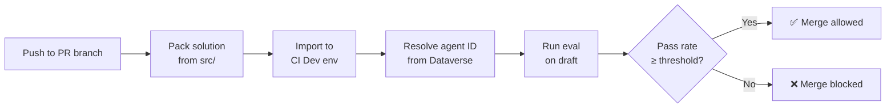

You've built your Copilot Studio agent. It answers questions, triggers the right topics, calls the right actions. You even have a test set in the Evaluate tab that proves it works. Ship it, right?

Then someone updates the agent instructions on a Friday afternoon, ever so elegantly telling the agent **YOU MUST NEVER RESPOND IN CAPS**. A topic gets renamed. A knowledge source URL goes stale. And nobody notices until a customer gets a hallucinated response on Monday morning.

The Evaluate tab is great for *manual* validation, but manual doesn't scale. What you actually need is a gate: something that runs every time someone pushes a change, checks agent quality automatically, and blocks the merge if the numbers don't add up. The kind of thing every software team has had for decades with unit tests and CI pipelines, but that somehow hasn't existed for conversational agents. Until now.

## The Evaluation API

Copilot Studio recently shipped an [Evaluation REST API](https://learn.microsoft.com/en-us/microsoft-copilot-studio/analytics-agent-evaluation-rest-api) that exposes everything the Evaluate tab does, but programmatically. You can:

- **List test sets** associated with an agent
- **Trigger evaluation runs** against a draft or published agent
- **Poll for completion** and retrieve detailed results per test case
- **Get per-metric breakdowns** (general quality, compare meaning, exact match, and custom graders)

The API lives under the Power Platform API surface (`api.powerplatform.com`) and uses delegated authentication (there's no app-only path, so you'll need a cached refresh token or a similar mechanism for unattended scenarios). The endpoint pattern looks like this:

```
POST /copilotstudio/environments/{envId}/bots/{botId}/api/makerevaluation/testsets/{testSetId}/run
```

You send a run request, get back a run ID, then poll until the state flips to `Completed`. Each test case in the results comes with metric-level pass/fail status.

One important detail: the API supports running evaluations against **draft agents**, not just published ones. That's the key that makes CI/CD integration possible. You can import a solution, run evals against the draft, and get results *before* anyone publishes or merges anything.

> The [Copilot Studio Kit]() is another option for automated testing. It can run unattended by pushing test records directly into Dataverse, and it scores responses against custom rubrics. The Evaluation API takes a different approach: it runs server-side against *draft* agents using Copilot Studio's built-in graders, so you can test before publishing.
{: .prompt-info }

## Agents as Code

Power Platform has its own [deployment pipelines](https://learn.microsoft.com/en-us/power-platform/alm/pipelines), and they work well for moving solutions between environments. But they operate on solution artifacts, not source. There's no branching, no PR reviews, no way to gate a deployment on test results. When you have a handful of agents, that's fine. When you have dozens of agents with multiple contributors, you may want the same source control and CI/CD discipline that every other engineering team already relies on.

With [Dataverse git integration](https://learn.microsoft.com/en-us/power-platform/alm/git-integration/connecting-to-git), agents *are* source code. They live in branches, get committed, get reviewed in pull requests. And the moment your agent source lives in a repo, every instinct from decades of software engineering starts screaming: *where are the automated tests?*

Azure DevOps is the natural place to answer that question (what about GitHub support, Microsoft?!? oh wait, that's us...). Dataverse git integration connects directly to ADO repos, so your agent's YAML, solution metadata, and test sets are already there. PR triggers, branch policies, the Tests tab, Key Vault for secrets: it's all native.

We published a sample, [EvalGateADO](https://github.com/microsoft/CopilotStudioSamples/tree/main/testing/evaluation/EvalGateADO), that wires these pieces together into an ADO pipeline. It deploys the agent from source, runs evaluations against the draft, and gates the PR merge based on a configurable pass threshold. The rest of this post walks through how it works.

## How the Pipeline Works

The pipeline doesn't just run evals. It deploys the agent from source, *every time*, into a dedicated CI environment. Here's what happens when a developer pushes to their PR branch.



### Step 1: Pack from source

The pipeline uses the `pac` CLI to pack the `src/` folder into an unmanaged solution zip. No pre-built artifacts, no solution exports from a running environment. The source in the PR branch *is* the solution.

```yaml
# Pack unmanaged solution from source
pac solution pack \
  --zipfile "$(Build.ArtifactStagingDirectory)/solution_unmanaged.zip" \
  --folder "$(Build.SourcesDirectory)/src"
```

This is a significant design choice. It means your CI environment always reflects exactly what's in the PR branch, not what someone last exported from their dev environment. If a developer makes a change in Copilot Studio but forgets to commit it, the pipeline tests what's in source, not what's running in their sandbox.

### Step 2: Import to CI Dev

The packed solution gets imported into a shared CI Dev environment using a service principal:

```yaml
pac solution import \
  --path "$(Build.ArtifactStagingDirectory)/solution_unmanaged.zip" \
  --environment "$(CI_DEV_ENV_URL)" \
  --async
```

This environment is dedicated to pipeline runs. It's not bound to git (that would create a conflict with the developer's own git-connected environments). It exists purely as a runtime target for automated testing.


### Step 3: Resolve agent ID dynamically

After import, the pipeline queries Dataverse to find the agent's GUID by its schema name. No hardcoded IDs in config files. This is important because agent IDs can differ across environments, and the schema name (from `bot.yml`) is the stable identifier that travels with the source.

```bash
# Query Dataverse OData for the bot
curl "${ENV_URL}api/data/v9.2/bots?\$filter=schemaname eq '${BOT_SCHEMA_NAME}'"
```

### Step 4: Run evals on draft

The eval script calls the Evaluation API with `runOnPublishedBot: false`, targeting the draft agent that was just imported. It polls until the run completes, then evaluates the results against a configurable pass threshold:

```javascript
const passRate = passed / total;
if (passRate < config.passThreshold) {
  process.exit(1);  // Pipeline fails → merge blocked
}
```

The script also generates JUnit XML so ADO's Tests tab renders individual test case results, and publishes the raw JSON as a pipeline artifact for deeper analysis. Since the Evaluation API requires delegated auth, the pipeline pulls an MSAL refresh token from Key Vault and writes back any rotated token after the run. Refresh tokens expire after 90 days of inactivity, so as long as the pipeline runs occasionally, it stays healthy.

Here's what the pipeline run looks like in ADO, with each step visible in the build logs:

{: w="700" h="400"}

### The Full Picture

What makes this setup satisfying is that *everything* is automated and *everything* comes from source. The developer's workflow is:

1. Edit the agent in Copilot Studio
2. Commit and push from the Solutions page
3. Open a PR in Azure DevOps
4. Wait for the green checkmark (or fix what the eval caught)
5. Merge

No manual exports. No "remember to run the eval before merging." No "it worked in my environment." The pipeline packs from the PR branch, imports to a clean CI environment, runs evals against the draft, and gates the merge. If your agent breaks, you find out in the PR, not in production.

When the eval passes, the PR gets the green light:

{: w="700" h="400"}

And when it doesn't, the merge is blocked until the agent quality improves:

{: w="700" h="400"}

Individual test case results show up in the ADO Tests tab, so reviewers can see exactly which scenarios passed and which didn't:

{: w="700" h="400"}

## Key Takeaways

- The **Copilot Studio Evaluation API** lets you trigger and retrieve evaluations programmatically, including against *draft* agents
- **Azure DevOps** is the natural platform for this because Dataverse git integration already uses ADO repos, making PR triggers, branch policies, and test result publishing native
- The pipeline **deploys from source** every time, packing the PR branch into a solution and importing it to a clean CI environment, so you're always testing what's actually in the PR

## Get Started

Clone the sample and try it on one of your agents:

**[EvalGateADO on GitHub](https://github.com/microsoft/CopilotStudioSamples/tree/main/testing/evaluation/EvalGateADO)**

---

Have you set up CI/CD pipelines for your Copilot Studio agents? Are you using the Evaluation API, the Kit, or something else entirely for quality gates? I'd love to hear what's working for your team in the comments.
