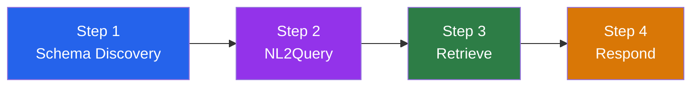
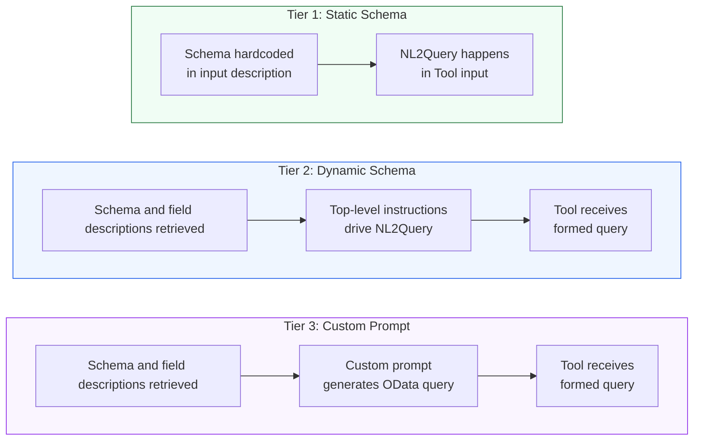
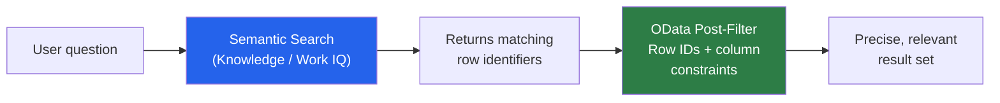

If you've ever tried to get a Copilot Studio agent to answer questions about **structured data** in a SharePoint list, you know the frustration. "Show me all pending shipments from Chicago." "Which orders have been in transit for more than 3 days?" "Give me a summary of shipments heading to Dubai." Simple questions, and yet the answers are... disappointing.

The usual advice? "Just add SharePoint as a Knowledge source!" But here's the thing: Knowledge sources in Copilot Studio are optimized for **unstructured content** — documents, pages, files. They're great for looking up policies, finding FAQs, searching through manuals. They're not the best mechanism for precise row-and-column filtering over a structured list. And even if you try to force it, you hit the wall fast: truncated results, no filtering, and an agent that confidently summarizes three rows out of three thousand.

This post shows a different approach: you set the `$filter` parameter as a **dynamic input** on the SharePoint connector's Get Items action, describe your columns in the input description, and the orchestrator can generate OData filter queries from plain English. No Power Automate flows. No custom code. No API wrappers. One tool. One agent.

We'll start simple — a single tool that handles natural language queries over a shipping list. Then we'll scale up to production patterns: dynamic schema discovery, semantic search, combining structured and unstructured retrieval, and shaping the response.

> This post uses SharePoint as the example, but the pattern works for any connector and with user requests that can be translated to a query — Dataverse List Rows, SQL queries, service management APIs. SharePoint is the vehicle; dynamic tool inputs are the point.
{: .prompt-info }

## What About Work IQ?

The **[Work IQ SharePoint](https://learn.microsoft.com/en-us/microsoft-agent-365/mcp-server-reference/sharepoint?context=/microsoft-copilot-studio/context){: .shadow w="700" }** connector is available as a tool in Copilot Studio and addresses a similar use case: it lets your agent converse over list data, abstracting more of the retrieval pipeline for you. If your use case is straightforward — authenticated users querying a well-structured list — start there. It handles the schema discovery, query generation, retrieval, and response formatting internally. But WorkIQ is not just a retrieval toolset, it's a full document management toolset.

When you need more control over your retrieval — scoping tools to specific query patterns, specializing tools for different use cases, shaping which columns and how many rows come back — you configure the connector yourself. That's the same trade-off as the [Dataverse retrieval patterns](): out-of-the-box tools get you started fast; configuring your own gives you precision.

Let's see how.

## The Scenario: A Shipping Tracker

Say you have a SharePoint list tracking shipments:

{: .shadow w="700" }
_A SharePoint list with shipment tracking data_

The list has columns like `Title` (shipment ID), `Tracking` (tracking number), `Origin`, `Destination`, `Status` ("Pending" or "In Transit"), and `Daysintransit`. A typical enterprise list with dozens or hundreds of rows.

You want users to ask questions like:

- "Show me all pending shipments from Chicago"
- "Which shipments are heading to Dubai with more than 3 days in transit?"
- "Find shipments originating from Miami or destined for Tokyo"

## Step 1: Add the SharePoint Connector as a Tool

In Copilot Studio, [add a new tool](https://learn.microsoft.com/en-us/microsoft-copilot-studio/advanced-connectors-as-tools) and select the **SharePoint** connector's [Get Items](https://learn.microsoft.com/en-us/connectors/sharepointonline/#get-items) action.

{: .shadow w="700" }
_Adding the SharePoint Get Items action as a tool_

Give it a name and description that tells the orchestrator what this tool is for:

- **Tool name:** `Get Shipping Info`
- **Tool description:** `Answer questions about order and shipping information`

> Tool names and descriptions are not for the end user, they're for the **orchestrator**. They help the LLM decide *when* to call the tool and *how* to fill in its inputs.
{: .prompt-info }

## Step 2: Configure Fixed Inputs

Some inputs should be fixed, they're the same every time the tool is called:

| Input | Type | Value |
|-------|------|-------|
| **Site Address** (`dataset`) | Fixed | Your SharePoint site URL |
| **List Name** (`table`) | Fixed | Your list's GUID |
| **Top Count** (`$top`) | Fixed | `50` (or whatever max you want) |
| **View** (`view`) | Fixed | Your list view GUID |

These ensure the tool always queries the right list and caps the number of returned items.

> **A quick word on data volume.** Remember that the orchestrator has to reason over whatever rows you hand back, and its context window only stretches so far. If your filter is too broad and pulls in hundreds of rows, the LLM won't magically analyze them all — it'll likely truncate, hallucinate, or just gloss over most of the data. That's exactly why this pattern matters: **we want to filter down to the relevant subset before the orchestrator ever sees it**. So keep `$top` sensible, write descriptive filter inputs that nudge the model toward narrow queries, and design your agent to ask a clarifying question when the user's request is too vague. A 5,000-row dump into a chat response rarely ends well for anyone.
{: .prompt-warning }

## Step 3: Configure the Dynamic Input — Where the Magic Happens

Here's where it gets interesting. The `$filter` parameter should be set as a [dynamic input](https://learn.microsoft.com/en-us/microsoft-copilot-studio/advanced-connectors-as-tools#add-tool-inputs), meaning the orchestrator will generate its value at runtime based on the user's question.

Think of this as **NL2Query** — turning natural language into a structured query. The orchestrator reads the input description, understands what the user is asking, and produces a valid [OData filter](https://learn.microsoft.com/en-us/sharepoint/dev/sp-add-ins/use-odata-query-operations-in-sharepoint-rest-requests#odata-query-operators-supported-in-the-sharepoint-rest-service). It's the heart of this pattern, and the richer your input description, the better the generated query.

> Pro tip: You can use M365 Copilot to help generate this description! Take a screenshot of your SharePoint list and ask Copilot to describe the columns and generate example OData queries.
{: .prompt-tip }

{: .shadow w="700" }
_Using M365 Copilot to generate the OData filter description from a screenshot of the list_


## Step 4: Review the Final Configuration

Here's what the complete tool looks like in the Copilot Studio UI:

{: .shadow w="700" }
_The complete tool configuration with fixed site/list inputs and a dynamic OData filter_

And here's the corresponding YAML for the tool definition:

<details>
<summary>Full Tool YAML</summary>

<pre><code>kind: TaskDialog
inputs:
  - kind: ManualTaskInput
    propertyName: dataset
    value: https://contoso.sharepoint.com/sites/retailers
  - kind: ManualTaskInput
    propertyName: table
    value: 05b4156a-317e-4ff9-83f0-7e0663531004
  - kind: AutomaticTaskInput
    propertyName: "'$filter'"
    name: User request about order and shipping
    description: "A generated ODATA filter query for sharepoint getitems 
      to restrict the entries returned (e.g. stringColumn eq 'string' 
      or numberColumn lt 123). Each row represents one shipment. 
      Columns (internal names without spaces): Title (text, e.g., 
      'SHIP-1'), Tracking (text, e.g., '5FP4PIFGSV'), Origin (text, 
      e.g., 'Chicago'), Destination (text, e.g., 'Dubai'), Status 
      (text, e.g., 'Pending' or 'In Transit'), Daysintransit (number, 
      e.g., 2). Build OData filters using exact column names, single 
      quotes for strings, and lowercase logical operators (and, or). 
      Example queries: Status eq 'Pending', Origin eq 'Chicago' and 
      Status eq 'Pending', Daysintransit gt 3, Destination eq 'London' 
      and Daysintransit ge 3, Status eq 'In Transit' and 
      Daysintransit lt 2, Origin eq 'Miami' or Destination eq 'Tokyo'."
  - kind: ManualTaskInput
    propertyName: "'$top'"
    value: 50
  - kind: ManualTaskInput
    propertyName: view
    value: 800eb42c-c1dc-474f-8baf-3e023ccfd40c
modelDisplayName: Get Shipping Info
modelDescription: Answer questions about order and shipping information
outputs:
  - propertyName: value
    name: value
    description: List of Items
outputMode: All
</code></pre>

</details>

## Step 5: That's It. Seriously.

With a single tool and no custom instructions, the agent handles natural language queries over your list. The orchestrator reads the input description, generates the OData filter, calls Get Items, and formats the answer. The entire thing runs from one tool configuration.

{: .shadow w="700" }
_One tool, no instructions — the orchestrator handles everything_

## Let's See It In Action

Here are real conversations with this agent:

**Query 1:** "Show me a report of which shipments from Miami or LA are busting my limit of 3 days in transit"

{: .shadow w="700" }
_The orchestrator combines origin, status, and numeric filters into a single OData query_

**Query 2:** "What's the status of my shipments titled SHIP-10 and SHIP-12"

{: .shadow w="700" }
_The orchestrator generates `Title eq 'SHIP-10' or Title eq 'SHIP-12'` and even offers follow-up actions_

**Query 3:** "Compare my shipments to London versus Sydney"

{: .shadow w="700" }
_The orchestrator calls the tool twice, once per destination, then reasons across both result sets to produce a comparison_

## OK, So How Does This Actually Work?

Now that you've seen the pattern in action, let's zoom out. What the orchestrator just did — reading your input description, turning "shipments from Miami" into `Origin eq 'Miami'`, calling the connector, and then reasoning over the results — follows a pipeline that every structured data approach uses, whether you build it yourself or let Work IQ do it for you:



1. **Schema Discovery** — Know the columns, data types, and valid values. In the walkthrough above, we hardcoded this in the input description. But you can also load it from a file or discover it at runtime.
2. **NL2Query** — Turn the user's natural language into a structured query (OData, FetchXML, SQL). This is the step we just saw in action — the orchestrator reading your column descriptions and generating a filter. The more context it has about your data structure, the better the query.
3. **Retrieve** — Execute the query against the data source and return matching rows.
4. **Respond** — Reason over the retrieved data to answer the user's actual question. Getting the right rows is only half the job — we'll come back to this in [Retrieval Is Not the Response](#retrieval-is-not-the-response).

In the one-tool setup, all four steps happen in a single tool call. But as your agent gets more complex, you'll want to split them out. That's where the next section comes in.


## Bonus: Keyword Search in a Text Field

OData filtering isn't limited to exact matches. You can also use the `substringof` function for keyword searches across text columns. The trick is adjusting the filter description to teach the orchestrator this pattern.

> **Important:** This is keyword matching, not semantic search. `substringof('Customs', Description)` finds rows where the word "Customs" literally appears. It won't find "import regulations" or "border compliance" even though they're semantically related. For true semantic search over list data, see [Beyond Keywords](#beyond-keywords-combining-semantic-and-structured-search) below.
{: .prompt-warning }

That said, you can add some intelligence to keyword choices through the input description. Instruct the orchestrator to expand keywords with likely synonyms: *"For example, when the user asks about customs, also search for 'import', 'export', 'clearance', 'border'."* This isn't semantic search, but it stretches keyword matching further than a single term.

Say your SharePoint list has a `Description` column with free-text entries:

{: .shadow w="700" }
_A SharePoint list with a free-text Description column_

Update the dynamic input description to include substring search syntax:

{: .shadow w="700" }
_Adding substringof examples to the filter description_

Now the agent can handle queries like "Which Tokyo and Sydney shipments have Customs information?":

{: .shadow w="700" }
_The orchestrator combines a destination filter with `substringof('Customs', Explanation)` to find relevant entries_

## Bonus: Scoped Tools for Precision

You don't have to leave the entire filter query generation up to the LLM. You can create **scoped tools** that fix some filter values and only generate the rest:

- **One tool per region:** A "Get Chicago Shipments" tool where `Origin eq 'Chicago'` is baked in, and only the remaining filters are dynamic.
- **One tool per query pattern:** A "Track Shipment by ID" tool where the description says: *"Fetch the tracking ID in the form of a 10-character string and generate the filter: `Tracking eq '<ID>'`"*

Scoped tools reduce the LLM's decision space and improve accuracy for common query patterns.

## When the Schema Changes: Static vs Dynamic

The walkthrough above hardcodes the list schema in the input description. That's fine for a stable list with a handful of columns — but what happens when someone adds a new column in SharePoint, or renames one? The tool breaks silently. The orchestrator generates filters against columns that no longer exist, or misses new ones entirely. Work IQ doesn't have this problem because it discovers the schema dynamically.

Think of it as three design tiers. The walkthrough you just saw is Tier 1. The rest of this post explores how to scale from Tier 1 to Tier 2 and 3 as your requirements grow.

## Where You Steer the Orchestrator

You've got four places to influence how the orchestrator handles your queries — and which one you use depends on how complex your setup is:

| Where | What it does | Example |
|---|---|---|
| **Input description** | Tells the orchestrator how to generate a specific filter value from  context, schema, format and guardrails. — this is where NL2Query lives in the simplest case | *"OData filter for shipments. Columns: Origin (text), Status (text, 'Pending' or 'In Transit')..."* |
| **Tool description** | Tells the orchestrator *when* to call the tool, plus light routing hints | *"Answer questions about order and shipping info. Call the Schema Lookup prompt first."* |
| **Top-level instructions** | Broad behavior across all tools — coordination, response formatting, fallback logic | *"For requests about orders, start with GetShippingInfo. If not answered, use knowledge..."* |
| **Custom prompt** | A dedicated NL2Query step — isolated, tuneable, can use a different model | A prompt that receives the user question + schema file and outputs a fully formed OData query |


Here's how the three tiers handle this:



### Tier 1: Static schema in the input description (what we built above)

Best for: small, stable lists where you control the schema. The input description carries the full column list, data types, valid values, and example queries. Simple to set up, but every schema change requires a manual update to the tool configuration.

### Tier 2: Dynamic schema loaded from a CSV

When your list evolves or has many columns, pull the schema dynamically. There's no out-of-the-box connector to retrieve SharePoint list metadata directly — the fully capable path is a **scheduled agent flow** that calls SharePoint REST or Microsoft Graph HTTP actions to pull column definitions, optionally wrapped in a custom connector for reuse.

The flow saves the schema to a  file that your agent retrieves at conversation start or at runtime.  The file can also include column explanations that go beyond what the raw metadata provides — for example: *"Name1 = company name, Name2 = user name, Description = explanation of any delay."*

With the schema loaded, your **top-level instructions** direct the orchestrator on how to build OData queries using the loaded columns. The tool's `$filter` input description simplifies to just *"a generated OData filter query"* — it no longer needs the full schema because that context comes from the CSV.

### Tier 3: Custom prompt for NL2Query

When the schema explanations and business rules are long and start interfering with top-level orchestration, move query creation to a **dedicated custom prompt**. This prompt:

- Receives the user's contextual question and the schema file as inputs
- Is tuned specifically for your NL2Query — turning natural language into well-formed OData
- Can use a different model than the orchestrator if needed
- Outputs a fully formed OData filter string

The tool description says: *"Always call the NL2Query prompt first to create a filter before calling this tool."* The tool itself receives the formed query and executes it; its input description is minimal.

This gives you an isolated, tuneable NL2Query step that doesn't compete with the orchestrator's other responsibilities.

## Beyond Keywords: Combining Semantic and Structured Search

The `substringof` trick from earlier is handy, but let's be honest — it's still keyword matching. When a user asks "which shipments have customs issues?" it finds rows containing the word "Customs," but it misses rows that say "import clearance delayed" or "border inspection pending." Close in meaning, invisible to keyword search.

For true **semantic search** over list data — matching by meaning, not just keywords — the content needs to be in a semantic index. SharePoint data can be indexed through the **Microsoft Graph index** used by Knowledge, or through a custom search index.

The powerful pattern is to **combine both approaches** when your semantic layer returns durable item identifiers:



1. **Semantic search** finds rows that *talk about* the topic the user cares about — even when the exact words don't match. If the semantic layer returns durable item identifiers (list item IDs, record GUIDs), you can chain those into the next step.
2. **OData post-filter** on those IDs, combined with structured column constraints (status, origin, date range), zooms into exactly the right subset.

This is an advanced hybrid pattern — it requires your semantic retrieval path to expose identifiers that your structured retrieval path can consume. The cleanest approach is **top-level instructions** that give the orchestrator a clear game plan:

```
For requests about orders and shipping:
1. Start with calling GetShippingInfo
2. If the request is not answered, use Knowledge to answer 
   the request and include the relevant order IDs
3. For follow-up questions on those same orders, 
   use GetShippingInfo with those order IDs
```

This gives the orchestrator a decision hierarchy: try structured retrieval first (fast, precise), fall back to Knowledge search (broader, semantic), and use the results to chain back into structured retrieval for details. 

> Whether the user sees the id's in the answer or not, if the orchestrator receives them, it will use them under the covers for the next NL2Query step!
{: .prompt-warning }

## Retrieval Is Not the Response

Everything up to this point has been about **retrieval** — getting the right rows into the orchestrator's context. But here's the thing: the user didn't ask for rows. They asked a question. *"Are my Miami shipments on track?"* is not answered by dumping a table.

The **response** is where the orchestrator reasons over the retrieved data to produce an actual answer. And if your retrieval is well-targeted — good filters, reasonable `$top` limits, relevant columns — the returned items fit comfortably in the context window. That's when conversational answers become possible.

Two types of response:

- **Qualitative:** The orchestrator reasons over the retrieval — summarizing patterns, comparing shipments, highlighting outliers, making recommendations. *"Three of your five Miami shipments are delayed beyond 3 days, all headed to the same destination. You may want to check the Dubai route."*
- **Analytical:** The orchestrator can also use its code interpreter for reliable calculations + analysis — counts, averages, trend identification, charts.  *"Average transit time for Chicago shipments: 2.4 days. 87% are on time."* 

You control response behavior through **top-level instructions**: *"When the user asks for a comparison, present a table with side-by-side metrics. When they ask for a summary, highlight outliers and suggest next steps. When they ask for a trend, generate a chart with the following tool.."  The orchestrator follows these instructions when forming its response over the retrieved data.

Here's one final example of a dynamic filter request to the ECB rates API through a Custom HTTP connector with a monetary analysis by the orchestrator's code interpreter: 

{: .shadow w="700" }
_User asked "compare the latest euro/usd trends" — the orchestrator pulls rates via the ECB connector, then uses code interpreter to generate the analysis and chart_


## Key Takeaways

- **Knowledge sources are optimized for documents, not structured list filtering.** But you can combine them — use Knowledge for semantic discovery and Get Items for precise column-level retrieval.
- **The pipeline is universal: Schema → NL2Query → Retrieve → Respond.** Every structured data approach follows it. What differs is where each step happens and how much control you have.
- **The instructions drive NL2Query**. The more specific you are about column names and definitions, data types, valid values, query type, guardrails and example queries, the better the generated OData.
- **You can use M365 Copilot to generate the description.** Screenshot your list, ask for an OData generation prompt, and paste the result.
- **Scale your architecture with complexity.** Static schema in the input description → dynamic CSV + top-level instructions → dedicated custom prompt for NL2Query. Pick the tier that matches your scenario.
- **Scoped tools reduce LLM decision space.** Fix what you can, generate only what you must.
- **Retrieval is not the response.** A well-targeted query gets the right data into context; top-level instructions shape how the orchestrator turns that data into a conversational answer.
- **This pattern works for any connector, not just SharePoint.** Any action with filterable inputs — Dataverse List Rows, SQL queries, service management APIs — can become a natural language query tool. SharePoint is the example; dynamic tool inputs are the point.
- **MCP servers are collections of tools with a general-purpose wrapper optimized by their maker.** When you configure a connector as a tool in Copilot Studio, you're building your own wrapper optimized for *your* use case. That's a feature, not a limitation.

Have you tried using connector tools with dynamic inputs for structured data retrieval? I'd love to hear which connectors you have used to orchestrate your own answers over structured data. Drop a comment below!
