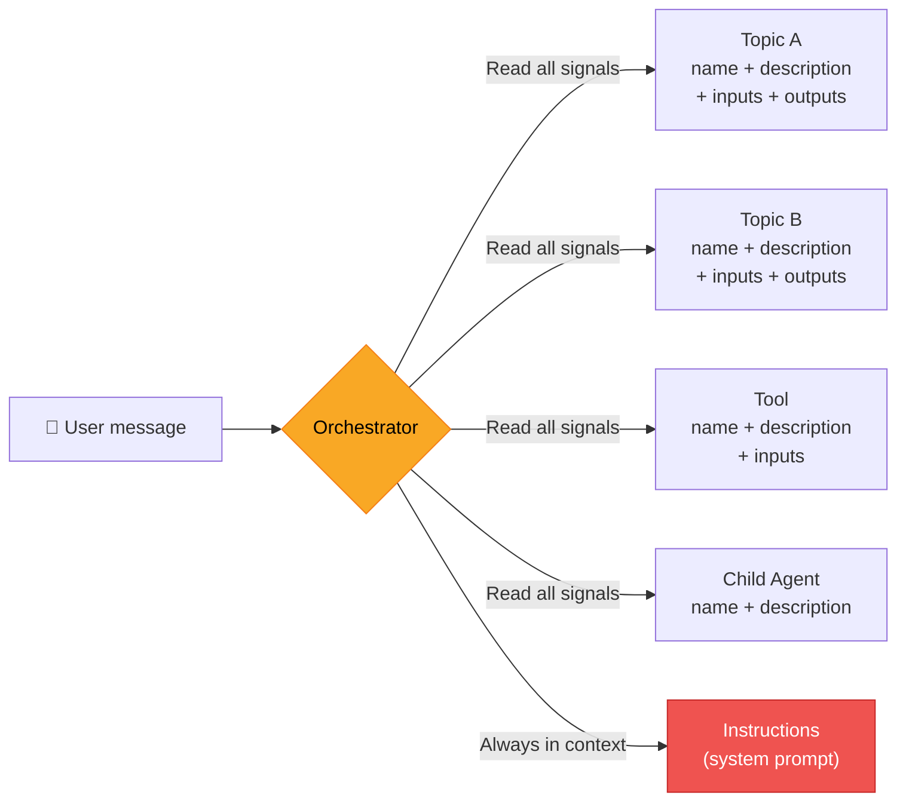

*Your Task-based Enterprise agent has five topics, a tool, and a child agent. It works great — except when the user asks "Tell me about my benefits" and the orchestrator has three places to go. The response is slow, and sometimes it picks the wrong one. Sound familiar?*

*This article covers two problems that keep coming up in customer engagements: **disambiguation** (why the orchestrator picks the wrong surface) and **latency** (why responses take longer than they should). Both are in the maker's control — and fixing one often fixes the other.*

---

## How the orchestrator decides — and where it gets confused

With [generative orchestration](https://learn.microsoft.com/en-us/microsoft-copilot-studio/advanced-generative-actions), your agent uses AI to route each user message to the right topic, tool, child agent, or knowledge source. No trigger phrases — the orchestrator reads a **full AI definition** for each surface:

| Signal | Where it lives |
|--------|---------------|
| **Name** | Topic filename, tool `modelDisplayName`, child agent `displayName` |
| **Description** | `modelDescription` on topics/tools, `beginDialog.description` on child agents |
| **Input parameter names and descriptions** | `AutomaticTaskInput` → `propertyName` + `description` |
| **Output parameter names and descriptions** | `outputType` → property name + `description` |
| **Top-level instructions** | `settings.instructions` in `agent.mcs.yml` — always in context, influences routing on every turn |



When two surfaces overlap across any of these dimensions, the orchestrator deliberates — and that deliberation adds latency and sometimes picks the wrong one. Top-level **instructions** make this worse: they're always in context, so they can compete with tool and topic descriptions during routing.

**Disambiguation** is the process of making each surface distinct enough that the orchestrator never has to guess. I helped build a [disambiguation check skill](https://github.com/microsoft/skills-for-copilot-studio) for the VS Code extension that automates this — it scans your agent and flags collisions with sample queries and suggested fixes.

> **Want to try it?** The [disambiguation check skill](https://github.com/microsoft/skills-for-copilot-studio) plugs directly into the Copilot Studio VS Code extension. Point it at your agent, and it'll flag every collision before your users do.
{: .prompt-tip }

## The sample: HR Helper agent

To put this to the test, I built a deliberately flawed sample agent. These are the kind of mistakes any maker would make on a first pass (don't pretend you wouldn't):

```text
HR Helper
├── topics/
│   ├── GetEmployeeInfo        — employee profile lookup
│   ├── GetEmployeeStatus      — work status check
│   ├── RequestTimeOff         — leave requests
│   ├── BenefitsFAQ            — benefits Q&A
│   └── SubmitITTicket         — IT ticket creation
├── actions/
│   └── CreateTicket           — service desk connector
└── agents/
    └── BenefitsExpert/        — child agent for benefits
```

Five topics, one tool, one child agent, plus three instruction sections covering time-off, IT support, and benefits. Looks reasonable. The disambiguation check found 5 collisions hiding in plain sight.

## 5 collisions and how to fix them

### 1. Combined definition collision: GetEmployeeInfo ↔ GetEmployeeStatus

Both topics output `employeeId`, and both descriptions mention it. When a user asks "What's the employee ID for Sarah?", the orchestrator sees two valid surfaces.

> Collisions are cumulative. Two surfaces can have different descriptions but still collide if their names, inputs, or outputs overlap enough. Always check the **full AI definition**, not just `modelDescription`.
{: .prompt-warning }

**The fix — rename and draw boundaries:**

```yaml
# BEFORE (GetEmployeeInfo)
modelDescription: Retrieves employee information including employee ID, name, 
                  department, role, and manager.

# AFTER (renamed to EmployeeProfile)
modelDescription: Looks up an employee's HR profile — employee ID, full name, 
                  department, role, and manager. This is the primary topic for 
                  employee ID lookups. Does NOT return attendance or work status.
```

```yaml
# BEFORE (GetEmployeeStatus)
modelDescription: Gets employee details such as employee ID, current work status, 
                  team, and last check-in date.

# AFTER (renamed to EmployeeAttendance)  
modelDescription: Checks an employee's current work status — active, on-leave, 
                  or terminated — and their attendance record. Does NOT return 
                  HR profile data.
```

> The "Does NOT" pattern is one of the most effective disambiguation tools available to you. It costs a few tokens in the description but saves the orchestrator from deliberating every time a borderline query comes in.
{: .prompt-tip }

### 2. Instruction interference: IT Support instructions ↔ CreateTicket tool

The agent instructions describe step-by-step IT support behavior. The `CreateTicket` tool *also* creates tickets with its own input descriptions. The orchestrator has two plans before it even starts — it's like giving someone driving directions and then handing them a GPS.

**The fix — instructions should augment, not re-describe:**

```text
# BEFORE (in agent instructions)
When someone has an IT problem, collect the issue description, affected system, 
and urgency level. Create a ticket and give them the ticket number.

# AFTER
When the CreateTicket tool completes, always show the ticket number to the user. 
If the ticket is high priority, also suggest escalation contacts.
```

The tool's input `description` fields already tell the orchestrator what to collect. Instructions add value *after* the tool runs.

### 3. Cross-scope collision: BenefitsFAQ topic ↔ BenefitsExpert child agent

Three surfaces claim benefits: a topic, a child agent, and the instructions. This is the worst case for orchestrator deliberation.

> **Three-way collisions are the worst offenders.** When a topic, a child agent, *and* the instructions all claim the same domain, the orchestrator doesn't just deliberate longer — it may invoke multiple surfaces for a single query. If your agent has a domain claimed in three places, fix it first.
{: .prompt-danger }

**The fix — one owner, exclusive claim:**

Disable the BenefitsFAQ topic (don't delete — you might need it for topic references). Remove the benefits section from instructions. Give the child agent exclusive ownership:

```yaml
beginDialog:
  description: Handles ALL employee benefits inquiries — health insurance, dental, 
               vision, 401k, FSA, HSA, enrollment, and claims. This is the only 
               surface that handles benefits. Does NOT process leave requests or 
               IT issues.
```

**A word on child agents and topics:** Be cautious about having child agents call parent-level topics. Topics are not top-level entities inside child agents — calling them requires deterministic interruption and context switching, which adds latency.

> **This one bites.** Child agents calling parent-level topics is a common pattern that looks harmless but introduces deterministic interruption and context switching overhead on every call. If you find yourself doing this, it's a strong signal that a **connected agent** is a better fit — it lets those topics live as first-class citizens instead of being summoned across scope boundaries.
{: .prompt-warning }

### 4. Tool ↔ Topic collision: SubmitITTicket topic ↔ CreateTicket tool

Both the topic and the tool claim to create tickets. The tool is a connector action that does the actual API call. The topic is a conversational wrapper that... also says it creates tickets.

**The fix — topic owns the conversation, tool is called explicitly:**

Keep both, but set the tool's **"When this tool may be used"** to *only when referenced by topics or agents*. The topic controls the user interaction and calls the tool when ready — you keep dynamic inputs from the orchestrator and can define custom ones with your own validation logic.

{: .shadow w="700" }

This setting also supports **Power Fx formulas** — for example, `User.IsLoggedIn` to make a tool available only to authenticated users, dynamically reducing the routing surface at runtime.

{: .shadow w="700" }

### 5. Instruction interference: Time-Off instructions ↔ RequestTimeOff topic

The instructions redundantly describe what the topic's `AutomaticTaskInput` fields already define — start date, end date, leave type. Combined with the nearby benefits domain, this creates unnecessary noise.

**The fix — replace with a routing pointer:**

```yaml
# AFTER (in agent instructions)
# Routing guidance  
- Leave and time-off requests go to the RequestTimeOff topic.
- Benefits questions (insurance, 401k, FSA, enrollment) go to the BenefitsExpert agent.
```

Or better: make the surfaces self-disambiguate through their descriptions alone and skip the routing hints entirely. For business-critical workflows where no statistical errors are tolerated, keeping the explicit topic is better than relying on instruction-only handling.

## Before and after

| Surface | Before | After |
|---------|--------|-------|
| `GetEmployeeInfo` | Shared `employeeId` output, generic description | Renamed to `EmployeeProfile`, "Does NOT" clause |
| `GetEmployeeStatus` | Shared `employeeId` output, mentions employee ID | Renamed to `EmployeeAttendance`, no longer mentions employee ID |
| `BenefitsFAQ` topic | Overlaps with BenefitsExpert child agent | **Disabled** — kept for potential topic-reference use |
| `SubmitITTicket` topic | Overlaps with CreateTicket tool | **Renamed and refocused** — owns the conversation, calls the tool explicitly |
| `CreateTicket` tool | Dynamically callable, competes with topic | Set to "only when referenced", called by the topic |
| Agent instructions | 3 detailed behavioral sections | Routing pointers + post-execution augmentation only |
| `BenefitsExpert` child agent | Partial description | Exclusive ownership stated, "Does NOT" clause added |

**Active surfaces went from 7 to 4.** Fewer surfaces = less comparison = faster routing.

## Beyond disambiguation — other latency levers

Disambiguation is the biggest latency lever — but not the only one. Every token the orchestrator reads, every reasoning step it takes, and every tool call it makes contributes to response time.

> These tips matter most for latency-sensitive agents. If your users tolerate a few seconds of thinking time, you may not need to optimize every lever. But for agents embedded in real-time workflows, each of these can save a second or more.
{: .prompt-info }

### Keep descriptions right-sized

**Too verbose** — the orchestrator reads a novel every turn. **Too terse** — it has to reason harder.

```yaml
# Too much
modelDescription: This topic handles employee time-off requests including 
  vacation days, sick leave, personal leave, bereavement leave, jury duty...

# Too little
modelDescription: Handles leave.

# Right-sized
modelDescription: Submits a new time-off request. Does NOT look up leave 
  balances or history.
```

Mention what the orchestrator needs to distinguish this surface from others. Don't list every parameter (input descriptions handle that). **Describe what's specific to your business rules and what's not obvious.**

### Write clear, decisive input descriptions

Here's a real pattern from a customer engagement — one input description that was single-handedly tanking latency:

```yaml
# Bad — forces extended reasoning
description: "Choose a severity level based on the entire conversation 
  sentiment, the impact of the user's issue, and the quality of previous 
  answers, with 1 being critical and 5 being lowest severity"

# Good — clear rubric, instant decision
description: "Severity 1-5. 1=system down/data loss. 2=major feature 
  broken, no workaround. 3=feature broken, workaround exists. 
  4=minor issue. 5=cosmetic/question."
```

> **Rule of thumb for input descriptions:** if you can turn it into a lookup table, the model can resolve it in one step. If it requires judgment, the model will reason — and reasoning costs time.
{: .prompt-tip }

### Use `AutomaticTaskInput` instead of extra tool calls

`AutomaticTaskInput` entries can do lightweight AI work — classification, extraction, formatting — as part of the orchestrator's existing reasoning pass. In one engagement, a customer had a separate prompt tool just to classify urgency. Removing it and putting the logic in an input description eliminated an entire roundtrip. Sometimes the best optimization is the call you don't make.

### Watch your instruction footprint

Every line of top-level instructions is in the orchestrator's context on every turn. Formatting requirements like "provide a 500-word analysis with headers" don't affect routing but dramatically increase output generation time. Keep default output concise and let the user ask for depth.

### Model choice — fix disambiguation first

A well-disambiguated agent on a fast model will outperform a poorly-designed agent on a reasoning model — and cost less to run. **Disambiguate first, then pick the fastest model that still routes correctly.**

> Don't use model upgrades as a substitute for good agent design. A well-disambiguated agent on a fast model will outperform a poorly-designed agent on a reasoning model — and cost less to run.
{: .prompt-warning }

### The latency budget

Think of each turn as four costs:

| Lever | What affects it | Your control |
|-------|----------------|-------------|
| **Routing decision** | Number of surfaces, description length, overlap | Disable unused surfaces, shorten descriptions, fix collisions |
| **Input collection** | Input description complexity | Write clear criteria, avoid multi-step reasoning |
| **Tool execution** | Number of tool calls | Use `AutomaticTaskInput` for lightweight AI tasks |
| **Output generation** | Instruction formatting requirements | Keep default output concise |

## The TL;DR

- **The orchestrator reads everything** — names, descriptions, inputs, outputs. A collision on any dimension is a collision.
- **One domain, one owner.** If two surfaces claim the same space, the orchestrator deliberates. That costs time and accuracy.
- **Instructions should augment, not re-describe.** Add value after execution, not before.
- **"Does NOT" clauses are your friend.** Draw boundaries, not just capabilities.
- **Disable, don't delete.** You'll thank yourself later.
- **Disambiguate first, then pick the fastest model** that still routes correctly.

The less the orchestrator has to think, the faster and more accurately it routes. Make the routing obvious, and everything else falls into place.

Have you run into disambiguation issues in your own agents? Found a pattern that isn't covered here? Drop a comment — I'd love to hear what you're seeing in the wild.

## Further reading

- [Orchestrate agent behavior with generative AI](https://learn.microsoft.com/en-us/microsoft-copilot-studio/advanced-generative-actions) — official docs on how generative orchestration selects topics, tools, and agents
- [Add tools to custom agents](https://learn.microsoft.com/en-us/microsoft-copilot-studio/add-tools-custom-agent) — tool configuration including the "when to use" option
- [Configure high-quality instructions for generative orchestration](https://learn.microsoft.com/en-us/microsoft-copilot-studio/guidance/generative-mode-guidance) — official guidance on writing descriptions
- [Disambiguation check skill](https://github.com/microsoft/skills-for-copilot-studio) — the VS Code skill used throughout this article to find and fix routing collisions before pushing
