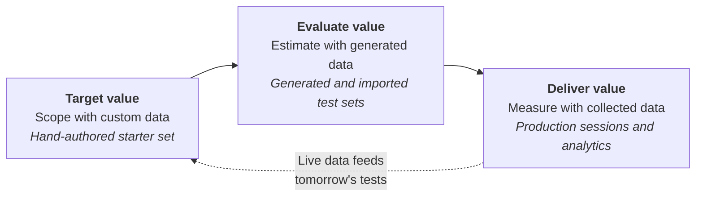
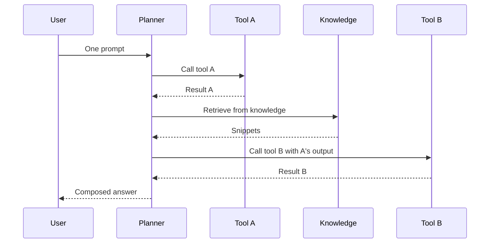

We don't just build agents. We **evaluate** them.

That's not a slogan, it's the single biggest shift I've seen separate the projects that ship from the ones that stall. The teams who treat evaluations as the *last* step are the teams I get pulled into as an escalation. The teams who treat evaluations as the *design contract* are the teams that go live without me.

Here's the question I get on every escalation call: *"Why isn't my agent at 100% yet?"*

And here's the answer most teams don't want to hear at first: **because it's not supposed to be**, and the fact that you can't tell whether 78% is a triumph or a disaster is the actual problem you came to me with. Generative agents are statistical systems. The right conversation isn't *"are we at 100%?"*, it's *"are we delivering the value we said V1 would deliver, are guardrails holding, and are users getting what we expected?"*

This post is a tour of the Copilot Studio **evaluation and analytics suite** through the lens of three questions every project has to answer: scoping, readiness, and value in production. I want to show how the suite hangs together end to end, what's in there that you might have missed, and the mental shifts that change how you run an agent project. There's a lot here, but stay with me, because most of these features were added precisely because customers kept hitting the same walls, and I want to make sure you don't.

> This post is a practitioner's companion to Microsoft Learn, not a replacement. For the canonical reference start with the [Evaluation overview](https://learn.microsoft.com/en-us/microsoft-copilot-studio/guidance/evaluation-overview) and the [iterative evaluation framework](https://learn.microsoft.com/en-us/microsoft-copilot-studio/guidance/evaluation-iterative-framework). What's *here* is the connective tissue, the practical seams, and the ah-ha moments I keep watching land in customer rooms.
{: .prompt-info }

## The three questions, the three stages, the same loop

Every Copilot Studio project I've worked on has the same three pain points, and they show up in the same order:

| Stage | The question makers ask | The pain it answers |
|---|---|---|
| **Target value** | *What does V1 deliver, and how do I know I'm done adding features?* | Scope creep |
| **Evaluate value** | *Is V1 ready to deploy, and at what bar?* | Readiness, expectations |
| **Deliver value** | *Are my customers getting the value I expected?* | Drift, regressions, ROI |

The good news is the suite was designed around exactly this progression. Each stage uses different test data, different graders, and different parts of the product, and they all feed into each other:

That dotted return line matters. The loop isn't one-shot. Once production data is flowing, it becomes the most valuable test data you'll ever have, and it goes right back into your test sets to harden the next release. The rest of this post walks the loop.

## Stage 1 — Target value: tests are your scope contract

When you start a Copilot Studio project, the most valuable artifact you can produce is not a topic flow diagram or a knowledge-source list. It's a **starter test set**, written *jointly* by the business and the maker, that captures the user stories the agent has to nail. Each test case is a value statement: "If a user asks *this*, the agent delivering *that* is value."

That set *is* your acceptance criteria for V1. It's small on purpose. It's hand-authored on purpose. And it's the artifact you point at when someone asks "what does V1 actually do?". It's the scoreboard everyone agrees to look at.

The unblock is enormous. Scope creep stops, because anything that isn't in the test set isn't in V1. "Is it ready yet?" gets a numeric answer. Stakeholders stop running shadow tests, because they helped write the tests that exist.

> **Heads up: dev environments don't collect analytics data.** During design and early build, you can't "fetch real conversations from production" because there is no production yet. Your starter set has to be **manually authored**, **generated** from your agent's design, or **imported** from another source. The "real collected data" loop in Stage 3 only starts producing value once you have real users.
{: .prompt-warning }

### You don't have to write expected answers for every row

This is the misconception I hear most often: that building a starter set means hand-crafting the prompt *and* hand-writing the perfect expected answer for every case. That feels heavy, and it's the number-one reason teams postpone evaluation. It also isn't true.

For a large portion of your starter surface, you can skip the expected answer entirely and let an **AI grader** do the work. The **General quality** grader uses an LLM to assess relevance, groundedness, and completeness without needing a reference answer from you. **Custom rubrics** let you describe a business-specific check in plain language ("Does the response cite a policy section?", "Does the response avoid mentioning competitor products?") and the grader scores against that.

Reserve the hand-written expected answers for your highest-criticality cases. That's where the next ah-ha lives.

> **Ah-ha:** Once you write down an expected answer, you unlock **the whole grader catalogue** on that one row.
> {: .prompt-tip }

When you have an expected response, you can stack two complementary grader families on the same test case:

- **Deterministic graders** — *Exact match*, *Keyword match*, *Capabilities match* (did the agent call the right tool, or chain the right tools?). Fast, cheap, high-confidence. They tell you the *path* was correct.
- **AI graders** — *General quality*, *Compare meaning*, *Custom rubric*. They tell you the *answer* was good.

Stack both kinds on the same row. The deterministic ones catch regressions in *what the agent did*. The AI ones catch regressions in *how it answered*. Same test case, two planes of confidence, no extra authoring. That's the real reason expected responses are worth writing for your Must-Pass cases: not because the platform demands them, but because they unlock more of the suite.

For the [full grader reference](https://learn.microsoft.com/en-us/microsoft-copilot-studio/analytics-agent-evaluation-overview), see the docs. The shorthand:

| Grader | Use when | Expected answer? |
|---|---|---|
| General quality | Default for broad coverage; relevance, groundedness, completeness | No |
| Compare meaning | Knowledge answers where you know what the right answer should say | Yes |
| Exact match | Deterministic outputs (action names, structured fields) | Yes |
| Keyword match | Guardrails (must / must-not contain phrases) | No |
| Capabilities match | Tool chain validation: did the planner call the right action(s)? | Yes (capabilities) |
| Custom rubric | Business-specific criteria (tone, format, citations, refusals) | No (rubric prompt) |

### Save your test-pane chats as test cases

One more accelerator most teams miss. When you're running through scenarios in **Test your agent** to check behavior, those conversations don't have to be throwaway. Copilot Studio lets you save the latest test chat directly as a test case in a new or existing test set ([single response](https://learn.microsoft.com/en-us/microsoft-copilot-studio/analytics-agent-evaluation-create), [conversational](https://learn.microsoft.com/en-us/microsoft-copilot-studio/analytics-agent-evaluation-multi-turn)).

The exploratory testing you're already doing is your starter set. The test pane is the front door to your evaluation pipeline, and it's right there in the product.

## A quick deep dive: a single-turn test is doing more work than you think

Before we go to Stage 2, there's a misunderstanding I have to clear up because it changes how you build the rest of your test sets.

Most teams over-rotate on multi-turn conversational testing too early. They assume that because their agent uses generative orchestration with multiple tools and knowledge sources, only a multi-turn test can exercise it properly. **That's not true**, and it's costing them weeks of authoring time.

When a user types one prompt to a generatively-orchestrated agent, the planner can do a *lot* in that single turn:

That entire chain (plan, call, retrieve, call again, compose) happens **in one turn**. A single-turn test that validates the final response is implicitly testing every step in that chain. You don't need a multi-turn test to test multi-step logic.

This is also where stacking graders shines. On the *same* one-row test:

- **Capabilities match** verifies the *path* (right tool A, right tool B, right order).
- **Compare meaning** or **General quality** verifies the *answer*.
- A **Custom rubric** verifies the *shape* (table, citation, refusal language, whatever your business needs).

One row. Three planes. Whole chain validated.

Multi-turn earns its place when state genuinely accumulates across turns: clarification, escalation, context carry-over, multi-step transactions. For *most* of your coverage, single-turn is the right tool, and it's much cheaper to author. If your single-turn tests are shaky, multi-turn just amplifies the noise.

## Stage 2 — Evaluate value: scaling from "is it real?" to "is it ready?"

A starter set of five or ten cases is enough to align stakeholders. It is **not** enough to confirm V1 will hold up at scale. For that, you need volume: enough cases to stress-test coverage and agree on realistic pass thresholds.

Two features give you that volume without weeks of authoring:

- **Built-in generation** — Copilot Studio reads your agent's topics, tools, knowledge, and instructions, and generates a much larger test set against that surface. It gives you a first estimate of the agent's coverage across its full scope.
- **CSV import** — when you need cases the platform can't infer (regulatory phrasings, regional dialects, edge cases from a domain expert), there's a CSV template you fill in offline and import.

Generated test sets are an accelerator, but they're also something else.

> **Fringe benefit of generated tests: they find the questions you didn't think to ask.**
>
> When the platform generates a test from your agent's design, it sometimes produces a prompt you'd never have written yourself. The agent's response to that prompt, even when it's a "Pass", can reveal an assumption you wrote into your instructions without realizing it.
>
> I recently had a tool that retrieves economic data over a date range. A generated test prompted the agent for a chart, and the agent responded by **asking the user for a start date and end date**. Pass on quality (the agent didn't hallucinate, it asked a sensible clarifying question). Fail on UX (the user wanted a chart, not an interrogation). The test wasn't really telling me my answer was wrong. It was telling me *my instructions had no default*. One line added to the tool description ("If a date range is missing, choose this year so far") and the next run was clean.
>
> The generated prompt did the work my imagination didn't.
{: .prompt-tip }

### Three expectation tiers

Now think about what that volume is *for*. Not every test should pass at 100%. That's the most counter-intuitive thing about evaluating generative agents, and the source of most stakeholder escalations. The trick is to segregate cases by criticality up front and let the use case dictate the bar.

| Tier | What it tests | Effort | Threshold | Default graders |
|---|---|---|---|---|
| **Must-Pass** | Core business outcomes, transactions, regulated answers, refusals | Highest | Near 100% | Compare meaning + Capabilities match |
| **Broader Use Cases** | Recommendations, decision support, research, persona behavior | Reasonable | What gets the user unblocked | General quality + Custom rubric |
| **Guardrail** | Off-topic, sensitive, prohibited | Focused | Inverted, near 0% match | Keyword match |

The conversation that this tier breakdown unlocks with stakeholders is the one that *prevents* escalation. When stakeholders see this framing for the first time, the room goes quiet, because they've been holding broader use cases to a Must-Pass standard and they've never written a guardrail test in their life. Set the right bar on the right use case and you avoid the argument later.

The Broader Use Cases tier is where I see the most stakeholder pushback, so it's worth being explicit. Agents are not single-purpose tools. They have a persona, a goal, and a set of tools and knowledge they reason over to fulfill that goal. A 50–60% match rate on a *"which credit card should I pick?"* or *"which travel package fits my criteria?"* use case can be a perfectly good V1, because the agent's real job is to move the conversation forward, surface a reasonable shortlist, and get the customer one step closer to a decision. **Even partial coverage is real value being enabled**, because users can phrase their question in dozens of ways and your agent serves a meaningful slice of them on day one. V1 ships and starts delivering. V2 layers in code interpreter, better retrieval, or a smarter tool to push the rate higher. That's a deliberate roadmap call, not a quality miss.

That leniency does **not** apply to terms of use, regulated content, refusals, or transactions. Those go in Must-Pass and stay there.

### Working set vs blind set — the cheapest safeguard you'll ever add

Once you have your generated volume, split it in two.

- The **working set** is what the maker tunes against. They look at it. They iterate. They make the agent better by knowing what people are asking for.
- The **blind set** is the same kind of cases, never seen during tuning. You only run it when the maker thinks they're done.

> **Ah-ha:** If your working set passes at 92% and your blind set passes at 64%, you didn't build a better agent. You **overfit** to the working set. Tuning bias is the silent killer of agent quality, and the working/blind split is the cheapest safeguard against it. Costs nothing to add. Catches everything.
{: .prompt-tip }

One caveat for blind sets you build from real conversations: when you import production sessions into a test set, the **expected response has to be filled in by a human** before you run a comparison grader. Real conversations come with the agent's *old* answer attached, not the right one. Skip that step and you're grading the agent against itself. (For quality and custom graders, you can run without an expected answer at all, so choose your grader to match what you have.)

### Three categories of tweaks: now your regression signal has a cause

Before you run again, name the change you just made:

- **AI tweaks** — names, descriptions, instructions, prompts, glossaries, models. They shift the orchestrator's reasoning. Hard to predict, easy to ripple. A model version upgrade lives here.
- **Deterministic tweaks** — config, interception logic, conditional blocks, global variables. Predictable, surgical, traceable.
- **Functional tweaks** — knowledge sources, tools, topics. New surface area, new failure modes.

Tag every change as one of these three before you ship. Re-run the test set. Now your regression signal has a *cause*, not just a number. The paradox is real: the more deterministic guardrails you bolt on, the more you interrupt the orchestrator's reasoning, and the more latency you add. Naming the tweak forces the trade-off into the open.

### A worked example: building and testing one tool

Let me make this concrete. Same generated-test story from earlier, with the screenshots.

I had a Eurozone economic data agent with a tool that retrieves data and generates trend charts. I wanted two things from every successful response: the data **content** had to be correct, and the **format** had to be useful (markdown headers, a table, at least one image). One row, two graders.

The first grader on the test set was **General quality**: standard relevance and groundedness. The second was a **Custom rubric** I configured for UX:

{: .shadow w="600" }
_The Configure classification panel for a custom UX rubric. Each label is a Pass/Fail criterion the LLM grader checks against._

When I ran the set, several rows looked like this:

{: .shadow w="700" }
_Pass on quality. Fail on UX. The agent asked the user for a date range instead of producing the chart._

{: .shadow w="700" }
_Same pattern on a different prompt. The signal isn't in the quality grader. It's in the rubric._

Two graders on the same row showed me what one grader couldn't: the agent was technically responding well, but its *response shape* was wrong for the user's intent. One instruction tweak ("If a date range is missing, choose this year so far"), re-run, and both graders went green.

This is the inner loop. One tool, multiple graders, iterate until coverage and UX are both clean. Then move on to the next tool. Rinse, repeat.

## Stage 3 — Deliver value: now the loop closes

After go-live, your agent is having conversations you couldn't have predicted. That is the most valuable test data you will ever have, and the platform now lets you pull it directly from analytics into evaluations.

You filter sessions in analytics — by zone, by topic, by outcome — and **fetch them straight into a test set**. The expected response still has to be filled in by a human (the live transcript is the conversation, not the right answer), but the prompts are real and the distribution matches what your users are actually asking. That's how you move from *estimating* value to *measuring* it.

This is also where evaluations earn their keep as a **runtime safety net**. Three things will keep changing under your agent whether you like it or not:

- **The platform.** Model upgrades, planner improvements, new generative features land continuously. Your evals tell you whether the change helped or hurt *your* scenarios, not the average customer's.
- **The agent design.** Every instruction tweak, new tool, or new knowledge source is a change to the system. Re-run your test sets before you publish.
- **Your users.** Production conversations are the only data that reflects how your users actually phrase things. Pull them back in so tomorrow's regression set reflects today's reality.

### The "irrelevant" alert that's secretly useful

Each environment exposes an overall agent performance number with an alert you can configure. On its own, that number means almost nothing. What does "78% overall" tell you when you have three tiers with three different bars and a Guardrail set that's *supposed* to score zero?

That's the wrong way to read it.

> **Ah-ha:** Once you've calibrated what "good" looks like for *this* agent in *this* environment, that single number (whatever it is) becomes a **baseline marker**. From that point forward, what matters is the **delta**. A sharp move from baseline is the alert. The number doesn't tell you the answer; it tells you to go look.
{: .prompt-tip }

A drop from baseline is your signal to dig into transcripts and re-run the affected test sets to see what actually regressed. It's the cheapest possible drift detector, and it's already on by default. You just have to know what it's *for*.

{: .shadow w="700" }
_The environment performance alert. Useless as an absolute value. Gold as a baseline-delta signal._

### The custom rubric you wrote in Stage 2 is the custom AI metric you run in Stage 3

This is the moment the loop genuinely closes, and it's the feature most makers haven't seen yet.

The same kind of LLM-judged custom rubric you used to grade test runs has a twin in the analytics dashboard: a **custom AI metric** that runs the same kind of judgment against real production conversations. The maker experience is striking. You don't write the prompt. You write **the question you want answered** and the **categories** the answer should fall into:

{: .shadow w="700" }
_You describe the metric in one sentence and define the result categories. That's the entire maker input._

The suite then **generates the full classifier prompt** for you (role, classification criteria, indicators per category, the lot), runs it across your transcripts, plots a chart on your dashboard, and lets you drill into the conversations behind each bar:

{: .shadow w="700" }
_You wrote one sentence. The suite wrote the LLM judge._

Tie this back to the GDP example. The very same *"is the response in the format the user actually wanted?"* concern I was checking for in Stage 2 with a custom rubric is what I'm now tracking *live* in Stage 3 as a custom analytics metric. **Same question, two surfaces, one continuous loop.** Pre-deploy, it gates V1. Post-deploy, it tells me what real users are asking for and getting.

### ROI: the value you targeted, now measured in time and money

When you've baselined your tiers and the agent is running in production, the suite lets you attach **time and money saved per successful tool invocation**:

{: .shadow w="700" }
_For each tool, you tell the suite what one successful invocation is worth. The dashboard multiplies it against the evaluated successful runs in production._

The value you *targeted* in Stage 1 (a hand-authored starter set), *estimated* in Stage 2 (generated volume + tier thresholds), is now *measured* in Stage 3 (real conversations + ROI). That's what you bring to the business review. Full reference in [Analyze time and cost savings](https://learn.microsoft.com/en-us/microsoft-copilot-studio/analytics-cost-savings).

### Automate it once you trust it

Once your test sets are stable and your tiers are dialed in, the next move is to run them automatically on every change. The [Evaluation REST API](https://learn.microsoft.com/en-us/microsoft-copilot-studio/analytics-agent-evaluation-rest-api) and the [Microsoft Copilot Studio connector](https://learn.microsoft.com/en-us/microsoft-copilot-studio/analytics-agent-evaluation-automate-tools) expose everything the Evaluate tab does, programmatically.

Adi Leibowitz already wrote the deep dive on the CI/CD side. Read [Quality Gates for Copilot Studio: Automated Evaluations in Azure DevOps]() for the pattern that blocks PR merges when a Must-Pass set drops below threshold, and [Closing the Loop: Automated Agent Improvement with Publish and Test]() for the AI-authored side of the loop where an AI coding agent edits instructions, publishes, and re-evaluates on its own.

> **One operational gotcha — DLP.** The Microsoft Copilot Studio connector's evaluation actions must be permitted by your environment's Data Loss Prevention policy before automation will run. If your evaluation runs are failing with policy errors, that's the cause. Check the [DLP guidance](https://learn.microsoft.com/en-us/microsoft-copilot-studio/admin-data-loss-prevention) and flag it with your tenant admin early.
{: .prompt-warning }

## Monday morning checklist

If you take one thing from this post, take this. The 30-minute version:

1. Open your agent. Go to **Evaluations**. Create a test set named after one user story, with the tier as a suffix (`Wellness Lookup — Must-Pass`).
2. Run a couple of prompts in the **Test your agent** panel and convert the good ones to test cases. Instant starter set.
3. Add three to five more by hand: two Must-Pass with expected answers, one Broader Use Case (no expected answer needed), one Guardrail.
4. Stack graders on each row. Must-Pass: **Compare meaning** + **Capabilities match**. Broader: **General quality**. Guardrail: **Keyword match**. Add a **Custom rubric** wherever you have a business-specific check.
5. Set thresholds per tier. Run. Read the **per-tier** pass rate, not the overall.
6. Make exactly one categorized tweak — AI, deterministic, or functional. Re-run. See what fixed and what regressed.
7. When you're ready to scale: generate volume, split into tune/blind, and start the build-evaluate-build cycle. Wire in [the API]() when manual is no longer enough.

That's the whole loop. The hard part is starting it, and the suite has quietly removed most of the excuses.

We don't just build agents. We evaluate them. The teams who internalise that are the teams who ship, and the suite is set up to take you all the way from "what is V1?" to "here's what V1 delivered last quarter, in hours and dollars."

What's the test you wish you'd written before V1 shipped? Drop it in the comments — I'm collecting patterns for a follow-up.
