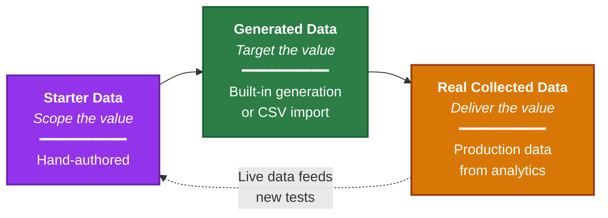
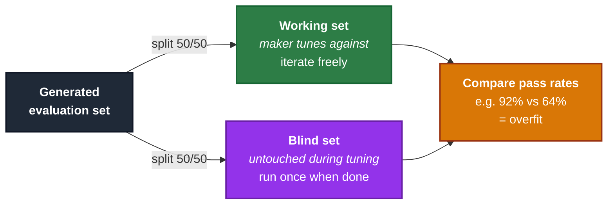
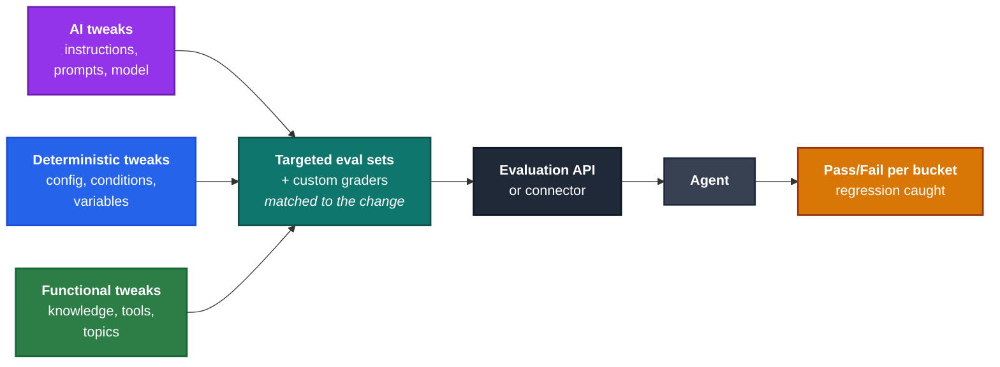
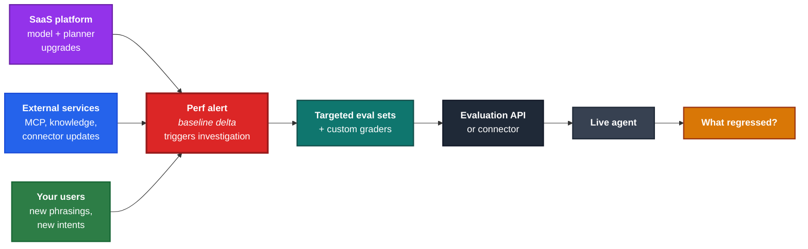
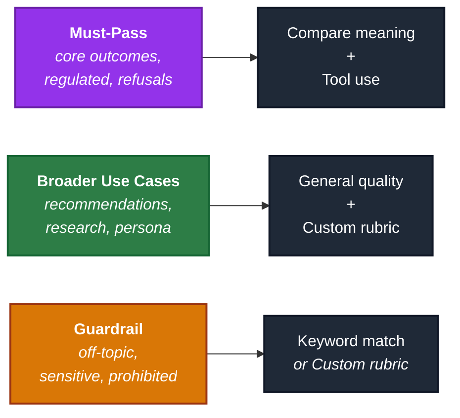

If you've ever shipped a Copilot Studio agent and then had to defend its quality to a stakeholder, you've probably hit the same wall: *"why isn't it at 100% yet?"* It feels like a fair question, but it isn't. Generative agents are statistical systems that reason over a wide surface of tools, knowledge, instructions and user phrasings, so a single overall score never tells you the whole story. If you can't quickly answer whether 78% is a triumph or a disaster, *that* is the real problem worth solving, not the score itself.

Instead of treating evaluations as a phase between "build" and "ship," start running them across the whole lifecycle at three stages:

- **Scope the value:** *what high-value use cases is V1 going to cover, and how do you design the agent to deliver them?* Evaluations here are a **scoping unblocker**. A starter test set written jointly with the business names the use cases that count, sorts them into Must-Pass, Broader, and Guardrail buckets, and the agent is designed to cover them. "What is V1?" becomes an agreement everyone can point at, and scope creep stops, because anything that isn't in the test set isn't in V1.
- **Target the value:** *is V1 ready to deploy, and at what bar?* Stage 1 told you which bucket each case lives in. This is where you **focus the expected value**: run enough cases to learn from, then tune the agent through a series of deliberate tradeoffs (AI grader vs deterministic guardrail, latency vs accuracy, coverage vs precision). The performance range V1 ships at becomes an intentional decision the room signed up for.
- **Deliver the value:** *are your users getting what you expected once it's live?* The same test sets, now run against real conversations, are how you **measure** the value V1 promised.

The Copilot Studio **evaluation and analytics suite** has features lined up for each of these jobs, and the parts that surprise people most are the places features connect across stages. The rest of this post walks the loop end to end.

> This post is a practitioner's companion to Microsoft Learn. For the canonical reference, start with the [Evaluation overview](https://learn.microsoft.com/en-us/microsoft-copilot-studio/guidance/evaluation-overview) and the [iterative evaluation framework](https://learn.microsoft.com/en-us/microsoft-copilot-studio/guidance/evaluation-iterative-framework).
{: .prompt-info }

## The three questions, the three stages, the same loop

Those three lifecycle stages map to the three pain points most Copilot Studio projects hit, in the same order every time:

| Stage | The question makers ask | The pain it answers | Features that put the right data in your hands |
|---|---|---|---|
| **Scope the value** | *What high-value use cases will V1 cover, and how do I design the agent to deliver them?* | Scope creep | Hand-authored test set, save test-pane chats as test cases, AI graders so you can skip expected answers |
| **Target the value** | *Is V1 ready to deploy, and at what bar?* | Tuning, expectations, readiness | Built-in test generation from agent design, CSV import, custom rubrics, working/blind split |
| **Deliver the value** | *Are my users getting the value I expected?* | Drift, regressions, ROI | Fetch sessions from analytics into evals, custom AI metrics on the dashboard, environment performance alert, per-tool ROI |

The product was designed with this exact progression in mind. Each stage has features that put **the right kind of evaluation data at the right time**, so you're never blocked waiting for data you don't have yet:

That dotted return line matters. Once production data is flowing, it becomes the most valuable test data you'll ever have, and it goes right back into your starter set to harden the next release.

## Stage 1: Scope the value, agree on V1 and build the agent

#### The starter set
When you start a Copilot Studio project, the most valuable artifact you can produce is not a topic flow diagram or a knowledge-source list. It's a **starter test set**, written *jointly* by the business and the maker, that captures the high-value user stories the agent has to nail. Each test case is a value statement: "If a user asks *this*, the agent delivering *that* is value."

That set does two jobs at once. It's your **acceptance contract for V1**: the scoreboard everyone agrees to look at when someone asks "what does V1 actually do?". And it's a **design brief** for the agent: every case in the set is a use case the agent's topics, tools, knowledge, and instructions need to cover. You aren't designing the agent then writing tests for it; you're agreeing on the use cases that count, and designing to cover them.

**Your agent is a persona with a role, not a sum of its tools.** What makes V1 V1 is the *scope* over those tools, knowledge, and instructions: the slice of user requests the agent has agreed to serve. A starter test set captures that scope at the level the agent itself reasons at, which is exactly why it works as both a design brief and an acceptance contract.

The payoff is huge. Scope creep stops, because any use case that isn't in the test set isn't in V1. "Is it ready yet?" gets a definitive answer.

#### Bucket the use cases as you scope them

While you're agreeing on what V1 covers, sort each case into one of three buckets. The bucket sets up everything that follows: how much effort the case deserves, what bar it should pass at, and which graders make sense for it.

| Bucket | What it tests | Effort | Threshold | Default graders |
|---|---|---|---|---|
| **Must-Pass** | Core business outcomes, transactions, regulated answers, refusals | Highest | Near 100% | Compare meaning + Tool use |
| **Broader Use Cases** | Recommendations, decision support, research, persona behavior | Reasonable | What gets the user unblocked | General quality + Custom rubric |
| **Guardrail** | Off-topic, sensitive, prohibited | Focused | Inverted, near 0% match | Keyword match |

Most stakeholder disagreements about "agent quality" are really disagreements about which use case lives in which bucket. Once Must-Pass and Broader Use Cases are visibly different sets with different bars, the argument about *"why isn't it 100%?"* resolves itself.

Broader Use Cases is the bucket that surprises people the most. Agents are not single-purpose tools; they have a persona, a goal, and a set of tools and knowledge they reason over to fulfill that goal. A 50–60% match rate on *"which credit card should I pick?"* or *"which travel package fits my criteria?"* can be a perfectly good V1, because the agent's real job is to move the conversation forward, surface a reasonable shortlist, and get the user one step closer to a decision. **Even partial coverage is real value being enabled.** V1 ships and starts delivering; V2 layers in code interpreter, better retrieval, or a smarter tool to push the rate higher.

That leniency does **not** apply to terms of use, regulated content, refusals, or transactions. Those go in Must-Pass and stay there. 

> **Heads up: dev environments don't collect analytics data.** During design, your starter set has to be either **manually authored**, **generated** from the agent's design, or **imported** from another source. 
>
> A shortcut for test data: Import you latest test chat data into evaluations in a new or existing test set ([single response](https://learn.microsoft.com/en-us/microsoft-copilot-studio/analytics-agent-evaluation-create#create-a-new-test-set), or  [conversational](https://learn.microsoft.com/en-us/microsoft-copilot-studio/analytics-agent-evaluation-multi-turn)). The exploratory testing you're already doing *is* your starter set.
{: .prompt-warning }

#### Do I have to write the expected value for each case?

The biggest misconception about starter sets is that you have to hand-craft the prompt *and* hand-write the perfect expected answer for every case. That feels heavy, and it's the number-one reason teams postpone evaluation.

> **Pro tip:** for a large portion of your starter surface, you can skip the expected answer entirely and let an **AI grader** ([General quality](https://learn.microsoft.com/en-us/microsoft-copilot-studio/analytics-agent-evaluation-overview#general-quality) or a [Custom rubric](https://learn.microsoft.com/en-us/microsoft-copilot-studio/analytics-agent-evaluation-overview#custom)) do the work. Reserve hand-written expected answers for your Must-Pass bucket, where they unlock the deterministic graders.
{: .prompt-tip }

## Stage 2: Target the value, intentional tradeoffs

Stage 1 gave you a starter set sorted into buckets. Stage 2 turns it into a tuned V1 you can stand behind. There are three moves:

1. **Get enough volume** that the results actually teach you something.
2. **Learn from those results.** Where is the agent failing, and is it a defect or a design choice you hadn't made yet?
3. **Make deliberate tradeoffs.** Every tuning fix has a cost; pick the one whose tradeoff you can defend.

The performance range V1 eventually ships at is an outcome of those three. It's something you *choose*, with the room in agreement, not something you discover at the end.

### Get volume

A starter set of 5 or 10 cases is enough to align stakeholders and name buckets. It is **not** enough to confirm V1 holds up at scale. Two features get you there without weeks of authoring:

- **Built-in generation**: Copilot Studio reads your agent's topics, tools, knowledge, and instructions, and generates a much larger test set against that surface. It gives you a first estimate of coverage across the agent's full scope.
- **CSV import**: when you need cases the platform can't infer (regulatory phrasings, regional dialects, domain-expert edge cases), there's a CSV template you fill in offline and import. You can use an external LLM to generate these according to your test zone.

Generated test sets are an accelerator, but they have a less-talked-about side effect.

> **Pro tip: generated tests find the questions you didn't think to ask.** When the platform generates a test from your agent's design, it sometimes produces a prompt you'd never have written yourself. The agent's response (even a Pass) can reveal an assumption you wrote into your instructions without realizing it. The worked example below shows exactly how that lands.
{: .prompt-tip }

### A worked example: targeting one tool

My Eurozone economic data agent retrieves data and produces trend charts, and I wanted to evaluate the  quality and format of answers, so I configured 2 graders on a generated dataset.

The first grader is **General quality**: standard relevance and groundedness. The second is a **Custom rubric** configured for UX evaluation. 

{: .shadow w="600" }
_The Configure classification panel for a custom UX rubric. Each label is a Pass/Fail criterion the LLM grader checks against._

When the set runs, several rows come back like this:

{: .shadow w="700" }
_Pass on quality. Fail on UX. The agent asked for a date range instead of producing the chart. Several other rows show the same pattern: the agent is technically responding well, but the response shape is wrong for the user's intent. The test generation discovered that my design was missing a default date range._

### Tuning is a series of intentional tradeoffs

Not every fix is as cheap as one line in a tool description. You may need to make tradeoffs, but these tradeoffs will be quantifiable with your evaluations. For Example:

- **AI vs deterministic guardrail.** An AI instruction can moderate phrasings you didn't anticipate, but calling a coded guardrail makes it bulletproof despite performance tradeoffs.
- **Latency vs accuracy.** A stronger model raises pass rates yet increases response time and cost. 

When the stakeholders can name the tradeoff, the conversation about *"why is the bar where it is?"* becomes a conversation about *"is this the tradeoff we want?"*. That's a much better conversation.

### Working set vs blind set

Once you have your generated large volume evaluation sets ready, the **best practice** is to split each one in two. 

- The **working set** is what the maker tunes against. Iterating on it makes the agent better.
- The **blind set** is the same kind of cases, never seen during tuning. You only run it when the maker thinks they're done.

If the working set passes at 92% and the blind set passes at 64%, you didn't build a better agent, you **overfit** to the working set, and this type of discrepancy is essential to catch.

### Types of agent changes by a maker

When something starts behaving differently, the first question is *what kind of change caused it?*

- **AI tweaks**: names, descriptions, instructions, prompts, glossaries, model changes.. 
- **Deterministic tweaks**: config, interception logic, conditional blocks, global variables..
- **Functional tweaks**: knowledge sources, tools (APIs, MCPs, Agent Flows, Connectors, Agents, Topics..)

Tag every change as one of these three before you ship. Re-run the test set. Now your regression signal has a *cause* and the tradeoff conversation from the section above has a vocabulary.

## Stage 3: Deliver the value and measure it. 

After go-live, your agent is having conversations you couldn't have predicted. That is the most valuable test data and the platform now lets you pull it directly from analytics into evaluations.

You filter sessions in analytics by zone, by topic, by outcome, and **fetch them straight into a test set** ([Create a test set based on a theme](https://learn.microsoft.com/en-us/microsoft-copilot-studio/analytics-agent-evaluation-create#create-a-test-set-based-on-a-theme)). The expected response still has to be filled in by a human (the live transcript is the conversation, not the right answer), but the prompts are real and the distribution matches what your users are actually asking. That's how you move from *targeting* the value to *delivering and measuring* it.

This is also where evaluations earn their keep as a **runtime safety net**.

### Types of changes outside the maker's control:

- **The SaaS platform.** Model upgrades, planner improvements, new generative features land continuously. 
- **The agent design.** MCP tool updates and  knowledge source updates happen at their own pace.
- **Your users.** Production conversations reflect how your users evolve and actually phrase things. Collect production data for evaluations as needed based on analytics drilldowns. 

### The "irrelevant" alert that's secretly useful

Each environment exposes an overall agent performance number with an alert you can configure. On its own, that number means almost nothing. What does "78% overall" tell you when you have three buckets with three different bars and a Guardrail set that's *supposed* to score zero?

> **Pro tip:** Once you've calibrated what "good" looks like for *this* agent in *this* environment, that single global performance value (whatever it is) becomes a **baseline marker**. From that point forward, what matters is not the actual value, but the **delta** from the baseline. 
{: .prompt-tip }

A drop from baseline is your signal to dig into transcripts and re-run the affected test sets to see what actually regressed. It's the simplest possible drift detector.

{: .shadow w="700" }
_The environment performance alert. Useless as an absolute value. Gold as a baseline-delta signal._

### There is also a custom classifier feature in analytics

The same kind of LLM-judged custom rubric used to grade test runs has a twin in the analytics dashboard: a **custom AI classifier** that runs the same kind of judgment against real production conversations. The setup is genuinely simple. You don't write the prompt. You write **the question you want answered** and the **categories** the answer should fall into:

{: .shadow w="700" }
_You describe the metric in one sentence and define the result categories. That's the entire maker input._

The suite then **generates the full classifier prompt** for you (role, classification criteria, indicators per category, the lot), runs it across your transcripts, plots a chart on your dashboard, and lets you drill into the conversations behind each segment.

{: .shadow w="700" }
_You wrote one sentence. The suite wrote the LLM judge._

Now we can tie this back to the Eurozone agent from Stage 2. The very same *"is the response in the format the user actually wanted?"* concern that gated V1 with a custom rubric is what's tracked *live* in Stage 3 as a custom analytics metric for a  **continuous feedback loop.** 

### ROI: the value you targeted, now measured in time and money

When you've baselined your buckets and the agent is running in production, the suite lets you attach **time and money saved per each type of successful tool invocation**:

{: .shadow w="700" }
_For each tool, you tell the suite what one successful invocation is worth. The dashboard multiplies it against the evaluated successful runs in production._

The value you *scoped* in Stage 1 (a hand-authored starter set, sorted into buckets), *targeted* in Stage 2 (volume, deliberate tradeoffs, working/blind split), is now *delivered and measured* in Stage 3 (real conversations + ROI). That's what you bring to the business review. Full reference in [Analyze time and cost savings](https://learn.microsoft.com/en-us/microsoft-copilot-studio/analytics-cost-savings).

## Evaluation features worth knowing about
{: #features-worth-knowing-about }

### DLP and the evaluation actions
{: #dlp-and-the-evaluation-actions }

This one is simple but also a blocker if you skip it. Agent evaluation, whether triggered manually from the Evaluations panel or programmatically through the API or connector, calls the **Microsoft Copilot Studio** connector under the hood. If your tenant's Data Loss Prevention policy blocks the connector's evaluation actions, runs fail with a policy error and the in-product UI gives you no hint about why.

Confirm with your admin that the actions below are enabled in a permitted data group ([DLP guidance](https://learn.microsoft.com/en-us/microsoft-copilot-studio/admin-data-loss-prevention)):

{: .shadow w="600" }
_The five evaluation actions: Evaluate Agent, Get Agent Test Run Details, Get Agent Test Runs, Get Agent Test Set Details, and Get Agent Test Sets._

### Stack graders to check path *and* answer in one row

Adding Expected answers to an evaluation set unlocks the whole grader catalogue. Now, you can stack a *deterministic* grader (Exact match, Keyword match, Tool use) with an *AI* grader (Compare meaning, General quality, Custom rubric). 

The deterministic graders catch regressions in *what the agent did*; the AI ones catch regressions in *how it answered*. Same test case, two planes of confidence. Pick a grader (or two) per row based on what the test is actually trying to confirm.

| Grader | What it confirms | Use when | Expected answer? |
|---|---|---|---|
| [General quality](https://learn.microsoft.com/en-us/microsoft-copilot-studio/analytics-agent-evaluation-overview#general-quality) | Relevance, groundedness, completeness | Default for broad coverage with no reference answer | No |
| [Compare meaning](https://learn.microsoft.com/en-us/microsoft-copilot-studio/analytics-agent-evaluation-overview#compare-meaning) | Semantic similarity to your expected answer | Knowledge answers where you know what the right answer should say | Yes |
| [Text similarity](https://learn.microsoft.com/en-us/microsoft-copilot-studio/analytics-agent-evaluation-overview#text-similarity) | Wording-and-meaning closeness via cosine similarity | Phrasing-tolerant exactness | Yes |
| [Exact match](https://learn.microsoft.com/en-us/microsoft-copilot-studio/analytics-agent-evaluation-overview#exact-match) | Character-for-character identity | Action names, structured fields, fixed phrases | Yes |
| [Keyword match](https://learn.microsoft.com/en-us/microsoft-copilot-studio/analytics-agent-evaluation-overview#keyword-match) | Presence (or absence) of specific phrases | Guardrails, compliance disclaimers | No (keywords) |
| [Tool use](https://learn.microsoft.com/en-us/microsoft-copilot-studio/analytics-agent-evaluation-overview#tool-use) | The right tool(s) or topic(s) were invoked | Tool chain validation, regardless of prose | Yes (capabilities) |
| [Custom rubric](https://learn.microsoft.com/en-us/microsoft-copilot-studio/analytics-agent-evaluation-overview#custom) | Business-specific criteria you describe | Tone, format, citation, refusal language | No (rubric prompt) |

#### A recommended evaluation pairing by bucket

### A single-turn test exercises the whole orchestration chain

Many teams over-rotate on multi-turn conversational testing too early. A single-turn test that grades the final response is implicitly testing every step in that chain. Ex: Plan, execute, retrieve, execute again, all in one turn.

[Multi-turn test sets](https://learn.microsoft.com/en-us/microsoft-copilot-studio/analytics-agent-evaluation-multi-turn) earn their place when the state genuinely accumulates across turns: clarification, escalation, context carry-over, multi-step transactions. For most cases, single-turn is the right tool to start with. 

### Automate it once you trust it

Once your test sets are stable and your buckets are dialed in, the next move is to run them automatically on every change. See:

- [Evaluation REST API](https://learn.microsoft.com/en-us/microsoft-copilot-studio/analytics-agent-evaluation-rest-api)
-  [Microsoft Copilot Studio connector](https://learn.microsoft.com/en-us/microsoft-copilot-studio/analytics-agent-evaluation-automate-tools)
- [Quality Gates for Copilot Studio: Automated Evaluations in Azure DevOps]()
- [Closing the Loop: Automated Agent Improvement with Publish and Test]()

## Key takeaways

- **Tests are the scope contract for V1.** Hand-author them with the business in the room, and "what does V1 do?" stops being a debate.
- **Dev environments don't collect analytics**, so during design and early build you only have manual, generated, or imported data. The live-data loop kicks in later.
- **Expected answers unlock the whole grader catalogue.** Pair a deterministic grader (Tool use, Keyword match, Exact match) with an AI grader (General quality, Compare meaning, Custom rubric) on the same row to validate path *and* answer at once.
- **Generated test sets find questions you didn't think to ask.** Treat unexpected agent responses to generated prompts as a window into the assumptions hiding in your instructions.
- **Bucket your use cases as you scope: Must-Pass, Broader Use Cases, Guardrail.** Most stakeholder disagreements about "agent quality" are really bucket disagreements in disguise.
- **Working set vs blind set is the cheapest safeguard against tuning bias.** Costs nothing. Catches the overfit every time.
- **A single-turn test exercises the whole orchestration chain.** Plan, call, retrieve, call again, compose, all in one row, validated by stacked graders. Save multi-turn for state that genuinely accumulates.
- **The same custom rubric runs in both surfaces.** What gates V1 in evaluations becomes a live custom metric in analytics, plotted on the dashboard with drill-down to the conversations behind each bar.
- **The single-number environment alert is a baseline-delta signal**, not a quality score. It tells you when to look.
- **Per-tool ROI ties the whole loop back to the business.** Time and money saved per successful invocation, multiplied by evaluated successful runs, gives you the number to bring to a quarterly review.
- **Once it's stable, automate it.** The Evaluation REST API and the Copilot Studio connector turn manual runs into PR gates and scheduled flows. See Adi Leibowitz's [Quality Gates post]() for the CI/CD pattern.

Which part of the suite has changed how your team ships? And which test do you wish you'd written before V1 went live? Drop a comment below.
