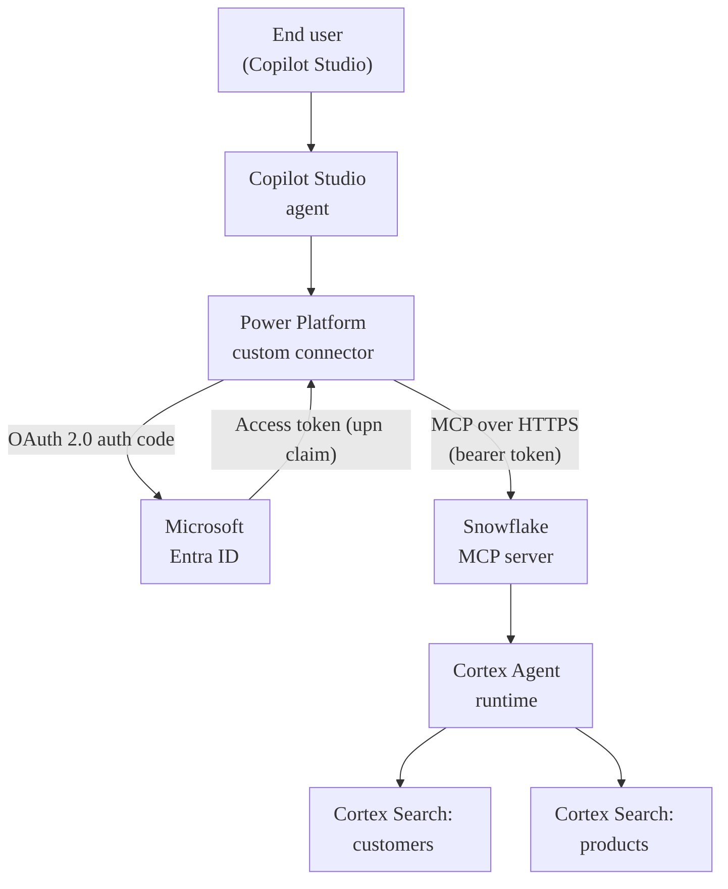

We recently wired a Snowflake-managed MCP server into a Copilot Studio agent end to end. The official docs cover the individual pieces well, but several details only become obvious once we tried to glue them together: manual OAuth is mandatory, there is a redirect-URI ordering trap, the test pane needs a separate end-user connection, and Cortex Agent is a quiet prerequisite that silently kills trial accounts. This post is the walkthrough we wish we had on day one.

> All sample IDs, secrets, hostnames, tenants, and email addresses below are placeholders. Replace every `<PLACEHOLDER>` with your own value.

## What we are building

A Copilot Studio agent that talks to Snowflake through a Snowflake-managed MCP server. Tokens flow through Entra ID using delegated user OAuth, so every query runs as the signed-in user, not as a service principal.



## TL;DR

If you only take five things away from this post, take these:

1. Snowflake-managed MCP always routes through Cortex Agent at runtime. If Cortex is blocked on your account (common on trials), tool discovery works but every call fails.
2. Snowflake does not support OAuth Dynamic Client Registration. Use **Manual** OAuth in Copilot Studio from the start.
3. The connector redirect URI does not exist until after you create the MCP tool. You add it to Azure *after* Copilot Studio generates it, not before.
4. The maker connection and the test-pane (end-user) connection are different things. Both need to succeed.
5. `ALTER USER ... SET DEFAULT_SECONDARY_ROLES = ('ALL')` is the line most blog posts forget. Without it, the `session:role-any` scope cannot bind to a role at runtime.

## Cortex Agent: the silent prerequisite

Snowflake-managed MCP servers always invoke the tool through Cortex Agent at runtime, regardless of whether the underlying tool is a `CORTEX_SEARCH_SERVICE_QUERY`, a `GENERIC` stored procedure, or `SYSTEM_EXECUTE_SQL`. Cortex Agent is the runtime orchestrator for every MCP call.

Two things must be true on your Snowflake account:

- Cortex Agent must be enabled in your Snowflake region.
- Your account must be allowed to call Cortex Agent. Standard 30-day trial accounts have Cortex blocked at the org level. Discovery will succeed, but every invocation fails with `MCP Server tool error: No tool result received calling Cortex Agent`.

If you are on a trial, request Cortex enablement from Snowflake support before continuing, or switch to a paid account. Everything else in this post still works, but the agent will never actually answer.

## Placeholder cheat sheet

The whole walkthrough uses these placeholders. Grab them as you go so you do not have to backtrack.

| Placeholder | Where to find it |
| --- | --- |
| `<TENANT_ID>` | Entra > Overview > Tenant ID |
| `<TENANT_NAME>` | Entra > Overview > Primary domain |
| `<RESOURCE_APP_CLIENT_ID>` | Resource app registration > Overview > Application (client) ID |
| `<CLIENT_APP_CLIENT_ID>` | Client app registration > Overview > Application (client) ID |
| `<CLIENT_SECRET_VALUE>` | Client app > Certificates & secrets (visible only at creation) |
| `<SNOWFLAKE_ACCOUNT_HOST>` | Snowsight > Admin > Accounts (looks like `<accountid>.snowflakecomputing.com`) |
| `<USER_UPN@yourtenant.onmicrosoft.com>` | The end user's Entra UPN |

## Step 1: Create sample data in Snowflake

We need something for the agent to actually query. Open Snowsight, then go to **Projects > Workspaces > New SQL file** and run:

```sql
CREATE DATABASE IF NOT EXISTS PRODUCT_CUSTOMER_DB;
CREATE SCHEMA IF NOT EXISTS PRODUCT_CUSTOMER_DB.STORE_SCHEMA;

CREATE TABLE IF NOT EXISTS PRODUCT_CUSTOMER_DB.STORE_SCHEMA.PRODUCTS (
    PRODUCT_ID INT AUTOINCREMENT PRIMARY KEY,
    PRODUCT_NAME VARCHAR(255) NOT NULL,
    DESCRIPTION VARCHAR(1000),
    CATEGORY VARCHAR(100),
    PRICE DECIMAL(10,2) NOT NULL,
    STOCK_QUANTITY INT DEFAULT 0,
    CREATED_AT TIMESTAMP_NTZ DEFAULT CURRENT_TIMESTAMP(),
    UPDATED_AT TIMESTAMP_NTZ DEFAULT CURRENT_TIMESTAMP()
);

CREATE TABLE IF NOT EXISTS PRODUCT_CUSTOMER_DB.STORE_SCHEMA.CUSTOMERS (
    CUSTOMER_ID INT AUTOINCREMENT PRIMARY KEY,
    FIRST_NAME VARCHAR(100) NOT NULL,
    LAST_NAME VARCHAR(100) NOT NULL,
    EMAIL VARCHAR(255) UNIQUE NOT NULL,
    PHONE VARCHAR(20),
    ADDRESS VARCHAR(500),
    CITY VARCHAR(100),
    STATE VARCHAR(100),
    ZIP_CODE VARCHAR(20),
    CREATED_AT TIMESTAMP_NTZ DEFAULT CURRENT_TIMESTAMP(),
    UPDATED_AT TIMESTAMP_NTZ DEFAULT CURRENT_TIMESTAMP()
);

-- Insert a couple dozen rows into each table here.
```

One small Snowsight quirk worth flagging: the **Run** button sometimes only runs the statement under the cursor. Highlight the whole script before pressing **Cmd/Ctrl+Enter** so all statements run.

A quick sanity check:

```sql
SELECT COUNT(*) AS PRODUCTS FROM PRODUCT_CUSTOMER_DB.STORE_SCHEMA.PRODUCTS;
SELECT COUNT(*) AS CUSTOMERS FROM PRODUCT_CUSTOMER_DB.STORE_SCHEMA.CUSTOMERS;
```


*Two filled tables is all we need before turning on Cortex Search.*

## Step 2: Stand up Cortex Search services and an MCP server

This is where Snowflake does the heavy lifting. We create one Cortex Search Service per searchable table, then wrap both of them in a single MCP server with a tool spec the LLM will read.

```sql
CREATE OR REPLACE CORTEX SEARCH SERVICE PRODUCT_CUSTOMER_DB.STORE_SCHEMA.CUSTOMER_SEARCH
  ON customer_info
  ATTRIBUTES CITY, STATE
  WAREHOUSE = COMPUTE_WH
  TARGET_LAG = '1 hour'
AS (
  SELECT
    CUSTOMER_ID,
    FIRST_NAME || ' ' || LAST_NAME || ' - ' || EMAIL || ' - ' || CITY || ', ' || STATE AS customer_info,
    FIRST_NAME, LAST_NAME, EMAIL, CITY, STATE
  FROM PRODUCT_CUSTOMER_DB.STORE_SCHEMA.CUSTOMERS
);

CREATE OR REPLACE CORTEX SEARCH SERVICE PRODUCT_CUSTOMER_DB.STORE_SCHEMA.PRODUCT_SEARCH
  ON product_info
  ATTRIBUTES CATEGORY
  WAREHOUSE = COMPUTE_WH
  TARGET_LAG = '1 hour'
AS (
  SELECT
    PRODUCT_ID,
    PRODUCT_NAME || ' - ' || CATEGORY AS product_info,
    PRODUCT_NAME, CATEGORY, PRICE, STOCK_QUANTITY
  FROM PRODUCT_CUSTOMER_DB.STORE_SCHEMA.PRODUCTS
);

CREATE OR REPLACE MCP SERVER PRODUCT_CUSTOMER_DB.STORE_SCHEMA.MY_MCP_SERVER
FROM SPECIFICATION $$
  tools:
    - name: "customer_search"
      type: "CORTEX_SEARCH_SERVICE_QUERY"
      identifier: "PRODUCT_CUSTOMER_DB.STORE_SCHEMA.CUSTOMER_SEARCH"
      title: "Customer Search"
      description: "Search customers by name, email, city, or state."
    - name: "product_search"
      type: "CORTEX_SEARCH_SERVICE_QUERY"
      identifier: "PRODUCT_CUSTOMER_DB.STORE_SCHEMA.PRODUCT_SEARCH"
      title: "Product Search"
      description: "Search products by name or category."
$$;

DESCRIBE MCP SERVER PRODUCT_CUSTOMER_DB.STORE_SCHEMA.MY_MCP_SERVER;
```


*The `DESCRIBE` output is our contract with the LLM. The `name` and `description` fields are exactly what the agent's model sees when it decides whether to call a tool, so keep them in snake_case and make the descriptions precise.*

## Step 3: Map a Snowflake user to your Entra identity

We need a role with the right grants and a Snowflake user whose `LOGIN_NAME` matches an Entra UPN. The `EXTERNAL_OAUTH` integration we set up later maps the incoming `upn` claim to that `LOGIN_NAME`, so the two must match exactly (case-insensitive).

```sql
CREATE ROLE IF NOT EXISTS SALESPROFESSIONAL;
GRANT USAGE ON DATABASE PRODUCT_CUSTOMER_DB TO ROLE SALESPROFESSIONAL;
GRANT USAGE ON SCHEMA PRODUCT_CUSTOMER_DB.STORE_SCHEMA TO ROLE SALESPROFESSIONAL;
GRANT USAGE ON CORTEX SEARCH SERVICE PRODUCT_CUSTOMER_DB.STORE_SCHEMA.CUSTOMER_SEARCH TO ROLE SALESPROFESSIONAL;
GRANT USAGE ON CORTEX SEARCH SERVICE PRODUCT_CUSTOMER_DB.STORE_SCHEMA.PRODUCT_SEARCH TO ROLE SALESPROFESSIONAL;
GRANT USAGE ON MCP SERVER PRODUCT_CUSTOMER_DB.STORE_SCHEMA.MY_MCP_SERVER TO ROLE SALESPROFESSIONAL;
GRANT USAGE ON WAREHOUSE COMPUTE_WH TO ROLE SALESPROFESSIONAL;
```


*Six `GRANT USAGE` lines and a warehouse grant are enough for the read-only agent use case.*

Now the delegate user:

```sql
CREATE USER IF NOT EXISTS SNOWSQL_DELEGATE_USER
  LOGIN_NAME = '<USER_UPN@yourtenant.onmicrosoft.com>'
  DISPLAY_NAME = 'SnowSQL Delegated User'
  COMMENT = 'Delegate user for SnowSQL/MCP OAuth-based connectivity';

GRANT ROLE SALESPROFESSIONAL TO USER SNOWSQL_DELEGATE_USER;

-- Optional when the OAuth scope is session:role-any (any-role mode resolves the role via secondary roles below)
ALTER USER SNOWSQL_DELEGATE_USER SET DEFAULT_ROLE       = SALESPROFESSIONAL;
ALTER USER SNOWSQL_DELEGATE_USER SET DEFAULT_WAREHOUSE  = COMPUTE_WH;

-- Required when the OAuth scope is session:role-any
ALTER USER SNOWSQL_DELEGATE_USER SET DEFAULT_SECONDARY_ROLES = ('ALL');

SHOW GRANTS TO USER SNOWSQL_DELEGATE_USER;
SHOW GRANTS TO ROLE SALESPROFESSIONAL;
```


*Creating the delegate user and binding the role in a single Snowsight worksheet.*

The last `ALTER USER` line is the one we kept missing. With the `session:role-any` scope, Snowflake activates roles via secondary-role resolution at session start, and that resolution only works if `DEFAULT_SECONDARY_ROLES` is set to `('ALL')`.


*If the role is not on this list, the OAuth handshake will succeed and the tool call will still fail with "insufficient privileges".*


*Confirm the role itself can see the database, schemas, Cortex Search services, and warehouse before moving on.*

## Step 4: Create the two Entra app registrations

You need **two** app registrations in your Entra tenant. Follow Snowflake's official walkthroughs end to end:

- [Snowflake docs: Create an OAuth client in Microsoft Entra ID](https://docs.snowflake.com/en/user-guide/oauth-azure#create-an-oauth-client-in-microsoft-entra-id)
- [Snowflake docs: Collect Azure AD information for Snowflake](https://docs.snowflake.com/en/user-guide/oauth-azure#collect-azure-ad-information-for-snowflake)

### Resource app: `Snowflake OAuth Resource`

- Under **Expose an API**, set the Application ID URI to `api://<RESOURCE_APP_CLIENT_ID>`.
- Add a delegated scope called `session:role-any`. If you want to lock the agent to one Snowflake role, use a narrower scope instead.


*This is the audience the access token will carry. It has to match `EXTERNAL_OAUTH_AUDIENCE_LIST` in the Snowflake integration exactly.*

### Client app: `Snowflake OAuth Client`

- Under **Certificates & secrets**, create a client secret and copy the value immediately. It is only shown once.
- Under **API permissions**, add a permission, pick **My APIs**, choose the resource app, then select the `session:role-any` delegated permission.
- Click **Grant admin consent for `<TENANT_NAME>`**.


*Copy the **Application (client) ID** and **Directory (tenant) ID** from this Overview tab. You will paste both into the Copilot Studio MCP form in Step 6.*


*Without admin consent, the first user sign-in fails with the generic "needs admin approval" page.*

You will add a redirect URI to this same client app in Step 7, after Copilot Studio generates it. Skip that for now.

## Step 5: Teach Snowflake to trust Entra-issued tokens

The `EXTERNAL_OAUTH` security integration tells Snowflake how to validate the access token and how to map its `upn` claim to a Snowflake user.

```sql
USE ROLE ACCOUNTADMIN;

CREATE OR REPLACE SECURITY INTEGRATION external_oauth_azure_1
  TYPE = EXTERNAL_OAUTH
  ENABLED = TRUE
  EXTERNAL_OAUTH_TYPE = AZURE
  EXTERNAL_OAUTH_ISSUER = 'https://sts.windows.net/<TENANT_ID>/'
  EXTERNAL_OAUTH_JWS_KEYS_URL = 'https://login.microsoftonline.com/<TENANT_ID>/discovery/v2.0/keys'
  EXTERNAL_OAUTH_AUDIENCE_LIST = ('api://<RESOURCE_APP_CLIENT_ID>')
  EXTERNAL_OAUTH_TOKEN_USER_MAPPING_CLAIM = 'upn'
  EXTERNAL_OAUTH_SNOWFLAKE_USER_MAPPING_ATTRIBUTE = 'LOGIN_NAME'
  EXTERNAL_OAUTH_ANY_ROLE_MODE = ENABLE;     -- required when scope is session:role-any

DESCRIBE INTEGRATION external_oauth_azure_1;
```


*`ENABLED = true` and a matching audience are the only two fields we check before moving on.*

## Step 6: Create the agent and the MCP tool in Copilot Studio

1. Go to **Copilot Studio**, then **Agents > Create agent**. Give it a name like *Snowflake Sales Helper* and a short description.
2. Open the agent, go to the **Tools** tab, then **Add tool > MCP > Add new MCP**.
3. Fill in the MCP form:
   - **Name**: something like *Snowflake MCP*.
   - **Description**: a brief, end-user-friendly sentence.
   - **Server URL**:
     ```
     https://<SNOWFLAKE_ACCOUNT_HOST>/api/v2/databases/PRODUCT_CUSTOMER_DB/schemas/STORE_SCHEMA/mcp-servers/MY_MCP_SERVER
     ```
     where `<SNOWFLAKE_ACCOUNT_HOST>` looks like `<accountid>.snowflakecomputing.com`. No trailing slash, no `/sse`, no `/mcp`.
   - **Authentication**: OAuth 2.0.
   - Switch from **Dynamic Discovery** to **Manual**. Snowflake does not support OAuth Dynamic Client Registration, so Dynamic Discovery will silently fail.

4. Fill in the Manual OAuth fields:

   | Field | Value |
   | --- | --- |
   | Client ID | `<CLIENT_APP_CLIENT_ID>` |
   | Client Secret | `<CLIENT_SECRET_VALUE>` |
   | Authorization URL | `https://login.microsoftonline.com/<TENANT_ID>/oauth2/v2.0/authorize` |
   | Token URL | `https://login.microsoftonline.com/<TENANT_ID>/oauth2/v2.0/token` |
   | Refresh URL | `https://login.microsoftonline.com/<TENANT_ID>/oauth2/v2.0/token` |
   | Scopes | `api://<RESOURCE_APP_CLIENT_ID>/session:role-any offline_access` |

5. Click **Create**.


*The Server URL is the only field most people get wrong. Use the exact pattern from the table above, including the `/api/v2/databases/.../mcp-servers/<MCP_SERVER_NAME>` suffix.*

One quirk worth flagging: the Server URL field sometimes keeps showing *"Enter the complete server path to continue"* even when the URL is correct, and the **Create** button can look disabled. It is usually actually enabled. If it does not respond to a normal click, the field has just lost focus on a stale validation. Click outside the field, then click **Create** again.

When you click **Create**, Copilot Studio auto-generates a custom connector in your Power Platform environment with the same name as the MCP tool. To find the redirect URL it generated:

1. Open [Power Apps](https://make.powerapps.com), then use the environment switcher (top right) to switch to the **same environment** you used in Copilot Studio.
2. In the left nav, go to **More > Custom connectors**.
3. Find your Snowflake MCP connector in the list and open it (pencil/edit icon).
4. Skip ahead to the **2. Security** tab.
5. Scroll to the bottom of the OAuth 2.0 section and copy the **Redirect URL**. It looks like this:

```
https://global.consent.azure-apim.net/redirect/<connector-slug>
```


*The connector appears in Power Apps under **More > Custom connectors**, in the same environment as your agent.*


*The **Redirect URL** field is at the bottom of the **Security** tab. Copy it — you will paste it into the client app's Authentication blade in the next step.*

## Step 7: Close the OAuth loop in Azure

The redirect URL only exists once Power Platform has created the custom connector, which is why we could not add it to the Azure app earlier. If you try to connect without it, the OAuth round-trip fails with `AADSTS50011: redirect URI mismatch`.

Open the **Client app** registration, go to **Authentication**, choose **Add a platform > Web**, paste the redirect URL from the previous step, then click **Configure**. You should see *"Successfully updated <Client app name>"*.


*Add the redirect URI under the **Web** platform, not SPA or public client. Anything else fails silently at token exchange.*

## Step 8: Connect, discover tools, and (separately) connect again

The maker connection and the test-pane connection are different things. Both have to succeed.

### Maker-side connection

Back in the agent's MCP tool details:

1. Under **Not connected**, choose **Create new connection**, then click **Create**.
2. The OAuth popup may not appear if you are already signed in to the same tenant. That is normal. Watch the connection label flip to your UPN.
3. Click **Add and configure**.
4. Copilot Studio calls the MCP server and auto-discovers the tools (`customer_search`, `product_search`). They appear in the Tools blade with the descriptions from the YAML spec.


*Filter the tool picker by **Model Context Protocol** to find your newly created MCP tool quickly.*


*If the tool list is empty here, discovery failed. Re-check the Server URL and the connection status before going any further.*


*Once tools show up here, the Snowflake side is correctly wired.*

### End-user (test pane) connection

The Copilot Studio test pane runs as the end user, not as the maker. The first time you ask the agent something that triggers an MCP tool, you will see:

> *Let's get you connected first. **Open connection manager** to verify your credentials.*

1. Click **Open connection manager**. It may briefly show *"TenantId mismatched"* if your browser's signed-in user differs from the agent's tenant.
2. Sign out of the wrong account, then sign back in with the user whose UPN matches the Snowflake `LOGIN_NAME`.
3. Click **Connect** next to the MCP entry. With same-tenant SSO this usually completes silently.
4. Return to the test pane and click **Retry** on the previous message.

## Step 9: Test the agent

Try a couple of prompts that map cleanly onto the tools:

- *"Find customers in California"* should invoke `customer_search` with `query=California`.
- *"What electronics products do we have?"* should invoke `product_search` with `query=electronics`.


*The grounded answer plus the **Activity map** showing a tool call is what you want to see. A plain LLM answer with no tool activity means the agent did not actually hit Snowflake.*

If the agent answers from general knowledge instead of calling the tools, open the **Overview** tab and add an instruction like:

> When the user asks about customers or products, use the Snowflake MCP tools. Do not answer from general knowledge.


*One explicit sentence in the instructions is usually enough to stop the model from answering from general knowledge.*

You can also disable **Web search** and **Use general knowledge** in the agent's generative settings if you want to be strict.


*Belt-and-braces: turning these off forces the agent to ground every answer in its tools.*

### Verify it actually ran in Snowflake

If you only run two queries to prove it worked, run these:

```sql
-- Was the OAuth handshake successful?
SELECT EVENT_TIMESTAMP, USER_NAME, IS_SUCCESS, ERROR_MESSAGE
FROM SNOWFLAKE.ACCOUNT_USAGE.LOGIN_HISTORY
WHERE USER_NAME = 'SNOWSQL_DELEGATE_USER'
  AND EVENT_TIMESTAMP > DATEADD(hour, -1, CURRENT_TIMESTAMP())
ORDER BY EVENT_TIMESTAMP DESC;

-- Did SQL actually run under the delegate user?
SELECT QUERY_ID, USER_NAME, ROLE_NAME, EXECUTION_STATUS, ERROR_MESSAGE,
       LEFT(QUERY_TEXT, 200) AS QT, START_TIME
FROM SNOWFLAKE.ACCOUNT_USAGE.QUERY_HISTORY
WHERE USER_NAME = 'SNOWSQL_DELEGATE_USER'
  AND START_TIME > DATEADD(hour, -1, CURRENT_TIMESTAMP())
ORDER BY START_TIME DESC;
```

`ACCOUNT_USAGE` views have roughly 45 minutes of latency. For real-time inspection use `INFORMATION_SCHEMA.QUERY_HISTORY` and `INFORMATION_SCHEMA.LOGIN_HISTORY` from an `ACCOUNTADMIN` worksheet instead.

## Troubleshooting

### Always start with the Activity tab

The most useful diagnostic is the agent's **Activity** tab. Click the test conversation, then click the tool node (`customer_search`, for example). The right-hand pane shows:

- **Inputs**: what the LLM sent to the tool (for example `query: California`).
- **Outputs**: `isError: true` and the verbatim error string from the MCP server.
- **Reasoning**: the LLM's tool-selection rationale.

Nine times out of ten the verbatim error string tells you exactly which step you got wrong.

### Common errors

| Symptom | Likely cause | Fix |
| --- | --- | --- |
| `MCP Server tool error: No tool result received calling Cortex Agent` | Cortex Agent disabled on this Snowflake account (often a trial). | Enable Cortex or use a paid account. See the prereq section. |
| `AADSTS50011: redirect URI mismatch` during connection | Connector redirect URI not added to the Azure client app. | Step 7. |
| `Operation failed (405)` with a `Schema validation` warning (`Property "" type mismatch, Expected: "object", Actual: "string"`) when running **Test operation** on the custom connector | Expected for MCP connectors. The connector test pane sends a plain GET that the MCP endpoint rejects with 405, and the response body is not the JSON object the connector schema expects. It does not affect real calls from the agent. | Ignore and validate end-to-end from the Copilot Studio test pane instead. |
| `Insufficient privileges` from Snowflake | Role or grants missing, or the default role is not the granted role. | Re-run the `GRANT` statements in Step 3 and confirm both `DEFAULT_ROLE` and `DEFAULT_SECONDARY_ROLES = ('ALL')`. |
| OAuth popup never appears, status stays "Not connected" | Browser blocked the popup, or you were silently signed in already. | Watch the button label. Silent SSO often skips the popup entirely. Refresh and check status. |
| MCP tool list never populates after **Add and configure** | Server URL wrong, OAuth scope wrong, or Cortex Agent missing on the account. | Re-check the URL pattern from Step 6, then `DESCRIBE INTEGRATION external_oauth_azure_1`. |
| `LOGIN_HISTORY` shows successes but `QUERY_HISTORY` shows no rows for the delegate user | Tool call dies inside Cortex Agent before SQL is ever issued. | Same root cause as row one. |

### Re-checking the custom connector

When the agent will not even discover tools, drop down to the connector itself.

1. Open **Power Apps**, switch to the right environment, then go to **More > Custom connectors**.
2. Open your Snowflake MCP connector, go to the **Test** tab, pick the connection, and run the operation.
3. If you get an IP-related error, check that Snowflake's network policies allow the Power Platform region's egress IPs.
4. If you get a role or ACL error, verify the scope is `session:role-any` and that `EXTERNAL_OAUTH_ANY_ROLE_MODE = ENABLE`.

Expect a red `Operation failed (405)` banner with a `Schema validation` warning the first time you hit **Test operation** on an MCP-backed connector. That is normal. The test pane issues a plain GET that the MCP endpoint refuses, so the response body does not match the connector's expected schema. As long as the OAuth handshake completes and the connection shows as connected, the connector is wired up correctly. Validate the actual tool call from the Copilot Studio test pane, not from here.

The screenshots below show the underlying custom connector pages. They are useful when you need to inspect or re-test the OAuth round-trip outside the agent UI.


*The auto-generated connector uses `HTTPS` and the Snowflake account host. Leave the scheme alone; only the host needs a sanity check.*


*Confirm the host matches `<orgname>-<accountname>.snowflakecomputing.com` exactly — no trailing path, no protocol.*


*The Resource URL must match `api://<RESOURCE_APP_CLIENT_ID>` and the scope must be `session:role-any`. A wrong audience here is the most common cause of token rejection.*


*A green "Invoke server" response means the OAuth handshake completed and the bearer token reached the MCP endpoint.*


*The 405 + schema validation warning is expected for MCP-backed connectors. Ignore it as long as the connection itself shows as connected.*

### Re-checking the OAuth round-trip

If everything looks right but the token still gets rejected, decode the JWT that Power Platform sends to Snowflake (network trace or the connector diagnostic) and confirm:

- `aud` equals `api://<RESOURCE_APP_CLIENT_ID>`.
- `iss` equals `https://sts.windows.net/<TENANT_ID>/`.
- `upn` matches `SNOWSQL_DELEGATE_USER.LOGIN_NAME`.

If any of those three differ from the integration, Snowflake will reject the token with a generic error.

## Lessons learned

A few takeaways that surprised us along the way:

- Snowflake-managed MCP is not a thin pass-through. Every call goes through Cortex Agent, so any account-level Cortex restriction kills the agent silently.
- Always pick Manual OAuth in Copilot Studio for Snowflake. Dynamic Discovery looks like it should work and never tells you it did not.
- The redirect URI is chicken-and-egg by design. Plan for two passes through Azure: one for the resource and client apps, and a second short pass after the connector exists.
- Maker connections and end-user connections are tracked separately. Test pane failures almost always trace back to the second one not being established.
- `DEFAULT_SECONDARY_ROLES = ('ALL')` is the single line that decides whether `session:role-any` actually works. Worth pinning to a checklist.

## Wrapping up

With this in place, you have an agent that takes natural language, picks the right Cortex Search tool, runs as the signed-in user, and only sees the tables you granted to one Snowflake role. From here it is easy to add more tools to the same MCP server (Cortex Analyst, generic stored procedures, `SYSTEM_EXECUTE_SQL`) without touching anything in Copilot Studio or Entra, since discovery picks them up on the next connection.

Are you wiring up other MCP tools on the same server (Cortex Analyst, generic stored procs, `SYSTEM_EXECUTE_SQL`)? Drop a comment with what combinations you have run and what surprised you.
