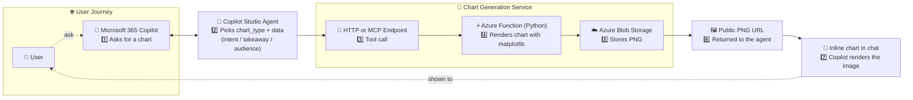

<!-- TODO(image): header.png — header concept: a cat handing a freshly rendered matplotlib chart to a Microsoft 365 Copilot window -->

Picture this. You're in the middle of a Copilot Chat, you've just asked for "*a chart of sales by region for the last four quarters*", and the model responds with a thoughtful, well-formatted... block of ASCII pipes and dashes that loosely approximates a bar chart if you squint.

Microsoft 365 Copilot *does* render Mermaid natively, and for the easy stuff — a simple flow diagram, a three-bar chart, a tidy little sequence — it actually works pretty well. But the moment your request gets more ambitious, things start to fall apart: labels overlap, layouts go sideways, and the result looks less "*executive briefing*" and more "*napkin sketch your toddler helped with*". Plus you've now spent a few thousand tokens having the model describe a chart in syntax instead of doing actual reasoning.

Richer native charting is coming to Microsoft 365 Copilot as part of [Enhanced Task Completion](https://github.com/microsoft/Agents/blob/main/docs/enhanced-task-completion.md), and when it lands it'll cover a lot of common scenarios. But there's also a real architectural case for keeping the rendering out of the LLM entirely — even after ETC arrives. Let Copilot Studio do what it's good at: understanding the question, reasoning over the data, and orchestrating the conversation. Let a purpose-built function do the drawing. Matplotlib has been better at axis labels and color palettes than any language model will ever be, and the consumption profile of "*one structured tool call*" tends to look rather different from "*entire chart described in prose and rendered as syntax*".

A colleague of mine, [Nico Sprotti](https://github.com/NicoPilot-dev), went off and built exactly that — in what he describes as "*two hours of vibe coding sessions with Claude Code*". The result is a tiny Azure Functions app that takes a JSON payload and hands back a public URL to a real, beautiful, **matplotlib-rendered** PNG that Copilot can drop straight into chat.

It is one of those "*wait, that's it?*" projects, and I think you should know about it.

The repo is here: [**NicoPilot-dev/matplotlib-azurefunction**](https://github.com/NicoPilot-dev/matplotlib-azurefunction). MIT licensed. Two integration paths. Genuinely a few hundred lines of Python. Read on.

## What This Actually Solves

The clearest framing comes from Nico himself when I asked him why he built it:

> *"Minimum tokens in the reasoning while still rendering beautifully in the chat."*

That is the whole insight. If you ask an LLM to *describe* a chart, it has to spend tokens on every axis label, every gridline tweak, every "*now plot the second series in coral*" decision — and the output is either a Mermaid blob or, worse, a textual approximation. If instead you give it a tool that takes structured data and styling parameters and returns a hosted image URL, the model only has to reason about **what the chart should say**, not how to render it.

Token-cheap to call. Pixel-perfect to look at. Cached forever in blob storage. As Nico put it: *"It cost like a fraction of a fraction to run."*

<!-- TODO(image): copilot-chat-rendered-chart.png — a screenshot of M365 Copilot rendering one of Nico's matplotlib PNGs inline in chat, ideally a multi-series bar chart with a clear title -->

{: .shadow w="700" }
_The agent calls the function, the function returns a URL, Copilot drops the PNG inline. No ASCII bar charts in sight._

## The Architecture (Smaller Than You'd Think)


_The whole story: the agent does the reasoning, the function does the drawing, the blob does the hosting, and Copilot does the rendering._

That is the entire system. One Python file (`function_app.py`), one shared renderer, and two front doors:

- **HTTP**: `POST /api/chart`. Plain JSON in, `{ "url": "https://..." }` out. This is what you wire up as a custom connector or a Power Automate HTTP action.
- **MCP**: a single tool called `generate_chart` on an MCP server named `MatplotlibChartGenerator`, hosted at `/runtime/webhooks/mcp`. This is what you point a [Copilot Studio MCP tool]() at if you want the agent to discover and call it natively.

The same renderer sits behind both, so you don't have two flavors of chart drifting apart. Pick the integration path that matches the channel you're shipping to.

Under the hood, the dependency list is comically short:

```text
azure-functions>=1.24.0
matplotlib
numpy
azure-storage-blob
```

That's it. The chart engine has been quietly shipping for two decades and renders identically every time. The Azure Function just orchestrates it.

## What You Can Render

Nine chart types, most with multi-series support:

| Type | Multi-series? | Notable params |
|---|---|---|
| `bar` | yes | `orientation` (`v`/`h`), `stacked`, `bar_width`, error bars |
| `line` | yes | dual y-axes, log scales, markers, error bars |
| `scatter` | yes | dual y-axes, markers, log scales |
| `pie` | no | `autopct`, custom slice colors |
| `histogram` | no | `bins` |
| `area` | yes | `stacked`, `alpha` |
| `box` | yes | grouped distributions |
| `violin` | yes | `show_means`, `show_medians` |
| `heatmap` | no | `cmap`, `annotate` |

Plus six annotation types (`point`, `hline`, `vline`, `hspan`, `vspan`, `text`), seven matplotlib themes (`ggplot`, `seaborn-v0_8`, `dark_background`, `fivethirtyeight`, `bmh`, `grayscale`, `default`), and the usual controls over `figsize`, `dpi`, font sizes, axis limits, and grid.

In other words: enough range that the model can pick the right shape for the question, not the only shape it has.

## The "Make the Model Think First" Trick

Here is the thing I want you to actually take away from this post. The MCP tool's signature is not just `chart_type`, `data`, and `params`. It also requires three free-text fields:

- `intent` — *why are we drawing this?*
- `takeaway` — *what should the viewer conclude?*
- `audience` — *who is going to read it?*

Nico calls these the "*fake variables*", because the server never reads them. They exist purely to force the calling model to articulate its reasoning **before** it picks a chart type and styling.

This is a beautifully underhanded prompt-engineering move. By making them required arguments, the tool description becomes a structured prompt that the orchestrator has to fill in. By the time the model gets to choosing between `bar` and `line`, it has already written a paragraph explaining what story the chart is supposed to tell — and the resulting annotations, titles, and color choices end up dramatically more aligned to that story.

> The tool description is itself a reasoning scaffold. The arguments don't have to be parameters the *server* needs. They can be parameters the *model* needs in order to do good work.
{: .prompt-tip }

If you're building tools for orchestrated agents, this is a pattern worth stealing wholesale.

## Wiring It Up: The Two Integration Paths

You get to pick. Here are both.

### Option A: HTTP endpoint as a Copilot Studio action (via Power Automate)

This is the path most enterprise tenants will land on, because it composes cleanly with existing connector governance and DLP.

1. Deploy the function app (instructions are in [the repo README](https://github.com/NicoPilot-dev/matplotlib-azurefunction#deployment-to-azure)).
2. Mint a per-caller function key:
   ```powershell
   az functionapp keys set `
     --resource-group <rg> --name <app> `
     --key-name copilot-studio-prod --key-type functionKeys
   ```
3. In Copilot Studio, add a Power Automate flow that POSTs to `https://<your-app>.azurewebsites.net/api/chart?code=<key>` with `chart_type`, `data`, and `params` from the trigger body.
4. Parse the `{ "url": "..." }` response, return it to the agent.
5. In the agent's action description, paste the tool description from [`copilot-studio-instructions.md`](https://github.com/NicoPilot-dev/matplotlib-azurefunction/blob/main/copilot-studio-instructions.md). It tells the orchestrator how to map natural-language requests to the JSON schema (e.g. "*sales by region*" → `"bar"` with `labels` + `values`).
6. Final step in the agent: render the returned URL as `` so Copilot displays the PNG inline.

<!-- TODO(image): copilot-studio-action.png — screenshot of the Copilot Studio action page with the description pasted in, showing the three input variables (chart_type, data, params) with their descriptions -->

{: .shadow w="700" }
_The action description and per-input instructions are what teach the orchestrator how to call the tool well._

### Option B: MCP tool, discovered natively by Copilot Studio

If you'd rather skip Power Automate entirely:

1. Deploy the function app the same way.
2. Add the MCP server to your agent. Same wizard, same flow as the [Hello World MCP post]() — point it at `https://<your-app>.azurewebsites.net/runtime/webhooks/mcp`.
3. The `generate_chart` tool shows up automatically, along with its `intent`/`takeaway`/`audience`/`chart_type`/`data`/`params` schema.
4. The agent calls it directly. No Power Automate hop in the middle.

The MCP path is fewer moving parts, but you get less of the connector governance machinery. Pick based on which trade-off your tenant is set up for.

## A Smoke Test You Can Run Locally

You don't need an Azure subscription to try this. Clone, configure the storage emulator, `func start`, and curl it:

```bash
curl -X POST http://localhost:7071/api/chart \
  -H "Content-Type: application/json" \
  -d '{
    "chart_type": "bar",
    "data": {"labels": ["A","B","C"], "values": [10, 20, 15]},
    "params": {"title": "Smoke test", "style": "ggplot"}
  }'
```

You get back a URL. Open it. Real chart. Real PNG.

For a more entertaining test, Nico's own go-to prompt was:

> *"Give me the popularity of the first names Doug, Henry, Nico and Remi over time plotted with Rastafarian colors."*

The model picks `line`, the data comes from whatever knowledge source you've wired up, the styling comes from `params.colors`, and you get back a chart with green/yellow/red lines. As demos go, it's effective.

<!-- TODO(image): rastafarian-names-chart.png — the actual rendered chart from Nico's prompt, four lines (Doug, Henry, Nico, Remi) in green/yellow/red over time -->

{: .shadow w="700" }
_Nico's reference demo. The point isn't the names — it's that the styling instruction survived a round-trip through the orchestrator._

## Configuration, Briefly

Four environment variables, three of which are nearly trivial:

| Variable | Required | Default | Purpose |
|---|---|---|---|
| `AzureWebJobsStorage` | yes | — | Functions runtime storage |
| `FUNCTIONS_WORKER_RUNTIME` | yes | `python` | Functions worker |
| `CHARTS_BLOB_CONNECTION_STRING` | yes | — | Storage account that holds the rendered PNGs |
| `CHARTS_BLOB_CONTAINER` | no | `matplotlib-charts` | Container for the PNGs |

> The container needs **public-read** access on the blob level for the returned URL to render directly in Copilot. If you're not comfortable with that — and many enterprise customers won't be — swap `_upload_to_blob` for a SAS-based variant. The chart URL becomes time-limited, but it still renders in chat.
{: .prompt-warning }

This is the main thing you'll want to harden before showing it to your security team. The function itself is `AuthLevel.FUNCTION` (per-caller keys), which is solid. The blob exposure is the dial you need to think about.

## Where It's a Bit Rough

Nico is the first to point at the rough edges, so I'll be too:

- **No telemetry yet.** *"I have not built any kind of telemetry, I want to do that next, backed by Dataverse,"* he said. So if you ship this to production, plan to add your own usage logging.
- **Annotation positioning is approximate.** The annotation types work, but the AI doesn't currently have a way to nail specific pixel coordinates or font choices. Good enough for "*draw a horizontal line at $1M*", not yet good enough for pixel-perfect chart art.
- **The OpenAPI sample is unauthenticated.** When Nico first shared the connector spec he was explicit: *"There is no auth."* Add function-key auth to the OpenAPI before importing it as a Power Platform custom connector for anything beyond a demo tenant.

None of these are blockers for shipping a useful tool to a single business unit. All of them are things you'd want to tidy before letting the entire tenant loose on it.

## Why I'm Writing About This

Two reasons.

First, it's a really clean illustration of an idea I keep coming back to: **the right boundary between LLM and tool is "*reasoning vs. rendering*"**. Make the model do the thinking, make the tool do the deterministic, expensive, or hard-to-describe work. Charts are a near-perfect case of this. Matplotlib has been better at drawing axes than any language model will ever be, and that's fine — it doesn't need to compete on that axis.

Second, it's a good reminder that "*native Copilot doesn't do X yet*" is not the same as "*you can't do X in Copilot today*". A few hundred lines of Python and an Azure Function later, your agents can. And when the native feature does arrive, you can rip this out and replace it — but you won't have spent a year waiting in the meantime.

Nico also pointed out, when we were chatting about scale, that he'd plotted **700 million+ stars** from a Google BigQuery public dataset through this same function: *"I was able to plot the big deeper, like you look through a telescope."* The thing scales further than the average "*let's chart Q3 sales*" demo would suggest.

If you build something with it, send me a chart. Especially if it's a heatmap. I have a weakness for heatmaps.

🔗 **Repo**: [github.com/NicoPilot-dev/matplotlib-azurefunction](https://github.com/NicoPilot-dev/matplotlib-azurefunction)
🔗 **Copilot Studio setup notes**: [copilot-studio-instructions.md](https://github.com/NicoPilot-dev/matplotlib-azurefunction/blob/main/copilot-studio-instructions.md)

What's the first chart you're going to ask your agent to draw? Drop it in the comments.
