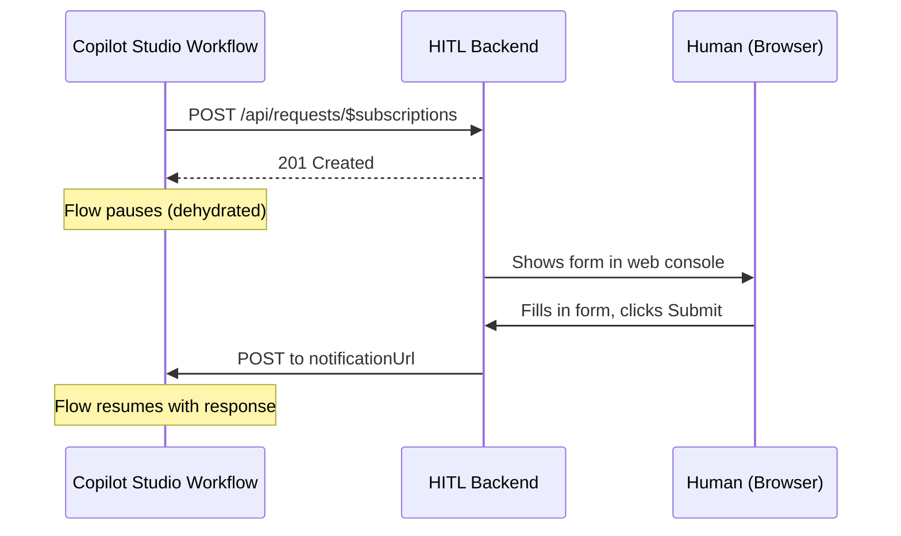

[Workflows in Copilot Studio](https://learn.microsoft.com/en-us/microsoft-copilot-studio/flow-designer?tabs=workflows) often need to pause and wait for a human: an approval, a review, a clarification. The built-in options (email via Human Review, Teams adaptive cards) work, but at scale they create noise. Dozens of requests a day across multiple workflows, all landing in the same inbox or chat, with no way to prioritize or batch them. And then the human builds an agent to triage the requests, which sends even more requests that need human input, and... you see where this is going.

We built a [custom connector sample](https://microsoft.github.io/CopilotStudioSamples/extensibility/human-in-the-loop/) that lets you plug in *any* UI for human responses. The sample includes a web console, but the pattern works for a custom app, a Slack integration (yes, I said Slack!), or anything that can call a REST endpoint.

{: .shadow w="700" }
_The sample web console. All pending requests in one place, organized by time, with Pending/Completed/All tabs._

## The Problem With the Built-in Options

The out-of-the-box connectors that support "pause and wait for a human" each have the same limitation: they own the delivery channel.

- **Human Review** sends an email. Every request is another email in someone's inbox, mixed in with everything else.
- **Post adaptive card and wait for a response** (Teams connector) sends a Teams card. Better than email, but still a stream of individual cards with no way to see what's pending across workflows.

Both work fine for occasional, high-signal requests. But when workflows scale, when you have dozens of runs a day each needing human input, these channels turn into noise. The human can't prioritize, can't see what's waiting across different workflows, and can't batch their responses.

What we wanted was to keep the same pause-and-resume behavior, but plug in our own UI. That means building a custom connector. But how do you build a connector action that *pauses* a flow?

## The Discovery: Webhook Actions

The Teams connector's "Post adaptive card and wait for a response" action uses a little-known pattern that also works in custom connectors: a **webhook action**. Unlike a webhook *trigger* (which starts a new flow run), a webhook action **pauses** the current flow and resumes it when the backend calls back. The flow dehydrates completely, consuming no resources while waiting.

## The OpenAPI Pattern

Three things in the connector's OpenAPI definition make this work:

1. **`x-ms-notification-url: true`** on the `notificationUrl` parameter tells the platform to generate a callback URL and inject it
2. **`x-ms-notification-content`** at the path level defines the schema of the callback payload (what the flow receives when it resumes)
3. **No `x-ms-trigger`** is the critical difference. Without it, the platform treats this as an action that pauses, not a trigger that starts

The connector also needs a `DELETE` endpoint for webhook unsubscribe (called when a flow is cancelled).

<details>
<summary>Full OpenAPI definition</summary>
<pre><code class="language-yaml">paths:
  /api/requests/$subscriptions:
    x-ms-notification-content:
      description: Human's response
      schema:
        type: object
        properties:
          responseText:
            type: string
            description: The primary response text
          response:
            type: object
            description: All response fields
          respondedAt:
            type: string
            description: When the human responded
    post:
      operationId: RequestHumanInput
      summary: Request human input and wait for a response
      # No x-ms-trigger — this makes it an ACTION, not a trigger
      parameters:
        - name: body
          in: body
          required: true
          schema:
            type: object
            required:
              - notificationUrl
              - body
            properties:
              notificationUrl:
                type: string
                x-ms-notification-url: true
                x-ms-visibility: internal
              body:
                type: object
                required:
                  - title
                properties:
                  title:
                    type: string
                    description: Title shown to the human
                  message:
                    type: string
                    description: Instructions for the human
      responses:
        '201':
          description: Created — waiting for response
  /api/requests/{id}:
    delete:
      operationId: DeleteRequest
      x-ms-visibility: internal
      # Webhook unsubscribe — called when flow is cancelled
</code></pre>
</details>

## How It Works End-to-End



The flow doesn't poll. It dehydrates completely, no resources consumed while waiting. It can wait for minutes, hours, or days. When the backend POSTs to the `notificationUrl`, Power Platform rehydrates the flow and continues with the response data.

## What Your Backend Needs to Implement

Your backend needs to implement two endpoints for the connector:

| Endpoint | Purpose |
|---|---|
| `POST /api/requests/$subscriptions` | Receive the request from the connector, store it (including the `notificationUrl`), return 201 |
| `DELETE /api/requests/:id` | Webhook unsubscribe. The platform calls this when a flow is cancelled |

When the human responds, your app needs to POST the response to the stored `notificationUrl`, matching the schema defined in `x-ms-notification-content`. That's what resumes the flow. Everything else is up to you: how you present pending requests, how humans submit responses, what the UI looks like. The sample includes a Node.js/Express implementation (~190 lines) with a simple web console, but you could build any UI on top of these two endpoints.


## Setting It Up

The [sample](https://microsoft.github.io/CopilotStudioSamples/extensibility/human-in-the-loop/) is designed to run in under 5 minutes.

**1. Clone the repo and start the backend:**

```bash
cd extensibility/human-in-the-loop
node setup.js
```

This installs dependencies, creates a dev tunnel (public HTTPS URL), starts the server, and prints the tunnel host URL.

**2. Import the solution:**

Go to [make.powerapps.com](https://make.powerapps.com) → Solutions → Import → upload `solution/customHIL_1_0_0_3.zip`. When prompted, set `HitlHostUrl` to the tunnel host URL from step 1.

**3. Use the connector:**

In Copilot Studio, add "Human-in-the-Loop" as a connector action in a workflow. Set the title, message, and optionally assign it to a specific person. The workflow pauses until the human responds.

{: .shadow w="700" }
_The connector action in a Copilot Studio workflow. The workflow pauses at this step until a human responds._

**4. Respond:**

Open the local or tunnel URL in a browser. Pending requests appear in the web console. Fill in the form, click Submit, and the workflow resumes with the response data.

## Production Considerations

The sample uses in-memory storage and dev tunnels, which is fine for demos. For production, consider:

- **Persistent storage** (database instead of in-memory map)
- **OAuth authentication** on the backend
- **User authorization** (validate who can respond to which requests)
- **Push notifications** (instead of polling the web console)
- **HTTPS hosting** on Azure App Service, Azure Functions, or similar
- **Protect the callback URL.** The `notificationUrl` is SAS-signed by Power Platform but doesn't require authentication. Anyone with the URL can resume the flow. Keep it server-side only, never expose it to the browser or end users.

The full sample is available at [CopilotStudioSamples/extensibility/human-in-the-loop](https://microsoft.github.io/CopilotStudioSamples/extensibility/human-in-the-loop/). It includes the complete OpenAPI definition, Node.js backend, importable Power Platform solution, and a local test harness.

What scenarios would you use a custom HITL connector for? Have you hit the same wall with the built-in approval channels? Let us know in the comments.
