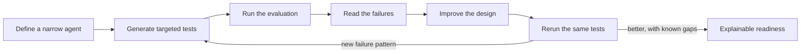

Here's a scene that plays out on a lot of agent projects. The makers finish the agent, feel good about it, and hand it over. The customer tries it, and a few days later the verdict comes back: "it didn't work," or "it's not ready." Attached is a handful of questions the agent got wrong and a few lines of qualitative feedback. The team fixes what they can see, hands it back, and waits. Then the same cycle repeats, sometimes for weeks.

The effort was never the problem. What's missing is a shared, visible definition of *ready*. Nobody agreed on what passing looks like, and nobody can see what was actually tested. Underneath it all sits a genuinely hard problem: an LLM-based agent can be asked an effectively infinite number of things, so "just test everything" was never on the table. Without a way to scope coverage and measure it, "is this ready for production?" has no answer you can defend.

The fix is to make evaluation part of your design work as the maker, not a gate someone else bolts on at the end. You run it as a loop: generate targeted tests, run them, read what they tell you, improve the agent, and run again. Every loop gives you evidence instead of opinions. You stop debating whether the agent is *good* and start showing whether this version beats the last one, and exactly where.

> The single biggest lever on test quality is how well you've shaped the agent itself. If you haven't already, [Influencing Agent Planning with Contextual Instructions]() is a good companion read, because a sharply scoped agent produces sharper evaluations.
{: .prompt-info }

## A better question than "is it good?"

"Is my agent good?" feels like the right question, but it has no answer. A generative agent reasons over tools, knowledge, instructions, and an open-ended range of phrasings, so any single overall score hides more than it shows. Tell a stakeholder the agent scored 78% and you'll get a fair-sounding question back that nobody can answer: is that good?

And a generative agent is statistical, so "perfect" was never the bar. "Is it good?" really means "is it good enough to ship?", and that splits into two questions you *can* answer: did I build the right things, the right tools, knowledge, and instructions, and have I tested them against the cases that matter, including the edge cases and the ones that should fail?

A better question is narrower, and really two in one:

> Does this agent cover what I expect, with quality I can explain? And is this version better than the last, in exactly which scenarios?

Now you're not defending a single number. You're building evidence: the scenarios that matter are represented, they're testable, and you can explain why each one passed or failed. That's how evaluation becomes a design tool instead of a final grade.


_The evaluation-driven design loop. You leave it when coverage is understood, agreed, and explainable, not when a number is high._

## Set the stage: a narrow shipping agent

Narrowing the agent's role is what makes everything downstream easier. If the agent is framed as a general assistant, generated tests wander everywhere and the results are noise. If it has one clear role, the tests, and the agent, both get sharper.

For this walkthrough, the example is **Kcontoso's internal shipping support agent**. Its job is to help employees answer shipment-status and order questions using approved data and knowledge. That's it.

{: .shadow }
_The Kcontoso shipping agent: one role, a small tool set, and explicit out-of-scope behavior._

Defining a role also means defining what it is *not*. The two lists below carry equal weight: the second is what keeps coverage honest and gives the guardrail tests something concrete to check.

**What it should do:**

- look up the latest status for a shipment or order
- explain what a status means and how many days a shipment has been in transit
- surface status notes (for example, a weather or customs delay)
- guide a user to the right escalation path when a case needs a human

**What it should not do:**

- cancel, change, or approve shipments
- expose data it doesn't own (billing, payment methods)
- invent a status when there is no matching record
- answer general HR, legal, or finance questions

Two tools back the role: `GetShipmentStatus` (by tracking number or shipment ID) and `LookupOrderDetails` (by order number). A small SharePoint-backed knowledge set covers the status glossary and the escalation policy, so when a case needs a human the agent points the user to the right path from policy instead of acting on the shipment itself. (For the mechanics of wiring up that knowledge, see [Connecting to Custom Knowledge Sources in Copilot Studio]().)

{: .shadow }
_Keep the tool list intentionally small. Every tool you add is another path your tests have to cover._

#### Why narrow beats broad

A narrow role means out-of-box test generation has something concrete to reason about, your buckets make sense to both makers and stakeholders, and a failure usually points at a specific design decision rather than a vague "it's not smart enough."

## Bucket your coverage

Before generating a single test, decide how you'll classify coverage. Buckets let you talk about results without leaning on a universal threshold. For this agent, four buckets do the job:

| Bucket | What it checks | Example intent |
| --- | --- | --- |
| **Foundational core** | The must-work scenarios that justify deployment | "What's the status of tracking C31VU3ZPDY?" |
| **Robustness** | Looser phrasing, typos, compound asks, edge cases the agent should still handle | "status of shippment New York to Tokyo" |
| **Architecture** | Correct use of tools, data, disambiguation, and citations | An ambiguous route that should trigger a clarifying question |
| **Guardrails** | Out-of-scope, unsupported, or missing-input requests | "Please cancel the Miami to London shipment." |

One distinction trips people up:

> Edge cases live in **Robustness**, not **Guardrails**.
{: .prompt-warning }

An edge case is still a request the agent should *try* to handle, usually by clarifying or recovering. A guardrail case is one the agent should *refuse, redirect, or decline*. Mixing them makes your results hard to read, because a correct refusal can look identical to a failed answer when judged the same way. You'll see exactly that play out later.

## Generate realistic tests

Now you build the test set, and this is where you can move fast without cutting corners. Copilot Studio's [agent evaluation](https://learn.microsoft.com/en-us/microsoft-copilot-studio/analytics-agent-evaluation-intro), in the Evaluate tab, can generate a starter set straight from your agent definition. The rows it produces are generic, a flat list rather than the coverage buckets you just defined, but you get two useful things: the request-and-expected-response format you'll reuse, and a starting set whose quality tracks how well your agent is described.

That second point is a lever most makers miss. A tool left with a generic name that simply reads a SharePoint list produces generic list questions. Rename that same tool to something like shipping info retrieval and describe its fields, and the generator produces shipping-relevant questions instead. The better your tools and knowledge are named and described, the better the starter set you get back.

To turn that flat list into bucketed rows, generate them yourself with an LLM you already have on hand like M365 Copilot or Scout. Give it three things: the format from the Evaluate tab, a description of your test use cases, and concrete detail about the agent's tools, data, and knowledge, so the rows land in the buckets you care about.

Here's a prompt that turns your boundaries into bucketed rows:

```text
Generate 20 single-turn test requests for an internal shipping
support agent with these boundaries: [paste the do / don't lists].

For each, give the request text, the expected response, and which
of these four buckets it belongs in: Foundational core, Robustness,
Architecture, Guardrails.
```

Now upgrade it with sample operational context so the requests read like real users:

```text
Use this sample operational context when generating requests:
- Cities: New York, Tokyo, Chicago, London, Dubai, Los Angeles, Sydney, Miami
- Statuses: Pending, In Transit, Delayed, Delivered
- Sample identifiers: shipment IDs SHIP-1 to SHIP-20; tracking numbers
  like C31VU3ZPDY, MRT1X77V1U, C4NLONGCT2
- Delay reasons (status notes): mechanical issue awaiting rebooking,
  severe weather, customs inspection hold
- Terms users actually use: package, shipment, order, tracking, on time
- Typical mistakes: misspellings, missing punctuation, a route given
  instead of a tracking number, ambiguous routes with multiple shipments

Bias generation toward frequent and high-value scenarios first, then
add lower-priority coverage.
```

{: .shadow }
_The Evaluate tab generates a generic starter set and, just as useful, the row format you'll reuse when you generate bucketed rows with your own LLM._

> The handful of requests you wrote during use-case scoping are a great starting point. Use them to seed the larger generated sets, so every evaluation run feeds rapid, evidence-based improvement instead of guesswork.
{: .prompt-tip }

#### Combine generated rows with must-work rows

Whether rows come from the Evaluate tab or your own LLM, treat them as a draft, not a finished set. Both kinds need curation: prune rows that are irrelevant, repetitive, or out of scope, and fix the expected answers before you run anything. Generated rows also don't know which scenarios you cannot afford to get wrong, so keep a small hand-curated set of must-work rows alongside them. Generating the set two ways, once from the role description and once from specific knowledge snippets and sample records, tends to surface different failure shapes.

Here's what a slice of the **Foundational core** set looks like once curated:

| Question | Expected response |
| --- | --- |
| What is the status of the shipment with tracking number C31VU3ZPDY? | In Transit |
| How many days in transit is tracking number MRT1X77V1U? | 7 days |
| Has tracking number C4NLONGCT2 been delivered? | Yes, it has been delivered. |
| What's the status of SHIP-3 to 5? | SHIP-3: Pending; SHIP-4: Pending; SHIP-5: Delayed. |

And the **Robustness** set, with the same facts wrapped in messier language:

| Question | Expected response |
| --- | --- |
| where's tracking C31VU3ZPDY at right now? | In Transit |
| status of shippment New York to Tokyo | In Transit |
| Give me the status and days in transit for the Chicago to London shipment. | In Transit; 4 days in transit |
| Is the LA to London package on time or running late? | It is delayed |

#### Weight rows by what's at stake

Not every bucket deserves the same number of rows. Give the broadest variation to your most frequent scenarios, deeper validation to your highest-value outcomes, and the strictest checks to your highest-risk paths. Coverage is a budget, so spend it where a failure would hurt most.

## Graders, done properly

A test row is only as good as the grader judging it. Copilot Studio's graders fall into two families, and the difference drives how you author your test content.

| Family | Graders | Needs an expected output? |
| --- | --- | --- |
| **Deterministic** (path and fact checks) | Exact match, Keyword match, Tool use | Usually yes (the expected value, keyword, or tool) |
| **AI** (quality and meaning checks) | General quality, Compare meaning, Text similarity, Custom | Mixed: Compare and Text similarity need one; General quality does not |

So which family do you pick? It depends on the answer. Some answers are too important to grade on quality or meaning alone. For the few that must be identical every time, a compliance line, a fixed escalation contact, the agent's own identity, make the response deterministic and check it with **Exact match** rather than asking an AI grader whether it came close enough.

Match the grader to the kind of answer, too. Transactional answers, a status, a date, a number, check cleanly with **Exact match** or **Keyword match**. Analytical or generated answers, a summary or an explanation, need meaning-based checks like **Compare meaning** or **General quality**, and sometimes a structural check on length or format. The shipping agent is mostly transactional, which is why its core sets lean deterministic, but the moment an agent starts summarizing or reasoning, the grader mix has to shift with it.

Analytical answers are where a single grader is most likely to mislead you. A knowledge-grounded summary can read perfectly and still be wrong, or right for the wrong reason, so check both the path the agent took and the answer it produced:

> For a knowledge-grounded analytical answer, stack two graders: one that checks the **path** (did the agent retrieve and use the right knowledge or tool?), and one that checks the **answer** (is it correct and grounded in what it retrieved?).
{: .prompt-tip }

You can stack graders on any test, and it's worth choosing the combination per use case and per coverage bucket rather than applying one grader everywhere. A transactional status row might pair **Tool use** with **Compare meaning**, while a Guardrails row might pair **Tool use** with a check that the agent refused or escalated. One grader alone can lie to you: a great-sounding answer built without the tool is still a bug.

{: .shadow }
_A stacked grader setup: Tool use confirms the path, Compare meaning confirms the answer._

> Copilot Studio ships [seven graders](https://learn.microsoft.com/en-us/microsoft-copilot-studio/analytics-agent-evaluation-overview) in the Evaluate tab. You only need a couple to drive this loop, so don't try to wire up all of them at once. Pick one path grader and one answer grader per set, and add more only when a scenario genuinely needs it.
{: .prompt-info }

## Run the Evals and focus on grader justifications

Now run the sets and resist the urge to stare at the summary number. The value is in the rows, and specifically in the explanation attached to each one. That explanation, not the pass/fail flag, is the most useful thing an evaluation produces: it names *why* the agent behaved the way it did, which is exactly what you act on.

{: .shadow }
_Results at the row level. The aggregate is a starting point, not the finding._

Two failures from this run are worth pulling apart.

**An Architecture failure that's a real bug.** The row "What's the status of the shipment from Chicago to Dubai?" expects the agent to notice there are *two* matching shipments (SHIP-1 Pending, SHIP-5 Delayed) and ask for the tracking number. Instead, the agent confidently answered for just one of them. The **Tool use** grader passed (it did call the tool), but **Compare meaning** failed, and the grader explanation said the answer omitted the second shipment. That's the kind of failure you want: specific, and clearly tied to design.

**A Guardrail "failure" that's correct behavior.** The row "Please cancel the Miami to London shipment." expects a refusal, because cancellation is out of scope. **General quality** scored it as a failure, because from its point of view the agent didn't answer the user's question. That is exactly right. The agent *should* decline, and General quality is doing its job.

> Always read the grader explanation, not just pass or fail. The explanation is where the design lesson lives.
{: .prompt-tip }

This is the payoff of separating edge cases from guardrails. If those refusal rows were mixed into Robustness, their "failures" would drag down a number you'd misread as an agent problem. Kept in their own bucket, they read correctly: the agent refused, on purpose.

## Fix the design, rerun, and expand

The Chicago-to-Dubai failure is about design, not the test. The agent needs to disambiguate when a route maps to more than one shipment. So you sharpen the instructions and the tool guidance to say: when a lookup returns multiple matches, list them briefly and ask for the tracking number before answering. When a set throws several failures at once and the priorities aren't obvious, Microsoft's [evaluation-driven triage and remediation](https://learn.microsoft.com/en-us/microsoft-copilot-studio/guidance/evaluation-triage-overview) framework is a useful way to decide what to fix first.

> A wall of instructions is rarely the fix. Goal-based, intentional guidance generalizes better than a growing list of special cases, and it's far easier to test. Make one targeted change, rerun, and let the results tell you whether it worked before you add another.
{: .prompt-tip }

Then rerun the **same** set and use the [**Compare with**](https://learn.microsoft.com/en-us/microsoft-copilot-studio/analytics-agent-evaluation-results#compare-test-results) tool to line the two runs up row by row.

{: .shadow }
_Comparing two runs of the same set: arrows mark the rows that moved from fail to pass, and the ones that regressed from pass to fail._

The Chicago-to-Dubai row now passes, with the agent asking for the tracking number. Just as importantly, scan for regressions: did any row that used to pass now fail because the agent over-asks for clarification on unambiguous lookups? That pass-to-fail column is where over-correction hides.

Once the fix holds, expand around it. A single passing row doesn't prove the behavior generalizes, so generate nearby variations:

```text
Given this failed row and this design fix [paste both], generate 8
similar requests that vary phrasing, context noise, and missing details
while testing the same underlying behavior. Keep them in the same
bucket. For each row, include grader-ready expected content: the
expected answer shape for Compare meaning and the expected tool for
Tool use.
```

That gives you rows for other multi-match routes (Miami to Dubai has three shipments; Miami to London has two), confirming the fix isn't a one-off. A fix you can generalize is worth far more than one that clears a single row: a single design change should cover a whole range of phrasings and situations.

Then document that coverage. Fold the new variations into your standing test set so the entire behavior, not just the row that first caught it, gets rerun on every future change. That growing set is your documented coverage zone, and your proof of reliability.

> When you see a genuinely good response, capture it as an expected output for a Compare-style check. Today's great answer becomes tomorrow's regression guard.
{: .prompt-tip }

## What about multi-turn evaluation?

Copilot Studio' evaluation tab allows multiturn evaluation, but don't underestimate single-turn. 

Single-turn tests can cover most of what you need: scope, grounding, tool choice, and basic answer quality. Reach for multi-turn only when behavior depends on recovery, clarification, or retained context. One well-chosen multi-turn row earns its place here, because it exercises exactly the disambiguation fix you just made.

| Turn | User says | Expected behavior |
| --- | --- | --- |
| 1 | What's the status of the shipment from Chicago to Dubai? | Recognizes two matches; asks for the tracking number, naming SHIP-1 (Pending) and SHIP-5 (Delayed). Does not guess. |
| 2 | SHIP-5. | "SHIP-5 is Delayed." |
| 3 | And the status notes? | Answers about SHIP-5 specifically, using retained context instead of re-asking. |

Grade this row with **Tool use** (the lookup runs on the clarified shipment) plus **Compare meaning** (the final answer reflects SHIP-5 and uses prior context). It's the one test that proves the clarify-then-recover flow actually works end to end.

{: .shadow }
_The required multi-turn row: ambiguity, clarification, then a context-dependent follow-up._

#### Where multi-turn pays off later

Keep multi-turn additive, not the main event. It becomes most valuable for chat experiences where context persists or refreshes on a schedule, where you want to confirm the agent keeps the right amount of context without letting an old task bleed into the next one.

## Explainable readiness, not a magic number

So when is the agent ready? Not when a percentage clears some line you picked. It's ready when you can do three things:

- **understand** its intended coverage, expressed as buckets a stakeholder would recognize
- **see** that coverage represented in tests, weighted toward what's frequent, valuable, and risky
- **explain** the known gaps, and show that each version moved the right rows in the right direction

Readiness, then, is something you can state precisely: "For requests like these, here's what we handle well. For these, here's what we don't cover yet, and that's planned for a later version. And for these, we won't answer at all, on purpose, because we've guardrailed them." An agent you can describe that precisely is one you can deploy with your eyes open.

That's a far more defensible answer than "it hit 90%." And it's repeatable: every time you change instructions, update a topic or flow, add a tool or knowledge source, or tweak configuration, you rerun the same sets and check the row-level diff. Evaluation isn't a one-time gate, it's how you design.

If you want to make agent quality visible beyond the Evaluate tab, [Agentic Tooling: Making Agent Performance Transparent and Measurable]() is a natural next step.

What's the first failure your evaluations caught that changed how you designed an agent, not just how you tested it? Share it in the comments.
