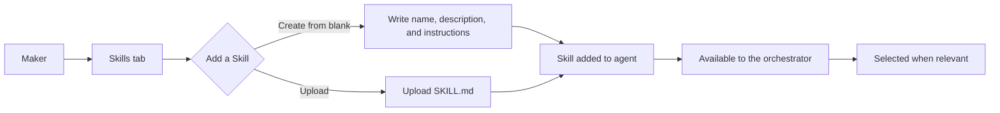
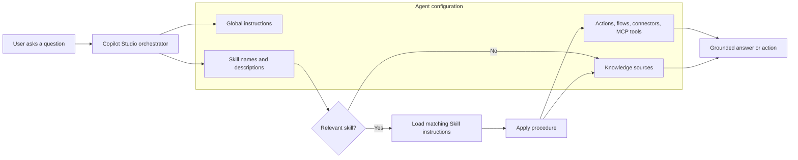
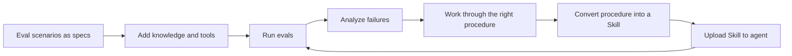

Enterprise agents rarely fail because they lack facts. They fail because the organization has a specific way of doing the work, and that procedure is usually scattered across prompts, policy pages, tool descriptions, and maker intuition.

Copilot Studio Skills give makers a dedicated place to package that procedure.

That is why Skills matter more than their simple shape suggests. The new Copilot Studio authoring experience is the visible change. The new orchestrator is the architectural change. Skills are the maker-facing building block that lets that orchestrator bring the right instructions into the conversation when a task needs them.

Not just what the agent should know.
Not just which tools it can call.
Not just what tone it should use.

Skills are where repeatable procedure lives.

## The short version

A Copilot Studio Skill is an instructional asset based on the [Agent Skills open format](https://agentskills.io/), an open standard originally developed by Anthropic and covered well in this [overview](https://www.unite.ai/anthropic-opens-agent-skills-standard-continuing-its-pattern-of-building-industry-infrastructure/). It uses the `SKILL.md` pattern, with metadata and instructions that describe what the skill is for, when it should be used, and how the agent should approach the task.

In the current Copilot Studio experience, Skills are primarily **instructional and procedural**. They are not executable script bundles today. Script and executable asset support should not be assumed until it is officially available.
{: .prompt-info }

A Skill starts with metadata that helps the orchestrator decide when to use it, then adds the procedural instructions the agent should follow when that Skill is selected.

In Copilot Studio, makers work with Skills through the **Skills** tab in the builder experience. Today, that means two entry points: create a Skill from blank or upload a `SKILL.md` file. Once added, the Skill becomes part of the agent and is available to the orchestrator at runtime.



_In Copilot Studio, Skills are added through the builder experience. The authoring entry point is simple, but the metadata and instructions still matter because they influence when the orchestrator selects the Skill._

Here is the same idea in two forms: what a maker writes in the builder, and what an uploaded `SKILL.md` could contain.

### Builder view: the pieces that matter

{: .shadow }
_The Create from blank experience in Copilot Studio asks for the same core pieces: name, description, and instructions._

### Upload a skill: collapsible example SKILL.MD

For upload, the file must start with YAML front matter. In Copilot Studio, keep the front matter focused on the required `name` and `description` fields. Put ownership, versioning, source policy, and other governance notes in the body of the Skill.

<details>
<summary><strong>Expand the example SKILL.md file</strong></summary>
<pre><code class="language-markdown">---
name: hr-leave-eligibility-triage
description: |-
  Use this skill when an employee asks about leave eligibility, leave policy,
  or what information HR needs to assess a leave request.
---

## Overview

Use this procedure to help employees understand what information is needed for a leave-related question.

## Ownership and versioning

- **Owner**: HR Operations
- **Skill version**: 1.0.0
- **Last reviewed**: 2026-06-08
- **Source policy**: Global Leave Policy v4.2

## Procedure

1. Identify the employee's country or region.
2. Identify the leave type.
3. Ask for employee type if needed.
4. Check the relevant policy knowledge source.
5. Do not make legal or final HR determinations.
6. Escalate exceptions, personal cases, and unclear eligibility questions to HR.

## Output format

- What we can confirm
- What information is still needed
- Recommended next step

## Guardrails

- Do not provide legal advice.
- Do not make a final HR determination for personal cases.
- Escalate exceptions, unclear eligibility questions, and sensitive employee situations to HR.
</code></pre>
</details>

That is not a tool. It is not a topic. It is not a knowledge source.

It is a reusable procedure.

## Why procedural memory matters

There are different kinds of knowledge an agent needs.

Some knowledge is factual: a policy, a product page, an invoice, a customer record. Copilot Studio already has strong patterns for grounding answers in knowledge sources and connected data.

Some knowledge is conversational: how the agent should introduce itself, what tone it should use, what topics it can handle, and where it should hand off.

Some knowledge is operational: which tools, actions, flows, connectors, or MCP servers are available to the agent.

Skills address a different layer: **procedural knowledge**.

That is why I use the phrase procedural memory. It is a metaphor, not a new Copilot Studio object. Factual knowledge tells the agent what is true. Procedural memory tells the agent how to do the work when a certain kind of task appears.

Procedural knowledge is the "how":

- How to triage a request.
- Which questions to ask first.
- Which policy to check before answering.
- When to call a tool.
- When not to call a tool.
- When to escalate.
- How to shape the final response.
- Which boundaries the agent must respect.

Humans use procedural memory all the time. A support specialist does not just know the refund policy; they know the sequence: check the purchase date, confirm the channel, inspect the exception rules, look for abuse signals, then decide whether to approve, deny, or escalate.

That sequence is not just a fact. It is a procedure.

Skills are a way to give that procedure to the agent without stuffing it into every prompt or every global instruction.

## The new orchestrator changes why this works

The new Copilot Studio experience is tied to a new orchestrator. The important concept is the agent loop.

At a high level, an agent loop works like this:

1. The user sends a message.
2. The model receives the conversation context.
3. The model decides whether it needs more context, a tool, a skill, or a final answer.
4. The orchestrator executes the requested step.
5. The result comes back into context.
6. The loop continues until the agent has enough information to respond.

```mermaid
flowchart TB
    User[User message] --> Context[Conversation context]
    Context --> Model[Model reasons over the task]
    Model --> Decision{Need more before answering?}

    Decision -- Use a Skill --> Skill[Select relevant Skill]
    Skill --> Procedure[Apply procedural instructions]
    Procedure --> Work[Ask, retrieve, or call tools]

    Decision -- Use knowledge or tools --> Work
    Work --> Result[Result returned to context]
    Result --> Context

    Decision -- Ready to answer --> Response[Final response]
```



_The new orchestrator runs the loop: the model reasons, the orchestrator executes the requested step, the result returns to context, and the loop continues until the agent is ready to answer._

That loop is what makes Skills useful. The agent does not need every procedure loaded all the time. The orchestrator can select the relevant skill based on the skill name, description, and instructions, then bring that procedure into context when the task calls for it.

Think of it as moving from:

> "Put everything the agent might ever need into the system instructions."

to:

> "Give the agent a library of task-specific procedures and let the orchestrator bring in the right one at the right time."

That is a big difference for maintainability.

## Where Skills fit in Copilot Studio

Skills sit between knowledge and actions.

They do not replace either.

Knowledge sources tell the agent what information is available. Actions, flows, connectors, and [MCP servers](https://microsoft.github.io/mcscatblog/posts/hello-world-mcp-copilot-studio/) tell the agent what it can do. Skills tell the agent how to approach a class of work.

For example:

- A knowledge source may contain the leave policy.
- A flow may create an HR case.
- A skill tells the agent which clarifying questions to ask, when to check the policy, when to create the case, and when to avoid making a final determination.

That distinction matters.

A Skill can instruct the orchestrator to use available tools, actions, flows, connectors, or MCP servers. But a Skill does not grant capabilities by itself. If the agent does not already have access to the tool, the Skill cannot magically call it.

Good mental model:

> MCP and tools provide reach. Knowledge provides facts. Skills provide the operating procedure: both the business procedure and the tool-use procedure.

## Skills can also improve tool-use success

Procedural knowledge is not only business procedure. It can also be technical procedure.

That matters when an agent has access to powerful tools, actions, flows, connectors, or MCP servers. A tool may be available to the agent, but availability does not guarantee the agent will call it well.

For example, an MCP server may expose tools that search customer records, create tickets, retrieve documents, or update structured data. The model still needs to know:

- which tool to use for which scenario
- which parameters are required
- how to shape the query
- which fields to include
- what to validate before calling the tool
- what to do if the tool returns no results
- when not to call the tool

A Skill can package those instructions. It does not grant access to the MCP server, but it can improve the quality and consistency of how the agent uses that MCP server.

This is where Skills become valuable for pro-code and maker teams working together. Pro-code teams can expose robust tools. Makers and subject matter experts can use Skills to describe the right operating procedure around those tools.

## Skills are part of the agent

In the current Copilot Studio experience, Skills are scoped to an agent.

There is a **Skills** tab in the authoring experience where makers can create a skill from blank or upload a skill file. Once added, the skill becomes part of that agent's configuration.

Skills are also solution-aware at the agent level. If you add a Skill to an agent and add that agent to a [Power Platform solution](https://learn.microsoft.com/en-us/microsoft-copilot-studio/authoring-solutions-overview), the Skill transfers with the agent. That is the right level of ALM framing for now: Skills move as part of the agent asset in the solution.

If you are already thinking about environment promotion, managed solutions, and production-safe deployment, the same foundation still applies. Skills do not remove the need for agent ALM; they become one more part of the agent asset you move through that lifecycle. For the broader foundation, see [ALM for Copilot Studio Agents: The Foundation](https://microsoft.github.io/mcscatblog/posts/alm-copilot-studio-agents-foundation/).

This is important because it keeps Skills close to the thing they influence: the agent's behavior.

It also means you should not think of Skills today as a tenant-wide skill marketplace or shared enterprise catalog. That may become an interesting pattern over time, but the current model is much simpler: a Skill belongs to an agent and travels with that agent.

## A simple architecture view



_The orchestrator does not need every procedure in context all the time. It can use skill metadata to select the relevant procedure, then combine that guidance with knowledge and tools._

The point is not that Skills are another place to put random instructions. The point is that Skills become a modular procedure layer that the orchestrator can select when the task requires it.

## Three examples that make Skills concrete

The easiest way to understand Skills is to look for repeatable work where the answer depends on a sequence: ask the right questions, check the right source, use the right tool, and stop or escalate at the right boundary.

Here are three examples. Each one uses Skills for procedure, not for raw knowledge or system access. **Select any example below to expand the full scenario.**

<details>
<summary><strong>Expand example 1:</strong> HR leave eligibility triage — collect context, check policy, and escalate exceptions before answering.</summary>

<p>Leave questions are rarely answered well by policy lookup alone. The agent often needs to know:</p>

<ul>
  <li>Which country or region applies?</li>
  <li>What type of leave is being discussed?</li>
  <li>Is the person a full-time employee, contractor, intern, or something else?</li>
  <li>Is the employee asking a general policy question or describing a personal case?</li>
  <li>Does the situation require HR escalation?</li>
</ul>

<p>A Skill can define that procedure. It can instruct the agent to ask for missing context before answering, check the relevant policy knowledge source, avoid making legal or final HR determinations, and escalate exceptions to HR.</p>

<p>This is a strong Skills use case because the work is repeatable, sensitive, and procedural. The value is not just in retrieving the policy. The value is in applying the right process before responding.</p>

</details>

<details>
<summary><strong>Expand example 2:</strong> Customer service refund and exception handling — apply policy windows, exception rules, and tool guidance before promising anything.</summary>

<p>Refund handling is another good example. The agent may need to identify:</p>

<ul>
  <li>Product or service.</li>
  <li>Purchase date.</li>
  <li>Purchase channel.</li>
  <li>Refund reason.</li>
  <li>Policy window.</li>
  <li>Exception rules.</li>
  <li>Abuse or fraud signals.</li>
  <li>Whether order lookup is available.</li>
</ul>

<p>A refund Skill can guide the agent through that sequence. It can tell the agent when to use an order lookup action, when to avoid promising approval, when to escalate high-value exceptions, and how to write a customer-safe response.</p>

<p>Again, the Skill is not the refund tool. It is the playbook for using policy, context, and tools correctly.</p>

</details>

<details>
<summary><strong>Expand example 3:</strong> IT incident intake and routing — classify the issue, ask the right triage questions, and escalate risky cases.</summary>

<p>IT support often starts with classification. Is the issue about access, device health, network connectivity, an application, data loss, or suspected compromise?</p>

<p>A Skill can instruct the agent to ask the right triage questions, suggest safe self-service steps only for low-risk issues, create a ticket when the ITSM action is available, and escalate immediately for security-sensitive scenarios.</p>

<p>This is where Skills help reduce the number of specialized agents you need. Instead of building separate agents for every support path, you can equip one agent with focused procedures for common classes of work.</p>

<p>That does not mean one mega-agent should do everything. Boundaries still matter. But Skills make it easier to build agents that are modular instead of fragmented.</p>

</details>

## What makes a good Skill

A good Skill is specific.

The name and description are not just documentation for humans. They are orchestration signals. The orchestrator uses them to decide when the Skill is relevant.

Prefer names like:

```text
HR Leave Eligibility Triage
Customer Refund Exception Handling
IT Incident Intake and Routing
```

Avoid names like:

```text
HR Help
Support Stuff
IT Process
```

The description should explain when to use the Skill. If needed, it should also say when not to use it.

For example:

```text
Use this skill when an employee asks about leave eligibility, required leave documentation, or the next step for a leave request. Do not use it for payroll, benefits enrollment, or performance management questions.
```

That is better than:

```text
Helps with HR questions.
```

The first description gives the orchestrator a clear routing signal. The second one invites ambiguity.

## A practical starter checklist

When designing a Skill, start with these questions:

1. **What repeatable task is this Skill for?**  
   If you cannot describe the task clearly, the Skill will be vague.

2. **When should the Skill be used?**  
   Write the description like routing metadata, not marketing copy.

3. **When should it not be used?**  
   This helps avoid accidental invocation and overlapping Skills.

4. **What information must the agent collect first?**  
   List required clarifying questions.

5. **Which knowledge sources should be checked?**  
   Point the agent to the right type of grounding.

6. **Which tools may be used?**  
   Only reference tools, actions, flows, connectors, or MCP servers that the agent actually has.

7. **What are the escalation rules?**  
   Be explicit about exceptions, uncertainty, approvals, privacy, legal, or security boundaries.

8. **What should the final response look like?**  
   Define the expected structure so outputs are consistent.

9. **Who owns the procedure?**  
   Add owner and review information inside the Skill instructions if needed.

10. **How will you test it?**  
   Create evals that check both selection and outcome quality.

## Testing Skills with evals

Testing a Skill with [Copilot Studio evaluations](https://learn.microsoft.com/en-us/microsoft-copilot-studio/analytics-agent-evaluation-intro) is not only testing whether the final answer sounds good.

You need to test whether the Skill is selected at the right time and whether the agent follows the intended procedure after it is selected.

There are several layers worth testing:

| Eval area | What to check |
| --- | --- |
| Trigger precision | Does the Skill activate only when it should? |
| Trigger recall | Does it activate across different phrasings of the same task? |
| Non-trigger behavior | Does it stay out of the way for unrelated requests? |
| Procedure adherence | Does the agent ask required questions, follow the sequence, and respect boundaries? |
| Tool behavior | Does the agent only use available and appropriate tools? |
| Output quality | Is the response complete, grounded, formatted correctly, and appropriately caveated? |

For example, an HR leave Skill should trigger when the user asks, "What do I need to provide for parental leave in Germany?" It should not trigger when the user asks about updating their home address.

That is trigger precision.

It should also trigger for different phrasings of the same intent:

- "Am I eligible for parental leave?"
- "What documents do I need for leave?"
- "Can I take time off after my child is born?"

That is trigger recall.

Once selected, the Skill should guide behavior. If the procedure says the agent must ask for country or region before answering, your evals should check that it does not skip that step.

Add adversarial cases as well: user attempts to override the Skill, bypass escalation, force an unavailable tool, or make the agent ignore required checks. Skills are procedural instructions, so evals should prove the procedure is followed under pressure, not only in the happy path.
{: .prompt-warning }

For more on testing patterns, see [Closing the Loop: Automated Agent Improvement with Publish and Test](), [Bulk File-Based Testing for Copilot Studio: Beyond Standard Evals](https://microsoft.github.io/mcscatblog/posts/bulk-file-testing-copilot-evals/), and [Quality Gates for Copilot Studio: Automated Evaluations in Azure DevOps](https://microsoft.github.io/mcscatblog/posts/copilot-studio-eval-gate-azure-devops/).

Testing tells you whether a Skill works. The next step is using failed scenarios to decide which Skills to create or improve.

## A practical workflow: build Skills from eval failures

The best way to create a useful Skill is often not to start with the Skill.

Start with the eval.

Before you decide what Skills an agent needs, write down the scenarios the agent must handle. Treat those eval scenarios as the working specification for the agent:

- What should the agent be able to do?
- What does a good answer look like?
- Which knowledge sources should it use?
- Which tools should it call?
- Which boundaries should it respect?
- What should count as failure?

That gives you a concrete target. You are not writing a Skill because the agent needs more instructions. You are writing a Skill because a scenario proves the agent needs a repeatable procedure.

Once the scenarios are clear, add the capabilities the agent needs: the right knowledge sources, the right tools, and precise descriptions for each of them. Those descriptions matter. They are not only documentation for makers; they are routing signals for the orchestrator. If the descriptions are vague, overlapping, or disconnected from the user language in your evals, the agent has less signal to select the right capability at the right moment.

Then run the evals.

For each failed scenario, inspect what happened. Did the agent miss the right knowledge source? Did it choose the wrong tool? Did it skip a required question? Did it answer before checking policy? Did it use the right capability but produce the wrong output structure?

This is where agent development becomes an eval loop.



When a scenario fails, do not immediately add another paragraph to the agent instructions. Work through the scenario with the agent. Ask it to reason through what information it needed, which tools or knowledge sources should have been used, what sequence should have been followed, and what the final answer should have looked like.

When that conversation produces the right outcome, ask the agent to review the procedure and turn it into a focused Skill. That Skill should capture the reusable playbook:

1. When the Skill applies.
2. What information to collect first.
3. Which knowledge sources to check.
4. Which tools may be used.
5. Which decisions or approvals the agent must not make.
6. What the final response should include.
7. Which edge cases require escalation.

Then upload the Skill into the agent and rerun the evals.

This is the practical version of "hill climbing" on agent quality: create scenarios, measure the baseline, diagnose failures, extract the missing procedure, package it as a Skill, and measure again. Each Skill becomes a small piece of procedural memory that is justified by a real scenario, not by guesswork.

It also keeps the agent cleaner. Instead of turning the system prompt into a 400-line collection of accumulated business rules, keep the always-needed instructions short and move task-specific procedures into Skills. The agent can then pull the right procedure into context when the task needs it, without carrying every possible process in every conversation.

## Inspecting why a Skill was selected

Makers can inspect why a Skill was selected in the builder experience. The reasoning view shows how the agent reasoned through the request, whether a Skill was executed, why it was selected, and what output came back from that execution.

This is important because Skills introduce a new design surface: metadata quality. If a Skill fires too often, the description may be too broad. If it does not fire when expected, the description may be too narrow, too generic, or missing the language users actually use.

If you want to inspect the full conversation transcript, turn on user feedback under **Settings > Safety and access > Feedback**. After a conversation, submit feedback at the end of the chat. That feedback flow gives you a way to extract the conversation transcript for deeper analysis.

For more background on how the Copilot Studio orchestrator reasons through a request, see [Open the hood: Copilot Studio transcripts]().

## Anti-patterns to avoid

### Do not use Skills as a dumping ground

If everything goes into a Skill, nothing is really a Skill.

Keep Skills focused on repeatable procedures. Do not copy entire policy manuals into them. Put factual reference material in knowledge sources and use the Skill to explain how to apply that knowledge.

### Do not create overlapping Skills with vague descriptions

If you create three Skills called "HR Help," "Employee Questions," and "Policy Support," the orchestrator has little signal to work with.

Skill descriptions should be precise enough that two reasonable makers would agree on when each Skill applies.

### Do not reference tools the agent does not have

A Skill can instruct an agent to use an action or flow, but it does not make that action or flow available.

If the Skill says "look up the order in Dynamics" and the agent has no order lookup tool, the instruction cannot be fulfilled.

### Do not treat Skills as a security bypass

Skills influence agent behavior. That makes them powerful, but it also means they need review.

Be especially careful with Skills copied from community sources, generated by AI, or reused from another environment. Review them for prompt injection, unsafe instructions, tool misuse, stale procedures, and hidden assumptions.

## Versioning and ownership

Skills should be treated as living procedural assets.

Even if your current process is lightweight, add enough metadata inside the Skill to know who owns it and when it changed.

Useful fields to include in the Skill body:

```markdown
## Ownership

- Owner: HR Operations
- Review cadence: Quarterly
- Last reviewed: 2026-06-08
- Source policy: Global Leave Policy v4.2
- Skill version: 1.0.0

## Change notes

- 1.0.0: Initial procedure for leave eligibility triage.
```

This is not about adding bureaucracy. It is about avoiding stale procedures.

Enterprise processes change. Policies change. Escalation paths change. Tool availability changes. If the Skill is procedural memory, then outdated Skills become outdated memory.

## Why this reduces agent sprawl

Before Skills, it was tempting to solve every complex process by creating another specialized agent.

One agent for HR leave.
One agent for HR benefits.
One agent for IT incidents.
One agent for device support.
One agent for refund handling.
One agent for order status.

Sometimes that separation is correct. Security boundaries, audience boundaries, and business ownership still matter.

But many times, the real need is not a new agent. The real need is a new procedure.

Skills make that distinction clearer.

If the same agent can serve the same audience, use the same knowledge boundary, and access the same toolset, then a Skill may be the better unit of modularity. You are not building another agent; you are teaching the existing agent another repeatable way of working.

That is the shift.

## What to watch next

Skills are early, and the current implementation is intentionally focused.

The areas to watch are the ones that turn Skills from a promising authoring feature into a mature enterprise building block: better authoring ergonomics, clearer trace visibility, stronger versioning patterns, richer package support, and deeper evaluation workflows that prove the right Skill was selected at the right moment.

For now, the most important thing is to understand the concept correctly.

Skills are not magic.
They are not tools.
They are not knowledge sources.
They are not a replacement for good agent design.

They are reusable instructions that the orchestrator can select when a task needs procedural knowledge.

That is why they matter.

The next generation of Copilot Studio agents will not only be grounded in enterprise knowledge and connected to enterprise systems. They will also be equipped with enterprise procedures.

And for makers, that changes the craft.

Writing better prompts still matters. But designing better Skills may become just as important: clear names, precise descriptions, focused procedures, explicit boundaries, and evals that prove the agent uses them at the right moment.

That is the procedural memory layer.
