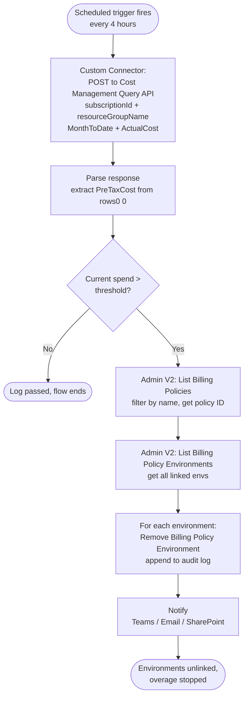

*Or: Teaching Power Platform to be its own bouncer...also does every 4 hours count as real time 🤔*

---

In the [previous post](), we built a solid PAYG governance pipeline using Azure Budgets, Automation Accounts, and Power Automate. And we were honest about its limits. The most pointed one was this:

> *Imagine a developer who accidentally builds a flow that reasons over a large PDF in an infinite loop. That flow starts burning through AI Builder credits at speed, and this solution won't catch it before serious damage is done. By the time the budget alert fires, the overspend has already happened.*

Azure Cost Management data carries an 8–24 hour delay. Budget alerts are evaluated periodically. For a runaway flow hammering an AI endpoint in a non-production sandbox, that lag is the entire problem.

So let's fix it, and do it without leaving Power Platform.

This post builds a **fully native Power Platform solution** for real-time PAYG overage protection. No Azure Automation Accounts. No runbooks. No Action Groups. No Azure portal at all. Just a scheduled cloud flow, a custom connector talking to the Azure Cost Management API, and the Power Platform Admin V2 connector doing the unlinking.

Here's the fastest path to getting it running, followed by how each piece works.

---

## What the Solution Contains

The solution packages four pieces that work together:

| Component | Role |
|---|---|
| **Scheduled Cloud Flow** | The heartbeat. Runs on your chosen interval and orchestrates everything else. |
| **Custom Connector (Cost Management)** | Wraps the Azure Cost Management Query API. Returns current month-to-date spend for a given scope. |
| **Power Platform Admin V2 Connector** | Lists billing policies, retrieves linked environments, and unlinks them when the threshold is crossed. |
| **Flow Variables** | Hold the subscription ID, resource group, billing policy name, spend threshold, and audit log. No external config store needed. |

Everything is importable as a single Power Platform solution. One environment. One connection setup. Done. You can grab the solution package, including the custom connectors described below, here: [Billing Policy Management solution](https://github.com/microsoft/CopilotStudioSamples/blob/main/infrastructure/manage-paygo/solution/BillingPolicyManagement_1_0_0_3.zip).

---

## Prerequisites

Before you import and configure the [Billing Policy Management solution](https://github.com/microsoft/CopilotStudioSamples/blob/main/infrastructure/manage-paygo/solution/BillingPolicyManagement_1_0_0_3.zip) linked above, make sure you have the following in place.

### 1. An App Registration (Service Principal) in Entra ID

The custom connector needs to authenticate against the Azure Resource Manager API (`https://management.azure.com/`). You'll need an App Registration with:

- A **client secret** (or certificate)
- The **Cost Management Reader** role assigned on the target subscription or resource group

> **Note on Admin V2 authentication:** The Power Platform Admin V2 connector does *not* support Service Principal authentication for billing policy operations; it requires an **OAuth (delegated) connection**. This means the Admin V2 connection runs as a named user account that holds the **Power Platform Admin**, **Global Admin**, or **Dynamics 365 Admin** role. Plan your connection credentials accordingly.
{: .prompt-warning }

### 2. A Premium Power Automate License

Custom connectors require a premium license on the flow's owner account. The Power Platform Admin V2 connector is also premium. Make sure the account running the flow is licensed appropriately.

### 3. Your Subscription ID and Resource Group

You'll need the Azure subscription ID and resource group name associated with your billing policy. These are the same values you used when setting up the billing policy itself, as covered in [the previous post](#a-quick-refresher-what-are-billing-policies), and the same ones the Cost Management API uses to scope its cost query.

### 4. Your Spending Threshold

Decide what spend level should trigger unlinking. This doesn't have to match your formal Azure Budget — it can be lower, and it should be. Given that this solution checks frequently rather than waiting for a batch alert, you can set a tighter threshold with confidence that it will be caught quickly.

---

## Get It Running (The Short Path)

If you just want the guardrail in place, here's the fastest route. Everything below is already built into the [Billing Policy Management solution](https://github.com/microsoft/CopilotStudioSamples/blob/main/infrastructure/manage-paygo/solution/BillingPolicyManagement_1_0_0_3.zip); the sections after this explain how each piece works if you want to customize or rebuild it.

1. **Import the solution.** Download the [Billing Policy Management solution](https://github.com/microsoft/CopilotStudioSamples/blob/main/infrastructure/manage-paygo/solution/BillingPolicyManagement_1_0_0_3.zip) and import it into your target environment (**Solutions → Import solution**).
2. **Create the two connections** the solution prompts for during import:
   - **Azure Cost Management custom connector** — an OAuth 2.0 connection backed by your App Registration from the [Prerequisites](#prerequisites). The exact OAuth values are in [Component 1](#component-1-the-custom-connector-for-azure-cost-management).
   - **Power Platform Admin V2** — an OAuth (delegated) connection signed in as a user holding the Power Platform Admin, Global Admin, or Dynamics 365 Admin role.
3. **Set the flow variables** at the top of the flow: `SubscriptionId`, `ResourceGroupName`, `BillingPolicyName`, and `SpendThreshold`.
4. **Confirm the recurrence** is set to every 4 hours (the reasoning is in [The Core Idea](#the-core-idea)).
5. **Turn the flow on.**

> Want to confirm it works without waiting for a real overage? In a non-production environment, temporarily set `SpendThreshold` below your current month-to-date spend, run the flow once, and watch it unlink, then set the threshold back. Don't test this against environments you can't afford to have unlinked.
{: .prompt-tip }

The rest of this post unpacks how each piece works.

---

## The Core Idea

The limitation in the previous post wasn't just that budget alerts are slow, it's *why* they're slow. Azure Budget alerts are evaluated roughly **once every 24 hours**. Even if cost data has already been ingested and your threshold crossed hours ago, the alert won't fire until the next evaluation cycle completes. That 24-hour evaluation window is the ceiling on how quickly the previous solution could respond.

The Cost Management Query API removes that ceiling entirely. Instead of waiting for Azure to run its evaluation cycle, we query the API directly, on our own schedule. And the right schedule is dictated by how often Azure actually refreshes cost data: **every 4 hours**. That's the cadence at which new spend information becomes available. Poll more frequently and you're reading the same numbers; poll every 4 hours and you're acting on every new data point the moment it exists.

The result is a detection window that shrinks from up to 24 hours down to 4 hours, not because the underlying data arrives faster, but because we've replaced Azure's evaluation cycle with our own.

The solution wraps this in a scheduled cloud flow that runs every 4 hours: it calls the Cost Management Query API for current month-to-date spend, compares the result against a threshold you define, and unlinks all environments from the billing policy the moment that threshold is crossed. Scope, threshold, and interval are all flow variables, configurable after import, with no code changes required.

> For the full details on API rate limits, QPU quotas, and throttling behaviour, see the [Azure Cost Management automation limits documentation](https://learn.microsoft.com/en-us/azure/cost-management-billing/costs/manage-automation).
{: .prompt-info }

---

## Component 1: The Custom Connector for Azure Cost Management

The Azure Cost Management Query API isn't available as a built-in Power Automate connector, so we wrap it in a custom connector. This is a single-action connector: all it does is post a cost query and return the result.

### The API Call

```
POST https://management.azure.com/subscriptions/{subscriptionId}/resourceGroups/{resourceGroupName}/providers/Microsoft.CostManagement/query?api-version=2025-03-01
```

### The Request Body

```json
{
  "type": "ActualCost",
  "timeframe": "MonthToDate",
  "dataset": {
    "granularity": "Monthly",
    "aggregation": {
      "totalCost": {
        "name": "PreTaxCost",
        "function": "Sum"
      }
    }
  }
}
```

A few things worth explaining here:

- **`type: ActualCost`** — returns what has actually been charged, not amortised reservation cost. This is the number that matters for PAYG.
- **`timeframe: MonthToDate`** — gives you spend from the first of the current calendar month to now. Use `TheLastBillingMonth` if your billing period doesn't align with the calendar month; let's just say I have seen some variance in behavior occasionally. You can get the list of options here: [TimeFrame Type](https://learn.microsoft.com/en-us/rest/api/cost-management/query/usage?view=rest-cost-management-2025-03-01&tabs=HTTP#timeframetype)
- **`granularity: Monthly`** — we want a single aggregated number for the period, not a daily breakdown. Keeps the response simple.
- **`aggregation`** — asks for the sum of `PreTaxCost`, which is what gets returned as your total spend figure.

### The Response

```json
{
  "properties": {
    "columns": [
      { "name": "PreTaxCost", "type": "Number" },
      { "name": "Currency", "type": "String" }
    ],
    "rows": [
      [ 4.72, "USD" ]
    ]
  }
}
```

The cost value lives at `rows[0][0]`. That's the number the flow compares against your threshold.

### Authentication

The custom connector uses **OAuth 2.0** against Azure Active Directory:

- **Authorization URL:** `https://login.microsoftonline.com/{tenantId}/oauth2/authorize`
- **Token URL:** `https://login.microsoftonline.com/{tenantId}/oauth2/token`
- **Resource / Audience:** `https://management.azure.com/`
- **Client ID and Secret:** from your App Registration

The connector connection is created once and reused by the flow. The App Registration needs at minimum **Cost Management Reader** on the target subscription or resource group.

---

## Component 2: The Power Platform Admin V2 Connector and a Billing Policy Lookup Connector

The [Power Platform for Admins V2 connector](https://learn.microsoft.com/en-us/connectors/powerplatformadminv2/) provides the actions we need to identify and unlink environments. Three actions are relevant here:

| Action | What It Does |
|---|---|
| **List Billing Policies** | Returns all billing policies in the tenant with their IDs, names, and status |
| **List Billing Policy Environments** | Given a billing policy ID, returns all environments currently linked to it |
| **Remove Billing Policy Environment** | Unlinks a specific environment from a billing policy |

This connector uses an **OAuth (delegated) connection**: it runs as a named user. That user must hold the Power Platform Admin, Global Admin, or Dynamics 365 Admin role. Create the connection once in your solution environment and it will be reused across flow runs.

A companion custom connector, Power Platform Billing Policy, lets you list all billing policies within the tenant so you can retrieve the billing policy ID you need for the actions exposed by the [Power Platform for Admins V2 connector](https://learn.microsoft.com/en-us/connectors/powerplatformadminv2/).
You can download the solution with this connector here: [Billing Policy Management](https://github.com/microsoft/CopilotStudioSamples/blob/main/infrastructure/manage-paygo/solution/BillingPolicyManagement_1_0_0_3.zip)

---

## The Flow: `MonitorAndUnlinkOnOverage`

Here's the step-by-step breakdown of the scheduled flow.

### Trigger: Recurrence

Configure the trigger to run every 4 hours. As covered in [The Core Idea](#the-core-idea), that's the cadence at which Azure refreshes cost data, so polling more often than that just re-reads the same numbers without catching anything sooner. If you have a compliance reason to check more frequently, you can, but treat anything tighter than 4 hours as redundant rather than faster detection.

```
Recurrence trigger
  Interval: 4
  Frequency: Hour
```

### Step 1: Initialize Variables

```
Initialize Variable — SubscriptionId     (String) → your subscription GUID
Initialize Variable — ResourceGroupName  (String) → your resource group name
Initialize Variable — BillingPolicyName  (String) → the policy name to protect
Initialize Variable — SpendThreshold     (Float)  → e.g. 5.00
Initialize Variable — OperationLog       (String) → ""
```

Keeping these as variables at the top of the flow makes the solution easy to configure after import, with no hunting through nested actions to change a threshold.

### Step 2: Query Current Spend

Call the custom connector action with the subscription ID and resource group name from your variables. The connector posts to the Cost Management API and returns the response.

Parse the JSON response to extract the spend value:

```
Parse JSON — Body: [Cost Management connector output]
```

Extract the cost: `first(body('Query_Cost')?['properties']?['rows'])?[0]`

This navigates to the first row of the result set and pulls the first column, the `PreTaxCost` sum.

### Step 3: Compare Against Threshold

```
Condition: [Current Spend] is greater than [SpendThreshold]
```

If false: append to OperationLog — `"Spend check passed: $X of $Y threshold."` — and the flow ends cleanly. Nothing to do.

If true: proceed to unlinking.

### Step 4: Find the Billing Policy

Call **List Billing Policies** from the Admin V2 connector. This returns the full list of policies in your tenant. Apply a filter to find the one matching your `BillingPolicyName` variable:

```
Filter Array
  From: [List Billing Policies output] → value
  Condition: item()?['properties']?['displayName'] is equal to [BillingPolicyName]
```

Extract the policy ID from the first match:

```
Set Variable — PolicyId = first(body('Filter_Policy'))?['name']
```

### Step 5: List and Unlink All Environments

Call **List Billing Policy Environments** with the resolved policy ID. This returns all environments currently linked to the policy.

Then loop:

```
Apply to Each — [List Billing Policy Environments output] → value
  │
  ├─ Remove Billing Policy Environment
  │    Policy ID:      [PolicyId variable]
  │    Environment ID: items('Apply_to_each')?['environmentId']
  │
  └─ Append to OperationLog
       "Unlinked: [environmentId] from [BillingPolicyName]"
```

### Step 6: Return the Audit Log

After the loop, the flow has a complete record of everything it did. You can route this wherever makes sense for your organisation:

- **Post to a Teams channel** — instant visibility for your admin team
- **Send an email** — if your admin team prefers inbox alerts
- **Write to a SharePoint list** — for a persistent, queryable audit trail
- **Do all three** — this is a governed production system; there's no such thing as too many receipts

---

## The End-to-End Picture


## Why This Solves the Problem the Azure Approach Couldn't

Cast your mind back to the infinite-loop PDF scenario. A runaway flow starts burning AI Builder credits at 9:15 AM. With the Azure Budget approach, the earliest you'd know is the next time Azure evaluates the budget alert, potentially 8–24 hours later.

With this solution, the next scheduled run, at most 4 hours later, queries Cost Management, sees the spike, and unlinks the environments. Maximum exposure: one polling interval, bounded by how often Azure refreshes cost data in the first place.

That's a fundamentally different risk profile.

---

## Pros and Cons of the Native Approach

### Pros

| | |
|---|---|
| **No Azure infrastructure** | No Automation Accounts, no runbooks, no Action Groups. The entire solution lives in Power Platform. |
| **Polling aligned to data refresh** | The 4-hour cadence matches Azure's cost-data refresh, so every run acts on genuinely new information rather than re-reading stale numbers. |
| **Single import, single environment** | One solution package. Import, configure connections, set your variables. Done. |
| **No Azure expertise required** | A Power Platform admin can own, modify, and troubleshoot this end to end without touching the Azure portal. |
| **Self-documenting audit trail** | Every run either logs a clean pass or a full unlink record. The flow run history is your audit trail. |
| **Catches rapid spend spikes** | Designed specifically for the runaway-flow scenario that Azure Budget alerts miss. |

### Cons

| | |
|---|---|
| **Cost Management data still has lag** | The API returns data that is typically 4–8 hours behind real time, better than the 8–24 hour budget alert lag, but not instantaneous. A flow that burns credits in a 2-hour window may still complete before the next poll catches it. |
| **Premium license required** | Custom connectors and the Admin V2 connector both require premium Power Automate licenses on the flow owner account. |
| **OAuth connection for Admin V2** | The billing policy unlinking must run as a named user with admin rights, not a service principal. That connection credential needs managing (password rotation, account lifecycle). |
| **Polling cost** | Every scheduled run calls the Cost Management API. At a 4-hour cadence that's roughly 180 calls per month per monitored policy, well within typical Azure API limits, but worth knowing. |
| **No push, only pull** | This is a polling architecture, not an event-driven one. You accept a maximum latency equal to your polling interval. For catastrophic runaway scenarios you may still want a manual emergency unlink option. |

---

## What You Now Have (Across Both Posts)

Stepping back, you now have two complementary tools:

- **The Azure-backed pipeline** from the [previous post](): battle-tested, event-driven, enterprise-grade. Best suited for production environments where you want formal budget governance integrated with your Azure Cost Management estate.
- **The native Power Platform solution** from this post: fast, self-contained, low-overhead. Best suited for non-production and sandbox environments where the risk of runaway development flows is highest and where you want Power Platform admins, not Azure admins, to own the guardrails.

They're not mutually exclusive. Many organisations will run both: the Azure Budget alert as the formal governance layer, and the scheduled flow as the rapid-response safety net for the environments that need it most.

---
> This blog demonstrates one of the ways of leveraging the Cost Management API. I have made every effort to keep the blog at the conceptual level and away from "here are the 293 steps" to make this happen. Maybe one final hint: you can also fetch the actual cost by ResourceID by changing the parameters in the QueryDataSet and fetch the actual breakdown by billing policy!
{: .prompt-info }

That's it. The training wheels are off! Godspeed Spider-Man!

---
*The custom connector definition, solution package, and variable configuration guide referenced in this article are available in the accompanying repository. As always, test in a non-production environment first, which, appropriately, is exactly the kind of environment this solution is designed to protect.*

