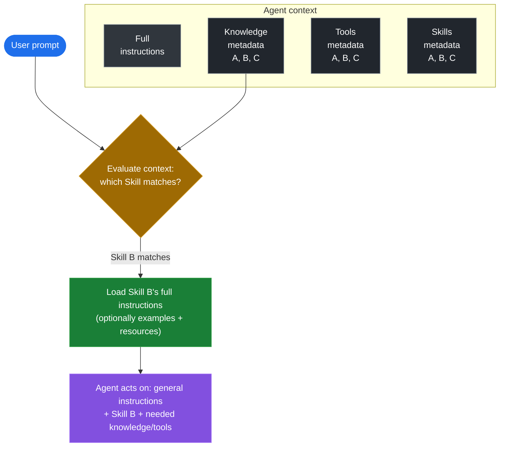
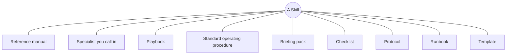
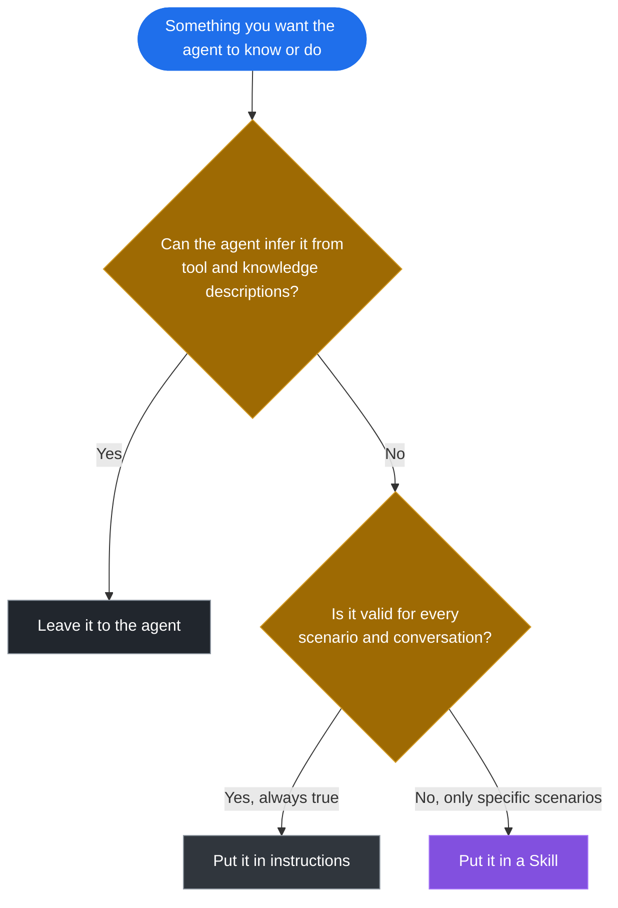

Enterprise agents are good at recalling facts. Where they struggle is the things that are specific to *your* organization: the context, conventions, data, and know-how an LLM cannot infer on its own. Some of that is true in every conversation, so it belongs in the agent's instructions. But a lot of it only matters in specific situations, and cramming all of it into one ever-growing system prompt is exactly where agents get bloated and unpredictable. Modern agents have a cleaner place to put the situational part: **Skills**.

If you have spent time with coding agents recently, you have probably already met them. At its core, a Skill is just instructions (and optionally resources like examples, templates, or scripts) that the agent loads **on demand**, only when a specific kind of task comes up. A `SKILL.md` file carries a name, a description, and the instructions themselves. The name and description are what tell the agent when the Skill is relevant.

That same idea has now arrived in the modern Copilot Studio agent experience. This post is about what Skills are, why an agent builder should care, and how they work in Copilot Studio specifically.

## Why an agent builder should care

Skills are based on the [Agent Skills open format](https://agentskills.io/), an open standard originally developed by Anthropic. The shape is deliberately simple. A Skill is just instructions, so the real question is why you would break instructions out into a discrete Skill at all. It comes down to four things:

- **Manageability.** Instead of one ever-growing instruction blob, each Skill is a focused, self-contained unit you can reason about, review, and version one at a time.
- **Context management.** Skills load *on demand*. The agent keeps only the names and descriptions in view by default, and pulls the full instructions into context only when a task matches. Ten Skills cost you ten short descriptions, not ten full sets of instructions, in every turn, so the context window stays lean.
- **Accuracy.** Use-case dependent, but real. A Skill can carry detailed tool-use guidance: which tool to reach for, which parameters matter, how to shape a query, what to validate before calling, and what to do when a tool returns nothing. With large or overlapping toolsets, bringing that guidance into context only when it is relevant can make the agent call tools more reliably. It is not a guarantee, so evaluate it rather than assume it.
- **Speed.** A Skill that points the agent straight at what to do means fewer exploratory loops, and less context for the model to weigh on each turn. Both can shave latency, and cost, off a response.

That is the short version. Manageability and context management are structural and apply almost everywhere. Accuracy and speed depend on your agent.

## The same benefits show up in Copilot Studio

The good news is that the modern Copilot Studio orchestrator works the same way: it can reason over a set of available Skills, select the relevant one, and bring its instructions into context only when the conversation calls for it. So the manageability and context benefits carry over directly, and the accuracy and speed questions are still yours to evaluate.



_This is how a modern agent manages its context in general, not something specific to Skills. Knowledge sources, tools, and Skills are all registered the same way: only their metadata (name and description) sits in context by default, just enough for the agent to know what is available. The agent's own instructions are the exception, always loaded in full. When a prompt comes in, the agent evaluates it against that metadata, then pulls in the full content of whatever it actually needs, the rows of a knowledge source, the result of a tool, or the full instructions of a Skill (and optionally that Skill's examples and resources). It then acts on its general instructions, the matched Skill's instructions, and whatever knowledge or tools the task requires. Loading full content only on demand is what keeps the context window lean, no matter how many Skills, tools, or knowledge sources you add._

There are a couple of things specific to how Skills work in Copilot Studio, which I come back to below.

## Working with Skills in Copilot Studio

From a maker's perspective, this is intentionally lean.

### Add a Skill

Skills live in the **Skills** tab of the agent. There are two entry points today: create a Skill from blank, or upload an existing Skill (a `SKILL.md` file, together with any bundled resources or scripts).

{: .shadow }
_Create from blank asks for the three pieces that matter: name, description, and instructions. An uploaded Skill carries the same fields in the `SKILL.md` front matter and body, plus any files it bundles alongside it._

Once added, the Skill becomes part of the agent. It is scoped to that agent and travels with it: add the agent to a [Power Platform solution](https://learn.microsoft.com/en-us/microsoft-copilot-studio/authoring-solutions-overview) and the Skill moves with it through your ALM lifecycle.

### Invoke a Skill

You do not "call" a Skill directly. The orchestrator selects it, based on the Skill's name and description, when the conversation matches. You can watch this happen in the agent's reasoning view.

{: .shadow }
_The user asks for a process-mining analysis. The orchestrator loads the matching Skill, then follows its instructions step by step, including calling the right tool (`get_processes`) at the right moment._

That reasoning view is also your main debugging surface: if a Skill fires too often, the description is probably too broad; if it never fires, the description is too narrow or does not match the words your users actually use.

### Write the description like routing metadata

This is worth dwelling on, because it is the part makers most often get wrong. The name and description are not documentation for humans; they are the **routing signal** the orchestrator uses to decide when the Skill applies. Treat them that way:

- Name specifically: `HR Leave Eligibility Triage`, not `HR Help`.
- Say when to use it *and when not to*: "Use for leave eligibility and required documentation. Do not use for payroll or benefits enrollment."

A precise description gives the orchestrator a clear routing target. A vague one ("Helps with HR questions") invites the wrong Skill to fire, or none at all. If two reasonable makers would disagree on when a Skill applies, the description is not specific enough yet.

## Copilot Studio Skills and the open format

If you come from coding agents, the good news is that Copilot Studio Skills follow the same [Agent Skills open format](https://agentskills.io/). A Skill folder can bundle more than instructions:

```text
my-skill/
├── SKILL.md          # metadata + instructions
├── scripts/          # optional executable code
├── references/       # optional documentation
└── assets/           # optional templates, resources
```

Copilot Studio supports this full shape today. A Skill carries its `SKILL.md` instructions and can bundle resources (reference files, examples, templates) and executable scripts, all loaded on demand when the Skill is selected. A couple of things are still worth calling out:

- **Distribution is per-agent.** Coding-agent ecosystems let you distribute Skills as plugins across products and tenants. In Copilot Studio, a Skill is scoped to its agent and travels with that agent through solutions and ALM, rather than through a shared, cross-product catalog.
- **Skills can soft-point at the agent's tools, not just bundled scripts.** A Skill can run its own bundled script, but it can also *soft-point* at the agent's existing capabilities: actions, flows, connectors, and MCP servers. The Skill can say "use the order-lookup action here," but it does not grant that capability. If the agent does not already have the tool, the instruction cannot be fulfilled.

So the mental model is: **a Skill provides the instructions and resources; the agent provides the reach.**

## How to think about a Skill

Skills are new to most makers, and "instructions loaded on demand" is accurate but abstract. It helps to have a few mental models, because a Skill can take whatever shape the job needs. Think of a Skill as any of these:



_One feature, many shapes. The right analogy depends on the job in front of the agent._

| Think of a Skill as a… | Useful when the job is… | For example |
| --- | --- | --- |
| **Reference manual** the agent consults | Understanding a proprietary data model, schema, or domain the LLM does not know | Documenting your data model and how to query it so a data tool returns the right thing |
| **Specialist** you call in | A narrow area of expertise the agent only occasionally needs | Region-specific tax rules, applied only when that region comes up |
| **Playbook** | There is a known set of plays for a recurring situation | Triaging a support request: classify it, then route by category |
| **Standard operating procedure** | A task must be done the same, compliant way every time | Handling a refund within policy windows and approval limits |
| **Briefing pack** | The agent needs background and context before it can act well | Onboarding context the agent reads before answering HR questions |
| **Checklist** | Certain steps or validations must not be skipped | Pre-submission validation before a record is created |
| **Protocol** | There are firm rules for handling a sensitive case | What to do when a user reports a suspected security incident |
| **Runbook** | An operational task has defined steps and known failure handling | Running a pipeline: discover processes, analyze, add a ROI pre-scan, format the result |
| **Template** | The output must follow a fixed structure or house style | Generating a report or standardized record to a fixed format |

The common thread: each one is **context-specific guidance the LLM cannot infer on its own, packaged once and pulled in only when it is relevant.** Knowledge gives the agent facts, tools give it reach, and a Skill gives it the situational know-how to use both well. And crucially, a Skill *guides* the agent, it does not straitjacket it. The model still reads the situation and decides whether to follow the Skill to the letter or adapt. That judgment is the whole point of using an LLM; the Skill just makes sure the right expertise is in the room when the task shows up.

## Instructions, or a Skill?

Start with one gate that applies to both: **can the agent figure this out on its own?** Give it a well-described tool or knowledge source and it can usually decide how to use it from the description alone. You do not need to hand-hold the obvious. Only the things the agent *cannot* infer, your organization's context, conventions, data, and rules, need to be written down at all.

Once you have decided something does need to be written down, the choice between instructions and a Skill is simple:

- **Is it true in every conversation, for every scenario?** Put it in the agent's **instructions**. Tone, the agent's role, always-on guardrails: these are valid 100% of the time, so they should always be in context.
- **Does it only apply to specific scenarios?** Make it a **Skill**. If a piece of guidance is not relevant to every turn, keeping it out of the default context and loading it only when its scenario comes up is exactly what Skills are for.



_Two questions decide it: can the agent infer it, and if not, is it always true or only situational?_

That is the whole distinction. Instructions are the always-on baseline; Skills are everything situational, named and described so the agent can reach for the right one at the right moment.

## A Skill, or a new agent?

Before Skills, the instinct for every distinct task was to build another specialized agent: one for password resets, one for software-request approvals, one for incident triage. Sometimes a separate agent really is right: security boundaries, distinct audiences, and clear business ownership still justify one.

But often those are not three agents, they are one IT support agent with three Skills. If the same agent serves the same audience, shares the same knowledge boundary, and already has the right tools, a Skill is the better unit of modularity. You are not building another agent to maintain; you are teaching the existing one another way of working. That is how Skills cut down on agent sprawl.

## A word on trust

Because a Skill shapes how the agent behaves, and can now bundle scripts, it is a trust surface. Treat any Skill you did not write, one from a community source, generated by AI, or reused from another environment, the way you would treat untrusted code: review it before adding it. Check for prompt injection, instructions to misuse tools, and anything that does not match what the Skill claims to do.
{: .prompt-warning }

## What to take away

If you want to go deeper, [Influencing Agent Planning with Contextual Instructions]() covers how always-on instructions steer the orchestrator, [Open the Hood: What Your Copilot Studio Agent Is Really Doing]() shows how to inspect the reasoning that decides when a Skill fires, and [Closing the Loop]() covers how to evaluate that the right Skill fires at the right moment.

Skills are early in Copilot Studio, and intentionally focused. But the core idea is already worth internalizing: keep instructions for what is true in every conversation, and move everything situational into Skills the agent can pull in on demand, whether that is a reference manual, a checklist, a runbook, or a playbook.
