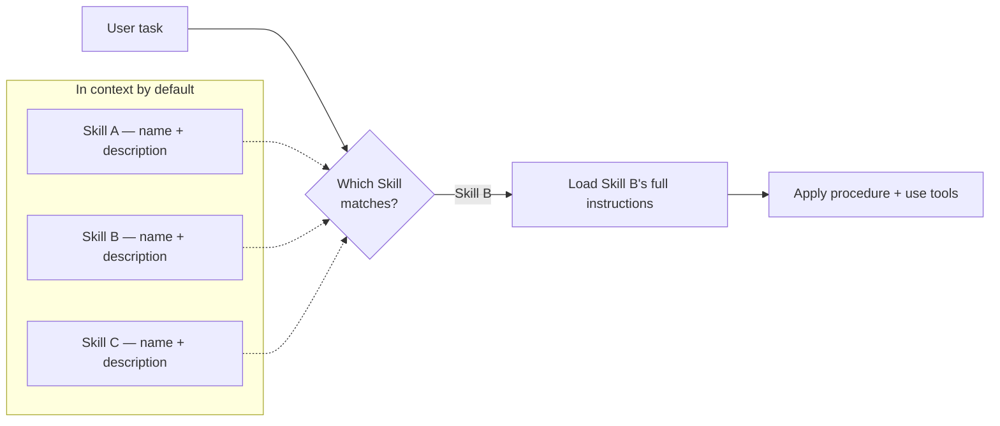
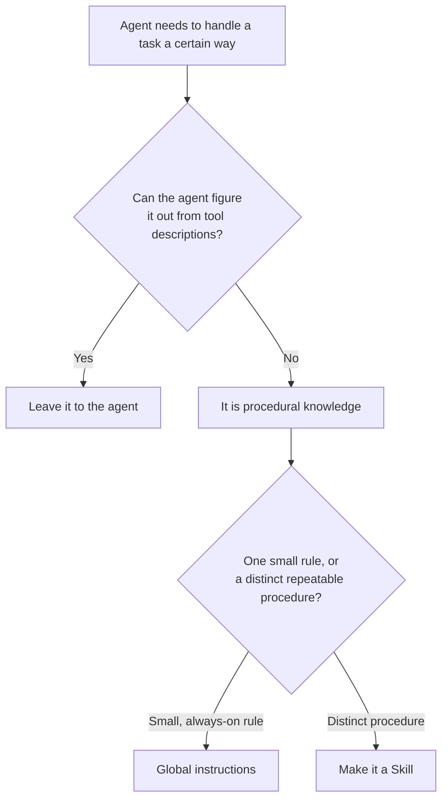

Enterprise agents rarely fail for lack of facts. They fail because the organization has a specific way of doing the work, and that procedure ends up scattered across one ever-growing system prompt. Modern agents have a cleaner place to put it: **Skills**.

If you have spent time with coding agents recently, you have probably already met them. A Skill is a small, self-contained package of procedural knowledge: a `SKILL.md` file with a name, a description, and instructions that tell the agent how to do a specific kind of task. The agent loads it only when a task actually needs it.

That same idea has now arrived in the modern Copilot Studio agent experience. This post is about what Skills are, why an agent builder should care, and how they work in Copilot Studio specifically.

## Why an agent builder should care

Skills are based on the [Agent Skills open format](https://agentskills.io/), an open standard originally developed by Anthropic. The shape is deliberately simple, but the benefits are real:

- **Manageability.** Instead of one ever-growing instruction blob, each procedure lives in its own focused Skill. You can reason about, review, and version them one at a time.
- **You avoid saturating the context window.** Skills load *on demand*. The agent keeps only the names and descriptions in view by default, and pulls the full instructions into context only when a task matches. Ten procedures cost you ten short descriptions, not ten full playbooks, in every turn.
- **Sometimes accuracy.** This one is genuinely use-case dependent. In specific scenarios, like large toolsets or sophisticated retrieval, keeping irrelevant procedure out of context and bringing in the right one can improve how reliably the agent acts. It is not a guarantee. Treat it as something to evaluate, not assume.

That is the short version. The first two benefits are structural and apply almost everywhere. The third depends on your agent.

## The same benefits show up in Copilot Studio

The good news is that the modern Copilot Studio orchestrator works the same way: it can reason over a set of available Skills, select the relevant one, and bring its procedure into context for that task. So the manageability and context benefits carry over directly, and the accuracy question is still yours to evaluate.



_Only the names and descriptions stay in context by default. The full procedure for a Skill loads on demand, when a task matches; that is what keeps the context window lean even as the number of Skills grows._

There are a few things that are specific to Copilot Studio today, though, both in how you work with Skills and in what is and is not supported yet. More on that below.

## Working with Skills in Copilot Studio

From a maker's perspective, this is intentionally lean.

### Add a Skill

Skills live in the **Skills** tab of the agent. There are two entry points today: create a Skill from blank, or upload a `SKILL.md` file.

{: .shadow }
_Create from blank asks for the three pieces that matter: name, description, and instructions. An uploaded `SKILL.md` carries the same fields in YAML front matter plus a Markdown body._

Once added, the Skill becomes part of the agent. It is scoped to that agent and travels with it: add the agent to a [Power Platform solution](https://learn.microsoft.com/en-us/microsoft-copilot-studio/authoring-solutions-overview) and the Skill moves with it through your ALM lifecycle.

### Invoke a Skill

You do not "call" a Skill directly. The orchestrator selects it, based on the Skill's name and description, when the conversation matches. You can watch this happen in the agent's reasoning view.

{: .shadow }
_The user asks for a process-mining analysis. The orchestrator loads the matching Skill, then follows its instructions step by step, including calling the right tool (`get_processes`) at the right moment._

That reasoning view is also your main debugging surface: if a Skill fires too often, the description is probably too broad; if it never fires, the description is too narrow or does not match the words your users actually use.

### Write the description like routing metadata

This is worth dwelling on, because it is the part makers most often get wrong. The name and description are not documentation for humans; they are the **routing signal** the orchestrator uses to decide when the Skill applies. Treat them that way:

- Name specifically: `HR Leave Eligibility Triage`, not `HR Help`.
- Say when to use it *and when not to*: "Use for leave eligibility and required documentation. Do not use for payroll or benefits enrollment."

A precise description gives the orchestrator a clear routing target. A vague one ("Helps with HR questions") invites the wrong Skill to fire, or none at all. If two reasonable makers would disagree on when a Skill applies, the description is not specific enough yet.

## Copilot Studio Skills vs coding-agent Skills

If you come from coding agents, it helps to know where Copilot Studio Skills line up with the open format today, and where they do not yet.

The full [Agent Skills format](https://agentskills.io/) allows a Skill folder to bundle more than instructions:

```text
my-skill/
├── SKILL.md          # metadata + instructions
├── scripts/          # optional executable code
├── references/       # optional documentation
└── assets/           # optional templates, resources
```

In Copilot Studio today, a Skill is the **instructional core** of that format. A few practical differences:

- **No bundled resources yet.** There is no `scripts/` or `assets/` execution today; a Copilot Studio Skill is procedural instructions, not an executable bundle. This is on the roadmap.
- **No plugin mechanism yet.** Coding-agent ecosystems let you distribute Skills as plugins across products. Copilot Studio Skills are scoped to an agent for now. This is also on the roadmap.
- **Skills can soft-point at tools, not just scripts.** This is the important one. A coding-agent Skill often points at its own bundled script. A Copilot Studio Skill instead *soft-points* at the agent's existing capabilities: actions, flows, connectors, and [MCP servers](https://microsoft.github.io/mcscatblog/posts/hello-world-mcp-copilot-studio/). The Skill can say "use the order-lookup action here," but it does not grant that capability. If the agent does not already have the tool, the instruction cannot be fulfilled.

So the mental model is: **a Skill provides the procedure; the agent provides the reach.**

## Skills tighten the loop and direct tool use

A modern agent works in a loop: it reasons, tries something, observes the result, and adjusts. That flexibility is what makes it capable, but it has a cost. Every exploratory step is another turn, and sometimes the agent reasons its way to an answer it could have reached directly.

A Skill with clear, directive instructions **shortens that loop**. When the procedure spells out what to do and in what order, the agent does not have to rediscover the approach each time; it follows the playbook. Fewer turns, more predictable behavior, and usually lower latency and cost as a side effect.

The same idea applies to tools. A tool's description tells the agent *what the tool does*. A Skill can tell it *how to use it well*:

- which tool to reach for in which scenario,
- which parameters are required,
- how to shape the query or filter,
- which fields to include,
- what to validate before calling,
- and what to do when the tool returns nothing.

Availability does not guarantee good usage. An agent can have a powerful action or MCP server and still call it clumsily. A Skill closes that gap by packaging the tool-use directive alongside the business procedure, which is exactly where maker know-how and pro-code tooling meet.

## Skills or instructions? When do you need each?

Modern agents are good at figuring things out on their own. Give an agent a well-described tool or MCP server, and it can usually decide when and how to use it from the description alone. You do not need to hand-hold the obvious.

So the real question is: **what can the agent *not* figure out from common sense?**

That is what instructions are for. Use them when your organization has a specific way of working that is not discoverable from a tool description:

- A procedure has an **order**: A must happen before B.
- The right **data source** for the inputs of step C is specifically tool D, not the other one that also looks plausible.
- A policy, boundary, or escalation rule the agent would have no way to infer.

Anything the agent can reasonably work out itself does not belong in instructions. Anything it cannot should. Not sure which bucket something falls in? **Evaluate it.** Run the scenario both ways and look at what the agent actually does.

## When to put a procedure in a Skill instead

Once you have decided something *is* procedural knowledge the agent needs, you still have a choice: keep it in the agent's global instructions, or move it into a Skill. Reach for a Skill when:

- **Your agent follows multiple distinct procedures.** Splitting each one into its own Skill helps *you*, the builder: they stay focused, reviewable, and individually testable, instead of tangling together in one long prompt.
- **You want to keep context lean.** Skills load on demand, so a procedure that only matters for one class of request does not flood every conversation by default.
- **Accuracy, maybe.** Accuracy benefits have been observed, but in specific situations: very large toolsets, or sophisticated Skill-retrieval setups. You need to evaluate and be the judge for your own agent.



_A rough decision path: let the agent handle what it can infer, put always-on rules in instructions, and move distinct repeatable procedures into Skills._

## What Skills look like in practice

Skills shine wherever the *right answer depends on following a sequence*. A few shapes worth recognizing:

- **Driving a conversational flow.** The agent must collect the right context in the right order before it can help: ask for region, then leave type, then employee type, before checking policy. The Skill encodes the questions and their order.
- **Generating a file from a template.** The output must follow a fixed structure every time, like a report, a summary, or a standardized record. The Skill carries the template and the rules for filling it in.
- **A specific order of execution.** The task is a pipeline: discover available processes, then run the analysis, then add the ROI pre-scan, then format the result. The Skill keeps the steps in the correct sequence and points at the right tool at each one, exactly what the reasoning view above is showing.

In every case the Skill is the *playbook*, not the data and not the system access. Knowledge gives the agent facts, tools give it reach, and Skills give it the operating procedure that ties them together.

## A Skill, or a new agent?

Before Skills, the instinct for every new process was to build another specialized agent: one for HR leave, one for IT incidents, one for refunds. Sometimes that is right: security boundaries, distinct audiences, and clear business ownership still justify a separate agent.

But often the real need is not a new agent, it is a new *procedure*. If the same agent serves the same audience, shares the same knowledge boundary, and already has the right tools, a Skill is the better unit of modularity. You are not building another agent to maintain; you are teaching the existing one another way of working. That is how Skills cut down on agent sprawl.

## A word on trust

Because a Skill shapes how the agent behaves, it is a trust surface, especially one copied from a community source, generated by AI, or reused from another environment. Review Skills before adding them: keep them focused (a Skill is not a place to dump an entire policy manual), avoid overlapping vague Skills that confuse routing, and check for prompt injection or instructions to misuse tools.
{: .prompt-warning }

## What to take away

If you want to go deeper on the surrounding craft, the [procedural-memory write-up]() covers what makes a good Skill description, and our [testing posts]() cover how to evaluate that the right Skill fires at the right moment.

Skills are early in Copilot Studio, and intentionally focused. But the core idea is already worth internalizing: stop stuffing every procedure into one prompt, and start giving your agent a library of task-specific playbooks it can pull from on demand.
