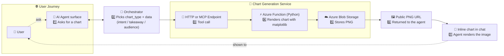

Picture this. You're in the middle of a chat with an AI agent, you've just asked for "*a chart of sales by region for the last four quarters*", and the model responds with a thoughtful, well-formatted... block of ASCII pipes and dashes that loosely approximates a bar chart if you squint. The model understood the question perfectly. It reasoned about the data just fine. It simply had no good way to *draw*. **That is not a model problem. That is a tooling problem.**

There are at least four meaningful ways to render a chart from an AI agent today, and the right answer depends on what you're optimizing for: visual polish, channel reach, agent reasoning, infrastructure footprint, or the persistence of the artifact. They are not a maturity ladder. Each option is optimized for a different job.

This post walks those four current options, with the matplotlib path in the middle as our main example. We'll keep the future-looking stuff until the end, after the practical decision guide.

1. **Mermaid** — native, text-based, the agent can read its own chart back.
2. **Adaptive Card chart elements** — channel-native visuals from a topic, no external services.
3. **Matplotlib via Azure Function + MCP** — maximum control and reusable PNG artifacts, the path we'll spend most of this post on.
4. **The new experience for Copilot Studio, with skills** — runtime chart construction.

> **A note on how we ordered these.** The order is about moving from lightweight, in-message rendering toward more packaged or externally rendered approaches. It is not a ranking. Mermaid can be the best answer for an editable process diagram, Adaptive Cards can be the best answer for channel-native data visuals, and matplotlib can be the best answer when you need deterministic rendering control.
{: .prompt-tip }

You'll see **[Classic]** and **[New Experience]** tags on the section headers below. Those refer to the two Copilot Studio authoring experiences Microsoft documents in [Classic vs. new agent experience](https://learn.microsoft.com/en-us/microsoft-copilot-studio/agents-experience/classic-vs-new): classic agents are organized around topics, flows, actions, and explicit configuration; the new experience uses a natural-language-first build surface, skills, tools, and enhanced orchestration. Some charting patterns work in both, some are tied to one experience.
{: .prompt-info }

## Option 1: Mermaid [Classic] [New Experience]

Mermaid is the lightest-weight option you have, and it shines brightest on **flowcharts and process diagrams**. The agent emits Mermaid syntax in its response, and any chat surface that renders Mermaid natively like Microsoft 365 Copilot turns it into a diagram inline. No infrastructure, no tool call, no roundtrip.

The big thing Mermaid has going for it that no other option here does: **the diagram is text in the conversation**, so the agent can read its own output back on the next turn. Inline images are opaque to the orchestrator; Mermaid isn't. The agent doesn't have to convert an image back into code or infer what a box-and-arrow diagram contains from pixels. The structure is already there, in a format models understand very well.

That matters even if you don't love the default look and feel. For agentic use cases, readability is a feature. If the user says, "*add an escalation branch*", "*show the fraud-review path*", or "*split this into domestic and international flows*", the agent can edit the Mermaid directly instead of redrawing an image from scratch.

It earns its keep on **diagrams** (flow, sequence, state, ER, simple Gantt) and on **simple bar/pie charts with a handful of values**. It falls apart on anything resembling a time series, anything with overlapping labels, and anything where visual quality matters more than agent-readability. But for branching processes, Mermaid is exactly the right hammer: readable, editable, and easy for the agent to revise on the next turn.

For example, here is a prompt and output using the Mermaid option:

> *"Create a Mermaid flowchart for a fictional airline lost-luggage claim process. Start when a passenger reports a missing bag, include the property irregularity report, baggage-system search, found-within-24-hours branch, extended search up to five days, compensation review, missing-document loop, fraud and compliance check, escalation to security and legal, and final resolved outcomes. Use clear decision nodes, readable labels, and simple styling for start, success, warning, fraud review, and denied outcomes."*

The result starts as plain Mermaid code:

<details markdown="1">
<summary>Click to expand: complete Mermaid flowchart code</summary>

```text
flowchart TD
    A([🧳 START: Passenger Reports Missing Bag]) --> B["Airline Creates\nProperty Irregularity Report - PIR"]
    B --> C["Search Tracking Scans\n& Baggage System"]
    C --> D{Bag Located\nWithin 24 hrs?}

    %% ── FOUND PATH ──────────────────────────────────────
    D -- Yes --> E["Notify Passenger\nof Bag Location"]
    E --> F["Arrange Delivery\nor Pickup"]
    F --> G{Delivery\nSuccessful?}
    G -- Yes --> H([✅ RESOLVED: Case Closed])
    G -- No  --> I["Escalate Delivery Issue\nto Ground Ops"]
    I --> F

    %% ── NOT FOUND PATH ───────────────────────────────────
    D -- No --> J["Continue Extended\nSearch — Up to 5 Days"]
    J --> K{Bag Found\nBefore Day 5?}
    K -- Yes --> E
    K -- No  --> L["⚠️ Day 5 Threshold Reached:\nBag Declared Lost"]

    %% ── COMPENSATION REVIEW ──────────────────────────────
    L --> M["Open Compensation\nReview Case"]
    M --> N["Passenger Submits\nClaim & Supporting Docs"]
    N --> O["Claims Analyst Reviews\nDocuments & Policy Limits"]
    O --> P{Documents\nComplete & Valid?}
    P -- No  --> Q["Request Missing\nDocuments from Passenger"]
    Q --> N
    P -- Yes --> R["Calculate Compensation\nper Airline Policy\ne.g. up to $3,800 DOT limit"]

    %% ── FRAUD CHECK ──────────────────────────────────────
    R --> S["🔍 Fraud & Compliance\nCheck"]
    S --> T{Fraud\nFlags Detected?}
    T -- Yes --> U["Escalate to\nSecurity & Legal Team"]
    U --> V{Investigation\nOutcome}
    V -- Fraudulent --> W([❌ RESOLVED: Claim Denied\n& Case Reported])
    V -- Legitimate  --> X["Proceed to\nCompensation Approval"]

    %% ── FINAL RESOLUTION ─────────────────────────────────
    T -- No  --> X
    X --> Y["Issue Compensation\nPayment / Voucher"]
    Y --> Z["Send Resolution\nNotice to Passenger"]
    Z --> AA([✅ RESOLVED: Case Closed])

    %% ── STYLES ───────────────────────────────────────────
    style A    fill:#4A90D9,color:#fff,stroke:#2c5f8a
    style H    fill:#27AE60,color:#fff,stroke:#1a7a42
    style AA   fill:#27AE60,color:#fff,stroke:#1a7a42
    style W    fill:#E74C3C,color:#fff,stroke:#a93226
    style L    fill:#F39C12,color:#fff,stroke:#b07d0e
    style S    fill:#8E44AD,color:#fff,stroke:#6c3483
    style U    fill:#E74C3C,color:#fff,stroke:#a93226
```

</details>

{: .shadow w="500" }
_Mermaid in action: the diagram is still text-based, so the agent can reason about the process on the next turn. "Add a customs branch for international flights" becomes a small code edit, not a redraw._

| ✅ Pros | ❌ Cons |
|---|---|
| Zero infrastructure | Limited chart types; no real time-series support |
| Channel-native rendering | Visual quality degrades fast with complexity |
| **Agent can read its own chart back** | Layout and styling control is essentially zero |
| Trivially fast to ship | Not every channel renders Mermaid |

Reach for Mermaid when **agentic understanding matters more than visual polish** — when the chart is part of an ongoing reasoning loop with the agent, or for flow diagrams where the structure is the point. Skip it for executive dashboards or board presentations; this isn't the option that wins on aesthetics.

## Option 2: Adaptive Card Chart Elements [Classic]

Adaptive Cards are the channel-native option. They have built-in chart elements (`Chart.VerticalBar`, `Chart.VerticalBar.Grouped`, `Chart.Line`, `Chart.Pie`, `Chart.Donut`, `Chart.Gauge`), and they render in any channel that supports Adaptive Cards, which is most of them. This is not "better than Mermaid" in every case. It is better suited to simple data visuals where you want the agent to emit a card from a topic without standing up infrastructure.

The agent's job becomes very small: turn the user's request into a `chartType`, a `chartTitle`, axis labels, and a JSON blob of `[{legend, values: [{x, y}]}]` series. The card template does the rest. The clever bit on the template side is `ForAll(Topic.ChartData As Series, ...)` — it walks the parsed JSON and emits one `legend`/`values` block per series, so the same template handles single-series and multi-series charts without conditional logic.

One small implementation detail is worth calling out before the YAML: the `chartDataJson` input description includes a date-format hint, *"For dates (even years or hours), ALWAYS use 'x':'2026-01-01' format."* Adaptive Card chart elements can be picky about date formats, so this nudges the orchestrator before it generates the card data. It's the same "*make the model think first*" trick we'll see again in Option 3, just expressed as an input description instead of a server-side parameter.

<details markdown="1">
<summary>Click to expand: complete Adaptive Card chart topic YAML</summary>

```yaml
kind: AdaptiveDialog
inputs:
  - kind: AutomaticTaskInput
    propertyName: chartType
    description: "Chart.VerticalBar.Grouped | Chart.Line | Chart.Gauge "
    shouldPromptUser: true

  - kind: AutomaticTaskInput
    propertyName: chartTitle
    description: Title shown above the chart
    shouldPromptUser: true

  - kind: AutomaticTaskInput
    propertyName: chartDataJson
    description: |-
      JSON string. Multi-series shape [{legend, values:[{x,y}]}]

      For dates (even years or hours), ALWAYS use "x":"2026-01-01" format.
    shouldPromptUser: true

  - kind: AutomaticTaskInput
    propertyName: xAxisTitle
    description: x Axis Title
    shouldPromptUser: true

  - kind: AutomaticTaskInput
    propertyName: yAxisTitle
    description: y Axis Title
    shouldPromptUser: true

modelDescription: "This tool can handle queries like these: render chart, show chart."
beginDialog:
  kind: OnRecognizedIntent
  id: main
  intent:
    displayName: Render Chart
    triggerQueries:
      - render chart
      - show chart

  inputs:
    - description: Chart.VerticalBar | Chart.Line | Chart.Pie | Chart.Donut | Chart.Gauge
      kind: AutomaticTaskInput
      propertyName: chartType

    - description: Title shown above the chart
      kind: AutomaticTaskInput
      propertyName: chartTitle

    - description: JSON string. Multi-series shape [{legend, values:[{x,y}]}]
      kind: AutomaticTaskInput
      propertyName: chartDataJson

    - kind: AutomaticTaskInput
      propertyName: xAxisTitle

    - kind: AutomaticTaskInput
      propertyName: yAxisTitle

  actions:
    - kind: ParseValue
      id: parseChartData
      variable: Topic.ChartData
      valueType:
        kind: Table
        properties:
          legend: String
          values:
            type:
              kind: Table
              properties:
                x: String
                y: Number

      value: =Topic.chartDataJson

    - kind: SendActivity
      id: sendChartCard
      activity:
        attachments:
          - kind: AdaptiveCardTemplate
            cardContent: |-
              ={
                type: "AdaptiveCard",
                '$schema': "http://adaptivecards.io/schemas/adaptive-card.json",
                version: "1.5",
                body: [
                  {
                    type: Topic.chartType,
                    title: Topic.chartTitle,
                    xAxisTitle: Topic.xAxisTitle,
                    yAxisTitle: Topic.yAxisTitle,
                    colorSet: "categorical",
                    data: ForAll(
                      Topic.ChartData As Series,
                      {
                        legend: Series.legend,
                        values: ForAll(
                          Series.values As Point,
                          { x: Point.x, y: Point.y }
                        )
                      }
                    )
                  }
                ]
              }

inputType:
  properties:
    chartDataJson:
      displayName: chartDataJson
      description: |-
        JSON string. Multi-series shape [{legend, values:[{x,y}]}]

        For dates (even years or hours), ALWAYS use "x":"2026-01-01" format.
      type: String

    chartTitle:
      displayName: chartTitle
      description: Title shown above the chart
      type: String

    chartType:
      displayName: chartType
      description: "Chart.VerticalBar.Grouped | Chart.Line | Chart.Gauge "
      type: String

    xAxisTitle:
      displayName: xAxisTitle
      description: x Axis Title
      type: String

    yAxisTitle:
      displayName: yAxisTitle
      description: y Axis Title
      type: String

outputType: {}
```

</details>

With that topic in place, here is an example of a prompt and output using the Adaptive Card option:

> *"Show a grouped vertical bar chart for the fictional Contoso Helpdesk comparing tickets opened and tickets resolved over the last six weeks. Use one series for opened tickets and one series for resolved tickets. Title it 'Contoso Helpdesk Ticket Trend', label the x-axis 'Week', label the y-axis 'Tickets', and keep the chart clean enough to render directly in a chat message."*

{: .shadow w="700" }
_Adaptive Card charts are not just a fully static image. In supported surfaces, users can hover over values, like the Week 6 tooltip above, and inspect the chart without leaving the conversation._

That is the trade: you get a native chart rendered directly in the conversation, with useful host-provided interaction and no external service. But the chart still lives inside the Adaptive Card, and the look and feel stays inside the built-in card constraints.

| ✅ Pros | ❌ Cons |
|---|---|
| Channel-agnostic (any Adaptive Card surface) | Limited to the chart types Adaptive Cards supports |
| No external services or infra | Styling is constrained (color sets, no custom fonts or themes) |
| Not just a static image; hover states can expose values in supported surfaces | Interaction depends on the host rendering the card |
| Topic stays inside Copilot Studio | The rendered chart is bound to the conversation, not a reusable artifact |
| Auditable Power Fx in the topic | Date formatting is fiddly |

Reach for Adaptive Card charts when you need clean, native-looking visuals with **no infrastructure** and your chart type fits one of the built-ins.

## Option 3: Matplotlib via Azure Function and MCP [Classic] [New Experience]

This is the path we're spending most of the post on, and the one we built. It gives you the most control over the chart by segregating the duties — the agent decides *what* to draw, matplotlib decides *how*. A small Azure Functions app exposes matplotlib's renderer via a custom MCP server (with an HTTP endpoint as a fallback): the agent calls the tool, the function renders in real matplotlib, and the PNG lands in blob storage with a public URL the agent drops into chat.

That separation still matters in the new experience. If you want full granular control over chart output, consistent rendering, and a clean separation of duties, handing the drawing to a deterministic renderer is still a strong pattern. It can also reduce chat latency because the model is not spending a generation pass inventing the visual; it is calling a tool and letting matplotlib do the pixel work.

The repo is here: [**matplotlib-azurefunction**](https://github.com/NicoPilot-dev/matplotlib-azurefunction).

The whole point of this pattern is a division of labor.

When you ask an LLM to draw a chart — Mermaid, ASCII, SVG, anything text-based — the model has to reason about *both* the story (what the chart should say) **and** the rendering (every axis label, every gridline, every "*now plot the second series in coral*" choice). That is a lot of cognitive load to push through a single prompt, and the output is either a syntactic blob the chat client has to interpret or, when complexity exceeds Mermaid's comfort zone, a textual approximation that nobody actually wants.

This pattern flips it. The orchestrator does **only the part it is uniquely qualified for**: turning a natural-language request into the right `chart_type`, the right `data`, and a coherent set of styling instructions. The function and matplotlib do **everything else**.

The consequence is what the conversation looks like end-to-end:

- The orchestrator produces a structured tool call instead of describing a chart in prose, so its reasoning budget gets spent on *what the chart should say* rather than on how to render it. That tends to be faster and noticeably lighter LLM calls than asking the model to author Mermaid or describe a layout from scratch.
- A smaller, more focused orchestrator can succeed where one tasked with both reasoning *and* rendering would have to be larger and slower. The pixel-level decisions never enter its working memory.
- The rendered PNG is a stable artifact — a URL you can share, embed in a doc, drop into a deck, or audit independently of the chat that produced it.

This last point is the one that distinguishes Option 3 from everything above and below it. Mermaid lives in the message. Adaptive Cards live in the conversation. The matplotlib path is the only one where the chart becomes a **deterministic, reusable, governed artifact** that outlives the conversation that produced it — same color palette every time, same fonts, same layout, hosted by the same function, logged the same way, sharable in a doc or a deck without screenshot gymnastics.

Here's a prompt that gives matplotlib room to show off:

> *"Generate a polished Matplotlib chart showing a fictional coffee shop's daily sales by hour. Plot three lines for coffee, pastries, and cold drinks from 6 AM to 6 PM. Add shaded regions for the morning rush, lunch rush, and afternoon slump. Annotate the highest coffee sales hour and the point where cold drinks overtake hot coffee. Use clean colors, readable labels, a legend, gridlines, and export it as a presentation-ready PNG."*

{: .shadow w="700" }
_The agent calls the function, the function returns a PNG URL, and the surface renders it inline. Multiple series, shaded time windows, annotations, legend, gridlines, and presentation-ready styling — no ASCII bar charts in sight._

### The Architecture (Smaller Than You'd Think)


_The whole story: the agent does the reasoning, the function does the drawing, the blob does the hosting, and the agent surface does the rendering._

That is the entire system. One Python file (`function_app.py`), one shared renderer, and two front doors:

- **HTTP**: `POST /api/chart`. Plain JSON in, `{ "url": "https://..." }` out. This is what you wire up as a custom connector or a Power Automate HTTP action.
- **MCP**: a single tool called `generate_chart` on an MCP server named `MatplotlibChartGenerator`, hosted at `/runtime/webhooks/mcp`. This is what you point an MCP client at if you want the agent to discover and call it natively.

The same renderer sits behind both, so you don't have two flavors of chart drifting apart. Pick the integration path that matches the channel you're shipping to.

Under the hood, the dependency list is very short:

```text
azure-functions>=1.24.0
matplotlib
numpy
azure-storage-blob
```

### What You Can Render

Nine chart types, most with multi-series support:

| Type | Multi-series? | Notable params |
|---|---|---|
| `bar` | yes | `orientation` (`v`/`h`), `stacked`, `bar_width`, error bars |
| `line` | yes | dual y-axes, log scales, markers, error bars |
| `scatter` | yes | dual y-axes, markers, log scales |
| `pie` | no | `autopct`, custom slice colors |
| `histogram` | no | `bins` |
| `area` | yes | `stacked`, `alpha` |
| `box` | yes | grouped distributions |
| `violin` | yes | `show_means`, `show_medians` |
| `heatmap` | no | `cmap`, `annotate` |

Plus six annotation types (`point`, `hline`, `vline`, `hspan`, `vspan`, `text`), seven matplotlib themes (`ggplot`, `seaborn-v0_8`, `dark_background`, `fivethirtyeight`, `bmh`, `grayscale`, `default`), and the usual controls over `figsize`, `dpi`, font sizes, axis limits, and grid.

In other words: enough range that the model can pick the right shape for the question, not the only shape it has.

### The "Make the Model Think First" Trick

Here's something else we want you to take away from this post. The MCP tool's signature is not just `chart_type`, `data`, and `params`. It also requires three free-text fields:

- `intent` — *why are we drawing this?*
- `takeaway` — *what should the viewer conclude?*
- `audience` — *who is going to read it?*

We call them the "*fake variables*", because the server never reads them. They exist purely to force the calling model to articulate its reasoning **before** it picks a chart type and styling.

With this prompt engineering trick that makes them required arguments, the tool description becomes a structured prompt that the orchestrator has to fill in. By the time the model gets to choosing between `bar` and `line`, it has already written a paragraph explaining what story the chart is supposed to tell — and the resulting annotations, titles, and color choices end up dramatically more aligned to that story.

> The tool description is itself a reasoning scaffold. The arguments don't have to be parameters the *server* needs. They can be parameters the *model* needs in order to do good work.
{: .prompt-tip }

If you're building tools for orchestrated agents, this is a pattern worth exploring.

### Wiring It Up: The Two Integration Paths

You get to pick. Here are both.

#### Option A: MCP tool, discovered natively

This is the cleanest path — fewer moving parts, the agent discovers and calls the tool itself, and the `intent`/`takeaway`/`audience` scaffold survives end-to-end.

1. Deploy the function app (instructions are in [the repo README](https://github.com/NicoPilot-dev/matplotlib-azurefunction#deployment-to-azure)).
2. Add the MCP server to your agent using the Copilot Studio MCP onboarding flow. Microsoft Learn has the product steps for [connecting an existing MCP server to your agent](https://learn.microsoft.com/en-us/microsoft-copilot-studio/mcp-add-existing-server-to-agent) and then [adding tools and resources from that MCP server](https://learn.microsoft.com/en-us/microsoft-copilot-studio/mcp-add-components-to-agent). Same idea as the [Hello World MCP post]() -- point it at `https://<your-app>.azurewebsites.net/runtime/webhooks/mcp`.
3. The `generate_chart` tool shows up automatically, along with its `intent`/`takeaway`/`audience`/`chart_type`/`data`/`params` schema.
4. The agent calls it directly. No Power Automate hop in the middle.

#### Option B: HTTP endpoint as an action (via Power Automate)

If you need to compose with existing connector governance and DLP -- which many enterprise tenants do -- there's a Power Automate variant. Microsoft Learn covers how to [use connectors in Copilot Studio agents](https://learn.microsoft.com/en-us/microsoft-copilot-studio/advanced-connectors) and how to [create a custom connector from an OpenAPI definition](https://learn.microsoft.com/en-us/connectors/custom-connectors/define-openapi-definition). If you're still deciding between MCP and connector-based integration, the [MCP servers vs. connectors guide]() is a good companion read.

1. Deploy the function app the same way.
2. Configure authentication for the endpoint. The sample can use a function key for a quick controlled test, but treat that key as a shared secret and do not treat query-string keys as a complete production security model:
   ```powershell
   az functionapp keys set `
     --resource-group <rg> --name <app> `
     --key-name copilot-studio-prod --key-type functionKeys
   ```
3. In Copilot Studio, add a Power Automate flow that POSTs to `https://<your-app>.azurewebsites.net/api/chart?code=<key>` with `chart_type`, `data`, and `params` from the trigger body. For production, evaluate whether your tenant should front the function with a custom connector authentication policy, API Management, Entra ID, or another governed pattern rather than exposing the function key directly in a URL.
4. Parse the `{ "url": "..." }` response, return it to the agent.
5. In the agent's action description, paste the tool description from [`copilot-studio-instructions.md`](https://github.com/NicoPilot-dev/matplotlib-azurefunction/blob/main/copilot-studio-instructions.md). It tells the orchestrator how to map natural-language requests to the JSON schema (e.g. "*sales by region*" → `"bar"` with `labels` + `values`).
6. Final step in the agent: render the returned URL as `` so the agent displays the PNG inline.

The action description and per-input instructions are what teach the orchestrator how to call the tool well.

Same renderer behind both. Pick the integration path that matches your tenant's connector governance posture.

### Configuration

The function app does not need much configuration. Before you deploy it, set the Functions runtime storage, the Python worker, and the blob storage location where rendered chart PNGs should be written:

| Variable | Required | Default | Purpose |
|---|---|---|---|
| `AzureWebJobsStorage` | yes | — | Functions runtime storage |
| `FUNCTIONS_WORKER_RUNTIME` | yes | `python` | Functions worker |
| `CHARTS_BLOB_CONNECTION_STRING` | yes | — | Storage account that holds the rendered PNGs |
| `CHARTS_BLOB_CONTAINER` | no | `matplotlib-charts` | Container for the PNGs |

The configuration is simple; the security posture is where you should spend the design time. The sample returns a URL that the chat surface can render directly. For a demo, that might mean blob-level public read access. For production, treat public blobs as a deliberate risk decision and prefer a time-limited SAS URL, authenticated delivery path, retention policy, and logging controls that match your organization's data classification.
{: .prompt-warning }

The same applies to the function endpoint. `AuthLevel.FUNCTION` and function keys are useful for proving the pattern, but they are shared-secret controls. Production deployments should make explicit decisions about caller authentication, secret rotation, network exposure, URL lifetime, storage access, and audit logging.

## Option 4: The New Experience for Copilot Studio [New Experience]

The next step over the horizon is the [new experience for Copilot Studio](https://learn.microsoft.com/en-us/microsoft-copilot-studio/agents-experience/overview) — Microsoft's updated experience for building agents that compose richer outputs at runtime, with charts as one of the things it covers.

The shape of it is different from everything above. Mermaid is text; Adaptive Cards is a card template; matplotlib is an MCP tool call. The new experience lets the agent **construct the chart at runtime** in a container that can run Python on its own, with skills defining the boundaries: what chart types are allowed, what data shapes the agent can produce, which libraries it should reach for, and what styling constraints apply. The agent itself becomes the renderer.

The important design move is not "let the model freehand pixels." It is to give the orchestrator a small, opinionated charting toolbox and make it choose the right capability for the job. Think of the skill boundary as the same kind of guidance we use in [Skills for Copilot Studio](): the agent gets freedom inside a safe, well-described lane.

For charting, that means the skill can guide the agent toward specific Python libraries depending on the user's request. The container gives the agent somewhere to run the code; the skill gives it a decision framework for which library should do which job:

| User asks for... | Skill should bias toward... | Why |
|---|---|---|
| A polished business chart with annotations, dual axes, custom layout, or a very specific look | **Matplotlib** | Core rendering control, `GridSpec`, secondary axes, annotations, themes, and predictable output |
| A statistical visual like a heatmap, box plot, violin plot, or distribution comparison | **Seaborn** | Higher-level statistical chart patterns and cleaner defaults for analytical visuals |
| A chart that depends on reshaping tabular data first | **Pandas** | Grouping, pivots, rolling windows, resampling, and "clean this table before charting it" work |
| A generated or simulated data story | **NumPy** | Vectorized metrics, distributions, lognormal simulations, and fast numerical transforms |

That is where the new experience gets interesting. Instead of one giant prompt that tries to reason about data, pick a chart type, style the output, and render the image all at once, skills can make the orchestrator decide: *is this a Matplotlib job, a Seaborn job, a Pandas-first job, or a NumPy-first job?* The answer changes the shape of the result.

This is genuinely powerful, and it's available now. The trade-off is that the new experience renders *with* the LLM, while the matplotlib path hands rendering *off* the LLM to a deterministic function. That doesn't make one universally better than the other. It just means you should think about what matters more for the scenario: flexible runtime composition, or repeatable rendering with fewer model decisions in the loop.

Here is an example prompt that showcases Seaborn in the new experience:

> *"Using Python and Seaborn, create a polished heatmap showing a fictional hotel's guest satisfaction scores by department and month. Departments should include Front Desk, Housekeeping, Restaurant, Spa, Concierge, and Maintenance. Months should run from January through June. Use realistic satisfaction scores from 1 to 10, with visible variation and a few clear patterns, such as Spa and Concierge trending high, Maintenance dipping in March and April, and Restaurant improving over time. Annotate each cell with the score, use a refined color palette, add a clear title, subtitle, axis labels, and export the chart as a presentation-ready image."*

{: .shadow w="700" }
_The new experience can use Python libraries like Seaborn directly in its runtime container. This is a good fit for statistical-style visuals, like annotated heatmaps, where the library's defaults do a lot of useful work._

| ✅ Pros | ❌ Cons |
|---|---|
| Runtime flexibility — agent composes the visual to fit the question | Requires clear skill guidance so the agent chooses the right library and shape |
| Skills as constraint give you governance over what's drawn | Slower than Option 3 — every chart carries a model generation pass |
| Lowest scaffolding once it's available in your channel | Rendered *by the agent*, so styling consistency depends on the model; not a reusable artifact |

## Choosing Between Them

The four current options cover different points on the same spectrum. A quick decision table:

| | Mermaid | Adaptive Card | Matplotlib + MCP | New experience |
|---|---|---|---|---|
| **Infrastructure** | None | None | Azure Function + Blob | None (when available) |
| **Channel reach** | M365 Copilot, Teams | Broad (any AC surface) | Any channel that renders images | Available in the new experience; channel behavior varies |
| **Chart types** | Diagrams, simple bar/pie | VerticalBar / Line / Pie / Donut / Gauge | Nine types, multi-series | Whatever the skill allows |
| **Visual polish** | Low | Medium | High (full matplotlib) | Variable (agent-dependent) |
| **Agent-readable** | ✅ yes (text) | ❌ no (card) | ❌ no (image) | ❌ no (image) |
| **Reusable artifact** | No (in-message) | No (in-card) | ✅ yes (URL) | No (in-conversation) |
| **Effort to ship** | None | Low (one topic) | Medium (deploy a function) | None once available in your channel |

## Try It and Tell Us What You Drew

If you build something with this, we'd love to see it. Point your agent — Copilot Studio, Foundry, GitHub Copilot, Claude Code, whatever you're on — at your renderer, and drop a screenshot of what you drew in the comments.

If you have ideas for improvement, want to extend the chart types, or spot a bug, open an issue or a PR on the [GitHub repo](https://github.com/NicoPilot-dev/matplotlib-azurefunction/issues).

🔗 **Repo**: [github.com/NicoPilot-dev/matplotlib-azurefunction](https://github.com/NicoPilot-dev/matplotlib-azurefunction)
🔗 **Copilot Studio setup notes**: [copilot-studio-instructions.md](https://github.com/NicoPilot-dev/matplotlib-azurefunction/blob/main/copilot-studio-instructions.md)

## The Future of Charts: Going Beyond the PNG to Interactive MCP Apps

The patterns above mostly end with something the conversation can render: Mermaid text, an Adaptive Card chart, a PNG URL, or a chart generated by the new experience. The next interesting step is making the chart itself more interactive.

That's where [MCP Apps / Interactive Widgets](https://learn.microsoft.com/en-us/microsoft-365/copilot/extensibility/plugin-mcp-apps) are worth watching. They are not a full custom Copilot Studio agent option yet, but the idea is compelling: package an MCP-backed charting experience with tools and UI, so users can do more than look at a static PNG. Think filterable views, drill-ins, or controls that let the chart become part of the conversation instead of just an artifact attached to it.
