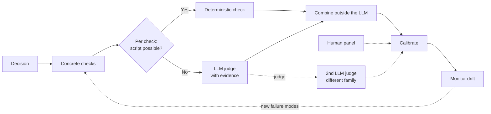

*The strategy was simple: have the model score every project proposal 1-5, and fund anything that came back a 4 or higher. Overnight, a stack of proposals turned into a decisive shortlist; clear winners up top, everything else below the line. Success! Then the year played out. The 4.2 we backed was quietly shelved. A 3.4 we'd passed on became the thing we wished we'd funded. The scores had sorted a real budget with total confidence, and the confidence was the problem. (Composite scenario, simplified for illustration.)*

Any time you ask an LLM or a [Copilot Studio Agent](https://learn.microsoft.com/en-us/microsoft-copilot-studio/) to "rate this from 1-5" (a proposal, an answer, a document, a support reply, a summary) you've probably seen that gap. The good news: you don't have to choose between "let an LLM score it" and "get a number you can trust." You just have to stop asking for the number directly.

Instead, define the decision first, break "quality" into small checks the model can answer reliably, pick the simplest scoring method for each, combine the answers outside the model, back every judgment with evidence, calibrate against references, and watch for drift.

## The short version of why scoring 1-5 fails

Two things go wrong at the same time:

- **The scale is vague.** Nobody can say consistently what separates a 3 from a 4, and the middle of the scale absorbs everything: *partly right*, *fine but incomplete*, *minor glitch*, *good but not great* all land on the same digit.
- **The judge isn't steady.** An LLM's score shifts with how the prompt is worded, the order it sees things in, how long the answer is, and which model version is running. It will even quietly favor answers that came from its own model family.

Both failure modes are well documented in the LLM-as-judge research literature. We pulled the relevant citations and evidence together in the [LLM 1-5 Scoring whitepaper](/mcscatblog/assets/posts/better-llm-scoring/20260626_LLM1-5Scoring_WhitePaper.pdf){:target="_blank"} if you want to dig into where each of these claims comes from.

The fix isn't a cleverer prompt. It's to let the LLM judge small, concrete things, and to build the final number yourself, from rules you control. The rest of this post is how to do that, in the order you'd actually do it.

## 1. Start from the decision, not the score

Before you measure anything, answer one question: **what will you do with this score?** Ship or hold? Pick between two models? Decide whether a change is real progress? Find out which part is weak?

This sounds obvious, and it's the step most people skip. It matters because the decision quietly sets everything that follows: which things you measure, how you score them, and how you add them up. Write it in one sentence: *"decide whether the summary agent is ready for pilot by checking faithfulness and completeness against a reviewed set"*.

## 2. Break "quality" into a few concrete checks

First name the few dimensions that actually matter, then turn each into a specific, checkable condition rather than a vague quality. "Is it good?" becomes "Does every claim cite a source that actually supports it?" Draw the checks from real failures you've seen, keep them few and non-overlapping, and mark which ones are dealbreakers.

## 3. Score each check the simplest way that works

There's no single right method. Work down this ladder and stop at the first one that fits the check:

- **Can a script check it?** Then don't use an LLM at all. Format validity, a required field, a present citation, a correct tool call, these are the cheapest and most reliable signals, so run them first.
- **Otherwise, ask the judge a yes/no question, with evidence.** This is your default. Breaking a fuzzy quality into a few binary questions is the single biggest reliability win available.
- **Use *pass / minor / major / fail* labels only when partial credit genuinely matters** and the in-between states are clearly defined. It buys you nuance at the cost of bringing back some of the 3-vs-4 fuzziness, so use it sparingly.
- **Comparing two systems or versions?** Don't score each in isolation, ask the judge *which one is better, A or B*. Head-to-head calls are noticeably steadier than absolute scores.
- **If your model can report how confident it was** across the options, you can turn that into a finer score, useful when everything bunches up near the top.

Note that model choice does affect scoring behavior, but there is no universal best judge. Reasoning models can help when the judgment requires multi-step evidence matching, but they still need calibration. Treat model choice as part of the evaluation design: test candidate judges against the same human-reviewed benchmark, measure agreement and disagreement patterns, and pick the judge that is most reliable for your rubric.

> The biggest reliability win is not a better 1-5 prompt. It is replacing one fuzzy score with several binary, evidence-backed checks.
{: .prompt-tip }

## 4. Combine the results with a rule you write down

This is where most of the real design lives, and the first rule is: **don't average the labels.** Averaging *pass/fail* results into a pass-rate is fine; averaging genuinely continuous scores is fine; averaging *minor/major/fail* style labels into a 3.7 is exactly the trap from the top of this post. Pick a combining rule that fits the decision instead:

| What you're deciding | How to score | How to combine |
| --- | --- | --- |
| Ship or hold (a release gate) | Pass/fail checks; flag the dealbreakers | **Gating**: any critical fail blocks release, however strong the rest is |
| Did a change make things worse? | Pass/fail checks, or A vs. the last good version | **Threshold** (too few pass) or head-to-head vs. baseline |
| Which system is better? | Ask which of two is better, many times | **Win-rate / ranking** |
| Where is it weak? | Per-check results | **Keep them separate**, no single number |
| Is live quality holding? | Pass/fail checks | **Track the pass-rate** and watch for drift |

Whatever rule you pick, write it down, version it, and keep it *outside* the model, so the same inputs always produce the same, inspectable result.

Once you have a rule that works, package it so you can drop the same scoring contract into every project instead of rewriting it. In Copilot Studio, that means a reusable [Modern Agents skill]() when the checks are deterministic or shared across agents, and a [connected agent](https://learn.microsoft.com/en-us/microsoft-copilot-studio/authoring-connected-agents){:target="_blank"} pattern when the evaluation process needs its own workflow, tools, memory, or human review path. Keep the combining rule outside the LLM, so the final decision stays inspectable and repeatable.

## 5. Make the model show its work

Every judgment should arrive with the evidence behind it: the quote, the field, the line that justified the call. This is what makes a score auditable: when a number looks wrong, you can see exactly why it landed where it did, instead of re-litigating a mystery digit.

## 6. Check it against two references

Calibrate against **two independent things**: a set of examples a human has reviewed, and a **second LLM judge from a different model family**. The different family matters, a model tends to favor its own kind, so don't let it grade its relatives. Where the human labels themselves are shaky, use more than one reviewer and track how often they agree. The point of the second judge isn't a smoother average, it's disagreement as a signal: split cases go to a human, and the rubric item that caused the split becomes the next thing to sharpen.

One honest caveat worth keeping in mind: all of this makes your scores **repeatable and auditable, not automatically correct**. A reproducible number can still be measuring the wrong thing. Calibration is what keeps it pointed at reality, which is why it's never quite finished.

This architecture buys you reliability, same input, same score, same evidence trail, not automatic validity. A reproducible number can still measure the wrong thing. Calibration is what keeps it pointed at reality.
{: .prompt-info }

## 7. Watch it over time, and prove every change

Scores drift as models and usage change, so track the pass-rate and the shape of the distribution, plus how well your second judge still agrees with periodic human spot-checks. When that agreement slips, recalibrate. And whenever you tweak the scoring system, **validate the change against a fixed benchmark**, confirm it raised agreement with your trusted references without breaking items you were already getting right, and add the new disagreements so the benchmark keeps covering your blind spots.

When you're switching architectures for the first time (e.g., retiring a 1-5 prompt for this pipeline) run both against the same benchmark and compare each to the human labels, not to each other. Split the errors into false passes and false blocks; those two failures usually cost you very differently.

This is also what makes scoring usable inside an [automated agent improvement loop](): when the judge is stable and the benchmark is fixed, every iteration on the agent gives you a real before-and-after instead of a fresh 1-5 guess on each run.

## Putting it all together: scoring the proposals

Let's walk the funding-proposal story from the top through the whole methodology.

**1. The decision.** The score exists to answer one question: *should this proposal move to the funded shortlist, get sent back for rework, or be declined?* Three outcomes, not a number.

**2. The checks.** Instead of one "quality" rating, break the proposal into a handful of concrete things a reader can actually verify:

- **Problem clarity**: is the problem stated with a concrete user, situation, and current cost?
- **Evidence**: are the claims backed by data, references, or prior work that actually exist?
- **Feasibility**: is there a plan, a team, and a realistic timeline?
- **Budget sanity**: do the line items add up and match the plan?
- **Strategic fit**: does it map to a stated priority for this funding cycle?
- **Dealbreakers**: is any required section missing, are there unverifiable claims, or are there conflicts of interest?

**3. The scoring method for each check.** Work down the ladder:

| Check | Method | Why |
| --- | --- | --- |
| Required sections present | Script | It's a field-existence test |
| Budget adds up | Script | It's arithmetic |
| Problem clarity | LLM yes/no with evidence | Fuzzy but decomposable |
| Evidence backed | LLM yes/no per claim | One binary call per citation |
| Feasibility | LLM *pass / minor / major / fail* | Partial credit genuinely matters here |
| Strategic fit | LLM head-to-head against the priority list | Comparison is steadier than an absolute score |

**4. The combining rule.** Written down, versioned, applied outside the model:

- Any dealbreaker → **decline**, regardless of the rest.
- Fewer than 4 of 5 non-dealbreaker checks pass, or feasibility is *fail* → **rework**.
- Everything else → **shortlist**.

Notice there's no 4.2 anywhere. The output is a decision plus the check-by-check breakdown behind it.

**5. Evidence.** Every check comes back with the quote or line it's based on: the sentence stating the problem, the citation being verified, the budget row that didn't add up. When someone challenges a decline, you don't re-run the model, you open the report.

**6. Calibration.** Take a small set of proposals a human panel has already labeled (funded, reworked, declined) and run them through the pipeline. Where the pipeline and the panel disagree, figure out which is wrong and fix it. Then run the same set through a second LLM judge from a different model family; if the two judges disagree a lot, your checks are still too fuzzy. Add every disagreement back into the reference set.

> Calibration is not a one-time step. Every proposal cycle produces new edge cases, and those are exactly what the reference set should grow to cover.
{: .prompt-tip }

**7. Monitoring.** Track the shortlist rate, the rework rate, and how often the second judge agrees with the first, cycle over cycle. If the shortlist rate quietly doubles, something drifted, the model, the prompt, or the incoming proposals, and it's time to recalibrate before another year's worth of decisions get made on autopilot.

Same proposals, same model, very different outcome from "rate this 1-5." The 4.2 either passes every check with evidence you can point at, or it lands in the rework pile with a specific list of what to fix. The 3.4 you would have skipped either shows up on the shortlist for a reason, or gets declined for a reason. Either way, no one has to defend a mystery digit.

## The bottom line

It was never a question of whether an LLM *can* score. The question is whether the score means anything and a single 1-5 rating bundles a vague scale together with an unsteady judge. Treat the LLM as **one part of how you measure, not the measuring tape itself**: decision first, concrete checks second, your own combining rule third, and calibration all the way through.

Build the proposal scores that way, and the 4.2 and the 3.4 stop being mystery numbers. You see which checks each one passed and failed and "fund anything above a 4" finally becomes a decision someone can defend.

What is a score your team trusted until it was too late? Share the lesson in the comments.

---

*Want the deeper version including the measurement theory, the methods in full, and the research behind each point? We wrote it all up in the [LLM 1-5 Scoring whitepaper](/mcscatblog/assets/posts/better-llm-scoring/20260626_LLM1-5Scoring_WhitePaper.pdf){:target="_blank"}.*
