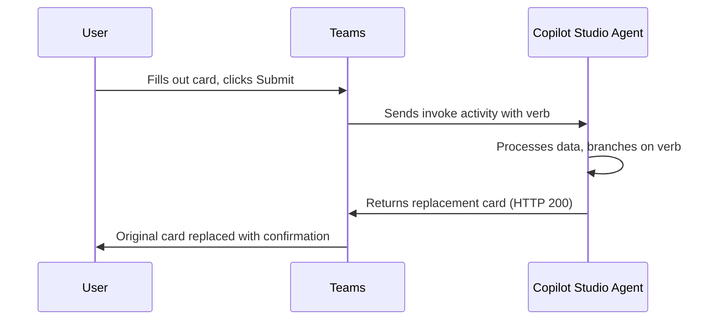

You've shipped an agent with an Adaptive Card form. A user fills it in, clicks Submit, and the data they just typed vanishes. The card sits there looking perfectly fillable, so they assume it failed, fill it in again, hit Submit a second time, and get an error for their trouble.

Nothing actually went wrong. The agent received the data and processed it fine. The card just never told the user that, and that small gap turns into a real support problem once you've rolled the agent out to thousands of employees.

The good news is that it's solvable. The catch is that the right fix depends entirely on where your agent lives. The platform hands you a different lever in a custom web portal than it does in Microsoft Teams, so this post walks through both.

## Why this happens

Adaptive Cards, by default, don't have a built-in "disable after submit" behavior. When a user submits a card:

1. The input fields clear (data disappears visually)
2. The card remains interactive
3. A second submission triggers an error because the conversation has already moved on

This is a platform behavior, not a bug in your agent logic. Your agent received and processed the data just fine. But the user doesn't know that.

## Two patterns, two channels

The fix depends on where your agent is surfaced:

| Channel | Pattern | Mechanism |
|---|---|---|
| Web portals (WebChat) | Attachment middleware | Disable card client-side |
| Microsoft Teams | Universal Actions | Replace card server-side |

Let's walk through both.

## Pattern 1: Custom Web Portals (BotFramework-WebChat)

> This pattern works for agents embedded in custom web portals or Employee Self Service (ESS) pages using the BotFramework-WebChat SDK.
{: .prompt-info }

The idea is simple: use an **[attachment middleware]()** in WebChat that checks whether a card belongs to the most recent bot message. If it doesn't (meaning the user has already moved past it), render the card as disabled.

### The core logic

The middleware intercepts every card render and compares the activity to the latest message in the store:

```javascript
const attachmentMiddleware =
  () =>
  next =>
  ({ activity, attachment, ...others }) => {
    const { activities } = store.getState();
    const messageActivities = activities.filter(
      activity => activity.type === 'message'
    );
    const recentBotMessage = messageActivities.pop() === activity;

    switch (attachment.contentType) {
      case 'application/vnd.microsoft.card.adaptive':
        return (
          <AdaptiveCardContent
            actionPerformedClassName="card__action--performed"
            content={attachment.content}
            disabled={!recentBotMessage}
          />
        );

      default:
        return next({ activity, attachment, ...others });
    }
  };
```

The key line is `disabled={!recentBotMessage}`. Once the bot sends a new message, the previous card becomes disabled. Inputs are read-only, buttons are non-functional.

### Visual feedback with CSS

To make it clear that a button has been used, add a CSS class that styles performed actions:

```css
#webchat .card__action--performed {
  background-color: #0063b1 !important;
  border-color: #0063b1 !important;
  color: White !important;
}
```

This gives the submitted button a solid blue "done" look, so users have a clear visual signal.

### Mounting it

Pass the middleware when rendering WebChat:

```javascript
<ReactWebChat
  attachmentMiddleware={attachmentMiddleware}
  directLine={directLine}
  store={store}
/>
```

> This is a **client-side** solution. It prevents resubmission in the UI but doesn't enforce it server-side. For most ESS scenarios, this is sufficient.
{: .prompt-warning }

The full working sample is available in the [BotFramework-WebChat repo](https://github.com/microsoft/BotFramework-WebChat/tree/main/samples/05.custom-components/l.disable-adaptive-cards).

## Pattern 2: Microsoft Teams (Universal Actions)

Here's where things get interesting. The WebChat middleware doesn't apply in Teams because you don't control the client. If you're designing agents for Teams more broadly, the [Teams agent patterns post]() covers the wider design considerations. For this problem, we reach for [**Universal Actions**](https://learn.microsoft.com/en-us/adaptive-cards/authoring-cards/universal-action-model), the model that lets an agent respond to a card action and hand back a fresh card in its place.

### How Universal Actions work



Instead of `Action.Submit`, the card uses `Action.Execute` with a unique **verb**. When the user clicks the button, Teams sends an invoke activity to Copilot Studio. A topic picks it up, processes the data, and returns a new card. Teams swaps the original card for the new one.

The user sees their form replaced with a confirmation. No ambiguity, no resubmission.

### Step 1: Design the card with `Action.Execute`

Start from any Adaptive Card. If you'd rather not hand-author the JSON, you can [let Copilot generate the card for you]() and tweak the actions from there. The critical change is in the action buttons. Replace `Action.Submit` with `Action.Execute` and add a `verb`:

```json
{
  "type": "ActionSet",
  "actions": [
    {
      "type": "Action.Execute",
      "title": "Submit",
      "verb": "feedbackSubmitForm",
      "data": { "actionType": "submitted" },
      "fallback": "Action.Submit",
      "style": "positive"
    },
    {
      "type": "Action.Execute",
      "title": "Skip",
      "verb": "feedbackSkipForm",
      "data": { "actionType": "skipped" },
      "associatedInputs": "none",
      "fallback": "Action.Submit"
    }
  ]
}
```

> Use `"fallback": "Action.Submit"` so the card degrades gracefully in clients that don't support Universal Actions.
{: .prompt-tip }

### Step 2: Send with a "Send a message" node

In Copilot Studio, use a **Send a message** node with the Adaptive Card JSON. Don't use the "Ask with Adaptive Card" node. That node uses `Action.Submit` internally and won't trigger the invoke/refresh flow.

### Step 3: Create a listener topic

Create a topic that triggers on the invoke activity. Parse the incoming payload using this schema to extract the verb:

```yaml
kind: Record
properties:
  action:
    type:
      kind: Record
      properties:
        data:
          type:
            kind: Record
            properties:
              userResponse: String
        id: String
        title: String
        type: String
        verb: String
  trigger: String
```

Then branch on `resultData.action.verb`:
- `feedbackSubmitForm` → process the input, return a thank-you card
- `feedbackSkipForm` → return a skipped confirmation

### Step 4: Return the replacement card

The response must follow the Universal Action response format:

```json
{
  "statusCode": 200,
  "type": "application/vnd.microsoft.card.adaptive",
  "value": {
    "type": "AdaptiveCard",
    "$schema": "https://adaptivecards.io/schemas/adaptive-card.json",
    "version": "1.5",
    "body": [
      {
        "type": "TextBlock",
        "text": "✅ Thank you for your feedback!",
        "weight": "Bolder",
        "size": "Medium",
        "wrap": true
      },
      {
        "type": "TextBlock",
        "text": "Your response has been recorded.",
        "wrap": true,
        "isSubtle": true
      }
    ]
  }
}
```

The original card is replaced. No buttons, no inputs, just a clean confirmation.

> Test this in Teams directly, not the Copilot Studio test canvas. The invoke/refresh flow may not work in the test panel.
{: .prompt-warning }

The complete walkthrough with screenshots is in [Nghiem Doan's repo](https://github.com/nghiemdoan-msft/AdaptiveCardInCopilotStudio).

## Comparing the two patterns

| Aspect | Web Portal | Teams |
|---|---|---|
| **Mechanism** | Client-side middleware | Server-side card swap |
| **User sees** | Greyed-out, buttons disabled | A fresh confirmation card |
| **Complexity** | Moderate (React/JS) | Moderate (topic + schema) |
| **Resubmission** | Blocked in UI | Impossible (replaced) |
| **Works in Teams** | ❌ | ✅ |
| **Works in WebChat** | ✅ | ❌ (n/a) |

## Key takeaways

- Adaptive Cards don't natively disable after submission. You need to implement this yourself.
- For **custom web portals**, use the WebChat attachment middleware to disable cards client-side. It's clean, visual, and straightforward.
- For **Microsoft Teams**, use Universal Actions with `Action.Execute` and a verb. A Copilot Studio topic listens for the invoke, processes the data, and returns a replacement card.
- Both patterns solve the same UX problem through different mechanisms. Pick the one that matches your channel.
- Always include `"fallback": "Action.Submit"` in your Universal Action cards for backward compatibility.

## A polished agent is a series of small moments

Adaptive Cards are one of the best ways to collect real input inside an agent, but input without feedback is just guesswork for the person on the other side. The gap between an agent that feels broken and one that feels finished often lives in a single moment: what the user sees the instant they click Submit. Close that moment, client-side in WebChat or server-side in Teams, and you remove one of those small, quiet frustrations that erode trust in an agent long before anyone bothers to file a bug.

So before you ship your next card, click your own Submit button and watch what happens. If the answer is "nothing," you now know exactly how to fix it.

How are you handling the after-submit moment in your own agents? I'd love to hear about it in the comments.
