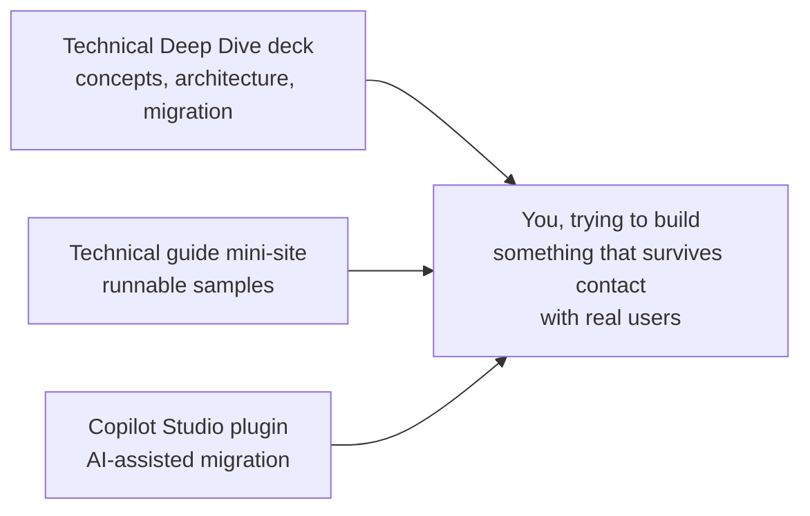
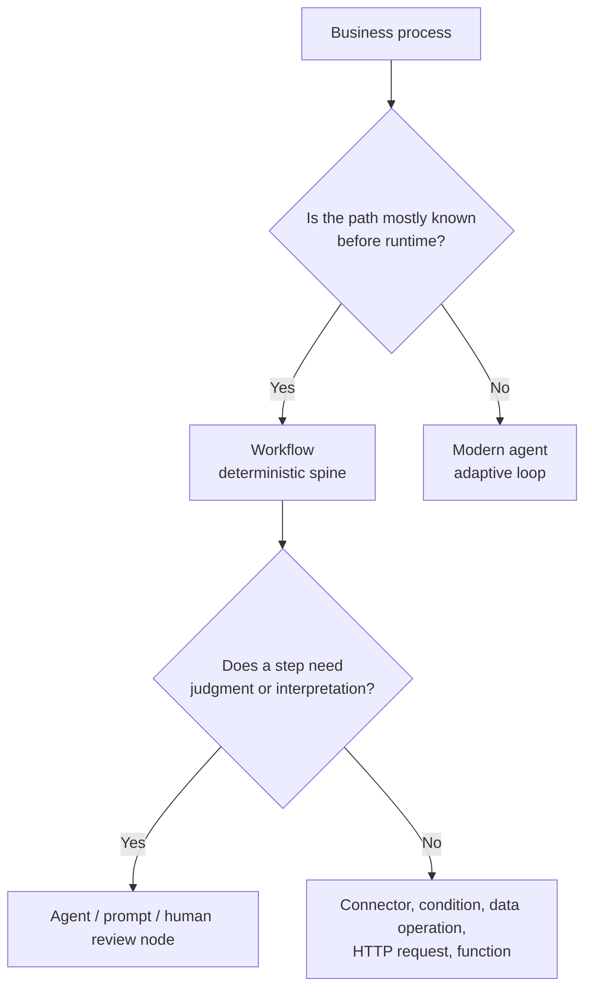
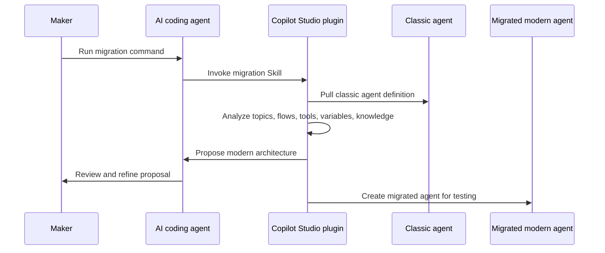

If you've been building classic Copilot Studio agents for a while, the new experience can look familiar enough to be tempting, but different enough to be dangerous. There are still agents, tools and knowledge. But under the hood, the orchestration model has changed quite a bit.

Classic orchestration was mostly about building, selecting, and executing a plan. The new orchestrator keeps deciding from the latest state. It can ask a smarter clarification question, call a tool, delegate to a connected agent, load a Skill, run code, observe the result, and then decide what to do next. That is a much better fit for messy, multi-step work, but it also means we need better guidance than "click around and hope the reasoning view likes you." A good introductory article on this matter can be found at: [Modern Agents Have Skills Now]().

So this post is a complement to that article. It contains three resources you should know about if you want to understand, test, and start moving toward the new Copilot Studio experience:

1. the **Copilot Studio Technical Deep Dive** deck,
2. the **new Copilot Studio technical guide and samples** mini-site,
3. the **Copilot Studio plugin** for AI coding agents, including the new migration Skill.

> The new orchestrator is not just "classic orchestration, but shinier." If you treat it as a one-to-one porting target, you'll probably rebuild the old constraints in a new runtime. The better move is to rethink the task, the boundaries, and where adaptive reasoning actually belongs.
{: .prompt-info }

## The short version

If you only remember one thing from this post, make it this:

| If you want to... | Start with... |
| --- | --- |
| Explain the new orchestrator to a technical audience | The **Technical Deep Dive** deck |
| See the new orchestrator working end to end | The **technical guide mini-site** |
| Try migrating a classic agent with an AI coding agent | The **Copilot Studio plugin** |

The three resources are meant to work together. The deck gives you the concepts. The mini-site gives you something real to deploy and inspect. The plugin gives you a path from an existing classic agent to a proposed modern architecture.

## 1. The technical deep dive deck

The first resource is the **Copilot Studio Technical Deep Dive** deck, which you can [download here](https://aka.ms/CopilotStudioDeepDiveDeck). This is the one to use when you want to understand, or need to explain, *what* changed and *why it matters* to people who are going to build, review, migrate, or govern agents.

It covers the new Copilot Studio experience as one platform for enterprise agents and workflows: conversational, autonomous, or anything in between. The useful part is that it does not stop at the marketing layer. It gets into the engineering mental models:

- why modern agents move beyond classic orchestration,
- how the new orchestrator differs from the classic plan-then-execute model,
- how to think about agents versus workflows,
- what belongs in instructions, tools, knowledge, memory, Skills, and connected agents,
- how to migrate from classic agents without mechanically copying every old artifact,
- where the current gaps and trade-offs are.

The deck's core distinction is simple, but important:

| Classic orchestration | New orchestrator |
| --- | --- |
| Build a plan, then run it | Decide the next step from the latest state |
| More predictable, but rigid | More adaptive, but needs good boundaries |
| Maker-authored paths carry most of the logic | Instructions, Skills, tools, memory, and connected agents shape the loop |
| Detours can interrupt the plan | Detours can become part of the reasoning path |

That last line is the one that matters in practice. A real user does not follow your flowchart. They ask side questions. They change their mind. They give you half the information, then correct it, then ask "actually, can you also check this other thing?" Classic orchestration can handle some of that, but it tends to become brittle once the task is not really a pre-authored path anymore.

The new orchestrator is designed for that kind of work.

### The new component model

One slide I keep coming back to is the component model. It separates the things we used to blur together:

| Component | What it should carry |
| --- | --- |
| **Instructions** | Role, scope, tone, safety rules, and behavior that is always true |
| **Knowledge** | Searchable facts from documents, sites, files, or structured sources |
| **Tools / MCP servers** | Live lookups, actions, CRUD operations, and system integration |
| **Memory** | Persistent user or preference context |
| **Code Interpreter** | Ad hoc analysis, file handling, data manipulation, and local computation |
| **Skills** | Reusable procedures the orchestrator can load when a scenario needs them |
| **Connected agents** | Specialist subdomains with their own instructions, tools, knowledge, and Skills |
| **Evaluations** | The evidence that the thing still works after you "just changed one prompt" |

If you've read [Modern Agents Have Skills Now](), this should feel familiar. Skills are not just another place to dump instructions. They are the situational part of the agent's know-how, loaded only when the task calls for it. The deck extends that idea into the wider architecture: choose the smallest component that makes the behavior reliable, inspectable, and safe inside the loop.

{: .shadow }
_A slide from the Technical Deep Dive deck showing the new component model. Instructions, knowledge, tools, memory, Skills, and connected agents all have their own responsibilities._

That design rule is doing a lot of work.

### Agents and workflows are not enemies

Another useful part of the deck is the workflow guidance. The old question was often "Should I build an agent or a flow?" The new question is better:

> Which parts of this process are known before runtime, and which parts need reasoning?
{: .prompt-tip }

If the path is known, put it in a workflow. If a step needs judgment, use an agent node, an inline agent, a published agent, a Microsoft 365 Copilot agent, or a human review node. If the whole path depends on what the agent discovers along the way, use an agent.

That is the "agent on rails" model. You do not have to choose between full determinism and full autonomy. You can put reasoning exactly where it earns its keep.

This is also where migration conversations get more honest. Not every classic agent should move to the new orchestrator. Some should stay classic because they work. Some should become Microsoft 365 declarative agents. Some customer-facing voice/contact-center scenarios belong elsewhere. And some complex, autonomous, multi-step agents are exactly where the new Copilot Studio experience starts to shine.

## 2. The technical guide mini-site and samples

The second resource is our new technical misite and sample collection, which you can find at: [https://microsoft.github.io/new-copilot-studio-tech-guide/](https://microsoft.github.io/new-copilot-studio-tech-guide/)

This is the place to go when you want to move from "I understand the slide" to "I want to see the thing actually run."

{: .shadow }
_A preview of the mini-site homepage showing the BlastBox Omega sample and the two scenarios: Self-Serve Card Reissue and Block Party Trade-Up._

The site is built around **BlastBox Omega**, a fictional retro-future game store. It is not just a story wrapped around screenshots. It is a deployable, working sample showing the new agent experience with:

- parent agents,
- connected agents,
- inline MCP servers,
- Skills,
- runtime Python,
- generated files,
- multi-turn orchestration.

The landing page explains the building blocks, and the scenarios show transcripts you can run. The GitHub repo includes the deployable solution and the scripts needed to stand it up in a Power Platform environment.

> The best way to build confidence with the new orchestrator is not to stare at an architecture diagram until it becomes friendly. Deploy a sample, run the prompts, open the reasoning view, and watch what the agent actually does.
{: .prompt-tip }

### What the sample demonstrates

There are two main scenarios today.

#### Self-Serve Card Reissue

A customer lost their BlastPass card and wants a replacement. The **Returns & Service Assistant**:

1. asks for the membership ID,
2. calls the Membership MCP server to look up the record,
3. verifies identity using two factors,
4. calls `reissue_card`,
5. runs a Skill that generates a PNG membership card,
6. returns `blastpass_card.png`.

This is a nice small scenario because it shows an important pattern: **do not make a write operation until the agent has verified the preconditions**. The Skill guides the procedure, the MCP tool performs the action, and the Python script produces the file.

#### Block Party Trade-Up

This is the flagship scenario. A store associate has a customer whose console failed ten days after purchase. The customer might want a replacement, a refund, an upgrade, and also wants to cancel their membership. Naturally, because customers have never once respected our carefully scoped demo paths.

The **Store Associate Assistant** coordinates:

- the **Store Policy Agent** for warranty and refund rules,
- the **Inventory & Fulfillment Agent** for stock, alternatives, restock dates, and game compatibility,
- the Membership MCP server for membership lookup and cancellation,
- the Order Management MCP server for orders, returns, and RMA actions,
- Python Skills for prorated refund math, points reconciliation, and PDF generation.

The result is a complete settlement: warranty swap, membership cancellation, store credit applied toward the upgrade, BlastPoints reconciliation, and a generated PDF slip.

That is the value of the sample. It shows the orchestrator doing more than answering a question. It coordinates multiple moving parts, keeps state across turns, asks the one missing gating question, reuses earlier results, and produces an actual artifact.

### Why the mini-site matters

The mini-site is useful because it gives you a reference architecture you can inspect. You can see what belongs where:

| Concern | In the sample |
| --- | --- |
| Policy reasoning | Store Policy Agent + Policy RAG MCP |
| Inventory and fulfillment | Inventory & Fulfillment Agent + Warehouse MCP |
| Membership actions | Membership MCP |
| Order actions | Order Management MCP |
| Repeatable procedures | Skills |
| Exact math and file generation | Python scripts bundled in Skills |
| End-user or associate experience | Parent agents |

That separation is the point. A large modern agent should not become one giant instruction blob with 43 tools and a prayer. Use connected agents for real specialist domains. Use Skills for procedures. Use MCP tools for system operations. Use code for exact computation. Use evals to keep yourself honest.

If you want more background on how Skills behave in Copilot Studio, the [Skills post]() goes deeper into the loading model, routing descriptions, and when to split logic out of instructions.

## 3. The Copilot Studio plugin and the migration Skill

The third resource is the new, revamped version of the Copilot Studio plugin for AI coding agents: [https://github.com/microsoft/copilot-studio-plugin](https://github.com/microsoft/copilot-studio-plugin)

If you saw the earlier [Claude Code plugin demo](), the idea will be familiar: use your AI coding agent to work against Copilot Studio assets locally, reason over the structure, make changes, and push them back.

What is new here is support for the new orchestrator, and specifically a new **migration Skill**.

{: .shadow }
_A screenshot of the Copilot Studio plugin migration flow. The plugin analyzes a classic agent, proposes a modern architecture, and generates a migrated agent for testing._

The migration flow is meant for the moment every customer eventually reaches: "We have a classic agent. We know the new orchestrator would probably handle this better. But what do we actually build?"

The plugin's migration command is designed to help with that first jump. You trigger the migration workflow from your AI coding agent. The plugin pulls the classic agent from the web, analyzes its current structure, proposes a modern architecture, and creates a new migrated agent that you can test.

### What the migration workflow does

At a high level, the workflow is:

The important word here is **propose**. Even if in our tests it behave very well, the plugin is not a magic "make my architecture correct" button. It is closer to a very fast migration assistant that can read the current agent, apply the migration mental model, and give you a (very good) starting point, but the final decisions still rest with you and your eval runs.

And honestly, that is exactly where AI coding agents are useful. They are good at exploring a structure, summarizing patterns, generating candidate files, and doing the repetitive mechanical work. They still need you for design judgment.

> Treat the generated migration as a first draft: run it, inspect it, compare it against your old evals, and decide if it meets your requirements or you need to make adjustments.
{: .prompt-warning }

### What "migration" should mean

This is where I want to be slightly annoying, but only because future-you will thank me.

Migration should not mean:

- every classic topic becomes one Skill,
- every Power Fx expression becomes one Python script,
- every variable becomes memory,
- every flow becomes a tool,
- every existing design choice gets preserved because it existed.

That is not migration, but rather an archaeology with YAML.

The better approach is:

1. understand what task the classic agent is responsible for,
2. identify the user outcomes that must still work,
3. inventory the old topics, tools, variables, and flows,
4. decide which modern components should carry each responsibility,
5. generate the modern agent,
6. run evals against the core journeys,
7. iterate until the migrated agent behaves better, not just differently.

The plugin helps extacly with this, by following that very same mental model.

## Key takeaways

Here is the simplest way I would use those three resources together:

| Step | Resource | Outcome |
| --- | --- | --- |
| 1 | Technical Deep Dive deck | Build the shared mental model |
| 2 | Mini-site sample | Let people see the orchestrator working |
| 3 | Plugin migration Skill | Try the model against one real classic agent |

If you've been reading this far, thank you. Here are the key takeaways I would leave you with:

- The new Copilot Studio orchestrator is a different mental model, not just a new UI.
- Use the **Technical Deep Dive** deck to explain the architecture, migration model, agents-versus-workflows decision, and current gaps.
- Use the **technical guide mini-site** to deploy and inspect real samples with connected agents, MCP servers, Skills, Python runtime, and generated files.
- Use the **Copilot Studio plugin** when you want an AI coding agent to analyze a classic agent and generate a proposed modern migration.
- Do not port one-to-one. Re-architect around tasks, outcomes, boundaries, and evals.
- Keep instructions lean, move situational procedures into Skills, use tools for system operations, and use workflows where the path should be deterministic.

The new orchestrator gives us a much bigger design space. That is exciting, and also a little dangerous, which is usually where the interesting engineering starts.

If you try the mini-site samples or the migration Skill, I would love to hear what surprised you. Did the proposed architecture match how you would have redesigned the agent, or did it make a choice you would push back on?
