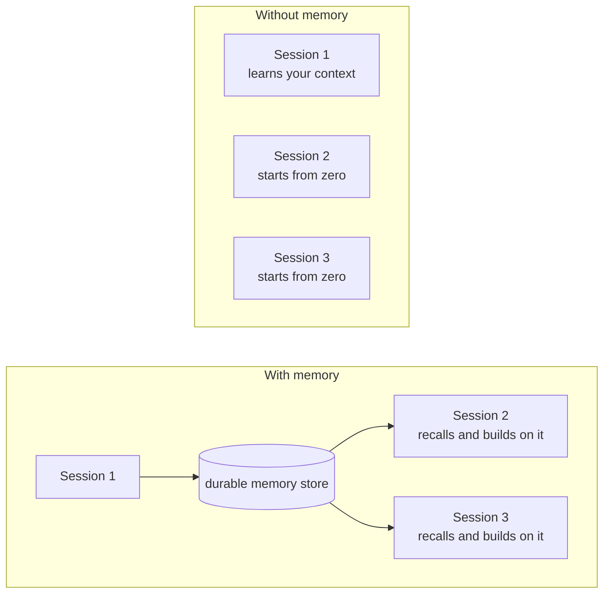
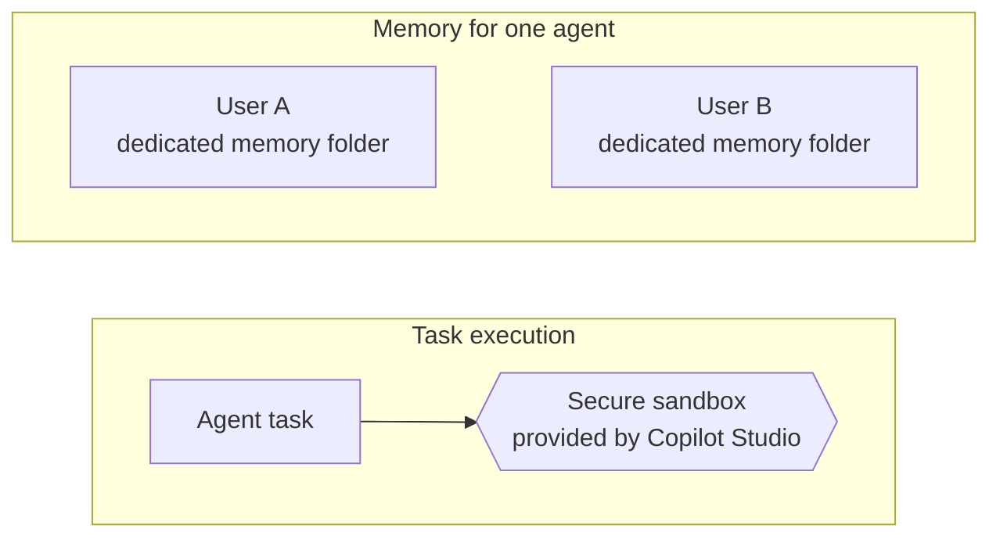
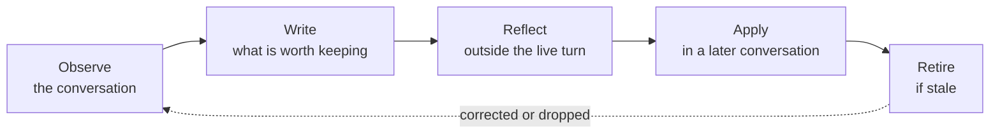

Large language models are stateless. Every conversation starts from nothing. Memory is the engineering we wrap around a model to create the illusion of continuity, and it is what turns an agent from a clever tool into something closer to a colleague.

## Why agents need memory

A language model only knows what is in front of it right now. Close the window, open a new one, and everything is gone: the preferences you explained, the file naming convention you corrected twice, the fact that your finance approver changed in March. Every session begins as a stranger.

That is fine for a search box. It is a poor fit for a co-worker.

Think about how a scientist actually works. Partway through a project she asks herself, *what did we try last Tuesday?* Not out of nostalgia, but so she doesn't burn a week repeating an experiment that already failed. Her answer lives in a lab notebook. And that notebook only works because she is quietly good at three things: knowing what is **worth writing down**, knowing **how to find the right page** later, and knowing when to **cross something out** because it is no longer true.

Those same three problems, what to write, what to recall, and what to forget, are exactly what an agent's memory system has to solve.

_The continuity gap. Without memory, each session is sealed off from the last. Memory is what lets knowledge cross the boundary of a single conversation._

## Two horizons: short-term and long-term

### Short-term memory is the live context window

Short-term memory is everything the agent can see *right now* without going to look it up: the current conversation, recent tool results, and its own in-progress reasoning. It is immediate and it is free to access, but it is finite. Conversations grow. Context windows do not.

The engineering answer is **compaction**: as the conversation approaches the limit, older turns are compressed into a running summary while recent turns are kept verbatim. Compaction is typically invoked one of two ways: deliberately, by the user, or automatically by the runtime once context pressure crosses a threshold. Either way, the agent keeps the thread of the conversation without keeping every word of it.

### Long-term memory persists outside the session

Compaction buys room inside one conversation. It does nothing for the next one. Long-term memory is knowledge that outlives the session entirely, which means it has to be stored somewhere durable: a file store, a database, an index. The runtime then does two jobs. It **writes** to that store during and after a conversation, and it **retrieves** the relevant pieces back into context when they are needed.

| | Short-term memory | Long-term memory |
|---|---|---|
| **What it is** | The live context window | Knowledge stored outside the session |
| **What's in it** | Current conversation, recent tool results, in-progress reasoning | Episodic, semantic, and procedural knowledge |
| **Lifespan** | Volatile, gone when the window closes | Durable, survives across sessions |
| **Access** | Immediate and free to read, but finite | Must be deliberately written, then retrieved |
| **Key technique** | Compaction | Write and recall |

## Three kinds of long-term memory

"Long-term memory" is really an umbrella over three distinct kinds of knowledge. They are formed differently, they are used differently, and, importantly for safety, they carry very different risk.

| Kind | What it is | Example |
|---|---|---|
| **Episodic** (experiences) | The agent's record of specific past events: when, where, how. Think of these as dated entries in a diary. | *Tuesday:* the user asked me to refund order XYZ, and I escalated it to a supervisor. |
| **Semantic** (facts) | Distilled episodic memory. The agent turns experiences into standing facts, which also means it has to notice when a fact has been superseded. | *Experience:* "Alice said she's moving to Berlin." → *Fact:* "Alice lives in Berlin." |
| **Procedural** (skills) | Learned routines, workflows, and rules of thumb: the agent's muscle memory. The difference between knowing a policy and knowing how to execute against it. | *Semantic:* "Expenses over $500 need approval." *Procedural:* pull the receipt, categorize, check against policy, route to the approver, file it, confirm back. |

That last row is worth sitting with. Procedural memory is a close cousin of a Skill, a reviewed routine the agent can run on demand. If you have read [Agents Have Skills Now](), you already know the shape of it: know-how, packaged so it can be applied again.

> The leap isn't that the agent knows a fact. It's that the agent knows how to do the task.

## How Copilot Studio approaches memory

[Memory in Copilot Studio](https://learn.microsoft.com/en-us/microsoft-copilot-studio/agents-experience/memory-overview) follows a deliberately concrete model: an agent saves a user's memory as files in a dedicated folder in Microsoft-managed storage. Each agent maintains a separate folder for every user, and the agent reads from and writes to that folder across interactions.

### Capture, store, and apply

Memory follows a three-step lifecycle:

1. **Capture**: The agent records signals such as preferences and relevant context shared during a conversation.
2. **Store**: Those signals are saved as files in the user's dedicated memory folder.
3. **Apply**: In later interactions, the agent reads that memory to inform its responses or decisions.

The maker decides whether to turn Memory on for an agent from the **Build** tab. The memories themselves remain private to the individual user: other users and the maker can't view them.

Memory is also user-controlled. The first time someone interacts with a memory-enabled agent in a new channel, the agent's response includes a link to that user's memory portal. The portal opens in a new browser tab, where the user can review what the agent has stored or clear all memories. In chat, the user can ask the agent to describe what it remembers, update a specific memory, forget something, or display the portal link again.

### Separated by user, executed in a secure sandbox

Two durable boundaries shape the design. First, every user gets a dedicated memory folder for each agent, so one person's context isn't shared with another. Second, agents powered by the GitHub Copilot harness run each task inside a [secure sandbox](https://learn.microsoft.com/en-us/microsoft-copilot-studio/harnesses-overview) provided by Copilot Studio.




_Clear boundaries. Each user has separate memory for an agent, while agent tasks run in a secure sandbox._

For this introductory post, those are the boundaries that matter: memory is separated per user, and task execution is isolated.

### Reflection as a broader memory pattern

Capture, store, and apply describe how memory supports future interactions. **Reflection** goes one step further as a broader memory-system design pattern.

In a reflection loop, an agent revisits stored experience outside the live conversation to consolidate what matters, merge duplicates, update stale information, and retire what is no longer useful. It is the memory-system equivalent of reviewing the scientist's notebook at the end of the week rather than treating every entry as permanent truth.

_A conceptual reflection loop. Forming memory is only half the system; keeping it useful and current is the other half._

## Trusted, but also verified

Everything above is a claim about how the system behaves, and claims about memory are easy to make and hard to keep. So before any of this widens to more customers, our engineering and data science teams have to show it holds. That work is ours, not something we hand to makers to figure out on their own.

> An agent with a bad memory does not crash. It just becomes confidently wrong.
{: .prompt-warning }

That is what makes memory worth testing carefully: the failure modes are quiet. So we evaluate memory against the ways it can go wrong, not only the ways it can help. Among the behaviors we hold agents to:

- **Recall.** Days later, in a brand new conversation, does the agent still know what it was told?
- **Negative recall.** When memory holds something stale or simply wrong, does the agent catch it, or repeat it with confidence?
- **Abstention.** When something was never actually said, does the agent say it doesn't know? An agent that trades correct refusals for plausible guesses has become less trustworthy, not more.
- **Hallucination.** Does having a memory tempt the model into inventing detail that was never in it?

Pinning down behaviors this nuanced is its own discipline. If you want to go deeper on that, we wrote about [scoring agent behavior with LLMs](). The bar is simple: memory has to clearly help on recall without costing the agent its willingness to say "I don't know."

> A memory system isn't good because it remembers more. It's good because it remembers the right things, and knows what it doesn't know.

## What this means for the people using your agents

Strip away the architecture and memory delivers one thing: **an agent that stops making people repeat themselves.**

The support agent already knows this customer has been escalated twice and doesn't restart the story from the top. The operations agent remembers that this approval always needs a second signature and stops asking. The analyst's agent recalls which approach was tried last quarter and why it was abandoned. Each is small on its own; compounded over hundreds of conversations, they are the difference between a tool people tolerate and a colleague people rely on.

And that value arrives without makers having to become memory engineers. The maker decides whether to turn Memory on for an agent. Copilot Studio then captures relevant context, stores it separately for each user, and applies it in later interactions. Each user can inspect and manage their own memories through chat or the memory portal.

Agents are becoming genuine co-workers. Memory, deciding what to write down, how to find it again, and what to let go, is the part that makes the relationship worth having.

So here's the question worth asking of your own agents: what is the first thing you'd want them to stop forgetting?

> Memory in Copilot Studio is a production-ready preview for agents powered by the GitHub Copilot harness. Preview capabilities and documentation may change.
{: .prompt-info }
