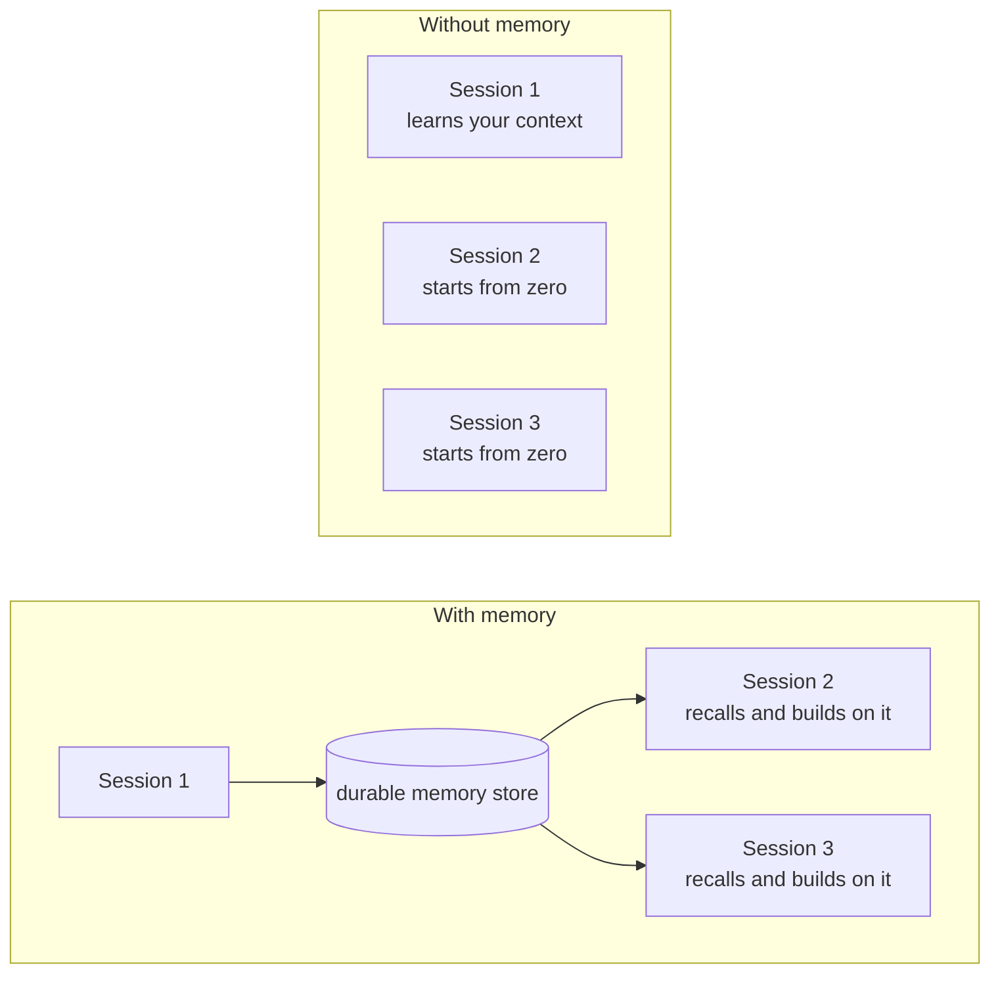
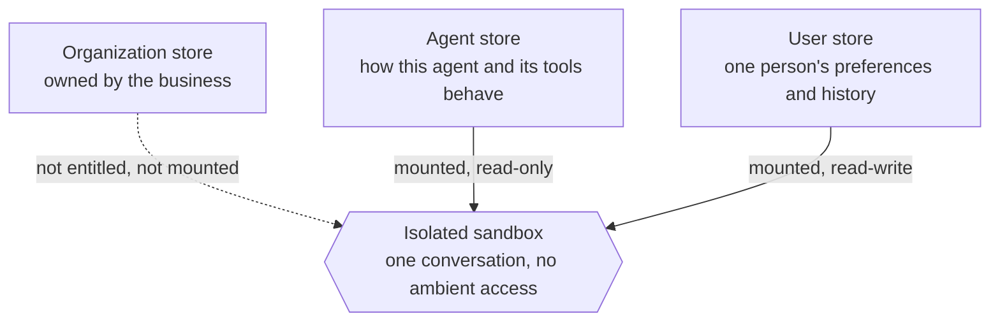
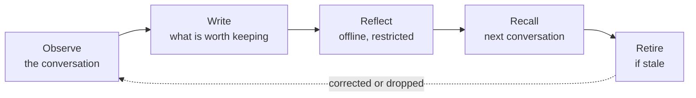

Large language models are stateless. Every conversation starts from nothing. Memory is the engineering we wrap around a model to create the illusion of continuity, and it is what turns an agent from a clever tool into something closer to a colleague.

## Why agents need memory

A language model only knows what is in front of it right now. Close the window, open a new one, and everything is gone: the preferences you explained, the file naming convention you corrected twice, the fact that your finance approver changed in March. Every session begins as a stranger.

That is fine for a search box. It is a poor fit for a co-worker.

Think about how a scientist actually works. Partway through a project she asks herself, *what did we try last Tuesday?* Not out of nostalgia, but so she doesn't burn a week repeating an experiment that already failed. Her answer lives in a lab notebook. And that notebook only works because she is quietly good at three things: knowing what is **worth writing down**, knowing **how to find the right page** later, and knowing when to **cross something out** because it is no longer true.

Those same three problems, what to write, what to recall, and what to forget, are exactly what an agent's memory system has to solve.

_The continuity gap. Without memory, each session is sealed off from the last. Memory is what lets knowledge cross the boundary of a single conversation._

## Two horizons: short-term and long-term

### Short-term memory is the live context window

Short-term memory is everything the agent can see *right now* without going to look it up: the current conversation, recent tool results, and its own in-progress reasoning. It is immediate and it is free to access, but it is finite. Conversations grow. Context windows do not.

The engineering answer is **compaction**: as the conversation approaches the limit, older turns are compressed into a running summary while recent turns are kept verbatim. Compaction is typically invoked one of two ways: deliberately, by the user, or automatically by the runtime once context pressure crosses a threshold. Either way, the agent keeps the thread of the conversation without keeping every word of it.

### Long-term memory persists outside the session

Compaction buys room inside one conversation. It does nothing for the next one. Long-term memory is knowledge that outlives the session entirely, which means it has to be stored somewhere durable: a file store, a database, an index. The runtime then does two jobs. It **writes** to that store during and after a conversation, and it **retrieves** the relevant pieces back into context when they are needed.

| | Short-term memory | Long-term memory |
|---|---|---|
| **What it is** | The live context window | Knowledge stored outside the session |
| **What's in it** | Current conversation, recent tool results, in-progress reasoning | Episodic, semantic, and procedural knowledge |
| **Lifespan** | Volatile, gone when the window closes | Durable, survives across sessions |
| **Access** | Immediate and free to read, but finite | Must be deliberately written, then retrieved |
| **Key technique** | Compaction | Write and recall |

## Three kinds of long-term memory

"Long-term memory" is really an umbrella over three distinct kinds of knowledge. They are formed differently, they are used differently, and, importantly for safety, they carry very different risk.

| Kind | What it is | Example |
|---|---|---|
| **Episodic** (experiences) | The agent's record of specific past events: when, where, how. Think of these as dated entries in a diary. | *Tuesday:* the user asked me to refund order XYZ, and I escalated it to a supervisor. |
| **Semantic** (facts) | Distilled episodic memory. The agent turns experiences into standing facts, which also means it has to notice when a fact has been superseded. | *Experience:* "Alice said she's moving to Berlin." → *Fact:* "Alice lives in Berlin." |
| **Procedural** (skills) | Learned routines, workflows, and rules of thumb: the agent's muscle memory. The difference between knowing a policy and knowing how to execute against it. | *Semantic:* "Expenses over $500 need approval." *Procedural:* pull the receipt, categorize, check against policy, route to the approver, file it, confirm back. |

That last row is worth sitting with. Procedural memory is a close cousin of a Skill, a reviewed routine the agent can run on demand. If you have read [Agents Have Skills Now](), you already know the shape of it: know-how, packaged so it can be applied again.

> The leap isn't that the agent knows a fact. It's that the agent knows how to do the task.

## How Copilot Studio approaches memory

Agent memory in Copilot Studio is built on a deliberately simple idea: **memory is content the agent can read and write**, in plain, human-readable form, rather than an opaque embedding blob nobody can inspect. If a person can open the agent's memory and understand what it believes and why, then makers can audit it, reviewers can reason about it, and the agent itself can revise it in place when something changes.

Two consequences follow. Recall doesn't require exotic infrastructure. The agent looks things up much the way you would, opening an index and navigating to the relevant section. And correcting memory is a normal edit rather than a re-indexing operation, which matters enormously for the "cross it out because it is no longer true" problem.

### Scoped, separated, and sandboxed

Not all memory belongs to the same person. What one user told an agent about their own preferences is very different from a pattern the agent learned about how a business process works, which is different again from knowledge owned by the whole organization. Copilot Studio keeps these in **distinct scopes**, and those scopes are **separate stores, not labels on a shared one**.

Each conversation then runs inside an **isolated sandbox**, the same kind of [agent sandbox]() that gives an agent a private place to work. Memory is mounted into that sandbox for the life of the turn with an access mode attached. So the question "what can this agent reach right now?" has a concrete answer: exactly the stores it was entitled to, at exactly the permissions they were mounted with. Anything else simply isn't there to reach.




_Privacy by construction. Because separation is enforced by where memory lives and how it is mounted, least-privilege access is a property of the system rather than something the model has to be trusted to respect._

That is the point of building it this way. Privacy and compliance become properties of the architecture rather than promises about behavior.

### Reflection: turning experience into knowledge

Writing memory during a live conversation is useful, but it is also the worst possible moment to decide what is worth keeping. The agent is mid-task, it has partial information, and everything it does costs the user latency.

So the harder work happens away from the live turn, in a background pass we think of as **reflection**. Off the clock, a deliberately restricted agent revisits its own memory stores alongside recent conversations and does what the scientist does at the end of the week: promotes the episodes that mattered into durable facts, merges duplicates, resolves contradictions, and retires what is no longer true. Memory stops being an append-only pile and starts being curated, and the next conversation simply finds better memory waiting for it.

The reflecting agent is deliberately weaker than the one you talk to. It gets a narrow, purpose-built toolset and no access to the maker's connectors or knowledge sources, because anything that *writes* durable memory should have the smallest blast radius we can give it. This capability is still being hardened, and it reaches customers the way everything else here does: gated, evaluated, and rolled out in stages.

_The memory loop. Forming memory is only half the system. Keeping it true is the other half: anything kept must also be capable of being corrected or dropped._

## Guardrails come first, not last

Memory can mislead as easily as it can help. A stale fact repeated confidently is worse than no fact at all, and durable memory about people is durable *personal data*. So the controls are part of the design, not a hardening pass bolted on afterward.

| Control | What it means in practice |
|---|---|
| Consent and control | Whether an agent uses memory, and at which scopes, is an explicit decision rather than an implicit behavior, with controls for the maker who builds the agent and for the people who talk to it. |
| Isolation by construction | Scopes are separate stores, addressed per tenant, environment, agent, and user, and surfaced to a session only when it is entitled to them. |
| Least privilege on write | Live turns cannot rewrite broader-scope memory. Anything that would widen a memory's audience is treated as a promotion that has to be earned, not a side effect. |
| Inspectable and reversible | Memory is human-readable and versioned, so it can be reviewed, corrected, or deleted, including deletion initiated by the person it describes. |
| Staged rollout | Capabilities widen only after they clear quality, safety, privacy, and cost gates, and every step retains a kill switch. |

Compliance is a first-class requirement rather than an afterthought: memory derived from a person's conversations must be discoverable and deletable by that person, and memory meant to describe a *process* must not quietly accumulate facts about *people*.

## Trusted, but also verified

Adding memory to an agent is a change you have to prove, because the failure modes are quiet.

> An agent with a bad memory does not crash. It just becomes confidently wrong.
{: .prompt-warning }

So memory is evaluated against the ways it can go wrong, not only the ways it can help. Among the behaviors we hold agents to:

- **Recall.** Days later, in a brand new conversation, does the agent still know what it was told?
- **Negative recall.** When memory holds something stale or simply wrong, does the agent catch it, or repeat it with confidence?
- **Abstention.** When something was never actually said, does the agent say it doesn't know? An agent that trades correct refusals for plausible guesses has become less trustworthy, not more.
- **Hallucination.** Does having a memory tempt the model into inventing detail that was never in it?

Pinning down behaviors this nuanced is its own discipline. If you want to go deeper on that, we wrote about [scoring agent behavior with LLMs](). Memory earns a wider audience only when it clearly helps on recall without costing the agent its willingness to say "I don't know."

> A memory system isn't good because it remembers more. It's good because it remembers the right things, and knows what it doesn't know.

## What this means for the people using your agents

Strip away the architecture and memory delivers one thing: **an agent that stops making people repeat themselves.**

The support agent already knows this customer has been escalated twice and doesn't restart the story from the top. The operations agent remembers that this approval always needs a second signature and stops asking. The analyst's agent recalls which approach was tried last quarter and why it was abandoned. Each is small on its own; compounded over hundreds of conversations, they are the difference between a tool people tolerate and a colleague people rely on.

And that value arrives without makers having to become memory engineers. You decide whether your agent should learn, and at which scope. Copilot Studio handles the rest: forming the memory, keeping it separated and governed, reflecting on it in the background, and proving through evaluation that it is helping rather than quietly drifting.

Agents are becoming genuine co-workers. Memory, deciding what to write down, how to find it again, and what to let go, is the part that makes the relationship worth having.

So here's the question worth asking of your own agents: what is the first thing you'd want them to stop forgetting?

> Agent memory in Copilot Studio is rolling out progressively. Capabilities described here may change as they move through preview.
{: .prompt-info }
