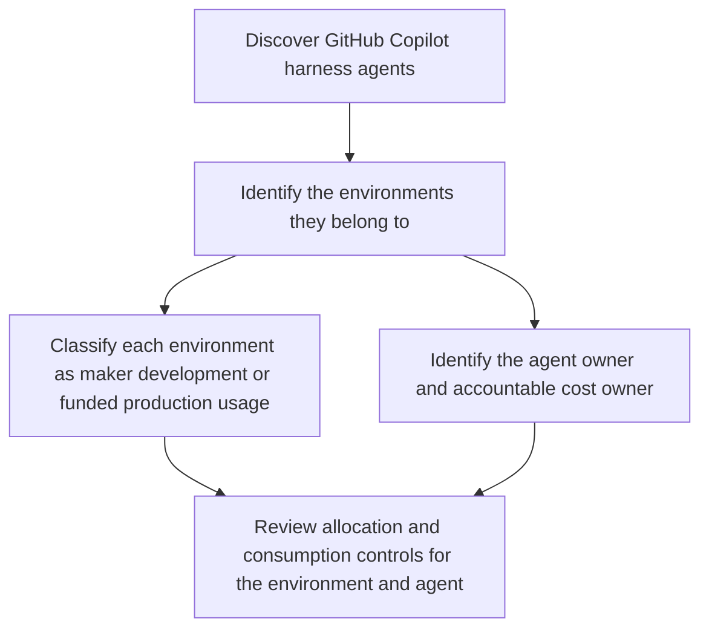
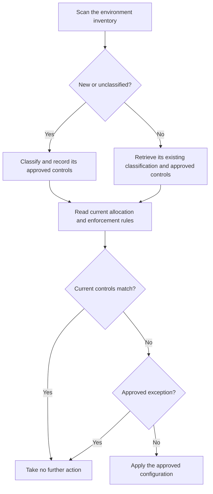
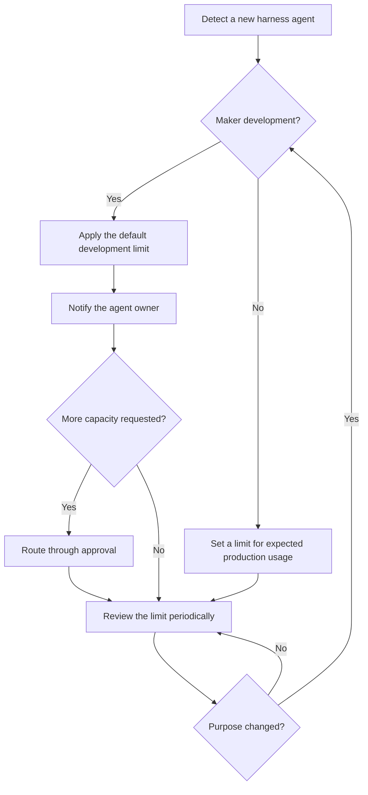

As AI agents become more capable, consumption is becoming a more important part of how organizations plan and govern their use. Makers using the [GitHub Copilot harness in Copilot Studio]() can consume Copilot Credits while building, previewing, and evaluating agents, before those agents enter a formal production lifecycle. This changes when administrators need to apply consumption controls.

An environment used for maker exploration can now incur consumption even if its agents are never published for production use. Maker development and funded production usage require different approaches to capacity, ownership, and continuity, regardless of the environment type used to support them.

A practical baseline for reducing exposure is to:

1. Find GitHub Copilot harness agents and the environments containing them.
2. Classify those environments as maker development or funded production.
3. Review allocations, tenant-pool access, pay-as-you-go billing, and enforcement rules.
4. Apply agent-level limits where individual consumption needs a tighter boundary.
5. Repeat the review periodically or automate detection of newly created environments and agents.

This post proposes a repeatable governance process for keeping Copilot Credit consumption in check, then shows how to implement it in the Power Platform admin center (PPAC) and at scale through the Power Platform API.

## Choose controls based on the environment purpose

Environments where makers explore, build, preview, and evaluate agents need a clear development boundary. Environments supporting funded production usage need controls aligned to their funding, ownership, expected usage, and criticality. The same controls are available in both scenarios, but how you apply them should reflect what the environment is there to support.

> Maker development can now incur Copilot Credit consumption before an agent enters a formal production lifecycle.
{: .prompt-warning }

Use the environment purpose to decide where to start.

### Maker development

Environments where makers explore, build, preview, and evaluate agents need controls before those agents enter a formal production lifecycle. Detect GitHub Copilot harness agents, apply a default agent limit, decide whether tenant-pool or pay-as-you-go access is appropriate, notify the agent owner of the boundary, and define how they can request more capacity.

### Funded production usage

Environments supporting approved departmental or organization-wide processes need accountable ownership and intentional funding. Confirm the cost owner and funding model, allocate capacity or configure billing intentionally, set limits based on expected usage and service criticality, and monitor consumption that could interrupt the production service.

Start by finding the affected agents and environments, then apply the controls that match their intended purpose.

## Discover and classify affected agents and environments

So now that we have two scenarios, let's handle them with the processes and controls that make sense. Governance and control isn't ever achieved well with a single approach that doesn't take the solution being built into account.

For each GitHub Copilot harness agent, first identify:
- the environment containing it,
- whether that environment supports maker development or funded production usage,
- the agent owner and the person accountable for its consumption,
- and whether its current allocation, overage settings, and consumption match that purpose.



To support this, start with [Power Platform Inventory](https://learn.microsoft.com/en-us/power-platform/admin/power-platform-inventory) to find Copilot Studio agents and the environments containing them. For a small estate, the inventory in PPAC might be enough. At scale, use [Azure Resource Graph](https://learn.microsoft.com/en-us/power-platform/admin/inventory-sample-queries) or the [Power Platform Inventory API](https://learn.microsoft.com/en-us/power-platform/admin/inventory-api) to make the review repeatable.

The `isCLIAgent` property identifies agents using the GitHub Copilot harness. These agents can consume Copilot Credits in the maker experience during design time. This request returns those agents together with their environment and owner IDs:

<details open>
<summary>View the Inventory API request</summary>
<pre><code class="language-http">
POST https://api.powerplatform.com/resourcequery/resources/query?api-version=2024-10-01
Content-Type: application/json

{
  "TableName": "PowerPlatformResources",
  "Clauses": [
    {
      "$type": "where",
      "FieldName": "type",
      "Operator": "==",
      "Values": ["'microsoft.copilotstudio/agents'"]
    },
    {
      "$type": "where",
      "FieldName": "properties.isCLIAgent",
      "Operator": "==",
      "Values": ["true"]
    },
    {
      "$type": "project",
      "FieldList": [
        "name",
        "properties.displayName",
        "properties.environmentId",
        "properties.ownerId",
        "properties.isCLIAgent"
      ]
    }
  ]
}
</code></pre>
</details>
<br>
Inventory returns the technical relationship between the agent, its owner, and its environment. Your environment naming, environment groups, governance metadata, or approval records can then provide the business context needed to classify it. If you already use [Copilot Agent Kit]() or [Compliance Hub](https://learn.microsoft.com/en-us/microsoft-copilot-studio/guidance/kit-compliance-hub), you can extend that inventory with the scenario and cost-ownership information used by your process.

## Apply environment controls

After classifying an environment, review how it can access Copilot Credits and what should happen when its available capacity is exhausted:

| Decision | Available control |
|---|---|
| Should pre-paid capacity be reserved for the environment? | Allocate Copilot Credits to the environment |
| Can the environment use unallocated capacity from the tenant pool? | Enable or disable tenant-pool draw |
| Can consumption continue through an approved Azure subscription? | Enable or disable pay-as-you-go billing |
| What happens as capacity is approached or exhausted? | Configure alerts or deny further consumption |

Maker-development environments usually need a deliberate boundary so exploration doesn't consume capacity intended for other work. For funded production usage, tenant-pool or pay-as-you-go access might instead be an intentional continuity decision owned by the team funding the agent.

Once you have selected the appropriate controls, implement them in PPAC or through the Power Platform API.

### Configure allocation and enforcement in PPAC

To allocate (reserve) pre-paid credits against an environment, in PPAC, go to **Licensing** > **Copilot Studio** and select **Manage Copilot Credits**. Select an environment, allocate pre-paid capacity where required, and configure what happens when that capacity is exhausted.

{: .shadow }
_Administrators can reserve pre-paid Copilot Credits for a selected environment._

The tenant's [add-on capacity assignment setting](https://learn.microsoft.com/en-us/power-platform/admin/tenant-settings) controls who can allocate credits. Allowing environment administrators to manage allocations doesn't restrict them to environments they administer; it gives them allocation control across all environments in the tenant. Keep allocation restricted to tenant administrators unless that broader tenant-wide access is intentional.

### Configure allocation and enforcement through the API

At scale, use [Update Allocations By Environment](https://learn.microsoft.com/en-us/rest/api/power-platform/licensing/allocations-by-environment/update-allocations-by-environment) to configure an environment's allocation and enforcement rules in the same request.

The following request allocates 10,000 Copilot Credits, enables administrator alerts, prevents draw from the tenant pool, enables pay-as-you-go overage, and leaves denial of further consumption disabled:

<details open>
<summary>View the allocation and enforcement request</summary>
<pre><code class="language-http">
PATCH https://api.powerplatform.com/licensing/allocationsByEnvironment?api-version=2024-10-01
Content-Type: application/json

{
  "environmentId": "&lt;environment-id&gt;",
  "currencyAllocations": [
    {
      "currencyType": "MCSMessages",
      "allocated": 10000,
      "enforcementRules": [
        {
          "ruleType": "Alert",
          "enabled": true
        },
        {
          "ruleType": "TenantPool",
          "enabled": false
        },
        {
          "ruleType": "PayGo",
          "enabled": true
        },
        {
          "ruleType": "Deny",
          "enabled": false
        }
      ]
    }
  ]
}
</code></pre>
</details>

> This PATCH replaces the allocation and configuration values included in the request. Read the current model first, preserve the existing values that should remain, and then submit the complete intended configuration.
{: .prompt-info }

### Review environment controls for new and existing environments

New environments can appear with draw from the tenant pool enabled, while the configuration of an existing environment can drift from its approved controls. A recurring review and remediate process can:

1. Query Power Platform Inventory for `microsoft.powerplatform/environments`. You can adapt the Inventory API request shown earlier by changing its resource-type filter.
2. Compare the results with your governed environment register.
3. Classify and record the approved controls for a new or unclassified environment. For an existing environment, retrieve its recorded classification and approved controls.
4. Read the environment's current allocation and enforcement rules with [Get Allocations By Environment](https://learn.microsoft.com/en-us/rest/api/power-platform/licensing/allocations-by-environment/get-allocations-by-environment).
5. Compare the current configuration with its approved controls.
6. Preserve approved exceptions; otherwise, remediate any mismatch.



Step 4 uses the read endpoint below to return the environment's current allocation and enforcement rules before you decide whether remediation is required:

```http
GET https://api.powerplatform.com/licensing/allocationsByEnvironment/<environment-id>?api-version=2024-10-01
```
{: .nolineno }

## Apply agent-level limits

Environment controls set the boundary for shared capacity. An agent-level limit adds a monthly boundary for one use case, regardless of whether its environment uses pre-paid capacity or pay-as-you-go billing.

For maker-development agents, a default on how much they can consume is the important control to prevent over-consumption, and a repeatable process can:

1. Detect a newly created GitHub Copilot harness agent.
2. Confirm whether it is in a maker-development environment.
3. Apply the organization's default development limit.
4. Notify the agent owner of the limit and what happens when it is approached or reached.
5. Route requests for more capacity through the appropriate approval process.
6. Review or replace the development limit when the agent moves into funded production usage.



This gives makers room to explore without leaving consumption unbounded. Because limits apply to agents rather than users, consider how many agents one maker can create when defining the default and escalation process.

Production agents can also use limits to protect shared capacity, but the value should reflect expected usage and service criticality rather than inheriting the maker-development default.

> Agent level limits don't cap the aggregate consumption across a consumption. As of August 2026, Microsoft has announced environment-level limits through Message Center item [MC1451872](https://portal.office.com/adminportal/home/?l=en-US&ref=MessageCenter/:/messages/MC1451872), which close the gap this creates. Until they are available, you can [review usage and unlink a billing policy to prevent further environment-level consumption]().
{: .prompt-info }

### Configure an agent limit in PPAC

In PPAC, go to **Licensing** > **Copilot Studio** > **Manage Agents**. Select an agent, set its monthly Copilot Credit limit, and choose whether to notify administrators as consumption approaches the limit and stop further usage when the limit is reached.

{: .shadow w="900" }
_Administrators can set an agent-level credit limit and choose what happens as consumption approaches or reaches it._

> Built-in limit notifications are sent to tenant and environment administrators, not necessarily to the agent owner. Define who reviews those alerts, who contacts the owner when context is needed, and who can approve a limit increase or allow the agent to stop.
{: .prompt-warning }

As an alternative to the in-product alerts for % consumption against a limit, administrators can implement their own consumption-review and notification process. [Get Many Environment Entitlements](https://learn.microsoft.com/en-us/rest/api/power-platform/licensing/entitlement/get-many-environment-entitlements) returns entitlement consumption data for an environment, allowing your monitoring process to be informed by this, then deciding who should be notified about what, and when.

```http
GET https://api.powerplatform.com/licensing/environments/<environment-id>/entitlements?api-version=2024-10-01
```
{: .nolineno }

### Configure an agent limit through the API

At scale, use [Update Resource Threshold](https://learn.microsoft.com/en-us/rest/api/power-platform/licensing/resource-threshold/upsert-resource-threshold) to apply the approved limit, notification threshold, and stop behavior. The following request sets a limit of 1,000 credits, notifies administrators at 80%, and prevents further consumption when the limit is reached:

```http
PUT https://api.powerplatform.com/licensing/environments/<environment-id>/entitlements/MCSMessages/resources/<agent-resource-id>/threshold?api-version=2024-10-01
Content-Type: application/json

{
  "stopResource": false,
  "limit": 1000,
  "stopIfOverCapacity": true,
  "notifyIfOverCapacity": true,
  "notificationThreshold": 80
}
```
{: .nolineno }

> Ensure you set `stopResource` to `false` to prevent stopping the agent from being used immediately. This is used to stop usage irrespective of a limit when the request is made, and works in the same way as the stop agent action through **Manage Agents** in PPAC.
{: .prompt-danger }

## Summary

Agents built with the GitHub Copilot harness present additional scenarios for needing to manage credit consumption. Take the careful balance of control and enablement by setting agent limits that enable some discovery for maker-development scenarios, and enforce use-case relevant controls and limits for funded production usage. Which parts of this process will you manage in PPAC, and which will you automate through the Power Platform API?