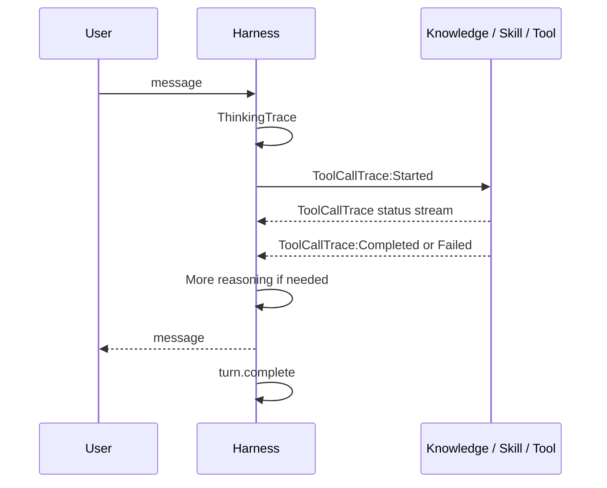

A user tells you the agent gave them the wrong answer yesterday. You ask the same question today and get a perfectly good response.

So you go looking for the conversation. What you find depends on where it happened. In Teams, chats are persistent by design and the user can scroll back through days of history. In web chat, each session starts fresh and the exchange is gone once the tab closes. Either way that history sits in the user's client rather than yours, and even where it exists it shows only the messages. The reasoning, the knowledge lookups, and the tool calls were never rendered to the user at all. The activity trace does show them, but only live, while a conversation is happening.

The transcript is what survives. [Open the Hood]() covers reading transcripts from topic-driven Standard-harness agents, where you follow `IntentRecognition` into `DialogRedirect` and out through `nodeTraceData`.

Agents powered by the GitHub Copilot harness record almost none of that. They emit a different vocabulary, most of it undocumented, and a parser written against the Standard-harness shape returns nothing useful. This post covers that vocabulary: how to find the record, how to reassemble it, and how to read the reasoning and tool calls inside it.

## Why the harness changes what you are looking for

A Standard-harness agent runs a dialog you authored. Debugging means checking whether the right topic fired and followed the branch you designed, so the transcript answers questions about routing.

An agent on the [GitHub Copilot harness](https://learn.microsoft.com/microsoft-copilot-studio/agents-experience/overview) has no authored path. It reasons over a goal, chooses [knowledge](https://learn.microsoft.com/microsoft-copilot-studio/agents-experience/knowledge-copilot-studio) and [tools](https://learn.microsoft.com/microsoft-copilot-studio/agents-experience/tools-overview), activates [Skills](https://learn.microsoft.com/microsoft-copilot-studio/agents-experience/skills-overview), works with files in a [managed sandbox](), inspects what comes back, and adapts while the task is still running. There is no branch to verify.

That moves the questions. Instead of asking which topic fired, you ask what the agent was reasoning about, which capability it selected and why, what arguments it filled in, what the tool returned, and whether the turn ever finished. The transcript answers all five, but only if you know which events carry them.

Telling the two apart takes one string search. If the JSON contains `ToolCallTrace` or `ThinkingTrace`, it came from the GitHub Copilot harness. If it contains `DynamicPlan`, it is a Standard-harness record and the rest of this post will not match it.

> The GitHub Copilot harness event names and payload shapes in this post are observations from transcripts captured in August 2026. Microsoft does not currently publish a schema contract for these trace events. Build parsers defensively and retain access to the raw JSON.
{: .prompt-warning }

## Finding the record

Ask the user to type `/debug conversationid` in the chat. That returns a GUID, and it is by far the fastest route to a specific conversation (see [How to Get Your Conversation ID]()). Declarative agents use plain `/debug` instead.

Transcripts land in the Dataverse [`conversationtranscript`](https://learn.microsoft.com/power-apps/developer/data-platform/reference/entities/conversationtranscript) table. The columns that matter are `Name`, which holds the conversation ID joined to the agent ID, `Content`, which holds the activity JSON, `Metadata`, which carries `BotId`, `BotName`, and `BatchId`, and `ConversationStartTime`.

Two timing rules decide whether a record exists yet. A transcript is written roughly 30 minutes after the last activity in a conversation, so a report that arrives minutes after the fact has nothing to read. For agents published to the Telephony channel, the documented timeout is three minutes after an *End Conversation* event.

### One conversation, several rows

This is where most GitHub Copilot harness transcript analysis goes wrong. Rows sharing the same `Name` arise for two independent reasons:

- After 30 minutes of inactivity, resumed activity is written to a new row with the same `Name` and a new `ConversationStartTime`.
- `Content` is capped at 1 MB. When one session exceeds that limit, the platform splits it across rows with the same `Name` and `ConversationStartTime` but different `BatchId` values.

GitHub Copilot harness agents reach the size limit frequently. A single turn that reads files or runs a Skill can emit thousands of streamed status events, so one session can span several batches.

Merge before you analyze anything. Group by `Name`, order the sessions by `ConversationStartTime`, then order each session's batches by `BatchId`:

```text
Name = {ConversationId}_{BotId}
  ├── ConversationStartTime T1
  │   ├── BatchId 0   ← activities part 1
  │   ├── BatchId 1   ← activities part 2
  │   └── BatchId 2   ← activities part 3
  └── ConversationStartTime T2   ← resumed after inactivity
      └── BatchId 0
```

Analyze a single row and you will draw confident conclusions from a third of a conversation.

> **Do not parse `Name` by splitting on `_`.** That works only when the conversation ID is a plain GUID. Teams and Direct Line conversation IDs contain underscores of their own, so values like `19:…@thread.v2_{BotId}` are normal and a naive split misidentifies the agent. Match on the whole value, or split from the right using the known `BotId`.
{: .prompt-warning }

### Connected agents write their own rows

When an agent delegates to a connected agent, the child conversation does not appear inside the parent's transcript. It is written as a separate row, with its own `Name` built from the parent conversation ID plus a child segment.

You can spot that delegation in the parent transcript through `ConnectedAgentInitializeTraceData` and `ConnectedAgentCompletedTraceData`. Those markers confirm that a connected agent was invoked, but the child's reasoning and tool calls still live in the child transcript row.

That has a practical consequence during triage. Pull the parent row alone and the delegated work looks like a gap: the parent hands off, some time passes, and an answer comes back with nothing in between to explain it. The reasoning and tool calls that produced that answer are sitting in a row you have not fetched. When a conversation involves connected agents, collect every row whose `Name` starts with the conversation ID rather than matching it exactly.

This is also where the `role: 1` trap above does the most damage, because child transcripts are exactly the records where the numeric encoding stops being reliable.

### Test chats are recorded too

Conversations from the authoring test pane are written to the same table as production traffic. The documented way to identify them is `ConversationInfo.isDesignMode`. In the transcripts analyzed for this post, `channelId` also distinguished `pva-studio` test-pane chats and `pva-autonomous` autonomous runs from channels such as `msteams` and `directline`.

In an active development environment these dominate the table, which is usually the explanation when transcript counts look far higher than actual usage. Filter them out before drawing conclusions about production behavior, and filter them in when you want to review what a maker was doing.

## The envelope, and where it differs from the docs

Every activity shares a common envelope. Most of it behaves as documented, but a few fields do not, and each one has a way of quietly corrupting analysis.

| Field | What to know |
| --- | --- |
| `type` | `message` for user and agent turns, `trace` or `event` for everything diagnostic |
| `name` / `valueType` | The event marker. Some events populate only one of the two, so always check both |
| `value` | The payload, and where nearly all diagnostic detail lives |
| `timestamp` | Arrives as integer epoch seconds rather than an ISO string, with `timestampMs` alongside it |
| `channelId` | Real values include `pva-studio`, `pva-autonomous`, `pva-published-engine-direct`, `directline`, `msteams`, and other channel-specific names |
| `replyToId` | Ties a trace event back to the message that triggered it |
| `from.role` | `0` for the agent and `1` for the user, with an important exception below |

The `name` and `valueType` split is the one that silently returns zero. The `ToolCallTrace` family and `ThinkingTrace` populate `name`, while `SessionInfo` and `ConversationInfo` populate `valueType`. A scan that checks only one field finds half the events and reports the other half as absent.

> **`role: 1` does not always mean "user".** In a connected agent transcript, both the user and the agent can arrive as `role: 1`, so the numeric encoding alone attributes agent messages to the user and makes the conversation unreadable. Check whether the transcript contains any `role: 0` message first. If it does, the normal encoding holds. If it does not, fall back to `from.aadObjectId` to separate the speakers. Delegation to connected agents is common on GitHub Copilot harness agents, so this is worth handling up front.
{: .prompt-danger }

## Anatomy of a turn

The typical shape of a turn looks like this.



Treat that as the common case rather than a contract. Reasoning usually arrives in several chunks rather than once. A tool call is normally preceded by reasoning, but calls also fire back to back with nothing between them, or immediately after a failure, or as the very first event of a turn. The intermediate status stream shows up for roughly half of tool calls. A Skill can produce a great many sandbox events, and a completion can land in a later split row.

## The events that matter

### `ThinkingTrace`

`ThinkingTrace` carries the reasoning text that the [activity trace](https://learn.microsoft.com/microsoft-copilot-studio/agents-experience/authoring-activity-trace) surfaces, in a `thinkingText` field.

The text does not arrive in one piece. It streams as delta fragments, then a cumulative snapshot equal to those fragments combined, and a later segment can follow in the same turn. To read it correctly, buffer the deltas, recognize the snapshot rather than appending it a second time, and flush any incomplete buffer before the next tool call so the reasoning does not drift out of order.

Reasoning is narrative rather than a timed operation, so it reads best as inline text next to the steps it preceded. It is also not a complete record of every internal model operation. It is the trace the product exposes for debugging, and its granularity varies.

### The `ToolCallTrace` family

Four distinct events share this prefix, and the difference between them matters.

The generic `ToolCallTrace` carries incremental `status` strings such as `Running Bash...`, `Reading a file...`, `Loading skill...`, and `Calling KnowledgeSearch`. These dominate by volume, outnumbering the lifecycle markers by roughly two orders of magnitude in a file-heavy turn. They are useful for narrating progress and almost useless for structure.

`ToolCallTrace:Started` is the most valuable event in the transcript. It records what the harness chose and what it prepared:

| Field | Meaning |
| --- | --- |
| `toolCallId` | Correlation ID shared by the start, completion, and failure |
| `toolName` | Internal tool identifier |
| `toolDisplayName` | Human readable name shown in the activity trace |
| `toolKind` | Capability category: `search`, `tool`, or `agent` |
| `filledParameters` | Inputs the agent supplied |
| `unfilledParameters` | Inputs still missing |
| `hiddenFilledParameters` | Runtime supplied values not shown as user inputs |

Skills need special handling. A loaded Skill reports `toolName: "skill"` with its real name in `toolDisplayName`, so match on the display name rather than the kind or you will collapse every Skill into one bucket.

`ToolCallTrace:Completed` closes a call successfully, carrying the same `toolCallId`, a `durationMs`, and a `result` that may be text or JSON. The `result` is where the step's observation lives.

`ToolCallTrace:Failed` is the first place to look for connector authentication problems, invalid parameters, timeouts, and MCP or sandbox errors. One detail saves real time here: the `status` string front loads the diagnosis, so it reads like this,

```text
list_records_with_organization failed: Connector returned 403:
{"error":{"code":"0x80072560","message":"The user is not a member of the organization."}}
```

which means the underlying HTTP status and connector message are visible without opening `errorMessage` at all.

### `turn.complete` and `turn.awaitConsent`

`turn.complete` marks the end of the harness work for a turn. Its payload is empty, so the marker itself is the whole signal. When it is present it genuinely comes last and always follows the agent's message, but it is not emitted on every turn. Treat it as positive confirmation that a turn closed, never as a required boundary, and do not read its absence as a failure.

`turn.awaitConsent` appears when a tool needs the user to authorize it, for example a connector action that surfaces a consent card. Its payload carries `requestId`, `toolName`, and the `connectors` awaiting authorization. A turn sitting on this event is waiting on the user rather than the agent, which is worth knowing before you go hunting for a performance problem that does not exist.

### `SessionInfo`

`SessionInfo` is the fastest way to triage a session without reading it, and it is richer than the documentation suggests. Alongside `startTimeUtc`, `endTimeUtc`, and `turnCount` it carries `type` and `outcome`, an `impliedSuccess` boolean, a `csatScore` where a survey was answered, and `lastUserIntentId`.

The values need care. `type` is documented as `unengaged` or `engaged` and `outcome` as `Escalated`, `Resolved`, or `Abandon`, but what actually arrives is capitalized and partly different: `Engaged`, `Unengaged`, `Resolved`, `Abandoned`, `HandOff`, and `None` for sessions that ended without one. Compare case insensitively rather than matching the documented strings literally.

The companion `outcomeReason` explains why a session ended and is usually more useful than the outcome by itself. Example values include `NoError`, `UserExit`, `Resolved`, `UserError`, `SystemError`, `AgentTransferConfiguredByAuthor`, `AgentTransferRequestedByUser`, and `AgentTransferFromQuestionMaxAttempts`.

## A trimmed turn

Stripped of the status stream, a single tool-using turn looks like this:

```json
[
  { "type": "message", "from": { "role": 1 }, "text": "Any open orders for Contoso?" },
  { "type": "trace", "name": "ThinkingTrace",
    "value": { "thinkingText": "I need to look up open orders for this account." } },
  { "type": "trace", "name": "ToolCallTrace:Started",
    "value": { "toolCallId": "call_01", "toolName": "list_records",
               "toolKind": "tool", "filledParameters": { "table": "orders" } } },
  { "type": "trace", "name": "ToolCallTrace:Completed",
    "value": { "toolCallId": "call_01", "durationMs": 812, "result": "{\"count\":3}" } },
  { "type": "message", "from": { "role": 0 }, "text": "Contoso has 3 open orders." },
  { "type": "trace", "name": "turn.complete", "value": {} }
]
```

Read it as a loop rather than a script. Reasoning sets up a call, the call returns an observation, and the observation either produces an answer or feeds the next round of reasoning.

## What to trust

A few habits keep this from going wrong.

Merge split rows before counting anything, because a missing completion is very often just a completion that landed in the next row. Match `name` and `valueType` on every scan. Correlate tool calls by `toolCallId` rather than by adjacency, since calls interleave and a turn can run several at once. Read `SessionInfo` first when triaging in bulk, because `outcomeReason` will sort real failures from ordinary handoffs faster than anything else in the record.

Be careful about inferring order from the diagram. Reasoning does usually precede a tool call, but often enough it does not, so a call with no reasoning in front of it is not evidence that the agent skipped a step. Completions reliably follow their starts, but not always in the same row.

And treat the absence of a lifecycle marker as weak evidence. Completions trail their triggers, `turn.complete` is optional, and reasoning appears only where the product chose to expose it. What the transcript positively records is reliable. What it omits usually means less than it appears to.

## Wrapping up

The GitHub Copilot harness did not make agents harder to debug, but it did move the evidence. The topic-and-branch record that Standard-harness agents produce is gone, replaced by a stream of reasoning, tool selection, arguments, and results. Once you can find the record, merge it, and read the handful of events that carry meaning, you can answer why an agent did something rather than guessing at it.

Next time an agent surprises you, the messages will only tell you what it said. What will the reasoning behind them tell you?
