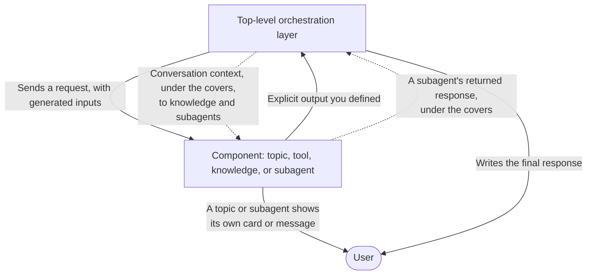
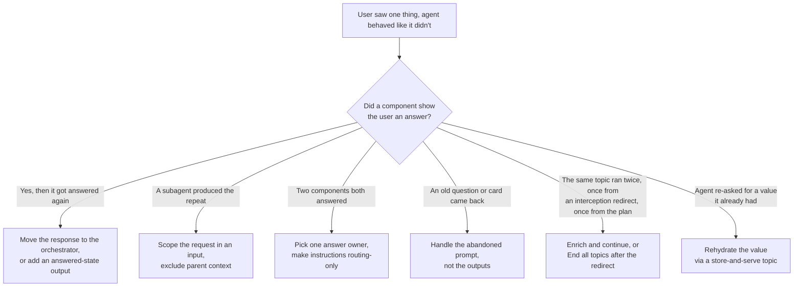

A support agent at a large company answers a question perfectly, in a clean Adaptive Card, and then, one line later, answers the exact same question again in plain text, as if the card had never happened.

```text
[Adaptive Card]
Q3 travel budget remaining: $2,450.00

Your remaining Q3 travel budget is $2,450.00. I can also help you book that
flight to the Munich supplier review...
```

The maker stares at that transcript and reaches for the usual suspects. Reword the instructions. Tighten the prompt. Tell the agent to stop repeating itself. None of it holds, because none of it is the problem.

The agent isn't confused about the answer. It was never told it had already given it.

Building and deploying an agent in the Copilot Studio standard harness remains a valid architectural approach for many use cases. But when duplicate messages appear during testing, teams sometimes abandon an otherwise sound use case because the behavior looks inherent to the harness. It isn't. The problem is usually a gap between what the user has seen and what the orchestration layer knows happened.

Once you recognize that gap, a family of bugs, including duplicate answers, missed answers, a question that returns after the user changes direction, and a specialist agent answering something another component already handled, becomes much easier to diagnose.

> This post is the practical companion to the Microsoft Learn guidance on the same subject: the full context model, the design decisions, and a troubleshooting reference. The end of this post links the whole set. This is the hands-on version: build the bug, watch it break, debug it, and fix it with snippets you can paste into your own agent.
{: .prompt-info }

## Why duplicate messages happen

Your agent is running two conversations at once.

One is the **user-visible conversation**: the messages, the cards, the buttons. It's what everyone points at when they file the bug.

The other is the **orchestration context**: what the top-level orchestration layer actually knows as it plans the next step. It's invisible in the chat window, and it is not automatically the same as what the user saw.

Duplicate messages and missed answers are what you get when those two drift apart. A topic shows the user a balance, but the orchestration layer's context never learns it happened, so the orchestration layer answers again or says it can't. Same gap, two symptoms.

The full mechanics of how context moves live in the guidance. This 20-second version is all you need to start fixing things:



  The user hears from two places: a topic or subagent can post its own card or message, and the orchestration layer writes the final response. The reliable paths back into the orchestration layer's context are the **explicit outputs** you define and a **subagent's returned response**.

  An Adaptive Card's body can reach the orchestration layer's conversation context, so newer models may restate it. But nothing marks it as already shown, and it isn't a structured output. Button selections don't reach the top-level context automatically; capture and return them explicitly.

Keep one question in mind for the rest of this post:

> What did the user see that the orchestration layer was never told?

## Build the bug in about five minutes

The fastest way to internalize this is to reproduce it on purpose. The example is **Fabrikam's internal employee assistant**, a standard harness agent that helps staff with travel, IT, and HR. It's the kind of broad internal assistant many large organizations build, and breadth is exactly what surfaces this class of bug. 

> What you're about to build is a teaching setup, not a pattern to copy. We turn it into the design we recommend a few sections down.

This minimal setup reproduces the opening transcript.

| Piece | What to build |
|---|---|
| **Travel budget topic** | A topic with no inputs and no outputs. Inside, look up a value and show it with a Message node that renders an Adaptive Card: `Q3 travel budget remaining: $2,450.00`. |
| **A travel booking path** | Any second component that answers a different part of a request. A knowledge source or connected agent for the travel policy both work. |
| **One top-level instruction** | `When the user asks about their travel budget, call the Travel budget topic.` |

Now send the agent a two-part request:

```text
How much is left on my Q3 travel budget, and can I book a flight
to the Munich supplier review?
```

The orchestration layer plans two steps. It routes the budget part to the topic, which shows the card. It routes the flight part to knowledge or the booking agent. Then it composes the final response, and you get the repeat from the top of this post: the card already showed the budget, and the orchestration layer states it a second time in its own reply.

You built a topic that answered the user and returned no outputs to the orchestration layer. The card's text may still reach the orchestration layer, but nothing there marks it as already shown. Newer models can read the value and restate it on the way to booking the flight.

> You now have a live agent that reproduces the bug. You can now apply the fix and re-test.
{: .prompt-tip }

## Debug it: read the plan, not just the chat

The chat window shows you the symptom. To see the cause, open **Activity Map**, which shows the plan the orchestration layer actually ran.

Put the two side by side and the gap is obvious.

| What the user saw (chat) | What the orchestration layer ran (Activity Map) | The gap |
|---|---|---|
| An Adaptive Card with the budget, then the orchestration layer stating the same budget again in its reply | Travel budget topic selected, then a knowledge step, both firing on the same request | The topic returned no output, so nothing told the orchestration layer the budget was already shown |

For each component in the Activity Map, compare **what the user saw** against **what the component returned as an output**. The bug is often in the space between those two columns. A component wrote to the user but returned nothing, two components both answered, or a later step got context that still looked unanswered.

## Fix it: two fixes, one preferred

Before you touch a single output, ask the question that prevents this whole class of bugs: does the Travel budget topic need to talk to the user at all? There are two fixes. Reach for the first whenever you can.

### Fix 1, preferred: let the orchestration layer answer

Have the topic look up the value, return it as an output, say nothing to the user, and let the orchestration layer write the answer. A component that only returns values and never posts to the user can't trigger duplicate messages, so the two conversations can't drift.

```text
budgetRemaining = "$2,450.00"

Description:
The user's remaining Q3 travel budget, retrieved by this topic.
```

No card, no message node, nothing shown from inside the topic. The orchestration layer holds the value, answers both parts, and the bug never had a chance to happen.

This is the fix we trust most. It was the most consistent design we tested across models.

> Prefer the orchestration layer as the answer owner. Each topic, tool, or agent collects what it needs as inputs, does its work without communicating directly to the user, and returns outputs, so exactly one owner writes each answer. 
{: .prompt-tip }

### Fix 2, when a component must talk to the user: report what you showed

Sometimes a component should post to the user itself. It's not a rare exception; it comes up across every component type:

- **A topic that shows a featureful, consistent, interactive Adaptive Card** that the orchestration layer can't reproduce; like a receipt, a rich status card, or a form.
- **A child agent that produces a long analytical answer** that you don't want entered into the limited top-level context. Let the specialist deliver the full breakdown, and keep only a short summary at the top level.
- **A connected agent that holds a multiturn, exploratory conversation** with the user, where the intermediate back-and-forth doesn't belong in the top-level context and the orchestration layer is better off just receiving the result.

Each is a valid, deliberate choice, and each carries the same required pattern: the moment a component posts to the user, it has to report what it did through outputs. Take the Adaptive Card topic from above. Keep the card, and add two outputs.

```text
answered = true

Description:
True if the user has already received a satisfactory answer to their
travel budget request in this topic.
```

```text
budgetRemaining = "$2,450.00"

Description:
The user's remaining Q3 travel budget, already shown in this topic and
available as context for later steps.
```

Write the answered-state description in terms of the user being answered, not the topic running. "The lookup succeeded" helps you debug the topic. "The user received a satisfactory answer" is what the orchestration layer needs to plan the rest of the turn.

Depending on the model, the outputs alone may not be enough.  Put the instruction where the orchestration layer acts on it; in the topic or subagent description, not in the output description:

```text
This topic writes to the user on its own channel. It shows the user their
travel budget there. After it runs, do not present the budget again and do
not restate it in text; assume the user already received it.
```

That topic-level instruction helps, but the piece that makes it hold across models is a top-level instruction that tells the orchestration layer to read the answered-state output before it replies:

```text
Whenever any topic or agent is called, always look for the
'answered' boolean output before deciding what to reply. Topics and
agents have their own channel of communication with the user. If
'answered' is true, always assume that the request has been answered
appropriately using at least one of the output variables, and check
which ones based on the output description. Do not give an awkward
acknowledgement of the answered content. Only provide the unanswered
outputs, and continue the conversation naturally with the next step.
```

With that instruction in place, you can mix topics and subagents that post to the user with ones that stay silent, just by setting each one's outputs.

Even with these instructions, fix 2 is the slightly more fragile choice, so when the orchestration layer can produce the answer itself, prefer Fix 1.

> Output descriptions are descriptions, not instructions.
{: .prompt-warning }

The orchestration layer reads an output description to understand what the value is; it does not run it as a command. Write "The balance already shown to the user," not "Keep this as context and don't show it again." An imperative reads like an instruction to the next maker who opens the topic, and it won't behave like one. 

We tested the shortcut of writing the imperative into the output description instead of the topic description. The orchestration layer ignored it for the presentation decision and re-showed the value anyway. The instruction only changes behavior when it lives in the topic description or the top-level instructions. The top-level instructions are a good home for it, so you don't have to repeat it in every topic and agent description.

Whichever fix you use, the red flag is the same.

> A component that does work and returns no outputs is a red flag. A topic or agent may leave the orchestration layer with no reliable record of what it did. A custom tool may update a system of record, send an email, or post a Teams message, but without outputs the orchestration layer and subsequent turns may not know what happened.
{: .prompt-warning }

Re-run the same two-part request. The orchestration layer now owns the budget answer, or sees it as already answered, skips re-answering it, and books the flight: one answer per part.

> In our tests, the Standard harness orchestration layer was more prone to duplicate messages with newer models and required clearer guardrail language. Test on the model you actually plan to deploy, and when in doubt, let the orchestration layer answer.
{: .prompt-warning }

## When instructions create a second answer

There's a version of this bug that no output can fix, because the instruction itself creates a second answer.

Compare these two:

```text
Routing only:
When the user asks about their travel budget, call the Travel budget topic.
```

```text
Routing plus an answering job:
When the user asks about their travel budget, call the Travel budget topic and give the balance.
```

The second one reads as more helpful and is quietly worse. The topic already shows the budget in its card. "And give the balance" tells the orchestration layer to answer too, so the user sees it twice: once in the card, once restated. Keep this top-level instruction focused on routing. Let the component that owns the answer own it. Sharpening instructions like this is its own skill, and the maker's rule of thumb is to think from the point of view of the component you're addressing.

## The snippet library

Use these snippets when a component genuinely needs to post to the user or hand a value to a later step. Adapt the wording to make what the component showed, returned, or left unanswered explicit.

### Report that a component answered

On any topic or subagent that shows the user an answer, add the following output. 

```text
answered = true
Description: True if the user already received a satisfactory answer
to this request in this component.
```

### Hand a shown value to later steps

When a later step in the plan needs the value the user just saw:

```text
<valueName> = "<the value shown>"
Description: The value already shown to the user, available as context
for later steps.
```

### Scope a subagent so it doesn't answer the whole conversation

A child or connected agent receives the parent's conversation context under the covers. If that context still holds an earlier request that looks unanswered, the agent tries to help with it too. 

Scope the request in an input:

```text
Input:
scopedRequest
Description:
The specific request this agent should fulfill.

Instruction:
Fulfill the request in scopedRequest. Treat it as your initial
request and ignore any other initial requests in the conversation.
```

For a child agent, the scoped input excludes the rest of the parent context from the task, even though the parent context still passes under the covers. A connected agent gives you a second control.

### Turn off the parent context for a connected agent

A connected agent has an advanced  setting, **Pass conversation history to this agent**, that feeds it the parent's entire conversation context by default. Leave it on, and the connected agent sees the whole conversation, including the parts the parent hasn't answered yet, and it may answer them itself and step on the parent's turn. Deselect it so the connected agent sees only the scoped input you passed it.

Use both levers together for a connected agent: scope the input, and turn off the parent context. 

For a child agent the scoped input above is the whole job. For the full mechanics of wiring inputs and outputs across subagents, see [Using Inputs and Outputs in Child and Connected Agents]().

### Keep a subagent silent when the parent should answer

A subagent can do the work, return its findings, and leave the parent to deliver the response. Silence takes an explicit instruction. The **After running** completion setting does not make a subagent silent; it only tells the parent what to do once the subagent finishes.

```text
Instruction:
Fulfill the request in scopedRequest. Do NOT reply to the user
directly and do NOT send any messages. Return a summary of your findings.

Output:
findings
Description: The answer to the scopedRequest, for the parent to deliver
to the user.
```

Add the output values that are important to pass to the parent.

### Let a subagent hand a request back instead of guessing

When a specialist can only handle part of what it received, don't let it guess or go quiet. Have it return what's left for the parent to route:

```text
openQuestions
Description: The part of the request that remains unanswered.
```

A missed answer is usually this snippet's absence: the specialist couldn't help, said nothing useful, and the parent never found out there was still a request to route.

> A subagent talking to the user directly is a valid, deliberate design, not a rule violation. Use it when you want a specialist to deliver a large answer itself, or to hold a back-and-forth. When you do, the parent's one job is to not repeat what the user already saw, which is exactly what an `answered`-style output is for.
{: .prompt-warning }

## Apply the context contract

Use this checklist when you design a component or review one that already exists. These decisions keep the user-visible conversation and orchestration context aligned.

A few rules of thumb:

- **Prefer the orchestration layer as the answer owner.** The fewer components that post to the user, the fewer places the two conversations can drift. If a component must post to the user, it owes an answered-state output.
- **Exactly one owner per part.** When two components can answer the same part, they can both answer, and the user sees it twice.
- **No outputs is a red flag.** A component that does work and returns nothing leaves the orchestration layer without a reliable record of what it did. For tools, that includes the result of work performed outside chat.
- **Sometimes you deliberately keep data out.** The goal is not to stuff every value into the parent context. If a subagent produced a long analysis, let it deliver that directly and return only a short summary, so the parent context stays small and clean. Managing context means deciding what to keep out as much as what to put in.

## Not every "duplicate" is a context issue

One pattern looks identical in chat but has a different cause. A topic uses **Ask with Adaptive Card** to ask which system needs access. The user changes course, the agent handles the new request, and then the original card reappears:

```text
Agent: Which system needs access?  [SAP] [Workday] [Salesforce]
User:  Actually, reset my VPN token.
Agent: Done, your VPN token is reset.
Agent: Which system needs access?  [SAP] [Workday] [Salesforce]
```

Nothing ran twice. The **Ask with Adaptive Card** node was still waiting for its output, so it came back. The card body may reach the conversation context, but it is not a structured output and does not tell the orchestration layer that the user has already seen it. The button labels and actions do not reach the top-level context automatically.

Most of the time, letting a user change course mid-question is the behavior you want. Fix it only when the returning prompt genuinely confuses people. The [troubleshooting guidance](https://learn.microsoft.com/en-us/microsoft-copilot-studio/guidance/generative-orchestration-duplicate-messages-troubleshoot) covers the full breakout pattern.

## Diagnose your own agent

When you encounter duplicate messages in a deployed agent, this is the fast path from symptom to the right fix.



Each branch maps to a section in the [troubleshooting guidance](https://learn.microsoft.com/en-us/microsoft-copilot-studio/guidance/generative-orchestration-duplicate-messages-troubleshoot), where you'll find the evidence to confirm it and the exact remedy.

>If you want to prove that a fix holds, write test cases into an evaluation set and re-run after each change. See [Evaluation-Driven Agent Readiness in Copilot Studio]().

## Microsoft Learn guidance

This post walked you through the problem and the fix. For the product behavior underneath, these published Learn articles cover the ground it builds on:

- [Orchestrate agent behavior with generative AI](https://learn.microsoft.com/en-us/microsoft-copilot-studio/advanced-generative-actions): how the orchestration layer plans, calls topics, tools, agents, and knowledge, then summarizes the final response.
- [Configure high-quality instructions for generative orchestration](https://learn.microsoft.com/en-us/microsoft-copilot-studio/guidance/generative-mode-guidance): how to write instructions the orchestration layer acts on, including keeping top-level instructions to routing.
- [Manage topic inputs and outputs](https://learn.microsoft.com/en-us/microsoft-copilot-studio/advanced-managing-topic-inputs-outputs): how to return a topic's result as an output instead of a message node.

The dedicated guidance set on duplicate messages and context design goes deeper on everything here:

- [Context distribution in the standard harness](https://learn.microsoft.com/en-us/microsoft-copilot-studio/guidance/generative-orchestration-context-design): the full context model.
- [Design best practices to avoid duplicate messages](https://learn.microsoft.com/en-us/microsoft-copilot-studio/guidance/generative-orchestration-duplicate-messages): the design decisions turned into inputs, outputs, and instructions.
- [Design topics as mini-agents that avoid duplicate messages](https://learn.microsoft.com/en-us/microsoft-copilot-studio/guidance/generative-orchestration-topics): topic design.
- [Design subagents that avoid duplicate messages](https://learn.microsoft.com/en-us/microsoft-copilot-studio/guidance/generative-orchestration-subagents): child and connected agent design.
- [Troubleshoot duplicate messages and missed answers](https://learn.microsoft.com/en-us/microsoft-copilot-studio/guidance/generative-orchestration-duplicate-messages-troubleshoot): each root cause and its remedy.


