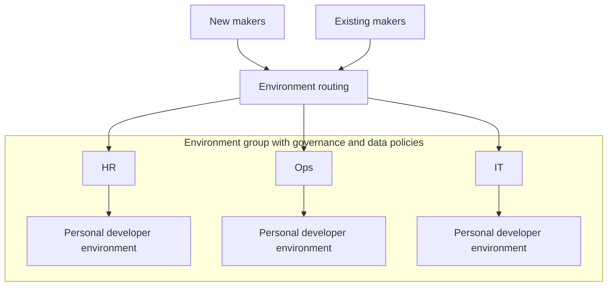

Agentic development means iterative building, and that speed often brings the sprawl or data exfil concerns every platform team knows by heart. The question of who gets to build is often not a nice-to-have; it's a control someone in risk or compliance is asking about by name.

Here's the thing that may have caused some confusion for Copilot Studio specifically. A tenant setting many admins leaned on for maker access control may be misleading. If you built your governance story around the Copilot Studio authors setting, you'll want to know what to reach for instead. Let's walk through what has changed and the layered set of controls that actually govern maker access.

## The Copilot Studio authors setting was never meant to be a maker access gate

In the [Power Platform admin center (PPAC)](https://aka.ms/ppac), under **Manage > Tenant settings**, there was a Copilot Studio authors setting that many organizations came to treat as the switch for who can make agents. Over the years that interpretation stuck, and plenty of governance runbooks were written on top of it. And understandably so, given the label.

But that setting was only ever meant to govern access for pay-as-you-go environments, not to be a "can this person open Copilot Studio and build" access gate. So it has been corrected since, and effective this month, the Copilot Studio authors setting is being renamed to "Copilot Studio pay-as-you-go users." The behavior, UI wording, and documentation are all being tightened so it stops implying an access-control guarantee it should have never made.

{: .shadow w="350" }
_Before_

{: .shadow w="350" }
_After: renamed to "Copilot Studio pay-as-you-go users"_

For more details on how the settings have changed, read [this Message Center post](#message-center-placeholder) and the updated documentation [here](https://learn.microsoft.com/en-us/microsoft-copilot-studio/billing-licensing#get-started-in-copilot-studio) and [here](https://learn.microsoft.com/en-us/troubleshoot/power-platform/copilot-studio/licensing/authors-access).

So if the Copilot Studio authors setting was never designed for full maker access control, how do we actually control access? Especially when your real goal is to **direct people to the right places** rather than to just say "no."

## Layer 1: Give every maker a safe place with environment routing

Before you think about blocking anyone, think about *where* you want makers to land. If a curious employee opens Copilot Studio and there's no intentional home for them, they'll build in whatever environment they stumble into, which is usually the last place your governance team wants them.

[Environment routing](https://learn.microsoft.com/en-us/power-platform/admin/default-environment-routing) fixes that. When enabled, makers are automatically redirected into their own **personal developer environment** the moment they visit Copilot Studio, Power Apps, or Power Automate. Think of it like OneDrive but for building: a personal space where someone can explore without touching shared data or bumping into anyone else's work.

For many enterprise organizations, this is the foundation. Instead of an uncontrolled free-for-all in the default environment, every maker gets a known, governed zone that your team defines the boundaries of.

Routing doesn't decide *who* can build, but it decides *where* they build, and that's what makes every later control enforceable.

## Layer 2: Contain the blast radius

Once each maker has a home, two questions matter: what can an agent connect to, and where can the agent be consumed? Two controls answer those, and they pair well.

**What it can reach: [Data policies (DLP)](https://learn.microsoft.com/en-us/microsoft-copilot-studio/admin-data-loss-prevention)** govern how agents connect to data and services, inside and outside your organization. On maker environments, apply a deliberately restrictive policy so exploration stays exploration and sensitive connectors stay out of reach.

**Where it can be consumed: Managed Environment sharing and publishing limits.** DLP decides what an agent touches; it doesn't decide who an agent can be handed to. [Managed Environments](https://learn.microsoft.com/en-us/power-platform/admin/managed-environment-overview) let you restrict sharing and publishing, so an agent built in an unsanctioned space never quietly reaches wide distribution.

{: .shadow w="400" }
_A data policy blocking an agent from being published to any channel._

The combined effect: even if someone builds something where they shouldn't, it can't reach sensitive data *and* it can't reach an audience.

## Layer 3: Budget for the build, because making now consumes credits

Here's a shift worth planning for. In Copilot Studio, some making experiences (like previewing and evaluating) can now consume Copilot Credits, before an agent is ever published.

That means access control and *cost* control are now part of the same conversation. If you route a thousand makers into personal environments and walk away, you've created a thousand individual consumption meters.

The control is straightforward once you know to reach for it: **allocate the right amount of credits to the environment**, and set the **tenant-pool draw** behavior intentionally so an environment can't quietly pull from shared capacity. For the detailed walkthrough, see Lewis Baybutt's [Adopting the GitHub Copilot Harness: Cost Control and Governance in Copilot Studio]().

> 📌 Copilot Studio consumption is expected to move under the [Microsoft 365 admin center](https://admin.microsoft.com) for a more unified cost management experience across services like Cowork and the WorkIQ API, so keep an eye out for a more consolidated view.
{: .prompt-info }

The nice property here is that a credit boundary doubles as an access boundary. A maker who passes the threshold your admins have set simply can't keep consuming, so an unbudgeted environment cannot accidentally consume credits that your organization hasn't budgeted for.

{: .shadow w="700" }
_When an environment runs out of allocated credits, makers can't keep consuming until an admin adds more._

## Layer 4: For the extreme case, block the door with Conditional Access

Everything so far is about *directing* makers: give them a safe space, contain what they can reach, cap what they can spend. But sometimes the requirement is blunt: **these specific people must never enter the making experience at all.** Think frontline or field staff who'll never author agents from a desk, external contractors, or entire job functions that compliance has ruled out.

The tool for a hard, tenant-level, user-based block is **[Conditional Access](https://learn.microsoft.com/en-us/entra/identity/conditional-access/) in Microsoft Entra.**

It's about creating a block policy in Entra and applying it to a security group, so that group of users can never access Copilot Studio.

However a maker tries to get there, whether they go directly to copilotstudio.microsoft.com in the address bar, follow a shared link from a colleague, or click something in the UI that lands in Copilot Studio, the policy stops anyone in that group from getting in. Same restriction. The door is the door.

To configure the policy:

1. In **Microsoft Entra admin center > Conditional Access**, create a new policy
2. **Assignments > Users**: target a security group (for example, `Frontline-No-Maker-Access`). This is your "who"
3. **Target resources > Cloud apps**: select **Power Virtual Agents** (not a typo, this name is a pre-cursor to Copilot Studio. Long live PVA!)
4. **Grant**: choose **Block access**
5. Enable the policy (test in report-only first)

{: .shadow w="600" }
_The policy: Power Virtual Agents selected as the target resource, with Grant set to Block access._

> Conditional Access is a big hammer. Reach for it when the requirement is genuinely "never," and lean on Layers 1 to 3 for everyone you're trying to *guide* rather than *stop*.
{: .prompt-warning }

## Putting it together

There isn't one switch for maker access, and the setting people thought was that switch never was one. What you have instead is a layered model, and honestly it's a better one:

| Layer | Mechanism | Question it answers | When to use |
|---|---|---|---|
| 1 | Environment routing | *Where* do makers build? | Always. Foundation for everyone. |
| 2 | DLP data policies + Managed Environment limits | What can agents reach, and can they be consumed by users? | Always, tuned per environment type. |
| 3 | Credit allocation + pool draw | What can they consume while building? | Any environment where makers explore, finetune, and evaluate. |
| 4 | Entra ID Conditional Access | *Who* is allowed in at all? | Extreme cases: populations that must be fully excluded. |

For most of your people, the goal isn't to say no. It's to make the safe path the default path: route them somewhere governed, contain what they can touch, budget what they can spend. Save the hard block for the genuine "never" cases, and let Conditional Access carry that weight.
